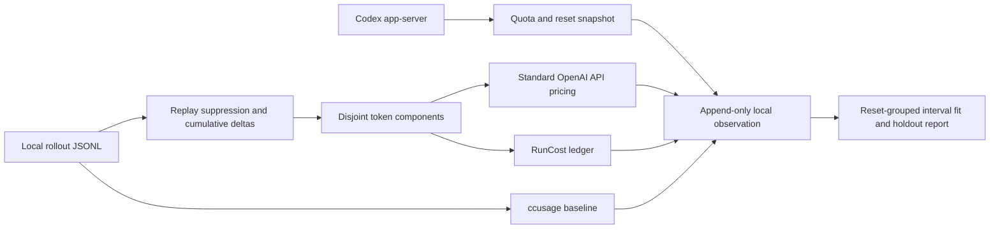

# Local Usage-Limit Triangulation Validation

> This initial validation is preserved as the pre-v0.3 research record. The completed implementation, seven gate results, corrected baseline, and final non-identifiability verdict are in [Usage Monitor v0.3 Final Validation](./2026-07-23-usage-monitor-v03-final-validation.md).

## Thesis

Existing tools can show local standard-API-price token cost or provider-reported quota, but they do not reproducibly join time-aligned observations and estimate the hidden quota budget while preserving rounding uncertainty and unexplained residuals.

Strongest counter-thesis: CodexBar plus ccusage already provide enough information, so another usage dashboard would be duplication.

## Scope

The proof of concept is local-only. It stores no prompts, response content, account identifiers, credentials, repository paths, or filenames. It initially supports the locally installed Codex client. Claude Code's official status-line limit fields and local transcript schema have been verified, and the privacy-minimized callback tap works; an authenticated callback with non-null quota windows still needs validation on this machine.

## Required capabilities

| Capability | Priority | Proof standard |
| --- | --- | --- |
| Read provider-reported used percentage, window, and reset | Required | Live read from an official local client surface |
| Reconstruct disjoint token components from local logs | Required | Compared with an established parser and official daily token total |
| Price components with provenance and warnings | Required | RunCost ledger; unknown models/components remain explicit |
| Persist append-only observations | Required | NDJSON with stable schema and no conversation content |
| Estimate quota capacity despite integer percentage rounding | Required | Feasible interval plus regression diagnostics |
| Detect resets, shared-pool contamination, and missing coverage | Required | Window identity, official/local token comparison, residual flags |
| Claude Code support | Valuable | Live-tested adapter; not inferred from Codex behavior |
| Multi-user collection | Out of scope | Revisit only after a privacy and consent design |
| Dashboard or menu-bar UI | Out of scope | Existing tools already cover it |

## Current verified findings

- Codex session JSONL contains cumulative and last-call token usage with input, cached input, cache-write input, output, and reasoning-output counters. Token-count events also contain rate-limit snapshots.
- The experiment now uses standard OpenAI API prices rather than the Codex subscription credit rate card. Per million tokens, GPT-5.6 Sol is $5 input, $0.50 cached input, and $30 output; Terra is $2.50/$0.25/$15; Luna is $1/$0.10/$6. Cache writes are 1.25 times uncached input. Requests above 272,000 input tokens are charged at twice the input price and 1.5 times the output price for the full request.
- The installed Codex app-server exposes `account/rateLimits/read`, including all named limit buckets, used percentage, window duration, reset timestamp, plan type, credits metadata, and earned reset count.
- The same official surface exposes `account/usage/read`, with a lifetime summary and daily token buckets. It does not expose per-model or per-component daily usage.
- A 30-day local structural audit found `rate_limits` on 727,998 of 728,197 raw token-count records. The stored fields are used percentage, window length, reset time, plan/limit metadata, and optional credit-state flags. They do not contain an absolute remaining token, message, credit, or dollar allowance.
- Every observed five-hour and weekly `used_percent` value was an integer from 0 through 100; none of the 727,998 populated snapshots had fractional precision. Local files therefore provide a last-known integer percentage, not a hidden high-resolution counter.
- The local snapshot changes only when a response writes another token-count event. `account/rateLimits/read` can refresh the current value without sending a model prompt, and a long-running app-server can receive `account/rateLimits/updated` notifications, but the exposed percentage still has the same integer granularity.
- A live 2026-07-23 comparison found the official daily token bucket materially above ccusage's local-log total at the observation time. This proves local coverage must be measured rather than assumed exhaustive.
- A later aligned live capture found the reverse: local logs were about 1.54 times the official current-day token bucket. The official daily bucket is therefore not an exhaustive real-time denominator for raw local tokens; it may be stale or use different accounting semantics.
- All retained Codex rollout files checked had `cache_write_input_tokens` absent or equal to zero. The field is now observable, but this installation cannot yet validate cache-write pricing against a non-zero event.
- None of the 20,195 priced request-like events in the first exact window exceeded 272,000 input tokens, so the current total does not exercise OpenAI's long-context multiplier even though the pricing engine supports it.
- Claude Code has an official opt-in status-line contract that supplies `five_hour` and `seven_day` used percentages and reset timestamps after API responses. This installation has 933 Claude transcripts and two user-local CLI versions. The privacy-minimized status-line tap ran live. A later 2026-07-23 Keychain-backed Claude.ai Pro OAuth smoke succeeded, so the earlier revoked-token observation is superseded; both status-line quota windows remain unvalidated and unavailable rather than being recorded as zero.
- Codex Fast mode is distinct from API Priority processing. The official Speed documentation specifies 2.5 times Standard credit consumption for GPT-5.6/GPT-5.5 Fast mode and 2 times for GPT-5.4, while GPT-5.6 API Priority is priced at 2 times Standard API token rates. The rollout token-count schema inspected does not retain a per-turn Fast marker. The installed app-server schema does expose `serviceTier` on thread start/resume and turn/thread-setting overrides, and the local app log database contains those override records. Its current sample has zero Fast overrides, so the processed historical speed mode remains an explicit confounder; prospective collection can sanitize and join the app-server signal without persisting thread identifiers.
- The linked Reddit experiment used 20+ same-day percentage/cost pairs and linear regression. Its reported USD-equivalent capacities are observational estimates, not a disclosed provider contract.

## Candidate decision

**Wrap.** Reuse ccusage for mature local-log parsing and RunCost for auditable pricing. Build only observation capture, window alignment, uncertainty-aware inference, and residual analysis.

The implemented Codex scanner deduplicates cumulative snapshots across chronological fork lineages, then prices request-like token deltas through RunCost using standard API rates. Its exact-window total was within roughly 1% of ccusage's same-day-aligned token total in the first smoke; RunCost and ccusage cost differed by roughly 2% on the aligned comparison.

The original 471-event `unknown` bucket was not a hidden model. It was 71,060,499 tokens of copied history at the start of 47 spawned/forked rollouts. Those records had no model because they appeared before an attributable active model context. Matching the exact cumulative token snapshots against the chronologically earlier parent rollouts removes them without changing priced cost; all remaining events resolve to Sol, Terra, or Luna.

Stop and use existing tools if a controlled panel of at least 20–30 observations cannot predict held-out quota movement within the provider display granularity.

## Candidate landscape

| Candidate | Verified strength | Missing for this experiment | Decision |
| --- | --- | --- | --- |
| Codex app-server | Official live quota windows, reset timestamps, named limits, plan type, and account daily-token buckets | No hidden capacity or per-component account ledger | Use as the Codex quota source |
| Claude Code status line | Official five-hour and seven-day percentages/reset times after a successful subscriber response | Event-driven rather than a stable polling API; OAuth works, but no non-null local window receipt yet | Wrap after a successful status-line quota capture |
| CodexBar | Source-visible quota polling, local Codex/Claude cost scanning, and tested percentage-burn forecasts | Cost and quota are intentionally independent; no marginal cost-to-quota fit | Use as reference, not a dependency |
| ccusage 20.0.18 | Mature replay-aware local Codex/Claude parser, model attribution, long-context pricing, JSON reports | No official quota join or regression; Codex JSON currently emits zero cache creation | Depend on as the linked-method baseline |
| RunCost 0.2.0 | Component cost ledger, current price-source resolution, provenance, strict warnings, reasoning fallback policy | No local-agent log parser, quota windows, or inference | Depend on as pricing kernel |

## Implemented data flow

## First live Codex result

Reprocessing the verified capture at `2026-07-23T16:15:40.974Z` with fork-lineage replay suppression gives:

| Measure | Value |
| --- | ---: |
| Plan/window | `pro`; one canonical 10,080-minute window |
| Used percentage | 92% |
| Window start | 2026-07-21 17:06:03Z |
| Reset | 2026-07-28 17:06:03Z |
| Exact-window local tokens | 2,892,709,515 |
| Uncached input | 95,758,355 |
| Cache-read input | 2,788,823,040 |
| Cache-write input | 0 |
| Text output | 5,527,686 |
| Reasoning output | 2,600,434 |
| Standard OpenAI API-price estimate | $1,668.24 |
| ccusage start-date baseline | $1,868.02 |

The single origin-aligned snapshot implies a conditional capacity of about **$1,813.30 at standard API prices**. Integer percentage rounding alone gives **$1,803.50–$1,823.21**. This is not yet a measured final limit: local-log coverage is not proven complete, subscription quota accounting may differ from API billing, and only one verified observation exists.

The ccusage value is not an absolute cross-check because its date filter includes activity from the beginning of the reset's UTC day, about 17 hours before this window began. Its marginal changes remain useful for reproducing the Reddit method.

The app-server also returned a separate named GPT-5.3-Codex-Spark research-preview bucket at 0%. It is stored for visibility but excluded from the canonical all-model regression because the local aggregate cannot safely be assigned to that bucket.

A verifier-only capture at `2026-07-23T16:22:45.716Z` exercised the full offline collection path into a separate temporary file. Local API-priced cost had increased to $1,673.33 while the displayed quota remained 92%, moving the one-point conditional capacity to $1,818.84. That is expected with integer percentage display granularity and is why the experiment needs cost deltas spanning multiple percentage points rather than repeated same-bucket snapshots.

The first durable schema-0.2 observation at `2026-07-23T17:32:19.676Z` found 94% used and $1,708.75 at standard API prices, with no unknown models or pricing warnings. Combined with the retained 92% observation, the two-point slope implies $2,025.58, but the rounding-feasible interval is still $1,350.39–$4,051.16. Two observations and a two-point percentage span do not identify the capacity; the narrower $1,817.82 origin-aligned value still depends on complete local coverage and a zero-cost origin.

## High-impact improvement roadmap

1. Mine quota transitions directly from existing token-count events. Manual snapshots discard hundreds of thousands of integer quota observations already present locally.
2. Fit an interval-censored model to the last event at percentage `p` and first event at `p+1`; compare floor, round-to-nearest, and delayed-update display models instead of assuming one rounding rule.
3. Build a lineage index from session IDs and `forked_from_id`, retaining cumulative-snapshot hashes so replay suppression remains deterministic across archives and active sessions.
4. Record capture staleness and source: latest local event, explicit app-server read, or app-server update notification. Never treat an old local snapshot as current.
5. Run controlled micro-workloads separated by model, context band, cache state, reasoning effort, and tool type. This is the fastest way to reveal quota multipliers that differ from API pricing.
6. Price official API tool units only where the logs expose a billable unit. Keep client tool-call counts separate from server-side web search, file search, code-interpreter sessions, and computer-use actions.
7. Use robust per-window inference with change-point detection, held-out transitions, bootstrap intervals, and residual attribution by model/effort/tool mix. Do not pool five-hour and weekly windows.
8. Add a passive local daemon that tails rollout files and holds one app-server connection for update notifications. Poll `account/rateLimits/read` only when the cached snapshot is stale; never generate dummy model turns merely to refresh quota.
9. Reconcile local totals against account daily buckets as a lagging anomaly signal, not as a coverage denominator. Flag other-device/shared-surface contamination rather than correcting it away.
10. Before multi-user collection, define a versioned privacy schema containing only interval deltas, coarse environment metadata, estimator version, and consented cohort fields; keep raw transcripts and stable account identifiers local.

## Experiment protocol

1. Capture a baseline with no other Codex or shared-agentic-pool work running.
2. Run one declared task interval.
3. Capture immediately after completion.
4. Repeat across at least 20 observations spanning several percentage points in one unchanged reset window.
5. Keep concurrent Codex, ChatGPT Work, Excel, cloud, mobile, and other-device usage out of controlled intervals or label the observation uncontrolled.
6. Fit used percentage against cumulative reconstructed cost. Treat each displayed integer percentage as an interval one percentage point wide.
7. Hold out the newest observations and report prediction error, coverage ratio, unknown pricing, reset changes, and negative or implausible deltas.
8. Repeat in a second reset window before accepting a stable quota estimate.

## Interpretation boundary

The experiment can show that observed quota burn is consistent with a standard-API-price model. It cannot prove the provider's internal accounting rule. Shared pools, server-side tools, model fallback, client logging gaps, stale limit snapshots, promotions, and A/B tests remain competing explanations.

## Sources

- [Linked Reddit experiment](https://www.reddit.com/r/codex/comments/1v4ds6g/ive_been_measuring_my_100_pro_lite_weekly_limit/)
- [OpenAI Codex app-server protocol](https://github.com/openai/codex/blob/main/codex-rs/app-server/README.md)
- [OpenAI Codex plan usage](https://help.openai.com/en/articles/11369540)
- [OpenAI API pricing](https://developers.openai.com/api/docs/pricing)
- [OpenAI Codex Speed](https://developers.openai.com/codex/speed)
- [ccusage](https://github.com/ryoppippi/ccusage)
- [CodexBar](https://github.com/steipete/CodexBar)
- [RunCost](https://github.com/adamallcock/runcost)
- [Anthropic Claude Code status-line contract](https://code.claude.com/docs/en/statusline)
- [Anthropic Claude Code costs and usage](https://code.claude.com/docs/en/costs)

## Next hard gate

Collect a controlled Codex panel with speed mode declared independently from API pricing tier. Claude authentication is working; Claude support now needs one successful response that emits the documented status-line windows. The tap itself has been exercised and preserves unavailable values correctly.
