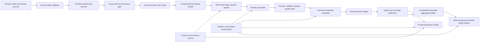
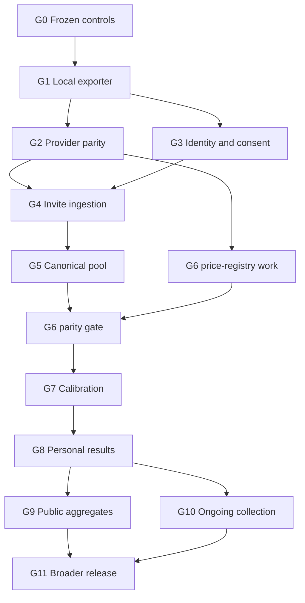

# End-to-End Multi-User Usage Monitor Goal

## Goal

Build and operate an opt-in, privacy-first research system that lets individuals understand how their Codex and Claude coding-agent activity relates to provider-reported quota movement, then combines metadata-only observations across consenting participants to estimate how quota behavior varies by provider, plan, model, execution speed, account, time, and eventually broad self-declared geography.

The system must work end to end:

1. parse private provider logs locally;
2. construct a new, strictly allowlisted metadata dataset without user content;
3. let the participant inspect exactly what would be shared;
4. enroll without requiring email or exposing provider identity;
5. protect and upload an explicitly approved bundle;
6. validate, decrypt, deduplicate, quarantine, and canonicalize it safely;
7. reconstruct versioned standard API-price-equivalent usage;
8. compare reconstructed activity with provider-reported quota changes and crosschecks;
9. return useful private results to the participant;
10. publish only disclosure-controlled, contribution-bounded aggregates; and
11. support pause, rotation, export, deletion, incident response, and reproducible research throughout the system's life.

The project is complete only when the full production definition of done near the end of this document is satisfied. Shipping a parser, an upload endpoint, a dashboard, or a visually persuasive estimate alone is not completion.

## Intended outcome for a participant

A participant should be able to install a signed release, run one command, and receive a plain-language preview such as:

> From July 1 through July 7, this exporter found 1,842 privacy-safe usage events and 926 provider quota snapshots. It will share token counts separated into uncached input, cache reads/writes, text output, and reasoning output; recognized model and speed classes; coarse tool/surface classes; quota percentages and reset times; and cryptographic pseudonyms. It will not share prompts, responses, code, commands, tool arguments, URLs, paths, filenames, repository details, credentials, emails, or raw account/session/device IDs. Review the machine-readable receipt before approving upload.

After processing, that participant should be able to see:

- the observed quota line beside API-price-implied usage over selectable time windows;
- five-hour and seven-day reset-aligned estimates with uncertainty and coverage warnings;
- Standard/Fast and model/cache/reasoning sensitivity where actually observed;
- separate account and plan continuity tracks rather than pooled account switching;
- likely missing shared-pool activity or stale snapshot periods;
- how their results compare with an eligible aggregate cohort; and
- the status, export, rotation, and deletion controls for their data.

## Definition of success

The end-to-end program succeeds when all of the following are true:

### Privacy and trust

- Raw provider logs, prompts, responses, code, attachments, commands, tool arguments, URLs, paths, filenames, repository details, credentials, emails, and raw provider/account/session/device IDs never leave the participant's machine.
- Every outbound record is constructed from an empty object against a versioned deny-unknown schema.
- A participant can preview the exact schema, counts, time range, privacy checks, bundle hash, destination, and retention policy before first transmission.
- Exact timestamps and pseudonyms remain restricted data; public outputs contain neither.
- Enrollment, upload, personal access, optional notification, data export, credential rotation, revocation, and deletion are exercised successfully by real pilot participants.
- No external data collection begins until the applicable phase gate explicitly authorizes it.

### Measurement usefulness

- The system preserves separate uncached input, cache read, cache write, text output, reasoning output, context-length, model, speed/tier, surface, agent/subagent, tool-class, account, plan, quota-window, reset, and provider-side crosscheck evidence when it is actually available.
- API prices are versioned by source and effective date. Codex subscription Fast is never conflated with OpenAI API Priority, Flex, Batch, or Standard.
- Fork replay, subagent work, scheduled tasks, Work/Workspace Agents/Excel/Cloud activity, other devices, Voice task work, image generation, separate-limit models, and ordinary Chat exclusions remain explicit coverage dimensions.
- Unknown models, tiers, surfaces, account attribution, and quota precision remain unknown rather than being silently imputed.
- Local and server analysis produce exact integer/record equality and predeclared decimal tolerance on the same sanitized frozen fixtures. Live provider crosschecks measure differing observability; they are not a substitute for deterministic parity.
- Week-by-week estimates include uncertainty, participant/reset sample sizes, model basis, error history, coverage flags, and policy-regime annotations.

### Scientific integrity

- Outputs say “API-price-equivalent quota behavior” or another precisely defined measurement, not “the provider's actual allowance,” unless provider documentation independently establishes that claim.
- The primary user-facing view remains the simple observed quota movement versus cost-implied movement, with more complex calibration available as explanation rather than jargon-first presentation.
- Confidence intervals resample participants or reset windows at the correct independence level; thousands of events from one participant are not treated as thousands of independent users.
- Policy-change claims require predeclared evidence thresholds and are robust to account mix, plan mix, instrumentation changes, snapshot precision, and shared-pool residuals.
- Negative, inconclusive, and non-identifiable results are publishable outcomes.

### Product and operations

- A new participant can inspect locally without uploading, enroll, upload, receive results, export data, rotate access, and delete data using documented flows.
- Repeated uploads and at-least-once cloud events never duplicate canonical records.
- One participant cannot dominate a public cohort through volume, retries, account count, or many devices.
- Bounded continuous collection can run for 30 days with visible health, predictable resource use, pause/uninstall controls, and no raw-data transmission.
- The complete system can be reproduced from source and infrastructure-as-code, monitored without logging sensitive payloads, and recovered from documented failures.

## Permanent invariants

These are not backlog items; they are conditions every phase must preserve.

1. **Extraction, never redaction.** New upstream fields have no output path until reviewed and explicitly mapped.
2. **No arbitrary telemetry strings.** Strings are bounded enums, recognized provider model identifiers, versions, timestamps, or cryptographic pseudonyms.
3. **The official client never transmits content.** Encrypted quarantine is untrusted input. Decrypted candidate input may exist only transiently inside the isolated bounded validator; prohibited content is rejected and deleted with a fixed non-sensitive code. It must never reach canonical storage, logs, traces, status records, personal output, or public output.
4. **Local inspection remains useful without enrollment.** The privacy-safe exporter is a standalone participant benefit, not merely a feeder for the cloud service.
5. **Identity is pseudonymous and email-free by default.** Notification identity, if added, is optional and segregated.
6. **Accounts and plans are continuity boundaries.** Historical records without contemporaneous account evidence remain `unattributed`.
7. **Subscription speed and API processing tier are independent.** Raw provider `priority` is interpreted only with its billing surface and source.
8. **Tool calls are explanatory features unless a provider billable unit is independently observed.** Client wrappers are not automatically priced as hosted provider tools.
9. **Personal and public products use different disclosure rules.** Personal detail does not imply public eligibility.
10. **The server cannot broaden collection.** It may advertise supported schema versions but cannot instruct clients to scan new directories or send new raw fields.
11. **Deletion includes derived outputs.** Participant deletion triggers canonical deletion/tombstoning, notification removal, aggregate rebuild, cache invalidation, and a non-reversible receipt.
12. **Uncertainty remains visible.** Integer quota displays, stale snapshots, reset ambiguity, missing surfaces, pricing gaps, and outliers are evidence, not cleanup targets.
13. **Material changes require renewed affirmative consent.** New restricted telemetry fields, longer retention, new public uses, scheduled/ongoing collection, notifications, and country collection cannot inherit earlier consent silently.

## Current verified starting point

As of July 24, 2026, the repository already has a substantial local foundation:

- replay-safe Codex rollout parsing with cumulative-to-marginal usage normalization;
- disjoint cached/uncached/output/reasoning token components and long-context-aware API pricing;
- Standard/Fast subscription attribution separated from Standard/Priority/Flex/Batch API tiers;
- conservative surface, agent, subagent, automation, and lineage classification;
- five-hour and seven-day quota snapshots, reset tracking, account/plan partitions, and provider-side crosschecks;
- passive collection, crash-safe checkpoints, controlled experiments, contamination analysis, corrections, monitoring-quality analysis, simple quota gradients, and weekly calibration;
- a Claude status-line sanitizer, but not full Claude export parity;
- telemetry v0.1 JSON Schemas for usage events, quota snapshots, activity markers, bundles, and privacy receipts;
- domain-separated participant/account/session/event/snapshot/marker/model pseudonyms;
- `inspect-export` and `export-local`, with `transportReady: false` and no network transport;
- adversarial and property-based privacy tests; and
- 182 passing Node tests plus a successful real one-hour local dry run.

The current branch `agent/privacy-exporter-phase1` and commit `8cb6b03` represent the local-exporter starting point. The [multi-user expansion plan](./2026-07-24-multi-user-privacy-expansion-plan.md) and [telemetry privacy contract](./2026-07-24-telemetry-privacy-contract.md) remain authoritative supporting documents. This goal organizes them into an execution program and adds finish criteria; it does not weaken their restrictions.

### Known current implementation blockers

The current local slice is useful, but it is not volunteer-pilot-ready until these concrete gaps are closed:

1. **Event-ID invariance:** tool counts currently contribute to event identity and can depend on the chosen export boundary. Overlapping, reordered, chunked, restarted, and differently bounded exports must produce the same logical event IDs.
2. **Identity separation:** the local telemetry pseudonym seed must never double as upload authentication or recovery. Telemetry identity, upload credential, recovery credential, device pairing, and optional notification reference need separate capabilities and keys.
3. **Account attribution:** exported Codex usage/quota rows are generally `unattributed`; prospective app-server/account markers must reach the export without retroactive guessing.
4. **True reviewed registries:** syntactically valid `gpt-*`, limit IDs, diagnostics, and versions are not necessarily approved. Recognized values need registries; surprises become `unknown` plus a keyed fingerprint only where justified.
5. **Snapshot identity:** distinguish the source observation from the provider account-level quota state so repeated identical quota displays across rollouts can be analyzed/deduplicated intentionally.
6. **Field provenance:** reasoning effort, outcome, plan variant, provider surface, receipt time, and display precision often remain unknown or heuristic. A generated coverage matrix must show observed, derived, declared, heuristic, and unavailable status per field/provider/version.
7. **Paired local commit:** bundle and receipt are written sequentially. Paths must be distinct and no-clobber, and a failure must not leave a valid-looking unpaired or overwritten artifact.
8. **Production canary wording:** real exports do not currently compare serialization against every raw source value; schema construction and pattern scanning are the production boundary, while source canaries are test evidence. Claims and future taint checks must reflect that accurately.
9. **Stable secret location:** the default identity secret is tied to the current working directory. Use OS application data/Keychain/Credential Manager/libsecret with explicit migration, backup, and device-linking behavior.
10. **Resource limits:** one million-record/1 GiB schema maxima are inappropriate as invite-pilot limits while the exporter materializes complete bundles. Lower client/server limits and streaming enforcement are required.
11. **Transport contract:** compression, encrypted header/payload, wrapping-key discovery/rotation, AEAD associated data, replay, chunking, and expanded-size rules need a separate reviewed version rather than flipping v0.1 `transportReady`.
12. **Frozen statistical contract:** comparable cohort keys, reset identity, quantization/lag, shared-pool residuals, price/policy epochs, chronological holdouts, participant-level resampling, identifiability refusal, and release thresholds must be specified before pooled analysis.

### Progress update — local artifact verification and recovery

The July 24 local hardening work has now closed or materially narrowed blockers 1, 4, 5, 6, 7, 8, and the POSIX portion of 9. Source-occurrence IDs are export-bound invariant; reviewed vocabularies and a generated 148-field provenance dictionary fail closed; quota observations and provider states have separate identities; missing token components remain unavailable; and the participant secret uses an OS-stable owner-only application-state path with guarded legacy migration.

The next completed slice adds three stronger artifact controls without widening collection:

- one generated compatibility tuple binds the exact six schemas, generated field contract, registry snapshot, consent status, contract status, package/exporter version, and executed Codex parser/adapter versions;
- Claude remains explicitly `not_implemented`, and provider declarations fail closed unless their bound adapter is implemented;
- `verify-bundle` independently checks canonical bytes, filesystem controls, compatibility, schemas, semantic record invariants, the privacy receipt, and its exact bundle digest without printing paths, content, or participant pseudonyms; and
- paired output now uses a synced private transaction manifest, publishes receipt first and bundle last, and can be replayed with `recover-exports` after every simulated crash boundary while refusing foreign destination artifacts.

This is still not G1 completion. Resource-bounded streaming/chunking, Claude parity, prospective account-scoped quota export, native secret-store/platform completion, signed clean-machine distribution, volunteer-local review, identity rotation/deletion UX, and the minimization ablation remain open. Telemetry v0.1 remains an unfrozen local-only format with `transportReady: false`; this progress does not authorize external participants or any network transport.

## Target architecture



### Trust zones

| Zone | May contain | Must never contain |
|---|---|---|
| Participant private source | Raw provider logs and local application state | Nothing is assumed safe here |
| Local safe-record process | Raw fields transiently in memory plus safe normalized output | Persistent raw copies or network calls before approval |
| Local bundle | Exact sanitized metadata and pseudonyms | User content, raw identifiers, credentials, paths, URLs, commands |
| Quarantine | Application-encrypted sanitized bundle | Decrypted payload in logs or object names carrying participant IDs |
| Canonical restricted store | Validated safe events/snapshots, quality flags, price provenance | Raw bundle bytes, recovery codes, notification addresses |
| Personal API | One authenticated participant's sanitized results | Direct warehouse access or another participant's rows |
| Public publication | Precomputed aggregate cells and methodology | Row-level data, exact timestamps, pseudonyms, small cohorts |

## Program structure

The work is divided into eleven sequential stage gates and nine parallel workstreams. A later stage may be prototyped early in isolation, but it cannot collect real external data or publish results until every predecessor gate passes.

## Stage 0 — Program controls and frozen baseline

### Objective

Make the current evidence, privacy boundary, responsibilities, and release process reproducible before adding more system surface.

### Deliverables

- Freeze an immutable dated local-baseline snapshot of telemetry v0.1 schemas, fixtures, and canonical serialization for reproducibility, while the working v0.1 contract remains explicitly unfrozen and local-only. Freeze a separately versioned successor contract, fixtures, and golden hashes before any volunteer or upload use.
- Keep telemetry v0.1 permanently local-only with `transportReady: false`. Any upload uses a separately reviewed telemetry/envelope version plus explicit compatibility and migration tests; v0.1 is never enabled by flipping its constant.
- Generate a field dictionary directly from the schemas and link every field to purpose, retention, public eligibility, and owner.
- Convert the threat model into a maintained risk register with severity, control, test, and review date.
- Establish architectural decision records for cloud choice, encryption, identity/recovery, storage, cohort disclosure, and deletion.
- Create a traceability matrix from every invariant and stage gate to code/tests/runbooks.
- Establish repository environments, protected branches, dependency update policy, secret scanning, provenance/SBOM generation, and release signing plan.
- Define data controller/operator responsibility, participant contact route, incident owner, and external privacy/legal review point before real collection.
- Record the existing local calibration artifacts and exporter fixtures as immutable research baselines.

### Exit gate G0

- A clean clone reproduces the existing tests and golden local bundle.
- Every allowed field and every prohibited data category has an automated control or an explicit documented residual risk.
- No secret, generated bundle, raw log, account identifier, or private report is tracked by Git.
- The program owner signs the privacy contract and agrees that later gates cannot waive it implicitly.

## Stage 1 — Production-grade local exporter

### Objective

Turn the successful in-memory proof of concept into a safe, bounded, inspectable, cross-platform artifact that can be given to volunteers without any upload capability.

### Deliverables

#### Core extraction

- Refactor schemas, safe constructors, privacy verification, and pseudonyms into a provider-neutral package with a stable API.
- Keep Codex parsing replay-safe across active/archived rollouts, forks, subagents, scheduled tasks, CLI/IDE/Desktop surfaces, Fast settings, unknown models, and schema changes.
- Export prospectively collected app-server/notification quota observations and content-free activity markers where provenance and account scope are defensible.
- Implement the Claude Code adapter using local usage metadata plus authoritative status-line five-hour/seven-day snapshots; never substitute transcript cost for subscription quota authority.
- Preserve provider, parser, exporter, and schema versions per bundle.
- Use reviewed registries for recognized model IDs, limit IDs, diagnostic codes, and versions. Unrecognized values fail closed or become `unknown` plus a keyed fingerprint only where the privacy contract explicitly permits it.

#### Resource bounds and determinism

- Stream records rather than retaining an unbounded history in memory.
- Enforce source-file, source-byte, line-size, event-count, expanded-size, elapsed-time, and memory budgets.
- Add incremental checkpoints initialized safely, resumable export, deterministic event IDs, and cross-file dedupe.
- Define event identity from provider event evidence that is invariant to export range; keep boundary-dependent attachment/features outside the event-ID input.
- Define separate observation IDs and provider-state fingerprints for quota snapshots, plus explicit server collapse rules.
- Produce byte-stable canonical serialization for a fixed fixture, then add compression with decompression limits.
- Make a partial or interrupted export leave either no artifact or an explicitly incomplete, non-uploadable artifact.
- Write bundle and receipt as a paired no-clobber transaction; reject identical/colliding output paths and recover cleanly after either write fails.

#### Participant experience

- Provide `doctor`, `inspect-export`, `export-local`, `verify-bundle`, `rotate-local-identity`, and `delete-local-export` flows.
- Preview counts by provider/record family/model class/time range and every privacy check without displaying private source values.
- Explain that inspect may create a local identity secret while creating no bundle or network activity.
- Produce a standalone privacy receipt that verifies exact bytes and software/schema versions.
- Store identity in an OS-stable application location, preferring Keychain/Credential Manager/libsecret and clearly warning on owner-file fallback.
- Generate a field-provenance/coverage view showing whether every field is observed, derived, declared, heuristic, fingerprinted, or unavailable.
- Run a preregistered utility-ablation study for second-level versus minute/five-minute timestamps, session pseudonyms, unknown-model fingerprints, tool-class granularity, exact receipt/reset timing, and diagnostic fields. Remove, coarsen, or shorten retention for restricted fields that do not improve calibration/identifiability beyond the declared tolerance.

#### Distribution

- Build reproducible artifacts for macOS arm64/x64, Linux arm64/x64, and Windows x64, or explicitly restrict the first release and document unsupported platforms.
- Generate checksums, SBOM, signatures/attestations, license inventory, and install/uninstall instructions.
- Ensure release builds contain no development credentials, private fixtures, local paths, or source maps that expose private build state.

### Exit gate G1

- At least five materially different malicious fixture families pass, covering each supported provider and platform path/credential syntax.
- Property, mutation, fuzz, large-file, truncation, partial-line, symlink, permission, decompression-bomb, and resource-budget tests pass.
- Overlapping, reordered, chunked, restarted, and repeated exports have stable IDs and identical logical records.
- Pilot limits are enforced on both sides of serialization and derived from measured p95/heavy histories rather than guessed. Candidate ceilings to benchmark are 31 covered days, 100,000 records per chunk, 32 MiB compressed, 128 MiB expanded, fixed nesting depth, and explicit CPU/RSS/wall-time budgets. Histories exceeding a safe chunk cap are split deterministically without silently shortening the requested period.
- Bundle/receipt path collision, overwrite, first-write failure, second-write failure, and interrupted-commit tests leave no ambiguous valid artifact.
- Two independent volunteers run signed artifacts locally, review bundles on their own machines, and confirm that no content or raw identity fields are present—only the documented cryptographic pseudonyms. No bundle is sent to the project.
- A clean-machine installation, inspection, verification, identity rotation, and uninstall succeeds on every declared platform.
- The privacy contract and consent draft are updated for the exact release artifact.
- The data-minimization ablation and decision receipt identify why each restricted field remains necessary before any transport work can use it.

## Stage 2 — Provider and accounting parity

### Objective

Ensure that uploaded metadata can support the useful local analysis without losing important provider distinctions or inventing unavailable fields.

### Deliverables

- Define a provider-adapter conformance suite for Codex and Claude Code.
- Preserve input/cache-read/cache-write/text-output/reasoning-output components and explicit unavailable values.
- Record model context thresholds and priceable versus unpriceable components without pricing on the client as authoritative server truth.
- Represent Codex subscription Standard/Fast and Claude speed/service evidence using provider-specific source provenance mapped to provider-neutral enums.
- Keep API Standard/Priority/Flex/Batch separate and price them only for API-billed observations.
- Include subagent and scheduled-task work while excluding inherited fork replay.
- Track coarse tool classes, but attach per-call cost only when an exact provider billable unit is independently present.
- Partition account and plan continuity prospectively; retain historical `unattributed`/`unknown` partitions.
- Add content-free declared markers for otherwise unobserved shared-pool surfaces: Work, Workspace Agents, Excel, Cloud, other devices, Work Voice task activity, image generation, third-party authenticated clients, and controlled quiet periods.
- Keep ordinary Chat and ordinary Chat Voice excluded from the shared agentic pool where current provider policy says they are excluded; treat Spark or later separate-limit models as separate series.
- Version provider-policy assumptions with effective dates and evidence links.
- Define a strict content-free `providerAccountingSnapshot` family for pooled crosschecks—time bucket, metric/unit enum, numeric value, source/provenance enum, account scope, and precision—or explicitly keep a crosscheck source local-only until that schema is reviewed.

### Exit gate G2

- Frozen Codex and Claude fixtures produce schema-conformant provider-neutral records while preserving provider-specific cache, thinking, speed, quota-window, and authority semantics.
- Every unavailable field stays unavailable; no zero/default inference can masquerade as observation.
- Local cost ledgers reconcile with independent ccusage/RunCost checks using predeclared component-level integer and decimal tolerances; every permitted difference has a fixed reason.
- The system proves that account, plan, provider, limit, reset, speed, and surface boundaries cannot be pooled accidentally.
- Provider schema changes fail closed and produce a safe upgrade diagnostic rather than partial silent extraction.

## Stage 3 — Anonymous enrollment, recovery, and upload authorization

### Objective

Create a participant identity and consent flow that supports upload and personal results without requiring a provider account, social login, or email.

### Deliverables

- Generate at least 128 bits of recovery/upload entropy locally using a cryptographically secure generator.
- Separate the human recovery credential, participant pseudonym, upload credential, bundle encryption identity, and optional short display code.
- Keep the telemetry pseudonym seed local and distinct from every server authentication/recovery secret; use expiring one-time pairing rather than copying the telemetry seed when joining devices.
- Define scopes explicitly: telemetry identity is installation-scoped; server participant identity is enrollment-scoped; device identity/credential is device-scoped; provider account pseudonyms are installation-local and must not be assumed equal across devices.
- Resolve overlapping multi-device source histories before canonical dedupe: either introduce a safely paired dedupe namespace, prohibit overlapping source exports, or accept that cross-device dedupe is unavailable and contribution-bound the overlap. Rotatable authentication credentials are never canonical dedupe keys.
- Choose through the G3 threat model between a public-key protocol, keyed verifier, or password KDF appropriate to a uniformly random high-entropy credential; never store the recovery code itself.
- Provide recovery code confirmation, offline backup guidance, rotation, revocation, and unrecoverable-loss behavior.
- Version consent and bind enrollment plus each bundle to the accepted consent/schema versions.
- Present exact operator, storage region, retention, research use, public aggregate use, deletion timing, optional country use, and contact details.
- Add rate limits, replay protection, CSRF/session protections, brute-force controls, abuse monitoring, and safe fixed-code errors.
- Use short-lived Secure, HttpOnly, SameSite cookies for personal web access; never put recovery codes in URLs, analytics, logs, or browser storage.
- Keep optional notification contact in a separate encrypted service joined only through an opaque reference.
- Define the approved pilot jurisdictions, named human operator/data responsibility, processing basis, processor/subprocessor register, cloud region, cross-border transfer position, age/eligibility rule, and jurisdiction-appropriate participant notice.
- Configure application logs never to retain upload IPs. Document unavoidable cloud-edge IP processing/retention, minimize it, and prohibit deriving geography or joining it to telemetry.

### Exit gate G3

- Enrollment, login, session expiry, rotation, revocation, retry, lost-code, abuse-rate-limit, and deletion-auth tests pass.
- Logs and traces contain no credentials, recovery codes, payloads, signed URLs, arbitrary errors, or notification content.
- Authentication uses fixed response semantics, rate-limit/lockout verification, offline-verifier resistance appropriate to the selected design, and distribution-based timing tests with a predeclared detectable-effect bound for participant enumeration.
- A participant can remain entirely email-free.
- Compromise of upload or recovery credentials cannot reproduce account/session/model pseudonyms from guessed provider values.
- Automated authorization tests prove participant A cannot read, modify, export, rotate, revoke, or delete participant B's records.
- A named human operator approves the final consent, bounded retention schedule, pilot jurisdictions, processors, and residual risks before G4 can begin.

## Stage 4 — Encrypted invite-only ingestion

### Objective

Accept explicitly approved sanitized bundles into a tightly bounded quarantine pipeline, with no analysis or public release yet.

### Deliverables

#### Client protection

- Compress only after local schema/privacy verification.
- Generate a fresh data-encryption key for every bundle and use reviewed authenticated encryption.
- Bind bundle ID, schema version, participant enrollment, content length, and hash as associated data.
- Wrap the data key for the ingestion service using a versioned public key/KMS design.
- Display destination, expiration, byte count, hash, consent, and retention before first upload confirmation.

#### Registration and object upload

- Implement an authenticated registration endpoint that returns an object-specific, random-name, write-only upload authorization with a short expiry.
- Enforce content type, compressed size, checksum, one-object scope, and no overwrite/read/list permissions.
- Store objects in a private uniform-access quarantine bucket with public access prevention and tested lifecycle/soft-delete behavior.
- Never include participant, account, session, provider, country, or time-range identifiers in object names.

#### Processing state machine

Implement idempotent states:

```text
registered -> uploading -> uploaded -> decrypting -> validating
                                              -> rejected
                                              -> quarantined
                                              -> accepted_pending_canonicalization
```

- Persist state transitions with compare-and-set/idempotency semantics.
- Treat duplicate object-finalization events and upload retries as expected.
- Produce participant-visible fixed-code receipts for accepted, quarantined, rejected, retryable, expired, and deleted states.
- Never echo source values or decrypted payload fragments in errors.
- Provide status, export, revoke, and deletion for every enrollment, credential, status record, and accepted/quarantine object Stage 4 writes. Canonicalization and analysis do not begin until Stage 5.

#### Server validation

- Verify registration, object identity, size, checksum, ciphertext envelope, associated data, key version, authenticated decryption, schema, record limits, privacy scans, timestamps, numeric ranges, model/tier compatibility, reset consistency, and ID shapes.
- Stream decompression and validation under byte, record, memory, CPU, and wall-clock budgets.
- Separate impossible/rejected and structurally or semantically inconsistent/quarantined states. A valid Stage 4 bundle ends as `accepted_pending_canonicalization`; statistical extremes and personal/aggregate eligibility are assigned only in Stage 5.
- Delete successful quarantine objects on the short approved schedule; expose effective soft-delete completion timing.

#### Infrastructure

- Manage Cloud Run, Storage, Eventarc, Firestore or equivalent job state, KMS/Secret Manager, service accounts, network/egress controls, budgets, alerts, lifecycle, and audit logging through infrastructure-as-code.
- Use separate least-privilege identities for enrollment, upload registration, decryption/validation, canonical writes, aggregation, deletion, and public publishing.

#### Minimum incident readiness before real upload

- Name the human incident owner and backup; define severity, escalation, evidence boundaries, participant-notification decision, and safe communication templates.
- Implement no-deploy global switches for enrollment, upload registration, and processing.
- Implement quarantine deletion, participant credential revocation, KMS disable/rotation, and isolated canary-content response.
- Drill canary content, credential compromise, cross-tenant access, unauthorized cloud read, and validator isolation failure before inviting participants.

### Exit gate G4

- Five to ten invited participants complete upload, status, retry, credential rotation, export of every Stage 4 record, and deletion from every Stage 4 system.
- Duplicate delivery, corrupt ciphertext, wrong associated data, expired URL, oversized upload, decompression bomb, malformed schema, secret canary, service retry, and partial outage tests pass.
- A red-team fixture cannot cause content to enter canonical storage, logs, traces, error responses, or status documents.
- No public aggregates are produced from pilot data.
- Cloud cost, latency, retention, backup/soft-delete, and deletion receipts are measured rather than assumed.
- The uploaded object reveals only a versioned envelope header, opaque registration reference, ciphertext length, and necessary cryptographic material; no participant pseudonym or covered date is visible outside authenticated ciphertext.
- Development credentials cannot decrypt production; key-rotation and retired-key rejection drills pass.
- Pilot jurisdiction/IP-handling controls and minimum incident drills pass, and a named human explicitly authorizes real-user collection.
- Inspect actual Cloud Run, Storage, CDN/edge, audit, trace, and security logs during the pilot fixture run; document unavoidable network metadata, prove it is minimized/short-retained, and verify it is never converted to geography or joined to telemetry.

## Stage 5 — Canonical metadata and provenance ledger

### Objective

Turn accepted bundles into an idempotent, queryable, provenance-complete research pool without losing participant or provider boundaries.

### Deliverables

- Define append-only accepted-bundle manifests and canonical usage, quota, marker, price, policy, account/plan continuity, quality, correction, deletion, and aggregate-eligibility tables.
- Select partitioning, clustering, and serving-store keys from measured query/cost patterns; do not treat warehouse layout as the participant authorization boundary.
- Keep participant/account/session/event pseudonyms restricted and absent from public build outputs.
- Deduplicate by the resolved participant/device scope, bundle ID, deterministic event/snapshot/marker IDs, and canonical content hash.
- Treat same logical ID plus identical digest as a no-op and same ID plus different digest as a quarantined conflict, never last-write-wins.
- Store a canonical fact plus a many-to-many import/provenance ledger for every contributing accepted bundle observation. Overlapping bundles add provenance links without duplicating the fact.
- Track every source bundle, exporter/parser/schema version, validation result, correction, price-card version, policy epoch, analysis version, and public aggregate version.
- Implement append-only corrections and supersession rather than editing evidence silently.
- Apply contribution accounting per participant, provider, account, reset, and day before public aggregation.
- Contribution clipping changes aggregate weight only; it never deletes or alters the participant's canonical/personal record.
- Define quality states and fixed reason codes for coverage, staleness, precision, replay, attribution, pricing, reset, surface, and outlier conditions.
- Preserve statistically extreme but plausible records with zero aggregate weight until reviewed; never automatically delete heavy users.
- Build participant-scoped export from canonical storage in a documented machine-readable format.
- Extend deletion from Stage 4 systems through canonical rows, derived features, corrections, job/status state, and any materialized analysis written in this stage.

### Exit gate G5

- Importing the same bundle, a reordered bundle, overlapping incremental bundles, and duplicate cloud events produces exactly one canonical copy of each logical record.
- Local and canonical record families match frozen fixtures field for field.
- Every canonical fact traces through the provenance ledger to all contributing accepted bundles and their software/schema versions.
- Corrections, deletions, and reprocessing are deterministic and auditable.
- One participant's repeated uploads or many devices cannot exceed contribution bounds.

## Stage 6 — Versioned cost reconstruction and provider crosschecks

### Objective

Reconstruct comparable API-price-equivalent usage on the server while retaining provider pricing provenance and independent accounting evidence.

### Deliverables

- Maintain versioned standard API price cards by provider, model, effective date, component, context threshold, API service tier, region if price-relevant, and source/retrieval date.
- Use RunCost or an equivalent auditable pricing kernel; treat package data as versioned evidence, not unquestioned truth.
- Preserve Standard API USD as the base counterfactual for subscription comparisons.
- Add separate subscription speed-weighted views using documented provider multipliers only where model and speed are supported.
- Never convert Fast into API Priority pricing; never price local wrappers as hosted tools without provider billable-unit evidence.
- Mark unknown models/components/tiers explicitly and compute priced-coverage percentages.
- Compare local event totals against provider-side daily/account summaries where available without allocating account totals to unsupported surfaces.
- Record policy and instrumentation epochs, including suspected shared-pool changes, but require evidence before calling them accounting changes.
- Recompute historical cost reproducibly under both event-time prices and a clearly labeled current-price sensitivity.

### Exit gate G6

- Golden price fixtures cover cached input, cache writes, reasoning output, long context, supported speed modes, API tiers, provider tool units, and unknown cases.
- Server and local ledgers match exactly on frozen records or explain every difference through recorded price/version provenance.
- Measure price coverage over all otherwise-qualified events using observable denominators: event count, input/output/cache/reasoning token components, context availability, and fully priced-event share. Set publication thresholds from pilot evidence; until then, 99% fully priced-event coverage is a hypothesis, not a circular hard gate.
- Provider crosschecks never overwrite local evidence or invent surface allocation.

## Stage 7 — Calibration, uncertainty, and research validity

### Objective

Estimate quota behavior as accurately and plainly as the evidence supports, validate forecasts chronologically, and expose what remains unexplained.

### Primary measurements

1. Minute/hour-bucketed API-price-equivalent usage.
2. Observed quota percentage movement over the same period.
3. Smoothed rolling observed versus expected movement, with selectable 15-minute, 30-minute, one-hour, and three-hour windows.
4. Reset-aligned seven-day API-price-equivalent value by participant/account/plan/provider/limit continuity track.
5. Error, residual, coverage, and policy-regime histories week by week.

### Analysis requirements

- Treat quota snapshots as quantized and potentially stale; retain displayed precision and receipt delay.
- Align by exact reset identity and duration, not merely `primary`/`secondary` slot labels.
- Never cross account, plan, provider, limit, or incompatible policy epochs.
- Model forecast/display lag using bounded, chronologically validated candidates.
- Compare Standard cost, captured-speed weighting, model-specific sensitivity, cache/reasoning/tool/surface explanatory features, and provider-side crosschecks.
- Use earlier-period training and later untouched holdouts; do not tune on the future period used to claim improvement.
- Compute participant/reset-level bootstrap intervals and leave-one-participant-out sensitivity.
- Bound each participant's influence before cohort estimates.
- Separate within-reset fit, next-reset prediction, and policy-change detection.
- Publish calibration error in displayed percentage points and API-price-equivalent units.
- Preserve residual movement as possibly missing shared-pool activity, stale display, account switching, policy change, parser loss, or unknown mechanism; do not force it into a multiplier.
- Maintain explicit `identified`, `conditionally_estimated`, `descriptive_only`, and `non_identifiable` result states.
- Before fitting pooled cohort data, freeze a dated statistical analysis plan defining the estimand, cohort keys, eligibility/missingness policy, smoothing, lag candidates, estimator/model-selection rule, participant contribution cap, bootstrap unit, holdout construction, multiple-comparison handling, interval method, baseline-comparison threshold, protected slices, and refusal rules.
- Ship a complex model only if it improves untouched participant/reset holdouts over the Standard API-cost baseline without material protected-slice regression; otherwise ship the baseline and measured accuracy floor.

### Policy-change criteria

A claimed change in limits or accounting requires, at minimum:

- a predeclared candidate change window;
- evidence across multiple independent participants and reset windows;
- stability after plan/model/speed/account/instrumentation adjustment;
- no single participant dominating the effect;
- consistent direction in held-out data;
- a documented alternative-explanation audit; and
- an exact date range and confidence statement.

Before testing a public policy-change hypothesis, write a dated pre-analysis record with the minimum independent participants/resets, minimum detectable shift, false-positive ceiling, power target, persistence duration, candidate-window family, and multiple-testing correction.

Global reset reports such as codex-resets.com may annotate candidate epochs but remain approximate external evidence, not authoritative participant reset data.

### Exit gate G7

- Local and server analyses match on frozen synthetic and real consented reference datasets.
- Chronological holdout and leave-one-participant-out reports are reproducible.
- Known injected changes are detected at predeclared power/error levels, while unchanged controls stay below false-positive thresholds.
- The user-facing simple gradient and weekly value can be explained without statistical jargon; expert methodology remains inspectable.
- No output claims the provider's actual allowance solely from model fit. Even `identified` means identified only within the declared API-price-equivalent observation model; an actual-allowance claim requires independent provider documentation.

Candidate pilot accuracy targets to freeze or revise before fitting are: fully qualified same-reset later-period MAE below 1.5 displayed percentage points, prior/regime forecast MAE below 2.5 points, absolute signed bias below 0.5 points, and empirical 80% intervals covering roughly 75–90% of untouched outcomes. If these are unattainable, publish the measured accuracy floor and smallest honest interval rather than repeatedly tuning.

## Stage 8 — Private participant results

### Objective

Return useful, transparent results and data controls to the contributor before building a public audience product.

### Deliverables

- CLI `status`, `results`, `export-my-data`, `rotate-credential`, `revoke`, and `delete-my-data` commands.
- A minimal private web dashboard using short-lived secure sessions and a narrow participant API.
- Upload/job history with fixed diagnostic reasons, software/schema versions, covered ranges, and retention/deletion dates.
- Personal observed-versus-implied timeline, five-hour/seven-day reset estimates, uncertainty, coverage, account/plan tracks, model/speed/cache/reasoning views, and aggregate comparison only when disclosure-safe.
- Plain-language warnings for missing quota precision, stale snapshots, unknown account scope, mixed plans, unobserved shared-pool surfaces, unknown price coverage, and insufficient reset evidence.
- Download of canonical sanitized records, analysis receipts, consent history, and deletion receipts.
- Accessible, responsive UI with no third-party trackers, analytics SDKs, external fonts, advertising, or row-level warehouse access.

### Exit gate G8

- Pilot participants can understand whether data was accepted, what it means, and how to improve coverage without project assistance.
- Cross-tenant authorization, session fixation, CSRF, XSS, caching, source-map, browser-history, and recovery-code leakage tests pass.
- Personal results agree with the versioned analysis receipt and downloaded data.
- Export, rotation, revoke, and deletion work from both CLI and web flows.

## Stage 9 — Disclosure-controlled aggregate publication

### Objective

Publish a useful public research view without exposing participant-level records or enabling differencing attacks against small cohorts.

### Deliverables

- Precompute aggregate cells; never expose an arbitrary row/query interface to browsers.
- Start with provider, plan, model family, Standard/Fast, broad surface class, limit duration, and calendar period filters.
- Add optional self-declared country only after consent, legal/privacy review, data-quality checks, and cohort thresholds; never infer or retain location from upload IPs.
- Require at least 20 distinct eligible participants and a separately declared minimum reset count for every public cell, with stricter thresholds for country or intersected filters.
- Cap participant contribution per day/reset/cell before aggregation.
- Use participant- or reset-level intervals and publish both participant and reset sample sizes.
- Coarsen timestamps to day/week buckets; remove all participant/account/session/bundle/event pseudonyms.
- Run differencing/disclosure tests across neighboring filters and versions; suppress unstable or near-threshold cells.
- Apply complementary suppression so totals, complements, neighboring periods, permitted filter intersections, and past releases cannot reveal suppressed cells.
- Publish simple rolling quota-versus-cost charts, week-by-week seven-day values, uncertainty, error history, coverage, policy annotations, methodology, schema dictionary, and changelog.
- Version aggregate code, configuration, schema, input hashes, disclosure decisions, and safe published artifacts. After participant deletion, rebuild or withdraw every project-controlled current artifact covered by the deletion policy; do not promise exact regeneration of a pre-deletion cell from deleted inputs.
- Before publication, define whether historical project-controlled aggregate URLs/artifacts are rebuilt, withdrawn, or outside the deletion promise. External copies cannot be recalled, but project-controlled caches, downloads, objects, and pages must follow the stated policy.
- Bound release frequency and test composition/differencing across every allowed filter combination and every retained prior release.
- Decide on differential privacy only after cohort/filter behavior is measured; do not use it to justify weak minimization.

### Exit gate G9

- Automated disclosure review finds no small cohort, pseudonym, exact timestamp, row-like download, unsafe cache, source-map leak, or filter-differencing path.
- Deleting a pilot participant removes their contribution from the next aggregate version and invalidates affected caches.
- Independent privacy and statistical reviews approve the initial public cells.
- A named human operator approves the public filter lattice, deletion/public-history policy, residual disclosure risk, and release.
- Public charts state sample size, basis, uncertainty, coverage, and conditional/non-identifiable status next to the result.

## Stage 10 — Opt-in ongoing collection and notifications

### Objective

Increase observation density without turning a transparent local exporter into hidden telemetry.

### Deliverables

- A visible foreground `watch` mode using incremental checkpoints and uploading only newly constructed safe records.
- Explicit pause, inspect-next-upload, bandwidth cap, frequency cap, retry queue, credential rotation, revoke, and uninstall controls.
- A local health/status display covering last source read, last safe event, last quota snapshot, pending bytes, last upload receipt, schema support, and errors.
- Scheduler installers for launchd/systemd/Task Scheduler only after a separate confirmation; never silently install background work.
- Require separate affirmative ongoing-collection consent before `watch` uploads or scheduler installation; manual-upload consent is insufficient.
- Signed auto-update manifest with staged rollout, rollback, schema compatibility, and no server-directed expansion of files scanned.
- Notification priority: CLI status first, then opt-in web push, then optional segregated email only if users require it.
- No remote code execution, arbitrary server commands, raw-log debugging upload, or undeclared files/directories.

### Exit gate G10

- Thirty-day pilot across supported platforms stays within declared CPU, memory, disk, bandwidth, and upload-frequency budgets.
- Offline, sleep/wake, clock reversal, file rotation, account switching, provider upgrade, schema mismatch, expired credential, revoked participant, and service outage recovery tests pass.
- Pause and uninstall stop collection; revoke prevents further upload; deletion removes server data and queued local bundles as documented.
- Participants can see every upload and its privacy receipt.
- A named human operator approves ongoing collection after the 30-day pilot and renewed-consent review.

## Stage 11 — Broader research release and steady-state operations

### Objective

Widen participation only after the product, scientific method, disclosure controls, and operational response are proven together.

### Deliverables

- Publish exporter source, schemas, privacy contract, methodology, aggregate dictionary, known limitations, release signatures, and reproducible build instructions.
- Establish supported-version and deprecation policy, including safe fail-closed behavior for old clients.
- Run external security/privacy review and address findings.
- Define incident severity, on-call/owner, detection, containment, participant notification, key rotation, forensic boundaries, recovery, and postmortem processes.
- Exercise credential compromise, KMS/key compromise, content-canary detection, accidental public object, cross-tenant response, bad aggregate release, pricing corruption, and deletion failure scenarios.
- Establish error, availability, latency, cost, deletion, aggregate freshness, disclosure, and privacy-control monitoring with fixed non-sensitive fields.
- Add cloud budgets, quotas, cost-per-participant dashboards, capacity tests, and kill switches.
- Define research release cadence and version every dataset/methodology change.
- Maintain a public coverage-gaps register for unobserved or uncertain surfaces.

### Exit gate G11

- At least 100 participants complete the normal inspect/upload/results flow; predeclared representative samples separately complete export, rotation, revoke, deletion, lost-credential, and multi-device drills.
- The system processes the defined 1,000-user workload profile with measured headroom and acceptable unit cost.
- Thirty days pass without unresolved high-severity privacy/security incidents, prohibited content emitted by the official client or escaping validator isolation, or disclosure-control failure.
- Independent review confirms that public claims match reproducible artifacts and uncertainty language.
- A named human operator approves broader release, supported jurisdictions, incident readiness, and remaining high-impact risks.
- The team can restore services and rebuild canonical/published results from documented state without recovering deleted participant data.

## Cross-cutting workstreams

### A. Telemetry contracts and provider adapters

Own schemas, canonical serialization, safe constructors, Codex/Claude adapters, model/tier vocabularies, policy epochs, compatibility, migrations, and conformance fixtures.

### B. Local client and distribution

Own bounded scanning, incremental state, privacy preview, bundle protection, credential storage, CLI/watch UX, packaging, signing, update/uninstall, and platform QA.

### C. Identity, consent, privacy, and security

Own recovery/access design, consent versions, threat/risk register, encryption, key lifecycle, abuse controls, retention, deletion, incident response, disclosure rules, and external review.

### D. Ingestion and canonical data platform

Own registration, object upload, quarantine, state machine, validation, quality states, storage schemas, idempotency, provenance, correction, deletion, infrastructure-as-code, and cost controls.

### E. Pricing and accounting

Own official pricing evidence, RunCost integration, effective dates, service tiers, tool-unit boundaries, unknown coverage, provider-side totals, and reproducible cost ledgers.

### F. Statistical analysis and research integrity

Own simple gradients, weekly calibration, reset identity, lag/precision models, cross-validation, influence bounds, change detection, uncertainty, identifiability language, and methodology releases.

### G. Personal and public product

Own participant status/results/data controls, aggregate builder, disclosure checks, static site, accessibility, explanation, methodology UX, and cache invalidation.

### H. Reliability and operations

Own test environments, observability, SLOs, budgets, backups, restore, key rotation, incident drills, capacity/load, release/deprecation, and runbooks.

### I. Pilot and research operations

Own volunteer recruitment, consent feedback, support, pilot cohorts, issue triage, qualitative usefulness assessment, methodology review, and release decisions.

## Testing and evidence matrix

| Layer | Required evidence |
|---|---|
| Parser | Provider-version fixtures, replay/fork lineage, cumulative deltas, unknown fields, corrupt/truncated/oversized lines, cross-platform paths |
| Privacy | Canary corpus, arbitrary nesting/property tests, mutation/fuzz tests, secret/PII scanning, no-value error tests, tracked-file scan |
| Identity | Entropy, domain separation, deterministic IDs, collision tests, rotation/revocation, lost credential, multi-device behavior |
| Bundle | Canonical bytes, hash/signature, compression/encryption, associated data, resource bounds, interrupted-write recovery |
| Upload | Expiry, scope, overwrite/list/read denial, checksum/size/type, retries, idempotency, outage recovery |
| Validator | Stream bounds, schema/privacy repetition, semantic rules, quarantine states, fixed safe errors, malicious payloads |
| Canonical store | Duplicate/reorder/overlap imports, provenance, corrections, participant/account separation, deletion, rebuild |
| Pricing | Component/tier/context/tool fixtures, source dates, unknown coverage, local/server parity, historical recomputation |
| Analysis | Synthetic ground truth, unchanged controls, chronological holdout, leave-participant-out, influence clipping, regime changes |
| Personal API/UI | Tenant isolation, session/browser security, accessibility, results/data parity, export/rotation/delete |
| Public site | Cohort thresholds, contribution caps, differencing, no pseudonyms/exact times, static artifact verification, deletion rebuild |
| Operations | Load/soak, cost budgets, failover/restore, key compromise, bad release rollback, privacy incident and deletion drills |

Every gate produces a dated, versioned receipt containing commands, hashes, test counts, environment, failures, and proposed residual risks. Agents may prepare and audit evidence; a named human records ownership and accepts any residual risk. Passing unit tests alone is never a release receipt.

## Initial service objectives and budgets

These are pilot hypotheses to measure and revise, not promises.

- Local inspect/export: bounded progress feedback within 2 seconds; complete the defined p50 seven-day workload within 60 seconds and under 512 MiB memory, while a separately defined p95/heavy workload has its own measured target.
- Local idle watch: under 1% average CPU when quiet, under 150 MiB memory, and configurable network cap.
- Upload registration availability: 99.5% during invite pilot; p95 registration under 1 second excluding client network.
- Processing: 95% of valid pilot bundles receive a terminal state within 5 minutes; no unbounded retry loop.
- Personal results: available within 10 minutes of accepted processing for 95% of pilot bundles.
- Deletion: active canonical/personal/public data removed or rebuilt within 24 hours; documented cloud soft-delete/backup completion shown separately.
- Public aggregate freshness: daily during pilot, with exact source/analysis version.
- Cost: establish measured storage, processing, query, and egress cost per active participant before moving from 10 to 100 and from 100 to 1,000 users.
- Privacy: zero prohibited content emitted by the official client, zero prohibited content surviving isolated validation, and zero public row/pseudonym/exact-time exposures.

Any breached privacy invariant stops collection or publication. Reliability SLO breaches may degrade service but cannot justify bypassing privacy validation.

Operational load profiles must specify bundles/day, records/day, compressed/expanded bytes/day, active-user distribution, p95 heavy history, duplicate bursts, and aggregate rebuild after mass deletion. Before each rollout stage, set approved monthly and per-active-participant cost ceilings plus RPO/RTO hypotheses for job state, canonical facts, personal results, aggregates, and deletion tombstones.

## Initial retention and deletion schedule

These are conservative starting proposals that require governance/legal review before G3 consent is finalized:

| Data class | Starting retention | Required behavior |
|---|---:|---|
| Incomplete upload registration | 48 hours | Automatic expiry and object authorization invalidation |
| Accepted encrypted quarantine bundle | 7 days after successful processing | Lifecycle deletion plus disclosed soft-delete completion |
| Rejected/quarantined bundle | Maximum 30 days | Fixed-code participant status, then automatic deletion |
| Exact event timestamps and session linkage | 180 days | Delete or coarsen after utility study; never public |
| Participant-level weekly features | Maximum 24 months without renewed need/consent | Reassess, coarsen, or delete |
| Operational security logs | 30–90 days by explicit purpose | Fixed fields only; no payloads, credentials, pseudonyms, exact event times |
| Optional notification address | Until unsubscribe/deletion, with inactive maximum | Separate encrypted store and independent delete |
| Public aggregate versions | Versioned publication policy | Explain that external copies cannot be clawed back; rebuild current version after deletion |

No datastore may inherit indefinite default retention. Backup restore must replay deletion tombstones or equivalent suppression before serving data, so restoration cannot resurrect a deleted participant.

## Critical path and dependency order



Privacy/security, testing, and operations run alongside every stage. The public site is intentionally downstream of personal results and deletion; background collection is intentionally downstream of stable manual upload.

## Pilot and release ladder

| Release | Participants | Enabled capability | Evidence required to advance |
|---|---:|---|---|
| Local dry run | At least 2 | Inspect/export only; no transmission | Safe reviewed bundles, clean install/uninstall, understandable privacy UX |
| Invite ingestion | 5–10 | Manual enrollment/upload/status/revoke/delete | G4 lifecycle, isolation, incident, jurisdiction, cost, and deletion receipts |
| Private alpha | 25–50 | Canonical processing and private results | G5–G8 parity, tenant isolation, supportability, full canonical deletion/export |
| Private beta | 100–250 | Aggregate preview and optional foreground watch | G9 disclosure review, G10 30-day soak, stable cost/SLOs |
| Research release | Up to 1,000 | Public aggregates and limited filters | Multi-reset/participant validation, incident readiness, defined load profile |
| Wider release | Evidence-dependent | Optional country, notifications, desktop shell | Separate necessity, consent, privacy, jurisdiction, and operational gates |

No stage advances because of elapsed time or participant interest alone. The named human gate owner must approve the evidence receipt.

The initial 1,000-user load profile should test at least 10,000 bundle attempts/day, 20 million expanded records/day, a measured p95 heavy-user history, deliberate duplicate bursts, decompression attacks, participant hot spots, and aggregate rebuild after mass deletion. Final per-bundle caps come from G1 benchmarks and deterministic chunking, not from this forecast.

## Parallel agent execution model

To increase speed without creating conflicting ownership, use parallel agents by workstream and phase:

- **Schema/provider agent:** telemetry package, adapter conformance, fixtures, migrations.
- **Client agent:** streaming exporter, checkpoints, encryption, CLI, packaging.
- **Privacy/security agent:** threat model, identity, consent, abuse, deletion, incident controls.
- **Cloud/platform agent:** infrastructure-as-code, upload registration, quarantine, state machine, storage.
- **Data agent:** canonical schemas, dedupe, provenance, corrections, contribution accounting.
- **Pricing agent:** official price evidence, RunCost catalog, tiers, tool units, parity receipts.
- **Analysis agent:** calibration, uncertainty, holdout, change detection, research reports.
- **Product agent:** personal dashboard, aggregate artifact, accessibility, disclosure UX.
- **Audit agents:** code quality, performance, plan completeness, tests/docs, plus targeted privacy review at each gate.

Rules for parallel work:

1. Give each worker explicit file/module ownership and a shared contract version.
2. Keep schema and state-machine changes serialized through designated owners.
3. Use isolated worktrees/branches for substantial concurrent changes.
4. Do not let parallel prototypes independently invent identity, crypto, schema, or deletion behavior.
5. Merge only after contract tests and gate receipts pass on the integration branch.
6. Re-run end-to-end and privacy suites after every cross-workstream merge.

## Concrete first implementation sequence

The next execution cycle should complete the remainder of G0/G1 before cloud work:

1. Generate a machine-readable field dictionary and schema traceability report.
2. Split the exporter/schema/privacy code into provider-neutral modules without changing output bytes.
3. Add independently shaped Codex, Claude, Windows, Unix, malicious getter/proxy, archive/fork, huge-history, truncation, and credential fixtures.
4. Add streaming/bounded bundle construction and canonical compression.
5. Extend the landed `verify-bundle` and interrupted-transaction recovery with deterministic golden hashes and broader incomplete-export cleanup fixtures.
6. Complete Claude usage-plus-status-line export parity.
7. Add app-server/notification quota snapshot export with prospective account scoping.
8. Build reproducible signed packages and clean-machine installers.
9. Run two local-only volunteer reviews and revise the privacy contract/UX.
10. Produce a formal G1 receipt and only then decide the G3/G4 technology spike.

Price registry/provenance work begins alongside G0/G2 using frozen fixtures. After G1, parallelize identity/consent, envelope-encryption, infrastructure, and canonical-schema spikes, but do not enable upload until their combined G4 gate passes.

## Progress update: exporter hardening and artifact-verification slices (July 24, 2026)

The first G0/G1 hardening slice is implemented on `agent/exporter-hardening-g1`; it is a bounded milestone, not G1 completion:

- usage-event and quota-observation IDs now derive from privacy-safe source scope plus the physical Codex JSONL record ordinal, not interpreted model/token/tool fields;
- global replay keys are source-scoped, so equal timestamp/model/token records in independent sessions are retained and file traversal order does not select a winner;
- quota observation identity is separated from provider-state identity, with unattributed state kept session-scoped;
- marker occurrence identity depends only on a required persisted UUID;
- model, limit, and diagnostic vocabularies are reviewed closed sets, with unknown model strings fingerprinted and arbitrary safe-looking values rejected by schemas;
- missing source token components export as `null`, not an observed zero;
- all tool-count fields are required by schema and their bounded-interval attribution limitation is recorded in the field policy;
- every one of the 149 properties across the six telemetry schemas has exactly one reviewed, machine-checkable purpose/privacy/retention/publication/Codex/Claude provenance row, and the generated dictionary is bound to schema hashes;
- the default participant identity moved from the working directory to an OS-stable application-state path, with strict POSIX regular-file/owner/link/mode/length checks and safe legacy copy-forward;
- telemetry v0.1 is now machine-declared as an unfrozen local-only draft with no compatibility promise; the first volunteer/upload contract must use a new frozen version and preserve frozen predecessors;
- the generated compatibility tuple binds all schemas, the field contract, registries, consent/contract state, package/exporter version, and the executed Codex parser/adapter while marking Claude `not_implemented`;
- local bundle/receipt output is distinct-path, same-directory, owner-controlled, no-clobber, receipt-first/bundle-last, and durably recoverable after process interruption;
- `verify-bundle` independently checks exact canonical bytes, filesystem controls, schemas, compatibility, record semantics, privacy checks, and receipt digest/size without printing paths or pseudonyms; and
- regressions cover changed export bounds, identical independent sessions, traversal reordering, marker metadata changes, missing components, unreviewed registries, symlink/hardlink/permission attacks, existing output, distinct paths, concurrent destination writers, stale locks, interrupted writer/recovery boundaries, and conflicting destination files.

Still open before G1 can pass: true per-source parser checkpoints and cumulative cross-restart resource accounting; disk-backed/capped fork, replay, lineage, and tool state; reduced heavy-history source-pass amplification; pre-commit SQLite/journal/temp disk reservation; disk-backed activity-marker processing; remaining internal export-set failpoints and deterministic golden fixtures; canonical compression with independent expanded/decompression limits and bomb tests; crash-recoverable `delete-local-export`; pilot-derived resource limits; native Keychain/Credential Manager/Secret Service backends and clean-machine platform validation; explicit identity-conflict migration UX; Claude usage and quota exporter parity; prospective account-scoped app-server snapshots; signed packaging; independently shaped fixtures; and two local-only volunteer reviews. No upload or collection has been enabled.

## Progress update: G1 resource and identity protection slice (July 24, 2026)

The active `agent/bounded-export-identity-lifecycle` slice adds immediate fail-closed protection and a durable design for the larger export-set refactor; it is not G1-R3 or G1 completion:

- a dated G1-R3 plan records the measured heavy-history baseline (1,384 files, 21.66 GB source, 410,566 usage-plus-quota records, 103.4 seconds, and 1.21 GiB process maximum RSS) and chooses a resumable owner-only disk-backed export-set workspace rather than pretending time-sliced arrays are streaming;
- Codex JSONL reads used by export discovery/parsing now cap allocation for one line at 16 MiB; a fixed-marker streaming classifier discards an oversized line only when it is provably irrelevant and fails closed on relevant/ambiguous oversize, while lineage discovery concurrency is bounded;
- a compatibility-bound candidate resource policy limits covered duration, traversed directory entries, discovered files/bytes, activity-marker input, output records, expanded safe-record bytes, canonical bundle bytes, elapsed time, and RSS with fixed content-free errors;
- bundle schemas, writer, and standalone verifier now converge on 100,000 per-family/total semantic records and a 32 MiB canonical bundle ceiling instead of permitting a schema-valid artifact the verifier would reject later;
- canonical/legacy participant-secret disagreement fails closed, concurrent migration converges only on the same secret, and a retirement tombstone prevents legacy identity resurrection;
- `rotate-local-identity` has non-mutating preflight plus explicit-confirmation atomic file rotation, environment-secret refusal, inode/concurrency checks, legacy retirement, content-free output, and an explicit no-secure-erasure/no-network boundary; and
- the compatibility tuple is bumped to exporter `0.3.0-draft.2`, scanner `codex-log-scan-v3`, adapter `codex-metadata-export-v4`, resource policy `g1-r3-candidate-0.2`, and the 149-field contract.

At that checkpoint, the SQLite workspace, source-prefix plan, deterministic materialization, complete-set manifest, and set verifier were still open. The following progress section supersedes that implementation status; the earlier resource/identity controls and measurements remain valid historical evidence. No upload or external collection was enabled at that checkpoint or by the later export-set work.

## Progress update: disk-backed deterministic export sets (July 24, 2026)

The next local G1-R3 slice is implemented on top of the earlier resource/identity controls:

- exact complete-line source prefixes are hashed, bound to the workspace, revalidated through an owner-only file descriptor before reading and again on that same descriptor after parsing; post-plan appends are excluded while prefix mutation, truncation, replacement, ambiguity, and identity rotation fail closed;
- normalized privacy-safe activity markers are digest-bound to the workspace, so interrupted resume cannot silently accept a changed marker set;
- validated provider-neutral safe records flow through an awaited sink into an owner-only strict SQLite workspace in bounded transactions, without raw content or raw provider identifiers;
- workspace leases exclude concurrent mutation, reap strict dead-process locks, and retain content-free errors;
- deterministic set/chunk IDs, total ordering, greedy chunk boundaries, unchanged bundle/privacy-receipt pairs, a standalone strict complete-set manifest, and manifest-last publication make chunking restartable and independently inspectable;
- the standalone verifier validates every pair, exact manifest hashes/bytes/counts/ranges/shared contract, cross-chunk total order and pseudonymous occurrence-ID uniqueness through a resource-bounded temporary disk-backed index, greedy non-final chunks, and a chunk-boundary-independent logical-record digest; and
- local CLI flows now create, resume, inspect, recover, and verify export sets while retaining `transportReady: false` and no upload implementation.

This still does not complete G1-R3. Resume currently performs deterministic replay from the beginning of every frozen prefix rather than restoring per-source byte/line/parser/tier/cumulative-token/tool/fork checkpoints. Cumulative resource accounting across restarts, disk-backed activity-marker processing, exhaustive set/manifest failpoint matrices, heavy-history and clean-runtime benchmarks, stable checked-in golden hashes, set-specific deletion/recovery, and the final independent audit gate remain open. All later end-to-end requirements—Claude parity, native secret stores, signed distribution, local participant review, consent/enrollment, encrypted ingestion, validation/quarantine, private results, aggregation, publication, ongoing collection, deletion and incident operations—remain active and unchanged.

## Progress update: disk-backed source checkpoints (July 24, 2026)

The next local G1-R3 candidate replaces export-path parser replay with transactional per-source checkpoints:

- exact byte and physical-line cursors, closed model/token/tier/tool parser state, safe tier rows, fork snapshots, open-task HMACs, reviewed diagnostics, safe records, and resource totals commit atomically;
- source-plan v2 binds fork lineage, tier transition proves the prepass reached EOF, finalization checks every source checkpoint, and source-integrity failures poison or reject resume;
- copied parent tools are intentionally excluded from child attribution under a compatibility-bound checkpoint scanner version, correcting the legacy double count;
- durable resource state survives successful resume and real process death, and materialization reuses the persisted policy before any output side effect;
- exact SQLite schema hashing rejects altered constraints, hidden columns, indexes, triggers, or views; and
- a literal output golden, parent-driven `SIGKILL` recovery, populated-artifact privacy canaries, 64 MiB task/snapshot heap gates, 329 post-history-fix repository tests, and a successful 151.7 MB create/resume/materialize/verify smoke support the slice;
- the complete bounded 30-day local history gate now passes across 1,349 files and 21,558,342,764 source bytes, producing 395,520 safe records while recovering from the committed checkpoint exposed by the initial failure; and
- that gate found and closed descriptor-ownership/error-masking and value-only tool-marker false-positive defects, with focused regressions and compatibility-bumped scanners preventing mixed-semantics resume.

The dated [source-checkpoint verification receipt](./2026-07-24-g1-source-checkpoint-verification-receipt.md) records exact evidence and limitations. This remains a bounded slice: broader fresh-process crash matrices, source-integrity hashing optimization, measured heap slope/near-ceiling cases, source-set deletion, compression, native secrets, Claude parity, signed distribution, and local volunteer reviews remain open. No upload or external collection has been enabled.

## Open decisions and decision deadlines

| Decision | Must be resolved by | Default if unresolved |
|---|---|---|
| Initial supported platforms | Before G1 release | macOS arm64 only, explicitly labeled |
| Application-layer encryption library and envelope format | Before G4 | No upload |
| GCP project, region, data residency, and operator identity | Before G3 consent finalization | No enrollment |
| Recovery credential versus public-key/passkey design | Before G3 | High-entropy recovery code with slow verifier |
| Exact timestamp necessity versus minute bucketing | During G1/G7 fixtures, before G4 | Exact restricted timestamps, no public exposure |
| Session pseudonym necessity | Before telemetry v1 freeze | Retain restricted session pseudonym |
| Quarantine and canonical retention | Before G3 consent | No enrollment/upload until every class has a bounded approved retention |
| Cloud soft-delete/backups | Before G4 pilot | Disclose and measure effective deletion window |
| Initial participant/reset public thresholds | Before G9 | At least 20 participants plus conservative reset minimum |
| Country data | Before G9 | Omit entirely |
| Optional notification channel | After G8 usability study | CLI polling only |
| Differential privacy | After stable G9 cohort behavior | Do not add |
| Desktop/tray application | After G10 watch pilot | Signed CLI only |

## Risk register summary

### Highest privacy/security risks

- Content leaks through new or nested upstream fields.
- Exact timestamps enable re-identification or behavioral inference.
- Recovery credential theft exposes personal results or upload rights.
- Cross-tenant query/auth bugs expose another participant's data.
- Quarantine, logs, traces, error strings, source maps, or object names leak identifiers.
- Small cohorts or filter differencing reveal participants.
- Deletion leaves derived aggregates, caches, backups, or notification identity behind.

### Highest measurement risks

- Shared-pool activity occurs on unobserved Work/Cloud/device/voice/image surfaces.
- Historical account switching cannot be assigned retroactively.
- Integer/stale quota snapshots distort short-window gradients.
- Fast/model/policy changes are confused with allowance changes.
- Fork replay or duplicate bundles inflate usage.
- Provider daily totals and local event metrics use different semantics.
- Unknown models and missing price components create biased cost coverage.
- A few heavy participants dominate cohort inference.

### Highest operational risks

- Large histories exhaust client/server memory or produce decompression attacks.
- At-least-once events and retries duplicate canonical data.
- Cloud cost grows through unbounded warehouse scans or malicious uploads.
- Release/update failures strand incompatible clients.
- A privacy incident lacks clear containment, deletion, or participant communication.

Every high risk must have a prevention control, detection signal, test/drill, response owner, and residual-risk decision before the relevant gate.

## Stop conditions

Pause collection or publication immediately if any of these occur:

- the official client emits a raw log, prompt, response, code fragment, credential, path, URL, email, or raw identifier; or prohibited content reaches canonical storage, logs, traces, status records, personal output, or public output;
- the client or server accepts unknown telemetry fields;
- a public output exposes a pseudonym, exact timestamp, row-level record, or undersized cohort;
- deletion cannot remove active/canonical/personal/public contributions as represented to participants;
- identity or tenant isolation is uncertain;
- cryptographic verification fails or key scope cannot be established;
- canonical dedupe is non-idempotent;
- a provider schema change causes partial silent extraction;
- analysis code labels a conditional/non-identifiable result as the provider's actual allowance; or
- the operator cannot explain who has access, where data resides, how long it remains, or how to contain an incident.

Reliability, cost, or analytical performance issues may trigger a narrower pilot or delay; they must not be “fixed” by weakening privacy or scientific gates.

## Production definition of done

Do not mark this goal complete until all of the following have durable evidence:

### Client and privacy

- Signed, reproducible supported-platform client releases pass clean-machine and adversarial testing.
- Codex and Claude safe records pass provider conformance and preserve supported usage/quota components.
- Local preview, receipt, bounded export, encryption, upload, status, watch, pause, rotation, revoke, uninstall, and local deletion work as documented.
- External privacy/security review finds no unresolved critical/high issue.

### Server and lifecycle

- Enrollment, short-lived upload, quarantine, validation, canonicalization, analysis, personal results, aggregate publication, export, revocation, and deletion operate end to end.
- Infrastructure is reproducible, least-privilege, monitored, budgeted, and recoverable.
- Duplicate/retry/outage behavior is idempotent and tested.
- Retention and effective deletion timing match participant disclosures.

### Measurement and research

- Versioned API-price ledgers, provider crosschecks, simple gradients, weekly calibration, uncertainty, influence controls, and policy-change tests are reproducible.
- Local/server parity and chronological validation receipts pass.
- Public claims use correct conditional/non-identifiable language and include sample/coverage/error context.

### Product and public output

- Participants can understand results and control their data without operator intervention.
- Public aggregates pass cohort, contribution, differencing, cache, and deletion-rebuild checks.
- Country and notification features, if present, have separate consent and privacy controls.

### Operational proof

- The invite pilot, 30-day ongoing-collection pilot, deletion drill, incident drill, key-rotation drill, restore drill, and 1,000-user load test have passed.
- At least 100 participants have completed the lifecycle and no unresolved privacy invariant remains.
- All phase receipts, methodology, schemas, release artifacts, runbooks, limitations, and coverage gaps are current and linked from the repository.

Only then may the goal be marked complete. Until that point, each completed gate should be reported as a bounded milestone, not as completion of the end-to-end system.

Agents may prepare evidence, run audits, and recommend decisions, but they may not accept privacy residual risk or authorize real-user collection/publication. Named human approval is mandatory at G3, G4, G9, G10, and G11.
