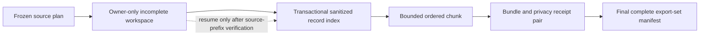

# G1 Resource-Bounded Export Set Plan

## Decision

The next local-only milestone is **G1-R3: deterministic, resource-bounded export sets**. It will replace whole-history in-memory export construction with a resumable owner-only workspace, disk-backed sanitized-record index, independently verifiable bounded bundle/receipt chunks, and one final set manifest.

This is a safety and determinism milestone. It does not authorize compression, encryption, enrollment, upload, external participants, cloud storage, or a `transportReady` change. Telemetry v0.1 remains an unfrozen local-only draft; the first volunteer contract will use a new frozen version after G1 is complete.

## Evidence for doing this now

A measured 31-day scan on the current heavy local history found:

| Measure | Observed value |
|---|---:|
| Source files selected | 1,384 |
| Source bytes | 21,656,801,910 |
| Usage occurrences | 163,612 |
| Quota observations | 246,954 |
| Tool observations | 243,217 |
| Wall time | 103,365 ms |
| RSS increase at completion | 820,723,712 bytes |
| Process maximum RSS | 1,267,200 KiB |

This is a heavy-history datapoint from one machine, not a p95 estimate. It proves that the current whole-history path exceeds the candidate 100,000-record chunk size and that elapsed-time/RSS limits need to be enforced. Final pilot ceilings require more machines and histories.

A separate constant-memory scan of 2,396 active/archive JSONL files and 3,323,306 physical lines found 217 lines over 16 MiB, 111 over 32 MiB, four over 64 MiB, and a maximum of 84,070,547 bytes. The exporter therefore cannot safely allocate every source line. Oversized lines are streamed through fixed relevance markers and discarded only when provably unrelated to session/context/tier/usage/task/tool metadata; relevant or ambiguous oversized lines fail closed.

## Artifact model

The workspace is explicitly incomplete and non-uploadable. It contains no raw log lines, raw paths in user-visible receipts, participant secret, prompt/response content, or arbitrary upstream strings. The final set manifest is the commit point: missing, partial, unverified, reordered, or foreign chunks can never form a complete set.

Each chunk remains an ordinary canonical bundle plus its existing privacy receipt. `verify-bundle` continues to verify a single pair. A new `verify-export-set` verifies the set manifest, ordered chunk hashes, aggregate counts/bytes, cross-chunk ID uniqueness, coverage completeness, compatibility, and resource-policy version.

## Runtime and storage choice

Use the runtime's embedded `node:sqlite` store for this local proof of concept, behind a narrow workspace interface. The current development runtime is Node 26.2.0 and exposes `DatabaseSync`. Before a volunteer artifact is built, declare and test the minimum supported Node/macOS combination or replace the backend with a packaged cross-platform equivalent. No subprocess SQL shell or private system path becomes part of the contract.

The store provides atomic cursor-plus-record commits, uniqueness constraints, disk-backed fork/dedupe indexes, ordered chunk queries, and bounded batches without recreating a database poorly in JSON. SQLite files are local implementation state, never upload artifacts.

## Deterministic source and record rules

1. Discover active and archived rollouts with bounded directory traversal; active wins only for the same exact rollout key.
2. Freeze each selected source prefix by privacy-safe source key, inode/birth-time where available, byte length, and SHA-256. Persist no raw path in the public manifest.
3. Resume only if every frozen prefix is byte-identical. Appends beyond the prefix are ignored for that export; truncation, replacement, or prefix mutation fails closed.
4. Preserve physical JSONL line ordinal across relevant, irrelevant, malformed, and filtered lines. This keeps v2 occurrence IDs invariant.
5. Persist parser state needed at a checkpoint: model, tier index/state, previous cumulative totals and component presence, pending coarse tool counts, fork snapshot membership, and diagnostics.
6. Commit sanitized records and the corresponding source cursor in one bounded transaction. Restart replays neither zero nor two copies.
7. Order materialization by record family, canonical time, and occurrence ID using one reviewed total order. Processing batch size and restart boundaries do not affect logical records or IDs.
8. Fill chunks deterministically to the first serialized record or expanded-byte ceiling. Never shorten the requested interval. If one record cannot fit, fail with a fixed content-free code.

## Resource policy

All limits are versioned, printed by `inspect-export`, persisted in the checkpoint, enforced while reading and materializing, and re-enforced by verification. Restart does not reset cumulative CPU/wall/disk accounting.

Initial benchmark candidates, not final volunteer promises:

| Resource | Candidate | Enforcement point |
|---|---:|---|
| Covered interval | 31 days | Plan creation |
| Directory entries | 20,000 | Streaming traversal |
| Source files | 5,000 | Discovery |
| Frozen source bytes | 32 GiB | Plan creation |
| One allocated JSONL line | 16 MiB | Stream-classify oversize; discard only if fixed markers prove irrelevance, otherwise fail |
| Sanitized records per chunk | 100,000 | Transactional index query/materialization |
| Canonical uncompressed chunk | 32 MiB | Incremental byte accounting and verifier |
| Canonical manifest | 1 MiB | Writer and verifier |
| SQLite transaction batch | 1,000 records | Scan checkpoint |
| Workspace disk | 4 GiB | Before each commit/materialization |
| Wall time | 10 minutes per invocation, cumulative persisted | Scan loop/checkpoint |
| RSS kill switch | 1.5 GiB | Periodic sampling; structural bounds remain primary |
| Nesting depth | Fixed by strict constructors/schemas | Construction and validation |

The writer and verifier now share a 32 MiB canonical-bundle ceiling until streaming verification is implemented. Compression comes after the uncompressed bounded core; compressed and expanded ceilings will then be independent and decompression-bomb tested.

## Checkpoint binding and resume

The checkpoint binds:

- checkpoint/workspace schema and resource-policy version;
- exact requested start/end bounds and creation timestamp;
- compatibility tuple and provider adapter versions;
- participant scope pseudonym, never the secret;
- frozen source-plan digest and per-source prefix evidence;
- cumulative resource use and diagnostics;
- committed source cursor/parser state; and
- completed chunk identities, hashes, counts, and bytes.

A mismatch creates no output and never mutates the old workspace. Resume uses an explicit command/flag and reports only bounded status/codes—never source paths, participant/session IDs, model fingerprints, or record content.

## Failure and recovery contract

- Before final manifest publication, the set is incomplete and cannot pass set verification.
- Source/resource/privacy failures retain an owner-only inspectable checkpoint with a fixed safe failure code; no partial bundle is called complete.
- Each chunk uses the existing receipt-first, bundle-last pair transaction.
- Completed chunk pairs are immutable/no-clobber. Resume verifies rather than trusts them.
- The final manifest is written only after all expected pairs independently verify and aggregate exactly.
- Recovery never replaces a foreign artifact or guesses whether an incomplete set was intended to be complete.
- Deletion of an export pair is a separate bundle-first crash-recoverable lifecycle operation; it is not implemented by recursive directory deletion.

Safe failure codes must be closed enums, including source-file, source-byte, line-byte, event-count, expanded-byte, elapsed, RSS, disk, source-changed, checkpoint-mismatch, chunk-conflict, and incomplete-set failures. Error text must not contain paths or private values.

## Implementation sequence

1. Stabilize the timing-sensitive passive-collector tests so gate evidence is trustworthy.
2. Add fail-closed identity-source conflict handling and safe local identity rotation without enabling transport.
3. Implement a reusable bounded JSONL reader and resource-policy guard; add immediate fail-closed protection to the legacy single-bundle exporter.
4. Extract pure Codex safe-record constructors and a provider-neutral async safe-record interface while retaining the old scanner as a parity reference.
5. Implement the SQLite workspace schema, frozen source plan, transactional checkpoints, safe-record uniqueness, and resume validation.
6. Materialize deterministic bounded bundle/receipt chunks and a separately versioned export-set manifest.
7. Add set-level publication, recovery, verification, `inspect-export`, `export-local --resume`, and `verify-export-set` flows.
8. Add deterministic golden hashes, adversarial fixtures, measured p50/seven-day/heavy benchmarks, and a dated receipt.
9. Only after the uncompressed core passes, add canonical compression plus expanded/decompression limits and bomb tests.

## Acceptance tests

- Huge-count, huge-line, truncation, partial-line, many-file, archive/fork, reordered, duplicate, nested-sensitive-canary, and crash/restart fixture families.
- Stable logical records and occurrence IDs across overlap, traversal reorder, scan batch size, chunk size, interruption, resume, and repeat.
- Exact source-prefix mutation/truncation/replacement detection.
- Tool attribution and fork replay remain equivalent across every checkpoint boundary.
- No silent range shortening; manifest totals equal the union and sum of all chunk receipts.
- Resource failures at writer and verifier boundaries use content-free fixed codes and leave no ambiguous complete artifact.
- Fixed fixtures produce byte-stable logical/set hashes on two clean runs.
- Full test suite, telemetry contract generation/check, diff check, focused performance audit, code-quality audit, plan-completeness audit, and tests/docs audit pass.

## Explicitly deferred

- Native Keychain/Credential Manager/Secret Service backends and non-macOS release claims.
- Claude Code export parity and prospective account-scoped app-server quota export.
- Minimization ablation and final timestamp/session/tool retention choices.
- Signed packages, SBOM, installers, and two clean-machine volunteer-local reviews.
- Encryption envelopes, upload credentials, network transport, server ingestion, cloud storage, aggregation, dashboards, notifications, and public reporting.

These remain required by the comprehensive end-to-end goal at their existing gates. This plan narrows the next implementation slice; it does not weaken or replace that goal.
