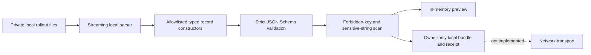

# Telemetry v0.1 Privacy Contract and Local Export Gate

## Decision

The first multi-user research artifact is a local-review-only metadata bundle. It is constructed from an empty object using versioned allowlists; it is never a redacted copy of a Codex or Claude log. A valid v0.1 bundle cannot contain arbitrary fields or free-form content, is written mode `0600`, carries a separate privacy receipt, and is structurally marked `transportReady: false`.

No upload, enrollment, server, background collection, notification, or dashboard functionality is authorized by this decision. A later transport design must pass a separate review and cannot weaken these schemas.

## Data-flow boundary



Raw source values exist only while the local parser examines the source. They are not written to an intermediate redacted file. The constructors receive normalized numeric values and fixed classifications; source IDs needed for grouping are immediately converted to domain-separated HMAC pseudonyms.

## Allowlisted field-purpose matrix

| Category | Exported representation | Research purpose | Local v0.1 retention | Public-use rule |
|---|---|---|---|---|
| Participant | `participant:v1:` HMAC pseudonym | Stable personal longitudinal grouping | In bundle until user deletes it | Never publish directly |
| Account | `account:v1:` HMAC or `unattributed` | Prevent account/plan pooling when evidence exists | In relevant records | Never publish directly |
| Session | `session:v1:` HMAC | Attach usage, quota, and tool-class observations without raw rollout IDs | In event/snapshot records | Never publish directly |
| Event identities | Domain-separated event/snapshot/marker HMACs | Deterministic dedupe and retry safety | In records | Never publish directly |
| Time | Exact UTC event, observation, receipt, reset, and covered-range timestamps | Align local cost to quota motion and reset regimes | In restricted research bundle | Bucket and suppress before public output |
| Model | Recognized bounded provider model ID, otherwise keyed `model:v1:` fingerprint | Compare model accounting while avoiding surprise strings | In usage records | Publish only supported groups with cohort thresholds |
| Token components | Non-negative uncached input, cache read/write, output text, output reasoning, total input context | Reconstruct API-price equivalents and test cache/reasoning effects | In usage records | Aggregate only |
| Execution classes | Fixed billing surface, Standard/Fast, API tier, reasoning effort, local surface, agent scope, lineage, outcome enums | Test tier and surface multipliers without source text | In usage records | Aggregate only |
| Tool activity | Counts in twelve fixed tool classes | Test whether coarse tool activity explains quota motion | In usage records | Aggregate only; never infer provider billing without server evidence |
| Quota | Provider, fixed plan/variant/limit/slot classes, percentage, display precision, duration, reset, source, coupling surface | Measure quota gradients and seven-day regimes | In quota snapshots | Aggregate and suppress small cohorts |
| Activity markers | Fixed surface/state/coupling/plan classes and pseudonyms | Bound otherwise unlogged shared-pool activity | In marker records | Aggregate only |
| Diagnostics | Fixed diagnostic codes and integer counts | Make parser loss/replay exclusion inspectable | In bundle | May publish aggregate quality counts |
| Integrity | Bundle byte count and SHA-256 in a separate receipt | Verify exact reviewed local bundle | In receipt | Safe only without participant/bundle pseudonyms |

## Explicit exclusions

The following are prohibited from every valid bundle and receipt:

- prompts, responses, summaries, messages, transcripts, and attachments;
- tool/function names, tool arguments, commands, command output, URLs, or URIs;
- repository/project names, paths, filenames, branch names, working directories, or document names;
- email addresses, raw account/provider/session/turn/call/device IDs, usernames, hostnames, IP addresses, locale, or geolocation;
- cookies, authorization headers, OAuth material, API keys, private keys, balances, or payment data;
- arbitrary labels, experiment text, error text, unknown input fields, or generic metadata maps; and
- raw unknown model identifiers.

Fields not present in the schema are rejected even if they appear harmless. Adding a field requires a schema-version change, purpose/retention update, adversarial fixture, and privacy review.

## Pseudonym specification

The exporter uses a separate 32-byte random participant secret, not the account-observation key. The default file is `.usage-monitor/export-participant-secret`, created mode `0600`. `APP_USAGEMONITOR_EXPORT_SECRET` or `--secret-file` may supply an alternative.

Each namespace derives its own 32-byte key using HKDF-SHA-256:

```text
salt = "app-usagemonitor/export-identity/v1"
info = namespace
namespace_key = HKDF-SHA-256(participant_secret, salt, info)
pseudonym = namespace + ":v1:" + base64url(HMAC-SHA-256(namespace_key, framed_subject))
```

Namespaces are `participant`, `account`, `session`, `event`, `snapshot`, `marker`, and `model`. The same source subject therefore cannot be correlated across namespaces by comparing digests. Rotating or deleting the participant secret breaks future linkability; copying the same secret to another device intentionally preserves the same participant identity.

Raw account/session identifiers are never used as exported identifiers. An account with no defensible local attribution is represented as the literal enum `unattributed` rather than being guessed.

## Threat model

| Threat | v0.1 control | Residual risk |
|---|---|---|
| New upstream content field is introduced | Empty-object extraction plus `additionalProperties: false` | A future developer could intentionally map it; review and tests remain required |
| Content appears in an allowed string field | Closed enums and recognized-model regex; unknown models are keyed fingerprints | A provider could choose a model ID resembling personal data but still matching the bounded model grammar |
| Raw IDs become correlatable hashes | Secret-keyed, domain-separated HMACs | Anyone holding the participant secret can reproduce pseudonyms |
| Credentials/content appear in an unexpected value | Defense-in-depth email, URL, path, credential, private-key, and bearer scanners | Pattern scanning cannot detect every semantic secret; schema allowlisting is the primary boundary |
| Malicious source adds getters/nested values | Existing safe classifiers use own data descriptors; export schema copies only normalized fields | Parser/library regressions require continued fuzz/property testing |
| Replayed/forked histories inflate contribution | Existing replay-safe scanner and deterministic event IDs | Server-side cross-bundle dedupe is not implemented yet |
| Local files are exposed to another user | Secret, bundle, and receipt are mode `0600`; export patterns are Git-ignored | Malware or the same OS user remains outside this control |
| Accidental network disclosure | No upload code or destination exists; `transportReady` is schema-constant `false` | Another application could manually copy a local bundle |
| Exact timestamps enable behavioral inference | Restricted bundle only; planned public output must bucket/suppress | The local bundle itself remains sensitive research metadata |
| Small cohorts identify a participant | No public aggregate system exists | Later server/site work must implement minimum cohort and contribution bounds |

## Local verification gate

An export is written only after all checks pass:

1. The complete bundle and each nested record validate against telemetry v0.1.
2. Recursive field-name scanning finds no forbidden content/identity/location keys.
3. Recursive string scanning finds no email, web/file URL, user path, common token, bearer token, or private-key shape.
4. Declared and actual record counts match.
5. Test fixtures prove supplied private canaries do not occur in serialization.
6. The receipt validates and records the exact canonical bundle SHA-256 and byte length.

Validation failures return only schema paths/check codes, never offending values. The process fails before either output file is written.

## Consent draft for a future dry pilot

> This tool reads your local coding-agent logs on your own computer and creates a new metadata-only file. It does not copy prompts, responses, code, paths, filenames, commands, URLs, credentials, email addresses, or raw account/session identifiers. The preview shows the time range, record counts, bundle size, and privacy checks. In this dry pilot, the file stays on your computer and nothing is uploaded. Exact timestamps, token usage, model classes, quota percentages/reset times, coarse tool classes, and cryptographic pseudonyms remain sensitive metadata. Review the bundle and receipt before deciding whether you would join any later upload pilot.

Future upload consent must separately name the operator, destination, retention window, research/public outputs, deletion method, contact channel, and whether notification information is stored. It may not rely on this local-only consent text.

## Local deletion and rotation runbook

1. Stop any exporter process. No background process is currently installed.
2. Delete the selected local bundle and its matching privacy receipt. Files under `exports/` are generated review artifacts and are not source evidence.
3. To end longitudinal linkability, delete `.usage-monitor/export-participant-secret`. The next inspect/export creates a new identity. Existing local bundles remain linkable to one another through their embedded old participant pseudonym until they are also deleted.
4. If a secret may have been exposed, rotate it before creating another bundle and do not share any bundle created with the exposed identity.
5. Do not delete raw Codex logs as part of this runbook; they belong to the provider application and are outside this tool's data lifecycle.

There is no server-side deletion procedure because no server or upload exists. Phase 2 cannot begin until enrollment, status, export, revocation, and deletion paths are implemented and exercised end to end.

## Validation receipt

The implementation is covered by 182 passing Node tests, including nine exporter-specific identity/schema/privacy/CLI/end-to-end tests plus property-based unknown-field injection. Synthetic fixtures contain prompt/response canaries, email and bearer-shaped values, raw account/session/call/marker IDs, a private path, tool arguments, repository metadata, arbitrary fields, and an unknown model string; none enter the valid output.

A real bounded dry run over 2026-07-24 18:10:45–19:10:45 UTC scanned four local rollout files and emitted 463 usage events plus 471 quota snapshots. The canonical bundle was 982,083 bytes, both bundle and receipt were mode `0600`, all five privacy checks passed, 125 fork-replay events were reported as excluded diagnostics, and `transportReady` remained `false`. The generated files are ignored local artifacts under `exports/` and were not transmitted.

## Remaining gates

This record does not claim Phase 1 completion. Before soliciting even local dry-run bundles from volunteers, the project still needs:

- several independently shaped fixtures and platform-specific path/credential cases;
- an inspectable field dictionary generated from the schemas;
- bounded/incremental processing for very large histories rather than retaining a whole bundle in memory;
- Claude Code export parity where stable local usage and status-line evidence exists;
- reproducible signed packaging and installation instructions;
- at least two volunteer local-only dry runs with explicit feedback; and
- a decision on compression and application-layer encryption before any network design.
