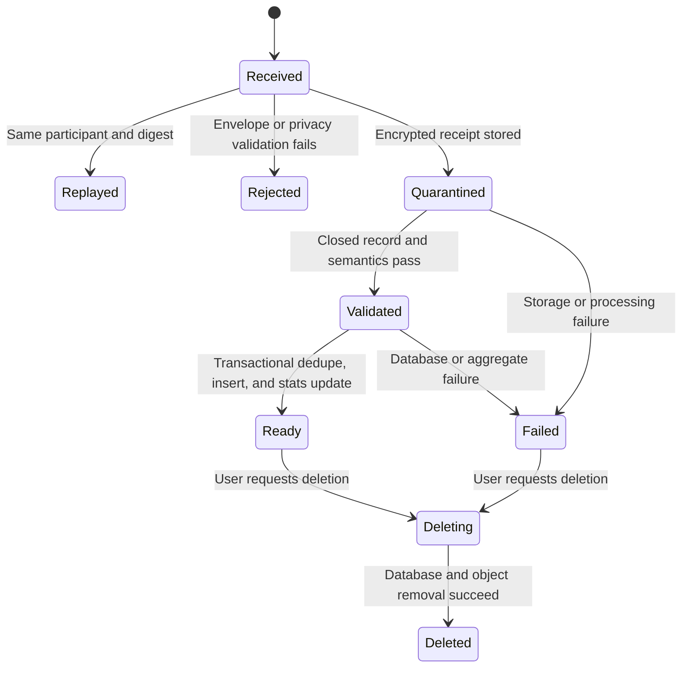

# Local Companion and Central Usage Intelligence App Plan

## Correction in scope

The synthetic consumer vertical slice proves anonymous enrollment, browser
encryption, server validation, export, recovery, and deletion. It does not
demonstrate the actual usage-monitor product. The useful product is the local
measurement experience already present in the CLI and detailed reports:

- real local Codex log discovery and incremental collection;
- current five-hour and seven-day quota observations;
- API-price-equivalent token and provider-tool accounting;
- cached/uncached input and text/reasoning output coverage;
- Standard/Fast subscription speed separated from API processing tier;
- observed-versus-cost-implied quota movement at one, two, and three hours;
- reset-specific weekly value estimates and their empirical uncertainty;
- chronological validation error and policy/regime diagnostics; and
- visible gaps for account, plan, shared surfaces, tools, and stale collection.

The next implementation must make those capabilities usable from one local app
and prove the complete contribution loop against a locally emulated central
service. The synthetic contribution experience remains a development mode, not
the default product.

## Product boundary

The product has two deliberate trust zones.

The companion is a loopback-only Node application:

1. a trusted local process reads Codex application state and privacy-safe local
   monitor artifacts;
2. raw logs never enter the browser;
3. the local process exposes only closed, content-free dashboard JSON;
4. the browser renders the real monitoring dashboard and can request an
   explicit local refresh; and
5. an explicit contribution action builds a second closed, versioned export
   containing only approved aggregate metadata.

The central service is a separately testable application:

1. it receives only encrypted, content-free exports and never local log files;
2. it performs strict envelope, schema, semantic, size, privacy-canary,
   duplication, and participant-state validation;
3. it quarantines the encrypted receipt while inserting only allowlisted
   analytical fields into a database;
4. it updates participant-specific and cohort statistics without exposing
   another participant's data;
5. it returns contribution processing status and bounded personal/community
   insights; and
6. it supports access recovery, participant export, contribution deletion, and
   full participant deletion.

The first functional checkpoint may reuse the existing validated local
artifacts while a refresh is running, but it must identify artifact freshness
and must never present July 2026 evidence as current live state without a
timestamp.

## Local architecture

```mermaid
flowchart LR
    A["Private Codex logs and app state"] --> B["Existing local collectors"]
    B --> C["Privacy-safe observations and transitions"]
    C --> D["Local companion API"]
    D --> E["Browser dashboard on 127.0.0.1"]
    C --> F["Gradient and weekly calibration"]
    F --> D
    D --> H["Closed contribution builder"]
    H --> I["Encrypted content-free export"]
    I --> J["Central validation and quarantine"]
    J --> K["Dedupe and analytical database"]
    K --> L["Personal and cohort insights"]
    L --> E
```

### Trust and network controls

- Bind only to `127.0.0.1`.
- Accept only the configured loopback host and same-origin browser requests.
- Emit no CORS permission.
- Require JSON plus a custom local-app header for refresh requests.
- Never accept a source path, raw log body, prompt, response, command, URL,
  account email, repository, or arbitrary label through the API.
- Serve only a fixed static directory and fixed allowlisted report files.
- Return fixed error codes; keep private paths and values out of responses.
- Keep refresh single-flight and resource-bounded.
- Require explicit consent and an explicit user action before contribution.
- Do not allow the browser or server to request a local source path or broaden
  the export schema.

### Central trust and ingestion controls

- Bound the compressed and decoded request size, record count, time span,
  numeric totals, nesting depth, and processing time.
- Decrypt only after authenticating the participant and validating the closed
  envelope shape.
- Validate exact keys recursively; arbitrary strings and extension fields are
  rejected rather than retained.
- Reject content canaries and content-like fields including prompts, responses,
  commands, paths, URLs, email addresses, repository names, session IDs, and
  arbitrary labels.
- Recompute canonical digests server-side and make ingestion idempotent for both
  retry safety and overlap deduplication.
- Keep participant identity as a random capability-backed pseudonym. Store only
  token hashes; never store access or recovery capabilities.
- Separate quarantine receipts from the queryable analytical database.
- Bound every database query and aggregate response; suppress or coarsen cohort
  slices that do not meet a minimum participant threshold.
- Return fixed error and processing codes without private values, source paths,
  decrypted bodies, or stack traces.
- Make deletion remove both analytical rows and quarantined objects, and test
  recovery after partial failure.

## API checkpoint

| Method | Path | Purpose |
|---|---|---|
| `GET` | `/api/local/health` | Local readiness, mode, versions |
| `GET` | `/api/local/overview` | Freshness, source coverage, current quota, cost and warning summary |
| `GET` | `/api/local/gradient` | Cumulative and 1/2/3-hour observed-versus-implied data |
| `GET` | `/api/local/weekly` | Reset estimates, central bands, validation error and selected method |
| `GET` | `/api/local/quality` | Coverage, quantization, reset-family and opportunity diagnostics |
| `GET` | `/api/local/reports` | Fixed local detailed-report links and timestamps |
| `POST` | `/api/local/refresh` | Start one explicit privacy-safe local refresh |
| `GET` | `/api/local/refresh` | Read bounded in-memory refresh status |
| `POST` | `/api/local/contribution/prepare` | Build and summarize a closed export locally |
| `POST` | `/api/local/contribution/send` | Explicitly encrypt and send the prepared export |

Responses are versioned and closed. Large chart series are capped or
deterministically sampled for the browser; detailed local reports remain
available for full inspection.

## Central API checkpoint

| Method | Path | Purpose |
|---|---|---|
| `POST` | `/api/v1/enroll` | Create a pseudonymous participant and recovery capability |
| `POST` | `/api/v1/recover` | Rotate access using the recovery capability |
| `GET` | `/api/v1/envelope-key` | Fetch the active contribution-encryption key |
| `POST` | `/api/v1/contributions` | Accept one encrypted, closed contribution export |
| `GET` | `/api/v1/contributions/:id` | Read validation/processing status owned by the participant |
| `GET` | `/api/v1/me/insights` | Read participant-only trends and coverage diagnostics |
| `GET` | `/api/v1/community/insights` | Read privacy-thresholded aggregate results |
| `GET` | `/api/v1/me/export` | Export all retained participant data |
| `DELETE` | `/api/v1/contributions/:id` | Delete one contribution and its quarantine object |
| `DELETE` | `/api/v1/me` | Delete the participant, contributions, and stored objects |

The API may compute insights synchronously for the local proof of concept, but
its contribution state model must allow `accepted`, `processing`, `ready`,
`rejected`, and `deleting` so production processing can later move to a queue.

## Dashboard information architecture

### Overview

- current five-hour and seven-day remaining percentages when observed;
- reset times and observation age;
- locally retained API-price-equivalent cost over selectable periods;
- latest model, Standard/Fast speed, API-price assumption, and priced coverage;
- explicit warnings when current state is unavailable or stale.

### Cost versus quota

- cumulative observed quota movement versus local API-price-equivalent cost;
- one-, two-, and three-hour rolling comparisons;
- residual and AUC summaries;
- exact UTC and Eastern timestamps;
- reset boundaries and selected gradient;
- empirical lower/upper slope envelope labeled as dependent pairwise
  dispersion, not confidence intervals.

### Seven-day estimate

- reset-by-reset weekly API-price-equivalent values;
- current ballpark and central 80% across resets;
- holdout MAE/bias and prior-reset validation;
- selected Standard or speed-weighted method;
- regime and display-lag findings without provider-formula claims.

### Monitoring quality

- account, plan, speed, snapshot-age, and controlled-state coverage;
- flat/increasing/regressing integer-display shares;
- collector freshness and source interval;
- known shared-pool and unobserved-surface caveats;
- prioritized opportunities to improve measurement.

### Detailed reports

The full existing gradient, weekly calibration, monitoring-quality, and
multi-surface reports stay directly reachable from the app.

### Contribution and results

- preview the exact categories and bounded totals that will leave the device;
- show exclusions and the privacy-contract/schema version;
- require explicit consent and send;
- display validation, dedupe, ingestion, and insight-computation status;
- show the participant's own retained periods, quota/cost gradient, weekly
  estimates, evidence quality, and change over time;
- show privacy-thresholded community distributions, sample size, countries or
  plan cohorts only when safely available, and provider/policy epochs;
- label synthetic/local-emulator/community-unavailable states unmistakably;
- provide contribution deletion, complete data export, access recovery, and
  account deletion controls.

## Refresh behavior

The app starts by reading the newest verified safe artifacts. A user-triggered
refresh runs the smallest existing privacy-safe collection/update pathway,
records bounded stage/status information, and atomically exposes a new
dashboard snapshot only after validation succeeds. A failed refresh retains
the prior valid snapshot and shows a fixed diagnostic.

Initial implementation should not silently run a multi-minute historical
rebuild on page load. Historical rebuild and current incremental collection
must be separate explicit actions.

## Ingestion state machine

No partially ingested contribution may affect personal or community results.
The database transaction marks a contribution ready only after every analytical
row needed for that contribution is present.

## Test strategy

The central service must be runnable against local D1/R2 emulation. Tests cover:

- happy-path enrollment, encryption, upload, validation, database insert,
  personal insight, aggregate insight, export, single deletion, and full
  participant deletion;
- duplicate transport retries, overlapping observation rows, and two different
  participants contributing identical public aggregates;
- truncated, oversized, malformed, deeply nested, non-canonical, out-of-range,
  unsupported-version, and decompression-bomb payloads;
- privacy canaries in every layer: prompt, response, email, URL, command, local
  path, repository, session identifier, and arbitrary unknown fields;
- authentication isolation and attempts to read or delete another
  participant's contribution;
- quarantine/database partial failures, retry behavior, last-known status, and
  deletion recovery;
- minimum cohort thresholds and the absence of participant-identifying rows in
  community responses; and
- a browser-driven end-to-end flow using a real locally generated safe export
  and the locally emulated service.

## Acceptance gates

- The default page shows real retained local evidence, not a fabricated graph.
- Every headline value names its observation time and evidence status.
- Browser JSON contains no prompt, response, path, command, URL, account email,
  repository, credential, or raw identifier.
- The one/two/three-hour and weekly charts reproduce the existing report
  datasets and meanings.
- The detailed reports open from the app.
- A refresh request is same-origin, single-flight, bounded, and cannot select
  arbitrary files or commands.
- The local preview lists every exported category and proves that raw content
  and source identifiers are absent before transmission.
- A real safe export can be encrypted, accepted, validated, deduplicated,
  persisted, and reflected in the participant's insights.
- Community insight queries are privacy-thresholded and never reveal another
  participant's rows or pseudonym.
- Contribution status, export, single deletion, complete deletion, and recovery
  work against local D1/R2 emulation.
- Empty, missing, stale, malformed, and oversized artifacts fail safely.
- Focused API/UI tests, adversarial ingestion tests, privacy-canary tests, and
  the existing accounting/report suites pass.
- Loopback browser QA checks overview, charts, time-range controls, detailed
  navigation, refresh states, desktop layout, and a narrow viewport.

## Verified implementation checkpoint

The local-development checkpoint now passes the product gates above for the
implemented manual-upload slice. A fresh privacy-verified real bundle was split
into two bounded transport batches, encrypted in the browser, accepted through
the fixed loopback relay, deduplicated on replay, reflected in personal
statistics, suppressed from community output below three participants, and
removed from both D1 and R2 through the consumer deletion control.

The server also rejected an encrypted nested `prompt` canary before creating a
contribution. Focused UI, companion, builder, Worker, type, and dry-deployment
checks pass. The [functional end-to-end verification
receipt](./2026-07-25-functional-product-e2e-verification-receipt.md) records
the measured evidence and residual risks.

## Explicit non-goals

- No production deployment or public bucket in this checkpoint.
- No automatic/background transmission.
- No collection of country or demographic data until a separate minimization
  and privacy review approves the exact low-cardinality fields and cohort
  thresholds.
- No public aggregate dashboard until the local emulator has multiple safe test
  participants and passes isolation/suppression tests.
- No claim that API-price equivalence is the provider's subscription formula.
- No automatic retroactive assignment of historical activity to an account.
