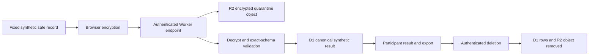

# Synthetic Consumer Vertical Slice Plan

> Superseded by the [G3 session and upload capability separation
> plan](./2026-07-25-g3-session-capability-separation-plan.md) and its
> [verification receipt](./2026-07-25-g3-session-capability-separation-verification-receipt.md).
> This is a historical synthetic-only design record. Its bearer-capability API
> description is not the current product contract.

## Outcome

Turn the existing local research and privacy machinery into the first usable consumer journey without accepting real participant logs:

1. understand what the product measures and what it excludes;
2. inspect a fixed synthetic safe-record contribution;
3. enroll anonymously;
4. encrypt and submit the synthetic contribution;
5. see processing status and personal synthetic results;
6. export the participant's complete server-side record; and
7. delete the participant and every associated object and derived row.

The slice is a development proof, not a launch. Every client and server boundary must reject non-synthetic contributions.

## Effort allocation

- Approximately 20%: finish the bounded OpenAI/Codex accounting correctness pass needed by the product readout.
- Approximately 80%: consumer UI, server/API, storage lifecycle, integration, and rendered QA.

Claude production integration, regional API pricing, real-user enrollment, notifications, background collection, and public aggregate publication are out of scope.

## Stack decision

Use one Cloudflare Worker with static assets, D1, and R2 for the synthetic proof:

- static assets serve a framework-free browser client;
- the Worker exposes the versioned JSON API;
- D1 stores anonymous enrollment state, token hashes, contribution status, and canonical synthetic results;
- R2 stores the opaque encrypted quarantine envelope; and
- Web Crypto provides browser-side AES-GCM encryption, RSA-OAEP key wrapping, server-side decryption, secure identifiers, and credential hashing.

This keeps the proof thin and maps directly onto the planned trust zones. It does not commit a future production system to Cloudflare or rule out a Google Cloud implementation after the synthetic slice is evaluated.

## Synthetic-only invariant

The application has no file picker, paste box, raw-log path, or arbitrary contribution editor. The only contribution is a checked-in, allowlisted synthetic fixture.

Both sides enforce the boundary:

- the browser marks the envelope and plaintext record `synthetic: true`;
- the server authenticates the participant, bounds and validates the envelope, decrypts it, validates the exact synthetic schema and fixture marker, and rejects extra keys;
- the server stores only the opaque envelope in quarantine and the allowlisted derived fields in D1;
- responses never echo credentials, decrypted payload bytes, or arbitrary request values; and
- production deployment remains outside this slice.

## API v0.1

| Method | Path | Purpose |
|---|---|---|
| `GET` | `/api/health` | Non-sensitive local readiness |
| `GET` | `/api/v1/envelope-key` | Current public wrapping key and key ID |
| `POST` | `/api/v1/enroll` | Anonymous participant, bearer credential, and recovery code |
| `POST` | `/api/v1/recover` | Rotate access using the one-time-disclosed recovery capability |
| `POST` | `/api/v1/contributions` | Authenticated encrypted synthetic envelope |
| `GET` | `/api/v1/me` | Participant status and synthetic personal result |
| `GET` | `/api/v1/me/export` | Complete participant-owned server record |
| `DELETE` | `/api/v1/me` | Delete enrollment, contributions, results, and quarantine objects |

Bearer and recovery secrets are returned only when created. D1 stores keyed or salted cryptographic hashes, never plaintext credentials.

## Consumer experience

The local application should make four points obvious:

1. this build uses synthetic data only;
2. prompts, responses, commands, paths, URLs, credentials, and account identifiers are excluded;
3. API-price-equivalent cost is an explanatory comparison, not OpenAI's subscription formula; and
4. the participant can export or delete their server-side record.

The primary screen should show:

- the synthetic quota-versus-cost result;
- component coverage for uncached input, cached input, output, reasoning, and provider tool units;
- the assumed API tier separately from observed Codex Standard/Fast subscription speed;
- enrollment/contribution status; and
- concise privacy and uncertainty explanations.

## Storage lifecycle

Submission is idempotent. Replayed identical envelopes return the existing contribution; conflicting reuse is rejected. Deletion must be verifiable by a subsequent authenticated request failing closed and by storage-level tests proving that no participant rows or objects remain.

## Acceptance gates

The slice is complete only when:

- UI helpers and Worker handlers have focused tests;
- Worker types are generated from `wrangler.jsonc`;
- TypeScript checks and a Wrangler dry-run pass;
- local D1 migrations apply cleanly;
- the full synthetic journey passes against local Worker storage;
- malformed, oversized, non-synthetic, unauthenticated, replay-conflicting, and unknown-key submissions fail closed;
- export contains only the participant's allowlisted records;
- deletion removes both D1 and R2 state;
- the existing root test suite remains green apart from an explicitly diagnosed pre-existing receipt drift;
- a loopback browser QA checks desktop and narrow layouts plus the complete journey; and
- repository scanning finds no secrets or private/generated local evidence in the new files.

## Deliberate non-goals

- No production deployment.
- No real log selection or upload.
- No automatic/background collector.
- No email or notification identifier.
- No public aggregate view.
- No subscription billing or payment.
- No claim that synthetic cryptographic and deletion tests constitute a completed external privacy or security review.

## Implementation checkpoint

The synthetic slice is implemented under `apps/web` and `apps/worker`. The
consumer can review the exact fixture, consent, enroll, encrypt and submit,
recover a lost browser session, refresh status, export the complete participant
record, and delete D1 and R2 state. The Worker has no public route.

Verification on July 25, 2026:

- 9 browser-helper and interface contract tests pass;
- 6 Cloudflare-runtime integration tests pass, including a real
  `createSyntheticEnvelope()` browser envelope submitted to the Worker;
- generated Worker types, strict TypeScript, and Wrangler dry-run pass;
- malformed JSON/content types, unknown keys, extra envelope/plaintext fields,
  non-synthetic records, oversized bodies, missing authentication, and a
  distinct second contribution fail closed;
- deletion removes D1 and R2 state and invalidates the old capability; and
- loopback browser QA completed enrollment, encrypted contribution, recovery,
  result rendering, and recovered-participant deletion.

Before any non-local route is added, enrollment and recovery require an
edge-level admission/rate-limit design. Before any real record is accepted, the
local telemetry contract must be separately frozen and authorized for
transport; this synthetic implementation does not alter `transportReady:
false`.
