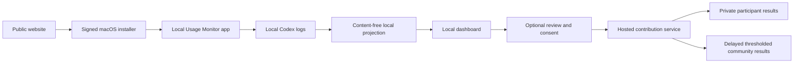

# New User First-Run Journey Audit

> **Closed pre-implementation baseline.** This audit preserves the product
> state and findings observed on July 28, 2026, before the end-to-end
> implementation work. It is superseded by the
> [End-to-End Release Readiness Plan](../plans/2026-07-29-end-to-end-release-readiness-plan.md)
> and the
> [End-to-End Usage Monitor Pilot Readiness Report](../reports/2026-07-29-end-to-end-pilot-readiness-report.md).
> Treat all findings and open items below as historical baseline evidence, not
> as the current implementation or readiness status.

## Objective

Trace the product from the perspective of a person on a clean Mac who knows
nothing about Usage Monitor, local companions, Codex log locations, terminals,
privacy-safe exports, or community contribution. The target experience is a
download, a normal macOS installation, a guided first launch, a useful local
result, and an optional reviewed contribution without requiring developer
tools or documentation.

## Target journey

1. Discover the product on a public website.
2. Download and install a trusted macOS application.
3. Launch it from Finder.
4. Understand what will be read, retained, and never uploaded.
5. Grant only the required macOS access, if any.
6. Detect local Codex history automatically.
7. Produce a useful recent result quickly while deeper history continues
   incrementally.
8. Explore allowance, API-price-equivalent usage, and confidence in ordinary
   language.
9. Optionally inspect and contribute content-free evidence.
10. Return later without reinstalling, re-pairing, or repeating a full scan.
11. Export or delete contributed data without developer assistance.
12. Update or uninstall the product cleanly.

## Evidence being collected

- Current macOS bundle, launcher, signing, and first-run behavior.
- Current website behavior with and without the local companion.
- Empty-history, inaccessible-history, slow-index, stale-cache, offline, and
  recovery states.
- Contribution enrollment, pairing, review, upload, results, export, and
  deletion.
- Hosted-service and distribution gates that prevent an external pilot.

## Current high-level finding

The repository contains a functioning local app and a thoroughly exercised
local backend laboratory, but it does not yet contain a consumer distribution
and onboarding funnel. A new user cannot currently move from a public URL to a
trusted installed app and hosted community service without developer
intervention.

## Executive verdict

The product is not yet installable by an ordinary new user. The core local
accounting, privacy filtering, contribution validation, recovery, deletion, and
backend lifecycle are materially ahead of the consumer journey around them.

The shortest truthful description of the product today is:

> A developer-built, local-only macOS companion and browser dashboard with a
> comprehensive disposable backend laboratory.

The next release milestone should not add more analysis panels. It should make
one linear journey work without Terminal:

> Public website → trusted macOS install → Codex detection → useful result →
> optional enrollment → reviewed contribution → personal result.

## Architectural boundary

A normal website cannot read `~/.codex`, multi-gigabyte rollout files, macOS
Keychain credentials, or private application state. Browser sandboxing is a
correct and useful barrier.

“Initialized through the website” should therefore mean:

1. the website explains the local/hosted boundary;
2. the website offers the correct signed installer;
3. the website can detect or reopen the installed app;
4. the app performs local detection, scanning, pricing, and privacy filtering;
5. the website or local dashboard guides enrollment and contribution; and
6. only a separately reviewed, closed-schema export reaches the hosted service.

It cannot honestly mean that an uninstalled webpage silently reads Codex logs.



## What exists today

The repository already has valuable product foundations:

- a self-contained AppKit application with an embedded Node runtime;
- loopback-only serving on an ephemeral port;
- owner-only application state;
- a content-free local data contract;
- bounded, replay-safe log scanning and API-price-equivalent accounting;
- explicit preparation, exact local review, and single-use send authorization;
- encrypted upload, strict validation, deduplication, participant isolation,
  recovery, export, contribution deletion, participant deletion, retention,
  restore replay, and delayed community aggregation in the Worker backend;
- a safe Cloud Run containment shell; and
- substantial unit, integration, HTTP, restart, and lifecycle coverage.

Those foundations reduce the remaining engineering risk. They do not provide
an acquisition, installation, onboarding, or hosted-pilot path by themselves.

## Current journey on a clean Mac

### 1. Discover

| User action | Current experience | Time |
|---|---|---:|
| Search for the product | There is no public product homepage or discoverable release. | Dead end |
| Open the repository | The GitHub repository is private. | Dead end |
| Open the current dashboard assets directly | The page says **The local companion is not available** and tells the user to “start the product laboratory.” It offers no download or **Open app** action. | Under 1 second locally, but no next consumer action |

The hosted Worker can serve the dashboard assets, but that does not install the
local reader. The current public-page empty state is developer documentation,
not onboarding.

### 2. Download and install

There is no consumer download. A developer currently has to:

1. obtain the private source;
2. install the exact supported Node toolchain and dependencies;
3. run `npm run product:macos:build`; and
4. manually open `.release-build/macos/Usage Monitor.app`.

The current bundle is:

- 141 MiB;
- version 0.0.1;
- Apple-silicon-only;
- macOS 13 or later;
- ad-hoc signed;
- not notarized;
- not packaged as a DMG, PKG, or release ZIP;
- missing a product app icon; and
- rejected by `spctl`.

This is a valid developer artifact, not an app a novice can ordinary-open
through Gatekeeper.

### 3. First native launch

If the app has somehow been placed on the Mac:

1. the user opens **Usage Monitor**;
2. a 460 × 210 window shows **Starting locally…**;
3. the embedded companion starts on a random loopback port;
4. the window changes to **Ready**; and
5. the user presses **Open Dashboard**.

An isolated launcher smoke reached loopback readiness in 0.13–0.14 seconds on
this development Mac. That is useful startup evidence, but it is not a
downloaded, quarantined, clean-Mac measurement. The current test only enforces
a 20-second readiness ceiling.

There is no first-run explanation, installer receipt, version/help surface,
startup Retry button, diagnostic export, or actionable failure code. The user
must keep the small launcher window open; closing it terminates the companion
and breaks the browser dashboard.

### 4. Website and app connection

The app opens the real dashboard at an ephemeral
`http://127.0.0.1:<port>/` URL.

Consequences today:

- old bookmarks and old tabs do not reconnect on a later launch;
- the user must reopen the app and press **Open Dashboard** each time;
- the public website cannot detect or reopen the app;
- there is no `usagemonitor://` URL scheme or equivalent handshake; and
- there is no stable local shell that redirects to the current port.

### 5. Local preflight

The dashboard checks:

- `~/.codex/sessions`;
- `~/.codex/archived_sessions`; and
- whether private Usage Monitor state is writable.

It does not offer a folder picker or native configuration for a custom
`CODEX_HOME`.

With no Codex session:

1. the page says to open Codex and create or resume a task;
2. the setup **Scan my local metadata** button is disabled;
3. there is no **Install Codex**, **Open Codex**, sign-in, or guided
   “create one task” action;
4. there is no automatic **Check again** transition after Codex creates a
   rollout; and
5. the global **Refresh local data** button remains enabled.

In a clean-state test, pressing that global button with no Codex source failed
in about 70 milliseconds and produced a generic **The local update did not
finish** message. The product already knew the source was missing and should
not have offered that action.

### 6. First analysis

When rollout files exist, the user presses **Scan my local metadata** or the
global **Refresh local data** action.

The current work is effectively all-or-nothing:

1. index a bounded seven-day tail;
2. refresh current quota evidence;
3. build or reuse replay-safe accounting, potentially across 31 days; and
4. publish the updated dashboard only after the combined operation completes.

The UI reports file counts and elapsed time, but it has no reliable ETA,
Cancel, safe-to-close behavior, or early headline. The controller has a
five-minute timeout and the browser can poll for roughly the same period.
Recent fixtures have taken around one minute; the large real history on this
Mac has approached five minutes.

A first result should not depend on deep weekly calibration finishing.

### 7. Understand the result

After a successful refresh, the full dashboard exposes:

- current quota observations;
- API-price-equivalent usage;
- measured-versus-calculated calibration;
- usage and allowance timelines;
- weekly allowance fits;
- cost accounting;
- model, speed, surface, lineage, tool, and coverage tables;
- monitoring gaps;
- detailed local evidence;
- contribution controls;
- backend operational readiness;
- private participant controls; and
- community results.

This is strong diagnostic coverage, but too much of it competes for first-run
attention. A novice needs the answer before the methodology:

1. allowance remaining and reset time;
2. recent API-price-equivalent usage;
3. best weekly-limit estimate and confidence;
4. one large timeline; and
5. one short explanation of what remains uncertain.

Technical calibration, metadata diagnostics, and backend lifecycle should be
collapsed by default.

### 8. Optional contribution

The privacy boundary is thoughtfully implemented, but the consumer bootstrap
is circular:

```text
Send prepared data
    requires a paired companion
        requires a pairing code
            requires an enrolled browser session
                currently requires the advanced manual-upload flow
                    requires finding or creating a prepared export
```

The current local-only app has no production community origin sealed into it,
so it cannot submit even if the user navigates the controls.

The backend primitives support the desired lifecycle, but the accepting hosted
service is not provisioned. The Cloudflare staging check currently proves a
safe unprovisioned/disabled configuration. The Cloud Run service passes its
containment tests by rejecting contribution APIs with
`503 collection_disabled`; it is not an accepting backend.

Cloudflare Worker + D1 + R2 is the shortest path to a pilot. Cloud Run can
remain a later portability lane unless Google Cloud becomes a hard product
constraint.

### 9. Return, update, and uninstall

On a later visit, the user must reopen the native app, wait for Ready, and
press **Open Dashboard** again. Cached local results persist, but evidence is
marked stale after 30 minutes and refresh remains manual.

There is no:

- login item or clearly scoped while-open monitoring option;
- update channel, signed updater, release notes, or rollback;
- notification when longer work finishes;
- in-app local-data reset;
- in-app Keychain identity reset;
- complete uninstall guide; or
- clean removal of `~/Library/Application Support/Usage Monitor`.

Dragging the application to Trash leaves its local state and Keychain
capabilities behind.

## Target consumer journey

The following is the proposed product contract. Times are product budgets, not
claims about the current build.

| Stage | What the user presses | What the user should experience | Target |
|---|---|---|---:|
| Discover | **Download for Mac** | Plain explanation: analysis stays local; contribution is optional. Compatibility, version, size, and privacy links are visible. | 10–30 s |
| Install | Open DMG, drag to Applications, open app | Ordinary Gatekeeper-approved launch with no workaround. | <2 min plus download |
| Welcome | **Get started** | Three short promises: what is read, what is stored locally, and what is never uploaded. | 20–30 s |
| Detect | **Check this Mac** | One explicit result: Codex absent, no tasks yet, access needed, custom location, or history ready. | <5 s |
| Repair | **Install/Open Codex**, **Choose folder**, or **Check again** | Contextual instructions, automatic recheck, no generic scan failure. | <1 min excluding Codex install/sign-in |
| Consent | **Analyze my usage** | Exact local directories and content-free fields are summarized before access. | 10–20 s |
| Quick result | No extra action | Latest quota/status first; then a useful 24-hour or seven-day headline. | quota <10 s; headline <30 s |
| Deep result | Optional **Continue deeper analysis** | Seven- and 31-day accounting continue without blocking the headline. ETA, Cancel, resume, and safe-to-close states are visible. | 1–5 min |
| Explore | **Overview**, **Trends**, **Weekly** | Results-first UI; specialist evidence remains collapsed. | Immediate |
| Opt in | **Contribute anonymously** | Invitation, consent, enrollment, recovery, and app pairing form one wizard. | <2 min |
| Prepare | Choose 1 h / 24 h / 7 d, then **Prepare** | Estimated records, batches, size, and time appear before work begins. Dense ranges are shortened gracefully. | <30 s normally |
| Review | **Review exactly what will be sent** | Readable summary first; exact JSON remains available. No network request occurs. | <1 min |
| Send | **Send contribution** | Encrypting → authorizing → uploading → validating → accepted receipt. | <30 s target; 60 s hard stop |
| Results | **View my results** | Private participant statistics and contribution receipt appear. Community delay and minimum cohort are explained. | <15 s after acceptance |
| Return | Open app | Cached answer appears immediately; incremental refresh follows. | answer <2 s; refresh <10 s |
| Control | **Export**, **Delete**, **Erase local data**, or **Uninstall help** | Clear local versus hosted effects and a completion receipt. | Immediate acknowledgement |

### No-Codex branch

The no-Codex branch should be intentionally supported:

1. **Codex is not installed** → official install/open action.
2. **Codex is installed but signed out** → open Codex and sign in.
3. **Codex has no tasks yet** → create or resume one task.
4. Usage Monitor polls locally or offers **Check again**.
5. Once a rollout appears, the same page advances to **Analyze my usage**.

The user should never need to know the term “rollout file.”

### Returning-user branch

1. Launch app.
2. Show cached current result immediately.
3. Run a bounded incremental refresh while the app is open.
4. Show **Updated just now** or an actionable source/account warning.
5. If optional contribution is enabled, keep preparation and sending governed
   by the user’s explicit consent mode.

No historical full rescan should be required for an unchanged source.

## Release-blocking work

### P0: required before inviting an ordinary external user

1. **Create the acquisition surface**

   - public landing page;
   - privacy and security explanation;
   - compatibility, version, size, and release notes;
   - signed installer download;
   - **Open installed app** fallback.

2. **Ship a trusted macOS artifact**

   - stable bundle identifier and Developer ID identity;
   - hardened runtime;
   - notarization and stapling;
   - DMG packaging;
   - real icon;
   - Apple-silicon support disclosed, or a universal build;
   - downloadable checksum and provenance receipt;
   - clean-Mac Gatekeeper smoke.

3. **Build a real first-run wizard**

   - privacy explanation;
   - correct Codex/no-Codex/no-task/access/custom-home states;
   - **Check again** and targeted repair;
   - one **Analyze my usage** action;
   - actionable startup and scan recovery.

4. **Stage first value**

   - quota/status independently from deep accounting;
   - newest 24-hour or seven-day answer before 31-day work;
   - progressive cache publication;
   - ETA, Cancel, resume, and safe-to-close behavior.

5. **Connect the website and app**

   - custom URL scheme, universal link, or bounded loopback handshake;
   - stable reconnect behavior;
   - no Terminal pairing command;
   - public site detects “not installed,” “installed but closed,” and
     “connected” without exposing local data.

6. **Provision one accepting hosted pilot**

   - real isolated D1 databases and R2 bucket;
   - production-distinct encryption keys and secrets;
   - migrations, HTTPS origin, budgets, alerts, and operator ownership;
   - enrollment and collection remain disabled until the release gate;
   - one live invite-only encrypted contribution;
   - verified private results, recovery, export, single-contribution deletion,
     participant deletion, retention, restart, and restore replay.

7. **Replace circular contribution enrollment**

   The only primary sequence should be:

   `invite → explain → consent → enroll → save/recheck recovery → pair app → prepare → review → send`

   Manual export selection should remain an advanced recovery tool.

8. **Resolve the contribution-volume contract**

   A prepared set may currently contain as many batches as the backend’s
   participant contribution cap. Either aggregate locally into coarse
   time/model/token/quota buckets or replace the lifetime cap with a bounded
   rolling policy before real users submit dense histories.

### P1: required for a durable pilot

- Keep the companion available without requiring a fragile launcher window, or
  explain and enforce a clear while-open lifecycle.
- Add startup timeout, Retry, support diagnostics, and privacy-safe crash
  receipts.
- Add a signed updater, release channel, rollback strategy, and version UI.
- Add local erase, Keychain reset, full uninstall, and storage/retention views.
- Add optional notifications for analysis completion and private results.
- Add contribution-size preflight and graceful partial preparation.
- Add Copy, Download, and self-test for recovery authority.
- Explain re-pairing after recovery/security reset.
- Warn before a 30-day paired-device credential expires.
- Hide contribution and backend operations until the user opts in.
- Collapse advanced calibration, metadata, and operational panels by default.
- Add support for custom `CODEX_HOME` and targeted permission repair.
- Add clean downloaded-app, rendered first-run, upgrade, and uninstall test
  lanes.

### P2: expansion after the first reliable pilot

- Intel Mac or universal support, followed by Windows/Linux helpers.
- Optional explicitly consented while-open or background incremental
  preparation.
- Optional auto-submit as a distinct stronger consent mode.
- Browser or local notifications without collecting an email identity.
- Google Cloud backend parity if portability or deployment requirements justify
  it.
- Privacy-safe funnel timing and failure telemetry.
- Broader public aggregate exploration after cohort and privacy thresholds are
  proven.

## Timing and expiry details that must be visible

The implementation already has meaningful time limits, but a novice cannot see
most of them:

- browser participant session: 30 minutes;
- app pairing code: 10 minutes;
- exact local review authorization: 10 minutes;
- one-use upload authorization: 5 minutes;
- paired-device credential: 30 days;
- upload request timeout: 60 seconds;
- private-results relay timeout: 15 seconds;
- encrypted quarantine retention: 7 days; and
- community publication: a completed weekly period, 48-hour delay, hourly
  publication work, and at least 20 independent participants.

These should appear at the moment they affect an action, not in an operator
document.

## Recommended implementation order

### Milestone A: install to first useful result

Deliver a notarized DMG, public download page, first-run wizard, no-Codex
repair, staged 24-hour result, and a clean-Mac timing receipt. This creates a
useful local-only product without waiting for community infrastructure.

### Milestone B: one linear contribution

Provision an invite-only Cloudflare staging origin and complete
website/app enrollment, recovery, automatic pairing, preparation, exact
review, send, and private results without Terminal or manual file selection.

### Milestone C: return and control

Add incremental refresh, updater, notifications, support diagnostics, local
erase, hosted export/deletion, Keychain reset, and complete uninstall.

### Milestone D: operational pilot

Complete consent/privacy/security review, invitation operations, abuse
controls, key rotation, budgets, alerts, backups, restore rehearsal, deletion
support, and a small volunteer cohort before any broad collection.

## External-pilot definition of done

An external pilot is ready only when a person on a clean supported Mac can:

1. find the public page;
2. download and ordinary-open a notarized app;
3. understand the local privacy boundary;
4. resolve a missing/no-task Codex state without documentation;
5. obtain a useful result within 30 seconds while deeper work continues;
6. close and reopen without losing the result;
7. opt into contribution without Terminal or file selection;
8. inspect every submitted field;
9. receive an accepted receipt and private result;
10. recover access on a fresh browser;
11. export and delete hosted data;
12. erase local state and uninstall; and
13. complete all of the above against a monitored, recoverable hosted
    environment.

The fastest defensible next milestone is Milestone A. It converts the existing
analysis engine into a real local consumer product while the accepting hosted
pilot is completed in parallel.

To be completed from the clean-state simulation and code/UI audit in this
review.
