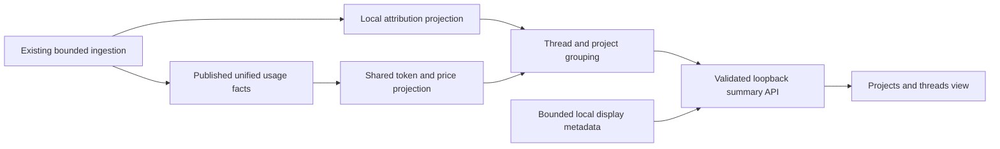

# Thread and project usage summaries

Design accepted for a viewable implementation by the owner on 2026-09-08.
The [implementation record](../plans/2026-09-08-thread-project-usage-implementation.md)
defines the current preview boundary; durable attribution migration remains deferred. The feature answers **where recorded tokens went**, with a ranked
project view and a drill-down into threads. Reuse the existing local accounting
authority, metadata reader, navigation, visual language and formatting.

The [red-team review and comparable products](../reviews/2026-09-08-thread-project-usage-red-team.md)
records the follow-up review. Amendments below are design recommendations, not
implemented behavior; repository/worktree grouping remains the accepted choice.

## Evidence and baseline

Reviewed on 2026-09-08. The working checkout is `main` at
`4cb5c48955c2a49861927ef51d6738eab0ef7763`, dated 2026-08-22. Its uncommitted
documents and other work are preserved. The newer locally available
`origin/main` snapshot is `dffe64d60c3ea6de985c697c31678bdf22feb815`, dated
2026-09-07. The source references below refer to that newer snapshot. This is
not a claim about the current remote head or installed release. Reconcile the
implementation base before coding; do not implement against the older checkout.

| Existing owner | Verified capability | Reuse or extension |
|---|---|---|
| `src/local-unified-index.js` | Typed token components, `session_local`, source order, account scope and published generations; parser v15 distinguishes logical thread from physical rollout | Sole usage fact source; thread identity must survive pagination and resume |
| `src/local-unified-index-extract.js` and ingest/build modules | Incremental, replay-safe extraction; `cwd` and `workspace_roots` are deliberately excluded | Extend metadata projection only after the project-attribution boundary is accepted |
| `src/local-companion-usage-model.js` | Shared token aggregation and usage projection | Reuse component arithmetic; preserve missing-component coverage alongside its numeric totals |
| `src/replay-safe-accounting-cache.js` and `packages/accounting` | Shared event-time pricing and price coverage | Reuse the existing pricer; no new price registry or subscription-cost estimate |
| `src/platform/local-codex-thread-store.js` | Bounded read-only local names and explicit worker parent metadata | Reuse `readCodexLocalThreadMetadata` for visible rows; never select `threads.title`, which can contain an initial prompt |
| `src/local-cache-drop-thread-links.js` | Local thread enrichment, generation checks and bounded lookup precedent | Reuse mechanisms, not cache-drop candidate matching: summaries join thread identities directly |
| `apps/local/server.js` | Loopback routing, request validation and local-only thread-links route | Add separate local summary/detail routes; keep names out of the overview and hosted DTOs |
| `apps/web/public/navigation.js`, `app.js`, `styles.css`, `ui-format.js` | Page navigation, period controls, paginated evidence tables, cream/green tokens and cached regional formatters | Add a small feature view module and extract narrowly shared helpers where necessary |
| `packages/i18n` | Canonical translations and generated browser mirror | Add localized labels and state copy at the source |

No external package is proposed. This is a projection over the existing product,
not a new analytics service. The older unified-index design document is useful
history, but the pinned source controls current schema details. Electron is a
separate workstream and is absent from this pinned tree; shell integration must
be checked on its actual implementation base.

## Proposed product decisions

1. Add **Projects & threads** as a local dashboard destination adjacent to
   **Usage and costs**. Default to Projects, last 7 days, descending tokens.
   A compact link from Usage and costs provides a second entry point.
2. Start with **recorded Codex usage on this device**. Other providers become
   available only when they have equivalent thread identity and token facts.
   A provider quota observation alone cannot populate a thread summary.
3. **Owner accepted, 2026-09-08:** group worktrees of one local Git
   repository into one project, with worktree detail. Separate clones remain
   separate unless explicitly grouped in future work. Grouping uses versioned,
   last-observed local repository mappings; it does not prove historical ownership.
4. Ship v1 with **individual threads** as disjoint rows. Defer **Group worker
   threads** to a later release with a qualified ancestry contract. An ordinary
   fork remains separate. The worker design below describes that later scope.
5. Labels are transient and local. Project names use a bounded directory/repo
   basename, with a short opaque disambiguator for collisions. Thread names use
   the existing safe reader; fallback is `Thread <short id>`.
6. Retain an **Unassigned project** row. Show partial metadata coverage without
   losing the underlying tokens. A known thread with an unknown name is not
   unassigned usage.
7. Tokens are the primary measure. Show **API equivalent** as secondary detail,
   with price coverage. It is neither subscription spend nor attributable quota.

## UI design

Use the existing shell, paper surfaces, green accents, serif headline numbers,
regional number/date formatting and localized copy. Prefer a table with small
in-cell share bars; it supports exact comparison and many rows without a second
chart repeating the same information. Do not add a treemap or pie chart in v1.

### Overview

Header: Projects & threads; subtitle: Where your recorded tokens go.
Place the existing 24h / 7d / 30d / All period control beside the heading.
Display the absolute interval and device/source scope in secondary copy.
Use one shared anchor instant for the entire page.

Three compact summaries: **Recorded tokens**, **Projects with usage**,
**Threads with usage**. Counts require positive recorded usage in the selected
period. Project count excludes Unassigned; thread count is always the distinct
individual-thread count even when worker groups are displayed.

Below these: Projects / Threads view control, and a quiet attribution line such
as `92% of recorded tokens assigned to projects · Local to this device`.
If token completeness is partial, qualify the amount and percentage as known
recorded tokens. Keep source freshness separate from attribution coverage.
Repository detail identifies mapping method and observation time; concise copy:
`Grouped using last-observed local workspace mappings`. Recorded working context
does not establish which files the agent read or changed.

| Projects columns | Threads columns |
|---|---|
| Project name | Thread name and optional worker label |
| Recorded tokens | Project, or Multiple projects |
| Share of selected-period tokens | Recorded tokens and share |
| Threads with usage | Last recorded activity |

Default sorting is tokens descending with a stable opaque-ID tie-breaker.
Use server pagination (25 rows, maximum 100), exact counts, and a total over the
whole filtered result. A page's visible rows must never become the denominator.
Optional token breakdown belongs in row detail. Avoid wide default tables.
Defer full-corpus name search: ephemeral page-only enrichment cannot truthfully
search or sort names across all history. Sorting by usage works across all rows.

V1 also needs recent-activity sorting and **Find thread** by exact thread ID or
validated canonical Codex link. Parse that link locally; never navigate to or
fetch an arbitrary supplied URL. This gives a way to find a known low-usage
thread without a persistent name index. Any future name search must search the
whole selected population in a bounded, explicit metadata pass; it must never
silently search only the current page. Model and project filters use typed data.

Keep the measure label explicit: **Recorded tokens** includes cached tokens.
Show cache/uncached/output composition in detail and make an optional
**API equivalent** ranking available from the same accounting result. Cost
sorting labels partial amounts as the priced portion and places unavailable
prices last without dropping those rows. Shares in that mode are of the priced
portion, never total actual spend. Do not claim that a partially observed row's
rank is its true all-usage rank. Token count remains the default metric.

### Project and thread detail

Selecting a project opens a detail view with a back control, project name,
period, recorded tokens, share of the all-project total, and its thread table.
Thread-row shares now explicitly say **Share of this project**. If a thread
worked in several projects, show only that project's events and a link to its
whole-thread detail. Worktrees appear in a disclosure when repository grouping
is active; selecting one filters its thread contributions. No raw absolute path
is required in the UI. Unknown-only and known-zero threads remain inspectable
even though neither contributes to the positive-usage summary count.

Selecting a thread opens an in-page detail panel (full-width detail at narrow
sizes) with a token-component breakdown, models, API-equivalent price coverage,
last recorded activity and **Open in Codex**. Reuse the canonical UUID handoff;
validate the target, avoid referrers, and show unavailable when the shell cannot
open it. Do not load or preview conversation content.

For worker grouping, show a single parent row including known descendants and
expand into **Direct usage** plus child rows. Never place both a rolled-up row
and its children in an additive footer. Graph cycles, missing parents and depth
limits produce explicit ungrouped rows; do not guess from names or directories.
The grouping switch changes presentation only, not the selected event universe.

Compute worker-family membership across the whole filtered thread population
and its permitted ancestry closure **before** sorting or pagination. A parent
with no events in the period can be a structural group heading, but contributes
zero direct usage to that period. Resolve grandparent chains as well as immediate
parents; a page-local or top-N graph is not a complete grouped result. Do not
cross account/provider scope boundaries to fill missing ancestry. Project
filters select events first; group headings never pull a worker's other-project
events into the selected project. Count individual active threads distinctly
across projects: summing each project's thread count can overcount threads that
worked in several repositories.

### Important states and interaction rules

| State | Behavior |
|---|---|
| No usage in range | `No recorded usage in this period`; zero is valid only for a successfully queried complete result |
| Missing index | `Analyze local usage to see projects and threads`; reuse existing analysis action |
| Project attribution not built | Thread totals available; project tab explains pending attribution, without pretending all projects are known |
| Metadata unavailable | Keep totals and ID-based thread label; retain Unassigned project amounts |
| Partial token components or prices | `Recorded tokens · partial data` / `… priced portion`; use a lower-bound claim only when admitted provenance proves it |
| Refresh/indexing | Preserve last-good rows and selection with an updating indicator |
| Stale result | Show last update; use its own generation consistently throughout |
| Cancel/failure | Preserve last-good state and offer Retry; distinguish cancellation from failure |
| Updated generation | Keep the pinned browsing snapshot and show `New usage available`; apply the update explicitly, resetting pagination atomically |

All rows use semantic buttons/links, visible focus and keyboard access. Return
focus to the originating row on closing detail. Mobile stacks controls and
reduces columns without hiding token values or qualification text. Large text,
long names, dark appearance, reduced motion and localization expansion are
acceptance requirements. Screen readers receive the same totals and qualifiers.
The companion design mock uses synthetic names and values only.

## Accounting and attribution contract

Define a canonical admitted event set E for one index publication, time range,
provider, device and account scope. Include exactly the events admitted by the
existing accounting authority; do not implement separate fork suppression.
Read logical `session_local` as thread identity, never a filename or source ID.
Physical rollout replacement, resume and pagination must not create new threads.
Internally qualify identity with provider and account scope; a bare thread ID
cannot merge accounts. One report selects one permitted account scope. Explicit
unknown-account facts remain in a separate selectable unknown scope, never
silently assigned to the signed-in account or joined to another scope's metadata.
An eventual all-account view would require a separate aggregation contract.

An indexed usage occurrence is not necessarily one request, turn or message.
Do not label event counts as any of those without a separate proven contract.
Keep full identity in the numeric snapshot; shorten only display labels, extending
the suffix deterministically on collisions within that snapshot. Check integer
range when accumulating totals; overflow is an explicit unavailable result,
never wraparound or a silently saturated token amount.

The period is `[fromMs, toMs)`. Reuse 24h / 7d / 30d as rolling durations;
All means all indexed local history, not complete lifetime usage. Use the same
anchor instant and account/surface inclusion policy as Usage and costs. Do not
silently reinterpret rolling durations as local calendar days.
The pinned accounting stream currently uses an inclusive upper bound. The owner
port must translate a validated integer-millisecond half-open interval to
`endMs = toMs - 1`, or adopt a reviewed shared half-open contract. Handle empty
intervals without a scan and reject unsafe bounds. Reconcile against Usage and
costs with the same resolved boundaries, not merely the same period label.

Required invariants, before display rounding:

```text
sum(individual-thread known token totals) = known tokens(E)
sum(project known token totals, including Unassigned) = known tokens(E)
sum(disjoint worker-group known token totals) = known tokens(E)
project detail total = sum(thread contributions within that project)
```

Input is uncached + cache read + cache write. Cache-write TTL splits are pricing
detail, not extra input. Output uses the shared combined-versus-text/reasoning
rule; reasoning must never be added twice. Total input context is not an extra
usage component. Repeated cache reads remain tokens, even when inexpensive.
Reuse the canonical component projector and pricing rules, and retain a separate
completeness envelope from nullable facts. A numeric sum of known components
does not prove every component was reported. Shares use known tokens as their
explicit denominator and are null when that denominator is zero.

Completeness must be collected from typed facts **before** the legacy adapter
coerces null to zero or the projector discards a zero total. Keep admitted fact
count, facts with no measurable tokens, component completeness, source coverage
and project attribution as separate fields. An all-null fact is not observed
zero usage. Show `No measurable tokens` with partial-data context if such facts
exist; do not show a complete empty state. Project/token coverage cannot measure
missing events whose amount is unknown. Older or otherwise unqualified parser
output does not automatically support `at least` wording, even if nullable
components alone would give a lower bound.

If the canonical output precedence discards a reported combined total in favor
of an incomplete split, fix that contract in its owning module with parity
tests before using the feature to claim complete totals. Do not introduce a
feature-specific output rule to make the figures look more plausible.
Resolve the output representation per event, before aggregation, using source
semantics and field completeness rather than positive-value tests. A known total
and an incomplete breakdown are separate states. A 100-token combined event
plus a 20-text/5-reasoning event must produce 125 output tokens; applying
split precedence to the aggregate would incorrectly produce 25.

Sum the accounting owner's exact decimal price values, round at presentation,
and preserve fully/partially/unpriced event counts. Do not accumulate binary
floating-point display amounts or rounded row values. Carry a nullable exact
amount plus status: the legacy numeric zero for an unavailable price is not a
known free event. Full pricing of known components does not establish complete
cost when token counts are missing. Unknown models keep tokens
and unknown pricing. Do not divide subscription fees across projects or infer
per-thread quota percentages. Main/Spark or other separately metered surfaces
must retain the same inclusion and disclosure policy as the existing dashboard.

Workspace assignment follows **source-recorded working context**; repository
grouping then uses a separately observed location mapping. Neither proves which
repository a tool edited. One event has zero or one project assignment.
Multiple workspace roots without one authoritative working directory are
ambiguous. Never split tokens equally or duplicate them across roots.
Do not apply the thread store's current directory backward over history.

Prefer an explicit event context; bounded session metadata is a fallback only
where provider semantics prove it applies to that segment. Absent such proof,
leave events unassigned. Worker parentage does not itself prove project identity.
Cache context reused from a different project is charged to the event's current
observed project; the feature does not attempt to trace prompt content.

## Technical design

### Owners and data flow



Add a cohesive reporting module behind `src/reporting/index.js`: contract,
pure aggregation and group attribution. `src/application/` orchestrates the
read; `src/platform/` owns local metadata and Git identity resolution. The
existing index owner supplies generation-pinned rows through a reviewed port.
Audit the architecture allowlist before adding imports: do not deep-import a
legacy facade or relax the ratchet to make a dependency pass.

The present `local-unified-accounting-source` stream is not yet that port: its
base DTO omits event/thread/account identities and skips facts without usable
components before its callback. Extend the owner-controlled internal projection
to expose opaque `event_key`, `session_local`, account scope, physical source and
source order, nullable components and completeness. Audit optional attribution
enrichment explicitly rather than assuming it supplies this contract. Keep these
internal join identities out of public/export DTOs. Exact Codex-ID lookup goes
through the existing local identity mapping; an internal HMAC is not a UUID.

Add `apps/web/public/work-usage-view.js` and a small validated data client.
`app.js` composes them. Reuse `ui-format.js`, localization and CSS tokens; extract
the existing period/pagination helpers only where they are actually shared.
Do not introduce a framework, generic dashboard engine or second collector.

### Local project identity and storage proposal

Project attribution needs a deliberate extension to the current content-free
boundary. Proposed persistent data contains opaque local keys and bounded
provenance only; raw paths, repo remotes and names remain transient.

For Git projects, resolve the local common Git directory and worktree root using
the existing platform ownership/security patterns and fixed read-only plumbing.
Use no network, hooks, shell interpolation or remote URL identity. Canonicalize
using actual platform filesystem identity; do not blanket lowercase paths.
Compute separate device-salted, domain-separated keys for repository and
worktree. For non-Git directories use an exact normalized working-directory key.
Do not infer semantic projects from arbitrary ancestor folders.

Keep Git resolution bounded and cached per metadata revision, outside the event
aggregation loop. A missing path retains its last-observed binding with stale
provenance when one exists; otherwise retain a valid folder assignment or
Unassigned with a reason. Never fabricate a repository match. Identity can split
after a move/reclone; disclose that limitation and defer manual merging.

V1 answers where recorded workspace locations map in the user's last-observed
local repository organization. Persist observation method/time and revision;
preserve source-recorded context independently. A later correction can regroup
historical workspace usage only in a new report revision on explicit refresh.
Do not overwrite observations in place or call a backfill-time lookup historical
proof. Freezing a wrong guess forever would not improve its accuracy. A full
historical repository-instance registry is deferred; do not merge separate clones
by remote URL, friendly name or similar path strings.

Proposed additive tables in the existing database (conceptual, not final DDL):

| Relation | Key and values | Publication rule |
|---|---|---|
| `work_attribution_generation` | ID, usage generation/fingerprint, resolver version, status, coverage, timestamps | Only atomically published attribution generations matching the usage publication can be used |
| `work_context_segment` | Attribution generation, scope, physical source identity/ordinal, start/end record order, nullable workspace key, fixed evidence/status enum | Non-overlapping half-open segments; joins use exact source order, not timestamps alone |
| `work_project_membership` | Attribution generation, workspace key, nullable project key, method/status enum, observed-at time, observation revision | One workspace to at most one project in a selected revision; preserve prior observations |

Join within the pinned usage/attribution generation and account scope using the
canonical physical-source identity and ordinal, then the source record offset
within its half-open segment. Never join by timestamp, bare thread or a reused
pathname. Missing/nullable source order yields Unassigned. Validate at most one
matching segment per canonical event; reject overlaps before publication.
Replacement/truncation cannot reuse a prior source instance's context silently.
A completed metadata traversal can publish partial attribution coverage: known
gaps or deleted history do not leave the feature permanently preparing. A failed
or interrupted traversal cannot publish an apparently completed generation.

Missing segments are visible unassigned coverage. A workspace key cannot be
reverse-resolved after restart: the metadata refresh rebuilds an ephemeral
key-to-safe-basename map from available bounded source metadata. If the source
has gone, retain numeric history with `Project <short key>` until metadata is
available. Do not claim a friendly name is durably available without storing it.

Reusing the ingestion traversal avoids a new independent scanner. A metadata
backfill can visit retained allowlisted context records without re-deriving
token deltas. If the current extraction boundary cannot support that separation
cleanly, use the existing staged parser-version rebuild mechanism instead;
never bypass its provenance requirements. Historical files no longer present
stay unknown, with last-good token facts untouched. Checkpoints and publication
must survive cancellation, replacement files, truncation and restart.

Thread names and current worker ancestry use the existing transient metadata
reader. Its 160-ID bound and one-parent lookup are real constraints, not a
whole-history graph API. V1 uses flat thread summaries. Later worker grouping
needs a separately bounded graph pass over selected thread identities, cycle
detection and a pinned in-memory metadata revision. If incomplete, disclose
coverage and keep unresolved threads disjoint. No token facts depend on names.
The existing reader supplies a Map, not a revisioned graph. For the later worker
feature, freeze the resolved ancestry map and its digest in the report snapshot.
Friendly-label refreshes may change decoration without changing group identity,
numeric order or pagination; a rename alone need not invalidate the report.

### API, consistency and resource bounds

Propose `POST /api/local/work-usage/query` for summary/detail queries, with a
closed JSON request, existing same-origin/capability checks and `no-store`
responses. POST is read-only here and avoids placing local group identifiers
in URLs. Reject unknown keys, invalid intervals, unsupported grouping and
oversized bodies before opening data. Extend route/method allowlists explicitly.
Mirror the local thread-links route's concrete gate: require
`x-usage-monitor-local: 1`, reject a supplied foreign Origin, and retain existing
Host/rebinding protections with no foreign CORS grant. The header is a request
gate, not a substitute for scope authorization. Test denied requests before any
metadata read or aggregation job starts.

Request fields: schema version, period or exact interval, provider/scope,
grouping (`project`, `thread`), optional opaque project/thread/worktree selection,
allowlisted sort, page size and opaque cursor. Worker mode is a later versioned
extension. Use opaque handles
bound to the local process/session; do not accept arbitrary paths or SQL.

Response fields: schema version; result status; snapshot ID; index generation;
attribution and metadata revisions; pricing fingerprint; resolved interval;
scope; coverage/freshness envelope; whole-result totals; rows; next cursor.
Numeric rows have bounded IDs, components and coverage, not arbitrary metadata.
Attach validated names and approved navigation IDs only in a separate
transient local display section. Never add this section to shared accounting,
overview, contribution, report, share-card or hosted response contracts.

Pin the usage, attribution and price revisions during a read. Pin the worker
map for grouped views. Display-name enrichment may fail without invalidating
numeric results. A cursor binds snapshot, filters, sort and tie-breaker; reject
mismatches with `snapshot_changed`, then reload the first page. Never combine
detail from a new generation with an old summary. If current attribution lags,
show current thread totals and explicit pending project attribution, or keep
the previous complete project snapshot labeled stale. Every visible numeric
bundle (cards, denominator, rows and detail) must come from that tab's one
snapshot. Switching tabs clears or replaces the whole bundle; never show current
thread summary cards above stale project rows.

A newly published index does not itself invalidate an active browsing snapshot.
Keep a bounded, immutable numeric snapshot while the user pages/drills down and
offer `New usage available`. Changing filters or accepting the update starts a
new snapshot. Provisional resource limits: five-minute idle expiry, at most two
retained snapshots and one active aggregation job per local app session, all
within the memory budget below. On expiry, preserve visible last-good results
and explain that reloading is necessary; never silently mix generations. Scope
or authorization changes immediately invalidate the snapshot and its handles.

First query may stream all admitted rows once in a cancellable worker using
the existing bounded batching and pricer. The renderer receives at most one
page; repeated page/detail queries reuse the pinned numeric result. Bound both
scan batches and distinct-group state: use temporary SQLite grouping when the
in-memory cardinality budget is reached, rather than accumulating unlimited
Maps. No pricing or raw-history scan on every click.

Keep cold query work off the request/control thread. Reuse the application's
background-task and cancellation primitives; if a result is not ready, return
a bounded preparing status/handle and allow progress/cancel instead of holding
an HTTP request open for a corpus scan. Coalesce duplicate identical requests,
bound queued work, and release temporary grouping state on error/cancellation.
Detail reconstruction must use the pinned numeric snapshot or its still-retained
generation; if neither is available, return expiry rather than re-read latest.

Index event time/thread/source-order joins and attribution segment lookup.
Measure query plans and memory on 100k and 1m synthetic events and 10k threads.
Proposed targets, to validate rather than claim achieved: cached page p95 under
150 ms, cancellation acknowledgement under 250 ms, control routes under 100 ms
during background grouping, peak extra memory under 100 MiB. Record hardware,
runtime and cold/warm conditions. Add durable rollups only if measurements
justify them; any cache must include all publication, resolver, price and scope
versions and must never become a second authoritative ledger.

### Privacy and compatibility

Treat the broader use of local thread labels and project-context hashes as
proposed product decisions. The existing owner-approved names exception is
specifically for cache-drop navigation; do not silently expand it. On acceptance,
update the relevant AGENTS guidance, field-purpose/privacy documentation and
negative export tests together. This is a design question, not an implementation
permission request in this draft.

Names and paths must not enter persisted analytics, browser storage, query
strings, logs, diagnostics, exports, contributions or public pages. Use synthetic
labels in screenshots/tests and text nodes in rendering. Local project hashes
are still linkable private metadata; exclude them from export by construction.

Schema migration is forward-only and additive with the existing application ID,
version checks and staged-generation rules. Rehearse on synthetic copies; a
failed/backfilled attribution must not replace valid accounting or require
deleting an index. Older clients must explicitly reject unsupported schema
versions. Preserve account attribution and fail closed across scope changes.

## Delivery slices and acceptance

| Slice | Deliverable | Required evidence |
|---|---|---|
| 1. Contract and thread view | Generation-pinned disjoint thread totals, safe labels, navigation and detail | Exact reconciliation, pagination and price/null semantics; loopback and rendered UI checks |
| 2. Project attribution | Local hashed context projection, backfill, Unassigned and repository/worktree detail | Privacy decision recorded; restart/migration, ambiguous/multi-root/missing metadata and Git identity tests |
| 3. V1 qualification | Resource bounds, accessibility, localization and shell behavior for both thread and project views | Synthetic performance evidence, browser and actual target shell QA; no release implication |
| Later: worker grouping | Explicit ancestry rollups and expandable direct/child usage | Deep/cyclic/missing/cross-project ancestry; invariant totals in both modes |

Slices 1–3 together are the smallest release satisfying this request. A thread-only
internal checkpoint does not complete the project-and-thread feature. Defer worker
families, global name search, persistent friendly names and retrospective Git
identity reconstruction. The dedicated destination remains the recommended UI.

Test meaningful contracts: repeated source ingestion; pagination/resume/fork
replay; zero and null components; output/reasoning overlap; missing model prices;
identical basenames; worktree/common-dir resolution; path changes mid-thread;
same-timestamp source ordering; deleted sources; period boundaries; rounding;
generation changes mid-pagination; account changes; malformed routes; stale
response races; cancellation/restart; safe names and export exclusion. Require
component-by-component conservation, not just a rounded grand-total assertion.
Include unknown-only and known-zero threads; mixed output representations across
events; tiny exact decimal prices; the same thread ID in separate scopes; 100/300
tokens across two repositories for one globally distinct thread; and overlapping
context segments that must not multiply facts. Walking all pages while ingestion
and a rolling boundary advance must return every row exactly once from the pinned
snapshot. Prove that next-page/detail requests do not rescan canonical usage.

Run the owning reporting/index/metadata tests first, then architecture,
local-server, UI and i18n gates affected by the implementation. Use source tests
for native routing plus actual native/embedded interaction checks on the target
branch. No provider metadata compatibility, performance result, installed-app
behavior or public release is established by this draft.

## Review questions

- Resolved: group by repository, with worktree detail (owner reply 2026-09-08).
- Confirm a dedicated Projects & threads destination rather than a subsection
  of Usage and costs; both can share the same feature view module.
- Accept the narrowly expanded local metadata boundary before implementation;
  no conversation content or persistent display names are required.

The owner asked to implement a viewable version on 2026-09-08. The implementation
record distinguishes the delivered read-only report from later durable attribution.

## Design-stage validation, 2026-09-08

The synthetic interactive preview was inspected in the in-app browser at its
desktop size and a 390px viewport. Project drill-down, thread component detail,
worker grouping, the repository worktree disclosure, and 7d/30d switching were
exercised. Worker groups and worktrees retained the selected project total.
A narrow-screen table-header overlap was corrected and visually rechecked.
The preview illustrates the happy path and unassigned usage; the state matrix
above specifies additional production states that are not all simulated.
It predates this red-team revision: its worker toggle illustrates a later feature,
and it does not yet simulate snapshot expiry, exact-ID lookup or mapping freshness.
The optional host design controls are guarded but were not exercised in the
standalone browser wrapper. No native or production behavior was tested.

The new spec passed focused link validation using the pinned newer source's
documentation validator, plus frontmatter and whitespace checks. The preview
script passed syntax validation. The older checkout has no `docs:check` script.
Its `test:preflight` passed root-layout and tracked-diff whitespace checks, then
failed on the pre-existing untracked `packages/accounting/accounting` entry
(`Could not access .../accounting/null`). That unrelated entry was preserved.
This is not a passing repository-wide preflight result.
