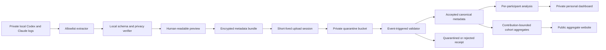

# Multi-User Privacy-Centric Expansion Plan

## Outcome

Turn the current local-only monitor into an opt-in, privacy-first research system that can accept metadata-only observations from many users, validate and deduplicate them, estimate usage-limit behavior across cohorts, and return both personal and aggregate results without ever receiving prompts, responses, repository content, commands, paths, URLs, raw account identifiers, or credentials.

The recommended first release is an invite-only CLI exporter plus a small Google Cloud ingestion pipeline. A desktop app, continuous background upload, email notifications, and public cohort filters should come only after the metadata contract and deletion path have survived a small external pilot.

The complete staged execution criteria, critical path, parallel workstreams, service targets, stop conditions, and production definition of done are maintained in [the end-to-end multi-user usage monitor goal](../goals/2026-07-24-end-to-end-multi-user-usage-monitor-goal.md).

## Hard decisions

1. **Construct a new allowlisted dataset; never upload redacted log files.** The client parses raw Codex or Claude files locally and creates new records containing only explicitly permitted typed fields. Unknown input fields are ignored, not copied.
2. **No arbitrary strings in telemetry records.** Every string is a bounded enum, a provider-owned model identifier that passes a strict validator, a schema/version identifier, or a cryptographic pseudonym.
3. **Raw logs never leave the user's computer.** Not even temporarily, not for debugging, and not after an ingestion error.
4. **Exact timestamps are restricted research data.** They are needed for quota alignment and reset analysis, but public aggregates use coarser time buckets and minimum cohort sizes.
5. **Identity is pseudonymous and email-free by default, with one capability per purpose.** Telemetry identity, upload authorization, human recovery, bundle encryption, device pairing, and optional notification linkage use distinct credentials/keys and cannot substitute for one another. Optional notifications are stored separately from telemetry.
6. **Personal views and public aggregates are different products.** A participant may see their own detailed sanitized data. Public results are precomputed, contribution-bounded, and suppressed for small cohorts.
7. **Server processing cannot broaden the client schema.** The upload API rejects unknown properties and unsupported schema versions.
8. **The current conditional-estimate language remains.** More users reduce sampling error and expose policy regimes, but do not magically reveal the provider's private accounting formula.

## Why extraction is safer than redaction

A generic redactor starts with private content and tries to remove every dangerous field. It can fail whenever Codex adds a new field, a nested object is missed, or content appears in an unexpected string.

The exporter should instead start with an empty record and copy only validated numeric, boolean, enum, timestamp, and pseudonym fields. This provides a durable failure mode: a new upstream field is omitted until the exporter explicitly supports it.

Secret and PII scanners remain useful as defense in depth, but they are not the privacy boundary. This follows the practical logging principle that session IDs, access tokens, passwords, keys, and sensitive personal data should be excluded, masked, hashed, or encrypted rather than recorded directly ([OWASP logging guidance](https://cheatsheetseries.owasp.org/cheatsheets/Logging_Cheat_Sheet.html)).

## System shape



## Component 1: local exporter

### Recommended interface

Create one reusable library and a thin CLI:

```text
usage-monitor-export inspect
usage-monitor-export export --output usage-metadata.umx
usage-monitor-export upload --server https://…
usage-monitor-export status
usage-monitor-export delete-my-data
```

`inspect` and `export` are entirely local. `upload` must display the schema version, time range, record counts, bundle size, privacy checks, and server destination before the first transmission. The user confirms the first upload explicitly.

### Code to reuse

- `src/codex-log-scan.js`: cumulative-to-marginal token handling, cached/reasoning component separation, rollout discovery, and reset-window normalization.
- `src/passive-collector.js`: incremental checkpoints, bounded streaming, crash-safe append logic, and safe event construction.
- `src/surface-classification.js`: closed surface/agent/lineage vocabulary without retaining source metadata.
- `src/tier-semantics.js`: separation of subscription Standard/Fast from API Standard/Priority/Flex/Batch.
- `src/account-scope.js`: Keychain-backed HMAC pseudonyms.
- `src/claude-statusline.js`: content-free five-hour and seven-day Claude limit snapshots.
- RunCost for reproducible price reconstruction and ccusage only as an independent comparison path.

The multi-user exporter should depend on these safe normalization functions, not on the report builders or local `.usage-monitor` artifacts.

### Proposed upload record families

#### Usage event

| Field | Type | Purpose |
|---|---|---|
| `event_time` | UTC timestamp | Align cost and quota movement. |
| `provider` | enum | `openai_codex`, `anthropic_claude_code`, or a future reviewed provider. |
| `model_id` | bounded provider model ID or `unknown` | Price and model-mix analysis. |
| `model_fingerprint` | optional keyed digest | Distinguish unknown aliases without uploading arbitrary labels. |
| `billing_surface` | enum | Subscription versus API usage. |
| `speed_mode` | enum | Standard, Fast, unknown, or other. |
| `api_service_tier` | enum | Standard, Priority, Flex, Batch, unknown, or other. |
| `reasoning_effort` | fixed enum or unknown | Compare effort regimes when actually observed. |
| `input_uncached_tokens` | nonnegative integer | API-price reconstruction. |
| `input_cache_read_tokens` | nonnegative integer | Cached-input reconstruction. |
| `input_cache_write_tokens` | nonnegative integer | Preserve providers that expose cache writes. |
| `output_text_tokens` | nonnegative integer | Output-price reconstruction. |
| `output_reasoning_tokens` | nonnegative integer | Thinking/reasoning reconstruction. |
| `total_input_context_tokens` | optional nonnegative integer | Long-context price thresholds. |
| `surface` | fixed enum | Desktop/IDE, CLI, subagent, scheduled task, cloud marker, or unknown. |
| `agent_scope` | fixed enum | Root, subagent, automation, or unknown. |
| `lineage_disposition` | fixed enum | Standalone, forked, or parent-linked. |
| `tool_class_counts` | fixed-key integer object | Coarse local shell, patch, MCP, search, computer-use, hosted-shell, or unknown counts. Never tool names or arguments. |
| `outcome` | fixed enum | Completed, failed, cancelled, interrupted, retry, or unknown. |
| `event_id` | deterministic HMAC | Deduplicate repeated uploads without sending source IDs or paths. |
| `session_scope_id` | deterministic HMAC | Join events within a rollout without sending the rollout UUID. |
| `account_scope_id` | deterministic HMAC or `unattributed` | Keep a participant's multiple provider accounts separate. |

#### Quota snapshot

| Field | Type | Purpose |
|---|---|---|
| `observed_time` and `received_time` | UTC timestamps | Preserve provider lag and receipt age. |
| `provider`, `plan_type`, `plan_variant` | bounded enums | Partition incompatible limits. |
| `limit_id` | reviewed enum or safe provider classification | Separate general, weekly, model-specific, Spark, and other limits. |
| `slot` | fixed enum | Preserve primary/secondary labels without assuming semantics. |
| `used_percent` | number in `[0,100]` | Provider-displayed usage. |
| `display_precision` | integer | Record integer versus decimal display precision when known. |
| `window_duration_minutes` | positive integer | Distinguish five-hour and seven-day windows. |
| `resets_at` | UTC timestamp | Reset-aligned analysis. |
| `snapshot_source` | enum | Rollout, app-server read, status line, UI declaration, or notification. |
| `provider_surface` | fixed enum | Shared/unallocated or a specifically observed surface. |
| `account_scope_id` | deterministic HMAC or `unattributed` | Prevent cross-account gradients. |

#### Optional declared activity marker

Retain the current content-free surface marker vocabulary for Work, Workspace Agents, Excel, Codex Cloud/other devices, Work Voice task activity, image generation, separate-limit Spark, quiet periods, and controlled experiments. Do not accept free-form labels.

#### Bundle manifest

The manifest contains only:

- exporter/schema versions;
- random `bundle_id`;
- pseudonymous `participant_id`;
- creation time and covered time range;
- per-record-family counts;
- parser/privacy diagnostic codes and counts;
- source-provider and broad client-platform enums;
- consent version;
- encrypted payload hash, compressed size, and cryptographic parameters.

It must not contain source paths, filenames, usernames, hostnames, repository names, branch names, raw session/account/device IDs, IP addresses, locale, or user-agent strings.

### Deterministic pseudonyms and deduplication

Generate a 256-bit installation-local telemetry secret and store it in Keychain, Credential Manager, or an owner-only file on unsupported systems. Derive distinct telemetry-only keys with HKDF for:

- account pseudonyms;
- session pseudonyms;
- event deduplication IDs; and
- other telemetry-only namespaces declared by the frozen telemetry contract.

Use domain-separated HMAC inputs. Never upload source values or reuse the same digest across domains. The installation telemetry secret must never derive bundle authentication, upload authorization, recovery, device pairing, or notification credentials and must never be copied between devices. Cross-device linking uses an expiring one-time server pairing flow with a separate enrollment-scoped identity. Provider-account pseudonyms remain installation-local unless a later reviewed protocol introduces a distinct safely paired dedupe namespace.

The human-facing recovery credential must carry at least 128 bits of entropy. A short memorable identifier can be displayed separately, but it must not authenticate uploads or dashboards.

Keep these capabilities cryptographically and operationally separate:

- the installation-local telemetry identity derives only allowlisted telemetry pseudonyms;
- a rotatable device-scoped upload credential authorizes only bounded upload registration;
- a human-held recovery credential restores personal access but cannot upload or derive telemetry pseudonyms;
- a versioned bundle-encryption identity protects bundle data keys but authenticates neither people nor uploads;
- an expiring, single-use pairing capability enrolls another device without copying the telemetry seed; and
- an optional opaque notification reference joins to a segregated notification service but authenticates nothing.

Rotation, revocation, compromise, storage, retention, and deletion tests must cover each capability independently. No combined “recovery/upload code” is permitted.

### Local privacy gate

An upload is impossible unless all checks pass:

1. JSON Schema rejects unknown properties and unbounded strings.
2. Every enum, timestamp, token count, percentage, and pseudonym passes its type/range validator.
3. The serialized bundle contains none of the raw source strings used to generate pseudonyms.
4. Canary fixtures prove that prompts, responses, emails, paths, commands, URLs, tokens, and high-entropy secrets do not survive extraction.
5. A secret/PII scan finds no credential-like, email-like, path-like, URL-like, or private-key material.
6. Decompression size and record counts remain below declared bounds.
7. The exporter prints a local preview and a machine-readable privacy receipt.

Property-based and mutation tests should add unexpected sensitive fields at arbitrary nesting depths and prove the output is unchanged.

### Bundle protection

Use HTTPS plus application-layer envelope encryption for the sanitized bundle. Generate a fresh data-encryption key per bundle, encrypt the payload with authenticated encryption, and wrap that key for the ingestion service. Google recommends a new local DEK for each write and a centrally managed KEK for wrapping ([Cloud KMS envelope-encryption guidance](https://cloud.google.com/kms/docs/envelope-encryption)).

This is protection for pseudonymous metadata and exact timestamps; it is not permission to weaken the allowlist.

## Component 2: ingestion and processing

### Recommended GCP MVP

1. **Enrollment/API service:** authenticated Cloud Run service.
2. **Upload transport:** 15-minute, object-specific Cloud Storage V4 upload URL or server-initiated resumable upload. Signed URLs grant time-limited access to one object and do not require the participant to possess cloud credentials ([Cloud Storage signed URLs](https://cloud.google.com/storage/docs/access-control/signed-urls)).
3. **Quarantine bucket:** private, uniform bucket-level access, random object names, no participant ID in the object path, no public access.
4. **Processing trigger:** authenticated Eventarc delivery on `google.cloud.storage.object.v1.finalized` to Cloud Run ([Cloud Storage to Cloud Run via Eventarc](https://cloud.google.com/run/docs/triggering/storage-triggers)).
5. **Participant/job metadata:** Firestore for participant IDs, independently issued eligibility-unit relations, purpose-specific credential hashes/references, bundle state, consent version, deletion state, and status receipts.
6. **Canonical analytical store:** BigQuery tables partitioned by event/reset date and clustered by provider, plan, and model family. Participant pseudonyms remain restricted canonical data. A separately access-controlled relation maps an enrollment to opaque `eligibilityUnitId`; that value never appears in client telemetry or public output. Partition pruning limits query cost ([BigQuery partitioned tables](https://cloud.google.com/bigquery/docs/partitioned-tables)).
7. **Aggregate publication:** scheduled queries write versioned, disclosure-checked aggregate JSON to a public-read bucket or static site. No browser receives BigQuery credentials.
8. **Secrets and keys:** Secret Manager plus Cloud KMS; separate service accounts for enrollment, quarantine validation, canonical writes, aggregation, and website reads.

GCP is recommended for the first pilot because it provides the required object upload, event trigger, serverless processing, lifecycle, and analytical primitives without operating servers. Keep the exporter and bundle contract cloud-neutral so Storage/Eventarc/BigQuery can be replaced later.

### Processing states

```text
registered -> uploaded -> decrypting -> validating -> accepted
                                      -> quarantined
                                      -> rejected
accepted -> analyzed -> published_personal -> aggregate_eligible
```

Every transition is idempotent and keyed by `bundle_id`. Duplicate Eventarc delivery or a repeated upload must not duplicate canonical events.

### Validation layers

1. **Transport:** expected object name, content type, byte size, checksum, and upload registration.
2. **Cryptographic:** authenticated decryption, key version, associated bundle/schema data, and digest.
3. **Structural:** supported schema, no unknown fields, record/decompression limits, and fixed vocabularies.
4. **Privacy:** repeat the client privacy scan; reject any arbitrary string or suspicious field even if client validation claimed success.
5. **Semantic:** timestamps within plausible bounds, percentages in range, positive durations, consistent reset identities, token component totals, cumulative-to-delta invariants, and model/tier compatibility.
6. **Identity/deduplication:** credential valid, event HMAC shape valid, bundle/event IDs not already accepted.
7. **Research quality:** account/plan/speed/snapshot-age coverage, reset span, display precision, fork-replay disposition, and missing-surface flags.

### Outliers

Do not delete or silently normalize extreme values. Assign quality flags:

- impossible: rejected;
- structurally valid but internally inconsistent: quarantined;
- plausible but statistically extreme: accepted with zero aggregate weight pending review;
- valid but weakly observed: accepted for personal reporting, excluded from precise cohort inference;
- valid and quality-qualified: aggregate eligible.

Use robust median/MAD or quantile diagnostics within comparable provider/plan/model/window cohorts. A participant should not be marked invalid merely for heavy usage.

### Retention

- Raw provider logs: never collected.
- Encrypted sanitized quarantine bundle: target seven days after successful processing.
- Rejected/quarantined bundle: maximum 30 days when needed for a participant-visible error and then deletion.
- Canonical metadata: retained while the participant consents, with export/deletion support.
- Operational security logs: minimal fixed fields and short retention; never request bodies, recovery codes, signed URLs, payloads, or arbitrary error strings.
- Optional notification address: separate encrypted store with an independent deletion policy.

Cloud Storage lifecycle rules can delete objects by age, but deleted objects are soft-deleted for seven days by default. The retention statement must therefore disclose the effective restoration window or deliberately configure soft delete after testing ([Cloud Storage lifecycle documentation](https://cloud.google.com/storage/docs/lifecycle)). Firestore job/status documents can use TTL, whose deletion is typically asynchronous rather than immediate ([Firestore TTL documentation](https://cloud.google.com/firestore/docs/ttl)).

### Participant deletion

The personal dashboard exposes “delete my data.” Deletion must:

1. revoke upload and dashboard credentials;
2. delete pending/quarantine objects;
3. delete or tombstone participant rows in canonical stores;
4. remove the enrollment-to-`eligibilityUnitId` relation and recompute contribution, holdout, resampling, and aggregate eligibility state without allowing the deleted unit to be reissued accidentally;
5. remove notification data;
6. rebuild affected aggregate versions;
7. retain only a non-reversible deletion receipt and legally required security audit event; and
8. display expected backup/soft-delete completion dates.

Test this flow before inviting external users.

## Component 3: results website

### Public view

Lead with the same simple measurement the local work established:

- rolling observed quota movement versus API-price-implied movement;
- reset-by-reset seven-day API-price-equivalent value;
- week-over-week median and uncertainty;
- model, plan, speed, cache, reasoning, and broad surface splits;
- sample sizes in independently issued eligibility units and reset windows, using “participants” only where a documented one-to-one relation has been established; and
- explicit data-quality and policy-regime annotations.

Public filters should initially be limited to provider, plan, model family, speed, broad geography, and calendar period. Country must be user-declared and optional; do not infer or retain location from upload IPs.

### Disclosure controls

- Suppress any public cohort with fewer than 20 distinct independently issued eligibility units or fewer than a predeclared number of qualifying reset windows. Never substitute self-created participant pseudonym counts.
- Cap each `eligibilityUnitId` contribution per day/reset before aggregation; participant-level caps may be used only after a documented one-to-one mapping is proven.
- Compute intervals, holdouts, and influence checks by `eligibilityUnitId` (or reset within that unit), not by events or self-created pseudonyms. Label the public count “independent eligibility units,” using “participants” only when one-to-one identity has been established.
- Publish day/week buckets, not exact event or upload timestamps.
- Never expose `eligibilityUnitId` or participant, account, session, bundle, or event pseudonyms publicly.
- Never permit arbitrary row-level queries from the browser.
- Add differential privacy only after the cohort/filter design is stable; it is not a substitute for minimization and cohort suppression.

### Personal view

The participant enters their high-entropy recovery code into a form, which exchanges it for a short-lived, HttpOnly, Secure, SameSite session cookie. Do not place the code in a URL or browser storage.

The personal dashboard can show:

- accepted/rejected uploads and diagnostic reasons;
- their exact sanitized timeline and data coverage;
- account-scope splits without revealing raw account identifiers;
- their own reset estimates and aggregate comparison percentile;
- missing instrumentation suggestions; and
- export/delete controls.

The personal API queries through a narrow service and never grants direct BigQuery access. BigQuery row-level policies can provide defense in depth, but they have operational limitations and should not be the only tenant boundary ([BigQuery row-level security](https://cloud.google.com/bigquery/docs/row-level-security-intro)).

### Notifications

Start with an email-free receipt code and a status command. Later options, in preferred order:

1. local CLI notification on the next `status` or upload;
2. opt-in web push with no analytics SDK;
3. opt-in email stored in a segregated notification service and deleted after unsubscribe/deletion.

Do not require email merely to upload or view results.

## Ongoing uploads

Continuous collection is useful, but it expands the privacy and operational surface. Introduce it only after manual uploads are stable.

Recommended design:

- incremental local checkpoints initialized at EOF;
- upload only new safe events and snapshots;
- a visible `watch` command first;
- explicit installation of launchd/systemd/Task Scheduler only after a separate confirmation;
- a tray/menu-bar app later, backed by the same extractor library;
- bandwidth, record-count, and frequency caps;
- pause, inspect-next-upload, rotate credential, and uninstall commands; and
- no remote command execution or server-directed expansion of files scanned.

The server may advertise a supported schema version, but it may not instruct the client to upload new raw fields or search additional directories.

## Consent and governance

Before external collection, publish a concise data notice that says:

- exactly which metadata is collected;
- why exact timestamps and pseudonyms are needed;
- what is never collected;
- where the data is stored and for how long;
- whether aggregate research will be public;
- how optional country and notification data are used;
- how to export/delete data; and
- that pseudonymized data still carries re-identification risk.

Version the consent text and attach its version to each bundle. A schema expansion requires a new privacy review and, when it materially changes collection, renewed consent.

## Abuse and security cases

| Risk | Control |
|---|---|
| Prompt/response leaks through a new upstream field | Empty-output allowlist construction, deny unknown output properties, nested canary tests. |
| Re-identification from exact timestamps | Restricted canonical store, public time coarsening, cohort thresholds, contribution caps. |
| Brute-forced personal code | At least 128 bits entropy, slow credential hash, rate limiting, rotation and revocation. |
| Signed URL theft | One object, short expiry, random object name, size/content constraints, HTTPS, no read permission. |
| Zip/decompression bomb | Streaming decode, compressed and expanded byte limits, record limits, CPU/time budgets. |
| Malformed or malicious records | Strict schema, no arbitrary HTML/text, parameterized queries, quarantine. |
| Duplicate uploads or event delivery | Bundle registration plus deterministic event HMAC and idempotent writes. |
| One person manufactures many enrollments/devices and dominates a cohort | Independently issued `eligibilityUnitId` relation, per-unit contribution clipping, unit-level resampling/holdouts, and abuse controls; participant is substituted only after one-to-one proof. |
| Small-filter deanonymization | Minimum independent-eligibility-unit/reset thresholds and no arbitrary public query endpoint. |
| Insider/cloud compromise | Application-layer encrypted quarantine, least-privilege service accounts, KMS separation, access audit logs. |
| Optional email links identity to telemetry | Separate encrypted notification store joined only by an opaque reference. |
| Account switching corrupts gradients | Participant-local account HMACs and account/plan continuity partitions. |
| Provider changes log schema | Fail closed, omit unknown fields, require reviewed exporter release. |

## Build versus reuse

### Reuse

- Existing local parsers, classifiers, account HMAC, storage durability, calibration, and report code.
- RunCost pricing and ccusage cross-checks.
- Official Google Cloud client libraries for Storage, Cloud Run, BigQuery, Firestore, and KMS.
- JSON Schema validation through a mature validator such as Ajv.
- Property-based testing through a mature generator such as fast-check.
- A reviewed cryptographic library or Google Tink for envelope-encryption primitives; do not invent a new cipher/protocol.

### Build narrowly

- The allowlisted interchange schema and exporter.
- Separate telemetry-identity, upload-credential, recovery-credential, bundle-encryption, pairing-capability, and notification-reference flows.
- Quarantine validation and quality-state machine.
- Deduplication and cohort contribution logic.
- Personal results API and disclosure-controlled aggregate builder.

### Explicitly do not build yet

- A full desktop application.
- Automatic always-on uploads.
- Social login.
- Country/IP geolocation.
- Arbitrary dashboard querying.
- Differential privacy parameters before real cohort sizes are known.
- A second independent parser unrelated to the validated local code.

## Phased implementation

### Phase 0: privacy contract and threat model

Deliverables:

- versioned JSON Schemas for bundle, usage event, quota snapshot, and marker;
- field-by-field purpose/retention matrix;
- threat model and data-flow diagram;
- consent draft;
- deterministic pseudonym specification;
- deletion runbook; and
- malicious/canary fixture corpus.

Exit gate: a standalone privacy test proves that arbitrary prompt, response, path, URL, command, account, and secret fields cannot enter a valid bundle.

### Phase 1: local-only exporter

Deliverables:

- `inspect` and `export` commands;
- content-free preview and privacy receipt;
- deterministic incremental event IDs;
- Codex coverage parity with current local analysis;
- Claude adapter where status-line evidence exists; and
- signed/reproducible release artifacts.

Exit gate: five varied local fixtures and at least two real volunteer dry runs generate safe bundles that remain on the volunteers' machines.

### Phase 2: invite-only ingestion

Mandatory precondition: comprehensive G3 must pass, the pre-pilot portion of G4 must pass, and the targeted external privacy/security review must have no unresolved critical or high finding before any real participant is invited to upload or any real participant bundle is transmitted. Until then, Phase 2 uses only synthetic fixtures and local-only volunteer review.

Deliverables:

- anonymous enrollment with distinct telemetry identity, upload credential, recovery credential, bundle-encryption identity, one-time pairing capability, and optional notification reference;
- short-lived upload registration;
- encrypted quarantine bucket;
- event-driven validator;
- accepted/quarantined/rejected receipts;
- lifecycle and deletion automation; and
- infrastructure-as-code with least-privilege service accounts.

Exit gate: after the mandatory precondition is evidenced in a dated receipt, 5–10 invited users complete upload, status, retry, independent credential rotation/revocation, export, and deletion exercises. No public aggregate is released.

### Phase 3: canonical analysis pool

Deliverables:

- idempotent canonical tables;
- a separately access-controlled enrollment-to-`eligibilityUnitId` relation that is absent from telemetry and every public artifact;
- dedupe, coverage, outlier, and reset-quality pipeline;
- server-side API price reconstruction with versioned price provenance;
- private per-participant weekly calibration plus pooled calibration/resampling keyed to `eligibilityUnitId`; and
- aggregate eligibility/contribution flags and caps keyed to `eligibilityUnitId`, using participant as the independence unit only when a one-to-one relation is proven.

Exit gate: local and server analysis agree on frozen fixtures; duplicate enrollments, devices, or uploads tied to one independently issued eligibility unit cannot materially change a cohort, resampling result, or holdout assignment.

### Phase 4: private participant results

Deliverables:

- private receipt/status and personal results pages;
- week-by-week limit estimates and error bands;
- no third-party analytics, fonts, or tracking; and
- participant export, revoke, and deletion controls.

Exit gate: the private lifecycle and cross-tenant security requirements in comprehensive gate G8 pass. No public aggregate is released.

### Phase 5: disclosure-controlled aggregate publication

Deliverables:

- precomputed static aggregate cells only;
- independently reviewed cohort thresholds, contribution bounds, uncertainty, and differencing controls;
- aggregate rebuild or withdrawal after participant deletion as disclosed; and
- named human approval of the exact filter lattice and release.

Exit gate: comprehensive gate G9 passes after G7 analysis validity and G8 private lifecycle evidence. A privacy-only page review is insufficient.

### Phase 6: optional ongoing collection

Deliverables:

- foreground `watch` mode;
- explicit scheduler installers for supported platforms;
- pause/preview/uninstall controls;
- key rotation and schema migration; and
- optional notification channels.

Exit gate: 30 days of operation with bounded disk/network use, no raw-data uploads, visible health, and successful revoke/delete drills.

### Phase 7: broader research release

Only after the prior gates:

- widen invitations;
- add country or other filters only when sample thresholds are met;
- publish methodology and data dictionary;
- publish schema and exporter source for community audit; and
- decide whether a carefully calibrated differential-privacy layer is warranted.

## Initial work breakdown

1. Extract current safe record constructors into a provider-neutral `packages/telemetry-schema` module.
2. Define schemas with `additionalProperties: false` at every object level.
3. Add raw-log adversarial fixtures and property-based privacy tests.
4. Implement local telemetry-secret storage and domain-separated HMAC IDs without introducing any server authentication capability.
5. Implement `inspect` and a human-readable privacy receipt.
6. Implement deterministic bundle serialization, compression, checksum, and encryption spike.
7. Write Terraform for enrollment API, quarantine bucket, lifecycle, KMS, Eventarc, Firestore, BigQuery, and service accounts.
8. Implement idempotent bundle/job state transitions.
9. Port existing local validation/calibration into canonical server jobs.
10. Build personal status before any public website.
11. Run invite-only deletion and leak-response exercises.
12. Freeze the v1 contract before soliciting broader uploads.

## Decisions to revisit after the dry pilot

- Whether the high-entropy recovery code alone is sufficiently usable or needs an optional passkey/social-login recovery path.
- Whether client-side application encryption materially improves the threat model enough to justify cross-platform complexity beyond KMS/CMEK.
- Whether exact timestamps can be reduced to minute precision without hurting reset/lag inference.
- Whether session-level pseudonyms are necessary after event-level dedupe is working.
- Minimum public cohort thresholds by filter and time period.
- Whether optional email or web push adds enough value over receipt polling.
- Whether a desktop shell is justified, or a signed CLI plus visible `watch` process remains sufficient.

## Recommended immediate next step

Build Phase 0 and the local-only portion of Phase 1 before asking anyone to upload. The first external request should be: “Run this exporter, inspect the metadata preview, and tell us whether you would consent to sending this bundle.” It should not yet transmit anything.

## Historical implementation checkpoint on 2026-07-24

This section records an early local-only milestone and is not the current status tracker. Its open-item list and baseline counts are superseded by the [live G1 local-only release route](../governance/2026-07-24-g1-local-release-route.md); retain the details below only as dated evidence.

The first local-only vertical slice is implemented on `agent/privacy-exporter-phase1`:

- five strict telemetry v0.1 JSON Schemas reject unknown properties at every object boundary;
- a separate owner-only participant export secret derives domain-separated participant, account, session, event, snapshot, marker, and unknown-model pseudonyms;
- `inspect-export` builds and verifies a bounded bundle in memory;
- `export-local` writes an owner-only local-review bundle plus a SHA-256 privacy receipt;
- the bundle is structurally fixed to `transportReady: false`, and there is no upload implementation;
- prompt/response fields, source IDs, paths, URLs, commands, tool arguments, arbitrary labels, and unknown source fields have no output mapping;
- adversarial fixtures, property-based unknown-field injection, schema rejection, canary non-leakage, and file-permission tests pass; and
- a one-hour real-log dry run produced 463 usage events and 471 quota snapshots with all privacy checks passing while remaining entirely local.

Phase 0 governance details and this slice's validation receipt are recorded in [the telemetry privacy contract](../governance/2026-07-24-telemetry-privacy-contract.md). Phase 1 is not complete: Claude export parity, incremental checkpoints, compression/encryption, signed release artifacts, volunteer dry runs, and any transport remain future gates.
