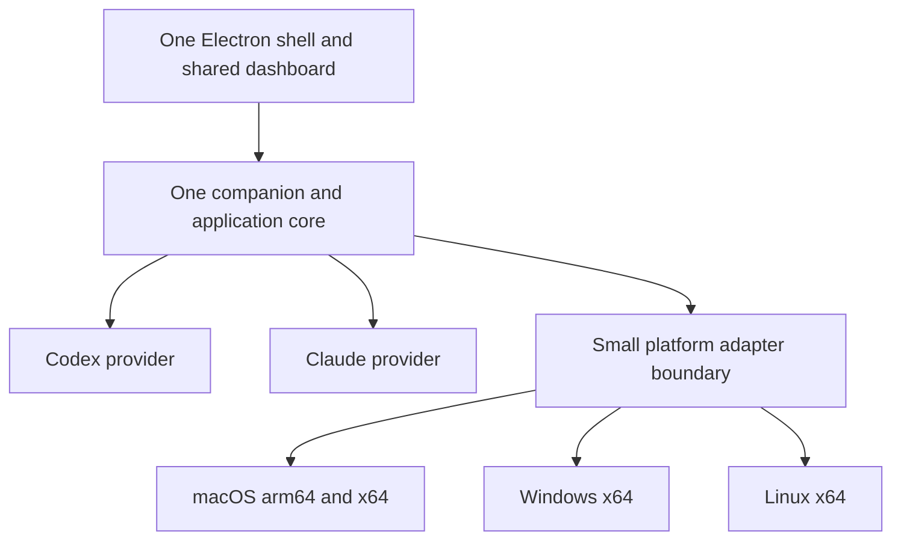

# One TiboTattle desktop app and release train

Recommendation: finish the scoped native 0.1.18 release, then converge on the
existing Electron shell with the shared companion, dashboard and accounting
core. Treat Codex and Claude as providers inside that product. Make installed
migration and the next update the first major proof, rather than leaving
distribution until after feature development.

This is a proposed workstream design, not implementation, release approval or
platform qualification. It assumes the four targets mean macOS arm64, macOS
x64, Windows x64 and Linux x64. Additional architectures and package formats
are outside the first convergence milestone. The active 0.1.18 work is not
modified by this plan.

## Verified starting point

Source and GitHub state were inspected on 2026-09-04. Historical runtime
receipts were read but not rerun. No private usage corpus was inspected.

| Surface | Evidence | Meaning for this workstream |
|---|---|---|
| Public release | Live [v0.1.17](https://github.com/adamallcock/tibotattle/releases/tag/v0.1.17), published September 3, with macOS-arm64 DMG and four evidence/feed assets | The current customer baseline is native macOS |
| Integration base | Live remote main and local `origin/main` both `9e1c33338297c4ffdd224a22b2a2cfbf589ce62a` | Start from production lineage, not the stale primary checkout |
| Native 0.1.18 | Local `codex/release-0.1.18` at `de386d3136a4cb0f5c70a848919567aac3887f53` when checked; includes Intel integration and Astra/history changes | Active, moving source; final accepted revision must be selected later |
| Electron | Local `codex/electron-latest-prs-20260830` at `64cdaddd`; package version 0.1.17; retained macOS-arm64 development-app receipt | Useful working foundation; no production migration or updater proof |
| Divergence | Main versus Electron: 71 main-only / 121 Electron-only commits, including merges | Reconciliation is real work; the package version understates the difference |
| Windows/Linux | Open [PR #74](https://github.com/adamallcock/tibotattle/pull/74), Electron qualification and dormant Linux foundations | Foundations do not establish supported installed products |
| Claude | Worktree `f56f`, branch `codex/claude-full-fit-foundation`, committed head `7c88d13a` already an ancestor of main; 121 modified tracked and 176 untracked paths at inspection | Substantial newer work is mixed and uncommitted; extract owned changes, not a wholesale branch merge |

The primary checkout was clean at `4cb5c489` but 155 commits behind and two
ahead of `origin/main`. Preserve it. This planning branch is isolated from
both that checkout and the active release worktrees.

## Destination and explicit simplifications

- One product version and development line; short task branches return to it.
- One shared dashboard, domain implementation and companion. Preserve the
  existing process boundary and reviewed public facades.
- One desktop shell. Swift may remain for a small credential helper or OS
  integration where justified; retaining a helper does not require retaining
  a second Mac UI, settings implementation and release product.
- Platform adapters own protected paths/files, credentials, startup, tray,
  notifications, deep links and installer/update integration. CPU differences
  select native artifacts; they do not fork product behavior.
- Provider modules own discovery, normalization, accounting and quota/fit
  semantics. Share infrastructure without forcing Claude data into Codex's
  evidence model.
- One release manifest and orchestration path generates platform packages,
  updater metadata, checksums and support/download information. Reuse the
  existing release-evidence contract instead of adding a competing registry.

There are still four platform qualification rows and provider-by-platform
integration checks. Adding Claude creates more test cases, not eight apps,
eight installers or eight release branches. Platform maintenance cannot be
eliminated; confine it to adapters, packaging and repeatable acceptance tests.

Keep the current macOS floor unless an explicit, tested change is necessary.
Start Windows with the existing per-user x64 NSIS installer contract. Propose
Linux x64 AppImage with one declared qualification environment, initially
Ubuntu 24.04 LTS/GNOME; test the claimed display sessions and credential
backend explicitly. Do not call an untested distribution, Wayland session or
tray implementation supported. Additional Linux formats, ARM Windows/Linux,
stores and Universal 2 packaging are deferred. Two thin Mac artifacts from
one source are already one product; a universal installer is optional later.

## Decisions that remove the split

1. **Native 0.1.18 remains a bounded maintenance release.** Include its final
   shared fixes in the convergence base. Thereafter native-shell work is
   restricted to necessary fixes and migration support. New product features
   target the shared application and destination shell.
2. **Reconcile once, then integrate continuously.** Bring the reviewed
   Electron/platform delta onto current production lineage, checking retired
   APIs and newer accounting/identity behavior. Do not resurrect a complete
   older tree or repeatedly produce detached “latest PR integration” products.
   Extract shared packaging closure out of its current macOS-builder owner
   when needed, preserving the existing allowlist and artifact checks.
3. **Keep Claude off the shell's critical path.** Preserve safely disabled
   provider foundations; complete and enable Claude through the same app
   after its own acceptance criteria pass. Do not lower its promised full-fit
   scope merely to declare desktop convergence complete.
4. **Replace overlapping completion checklists with this workstream's fixed
   acceptance ledger when the proposal is accepted.** Update conflicting
   current authorities in the implementation change. The old Claude plan's
   Swift-on-Mac/Electron-elsewhere direction and Linux ARM64 requirement do
   not govern this proposed four-target destination. Old receipts remain
   evidence only for their named source and artifact.

## Prove the handover before expanding scope

The first decisive demonstration is:

**Supported native Mac N → signed Electron N+1 → signed Electron N+2**,
with history, identity, consent, settings and expected background behavior
preserved. N refers to the supported predecessor(s) at cutover, including
0.1.17 and any released 0.1.18. Each Mac architecture needs its own proof.

The current Electron development app uses a separate identity and defaults
to Electron `userData/companion-state`; the successful development-profile
copy is not a production migration. Design one idempotent, journaled handover:

1. Detect the supported predecessor and acquire exclusive migration/writer
   ownership. Stop the old companion and prevent its login item from racing
   the replacement. A preview remains fully isolated, including URL scheme.
2. Inventory and preserve the actual stable state roots, database compatibility
   metadata, history, identity salt, credentials, consent, preferences and
   startup registration. Do not derive stable paths from Electron defaults.
3. Prepare a consistent backup and staged candidate; validate integrity,
   generation, accounting conservation, identity and permissions before commit.
   Preserve the existing non-interactive Keychain requirements; do not assume
   Electron/keytar can read the native broker's credentials transparently.
4. Atomically commit the state handover, register one app/login owner, launch
   the new companion and record completion. Inject interruption/restart
   failures and prove retry does not duplicate history or identities.
5. Preserve recovery material. Recover by a newer compatible build or an
   explicit matching pre-migration backup; never point an older writer at
   newer state or silently reset consent to make the upgrade work.

Retain the stable bundle identity and monotonic native build ordering for a
supported replacement, subject to proving signing, Keychain and updater
compatibility. Do not reuse the development app identity for production.

Timebox a direct Sparkle-to-Electron replacement experiment first. Sparkle
delivery of a replacement bundle and the new app's future updater are two
separate contracts. A direct swap is an unproven option, not an assumption.
If it fails, choose a minimal final-native bridge or a guided one-time signed
installation with the same migration checks. Do not spend weeks building a
general migration framework. No stable feed changes until the chosen route
and the subsequent Electron update are qualified.

Keep old Sparkle migration entry points for users who skip releases; retaining
an immutable bridge/feed does not require continued native feature development.

## Reuse distribution tooling behind the existing trust boundary

Timeboxed official-documentation review supports using the existing
electron-builder foundation with electron-updater rather than writing an
updater. The package supports NSIS, Mac updates and Linux AppImage; its Mac
path also needs a ZIP update payload alongside the DMG. This is tooling
capability, not proof for TiboTattle's runtime or pinned dependency versions.
See [electron-builder updates](https://www.electron.build/docs/features/auto-update/).
Electron's own built-in updater does not support Linux:
[Electron autoUpdater](https://www.electronjs.org/docs/latest/api/auto-updater/).

Before adopting it, verify a compatible pinned version and a packaged
smoke test, including the existing runtime's native module ABI. Preserve
artifact closure, signing/notarization, Windows publisher verification,
provenance and fail-closed readiness. Linux update authentication requires
its own verified trust design; do not treat a checksum from mutable metadata
as sufficient authorization. Consult the package's
[security documentation](https://www.electron.build/docs/features/security/).

The present release contract allows macOS `sparkle`/`none`/`store-managed`
and Linux `none`/`store-managed`. New updater kinds therefore need a coherent
schema/policy, generator, validator and consuming-service change. A dependency
addition alone is insufficient. Preserve safe update-install timing and
test interruption/recovery, especially for a tray-only Windows app.

One release process should:

1. Select one source revision/version and build the declared target matrix on
   appropriate hosts with target-native dependency closure.
2. Validate shared behavior, each packaged artifact and required installed
   journeys. Freeze immutable artifacts; signing/finalization produces the
   exact final bytes that receive their own trust and installed checks.
3. Track per-target candidate/qualified/held state in the orchestration ledger.
   The public evidence manifest includes only qualified final artifacts from
   its one source/version. Missing required evidence blocks that target.
4. Publish immutable authorized artifacts, then promote compatible per-target
   update pointers and downloads from those artifacts. Never rebuild during
   promotion. Keep feeds architecture-correct and channels isolated.
5. Retain a stop-promotion path and publish a newer corrective version when
   needed. Download/support metadata for a held target references its previous
   qualified version and immutable manifest; do not mix old artifacts into
   the new release manifest.

One release train need not mean every platform blocks an urgent fix on another.
Initial four-target availability still requires all four support gates. During
qualification, new platforms may remain preview while the Mac cutover advances.
Do not advertise “four supported targets” before all four qualify.

Hosted Worker/schema deployment remains a separate versioned dependency.
Declare supported client/service contracts for stable and migrating clients;
use additive server changes before client activation. A shell replacement
should not require a simultaneous hosted migration. If new transport does,
stage it separately and preserve the existing consent boundary.

## Claude as an independently enabled provider

Use one provider capability/status projection: enabled state, source
availability, platform qualification, last successful result/freshness, and
evidence state such as learning or unavailable. Put source/credential discovery
behind injected platform services. Do not create provider-specific builds or
use a remote flag to grant consent or activate collection automatically.

Keep provider failure and latency independent. The inspected Claude work
contains error handling but still awaits Claude quota/shadow/fit callbacks
during the common foreground refresh, with 30-second callback defaults.
Independent bounded scheduling and result publication are required so a slow
Claude operation does not delay a successful Codex refresh. Define cancellation
and total resource limits across providers in the same companion.

Extract the dirty Claude work by explicit path/patch ownership, preserving all
unrelated edits. Bring over shared contracts only when needed for convergence.
Its own public-enable gate includes installed-source/restart proof, trustworthy
account/backend/reset linkage, separately billed activity exclusion, shared-pool
coverage and holdout policy, consent/history handling, and customer-facing
fit/gap states. The inspected fit adapter intentionally remains `learning`
without its holdout policy; completion cannot be inferred from test counts.

## Execution order and bounded milestones

Suggested timeboxes are planning budgets, not delivery promises. Hardware,
signing access and migration results determine the public release date.

| Milestone | Work and ownership | Exit |
|---|---|---|
| M0: reconcile and freeze scope | Integration owner; roughly 1–2 focused engineering days. Select final production base, classify Electron/platform delta, assign narrow ownership, enumerate supported predecessor states and four target environments | One current integration branch, fixed user-journey ledger, dependency and hardware/access gaps recorded |
| M1: Mac vertical slice and migration spike | Runtime/migration owner plus distribution owner; next 3–5 focused days as an initial budget. Current accounting in Electron, staged state handover, target credentials, first signed replacement/update experiment | Evidence-backed choice of direct update, minimal bridge or guided install; current packaged app works and unresolved blockers are named |
| M2: four-target candidates | Windows and Linux adapters/qualification run in parallel with Mac migration; shared build/manifest/updater work has one owner | Reproducible install/update/relaunch evidence per target, and a stable candidate revision for full required qualification |
| M3: promote and retire | Release owner; authorized staged rollout with an observation window defined before promotion | Mac handover and second Electron update pass; all claimed targets qualify; native feature/build lane retires after the agreed window |
| Provider follow-up | Provider owner after shared contracts settle; may proceed in parallel with M2 without modifying migration contracts | Claude passes its enablement gate and appears in the same four artifacts through a normal release |

M2 explicitly includes Windows trusted runtime-verifier/readiness wiring,
retention of final artifacts and installed lifecycle qualification. The
inspected production readiness constructor rejects activation and the signed
candidate procedure deletes outputs; signing alone cannot close that row.

The first-week objective is a current Electron candidate plus a demonstrated
update/migration route and a concrete remaining platform list. It is not a
promise to ship all platforms in a week. If M1 exceeds its budget, stop adding
features and resolve the observed blocker or choose the simpler handover route.

Use one integrator for shared companion/schema/build contracts; delegate
platform adapter implementation and independent native qualification. Keep
0.1.18 release coordination separate until its accepted revision is available.
At cutover, allocate a normal version (potentially 0.2.0 to communicate the
transition); do not create an Electron-specific version series.

## Fixed acceptance ledger

Maintain four target rows in this document during implementation. Each needs
exact candidate/source/artifact references for these gates:

| Gate | Required result |
|---|---|
| Core user journeys | Offline first launch, source discovery, current accounting, large-history refresh/cancel, honest unavailable states, settings and relaunch |
| Desktop integration | Tray/menu access, close-versus-quit behavior, startup opt-in, notifications, deep links, sleep/resume and single companion ownership |
| State/security | Protected state and credentials, consent continuity, interrupted migration recovery, future-schema refusal, no duplicated/lost history |
| Distribution | Signed/trusted install, update to next version, interrupted update/recovery, correct architecture/feed and uninstall preserving intended data |
| Existing Mac migration | Every supported predecessor profile class, salt/credential/consent continuity, old login-item cleanup and no unexpected automatic Keychain prompts |
| Product parity | Current stable customer capabilities on replacement Mac; optional hosted contribution remains opt-in and compatible. Reduced Windows/Linux functionality is disclosed and classified, not silently called full parity |
| Performance/accessibility | Measured startup, idle CPU/RSS, large-history responsiveness, keyboard/navigation, readable failure states and retained localization; agree budgets against current native before sign-off |

Shared deterministic accounting/provider tests run once in their owning
portable lane; platform contract and filesystem tests run on target hosts.
Test both providers' adapter interactions on all supported targets before
Claude enablement. Use existing tests and harnesses; add tests for changed
boundaries and failures rather than rebuilding an entire parallel suite.
Run impacted checks during iteration and the required complete qualification
on the frozen candidate. Never waive a required gate because another lane is
green, and do not regenerate expensive release evidence for every UI edit.

Native retirement is an explicit milestone: successful supported migration,
successful subsequent Electron update, agreed observation window and recovery
path. Then remove the active Swift UI build/release lane and duplicate feature
work in a reviewed follow-up. Retain necessary helpers, immutable recovery
artifacts and long-tail migration feeds. This proposal authorizes no deletion.

## Source pointers and remaining uncertainty

- Electron `64cdaddd`: `apps/electron/desktop-runtime.js:114` (state),
  `desktop-platform-services.js:295` (disabled updater), `main.js:403`
  (Windows readiness composition), `scripts/build-electron-app.mjs:60`
  and `apps/electron/electron-builder.config.cjs:94` (target limits).
- Electron `64cdaddd`:
  `docs/plans/2026-08-30-electron-latest-pr-integration.md:192` records the
  historical macOS development receipt;
  `docs/plans/2026-08-24-electron-native-parity-ledger.md:64` is an older
  completion rule requiring reconciliation with current source.
- `config/release-evidence.js` defines updater/support evidence contracts;
  Electron `config/windows-installer-contract.js:309` defines per-user NSIS.
- Main's [state/channel decision](../decisions/2026-08-27-local-state-schema-and-release-channel-isolation.md)
  and [release publication runbook](../runbooks/2026-08-18-cross-platform-release-publication.md)
  remain constraints; this proposal does not bypass them.
- Claude working tree: `src/local-companion-refresh.js:1488` (awaited work),
  `src/claude-source-capabilities.js:68` (capability projection),
  `src/providers/claude/fit-analysis.js:1471` (learning gate),
  `docs/plans/2026-08-23-claude-code-full-fit-completion-plan.md:622`
  (conflicting split-shell direction), and
  `docs/receipts/2026-09-02-claude-hidden-composition-and-recovery-validation.md:81`
  (remaining installed/provider gates). These are local uncommitted observations,
  not reproducible evidence from committed head `7c88d13a`.

Still unproven: native-to-Electron credential and update compatibility, exact
Electron Intel/native-module closure, supported Windows/Linux installed
lifecycle, the Linux update trust path, and final Claude full-fit readiness.
These are the workstream's concrete engineering gates, not reasons to restart
the application architecture or maintain separate provider products.
