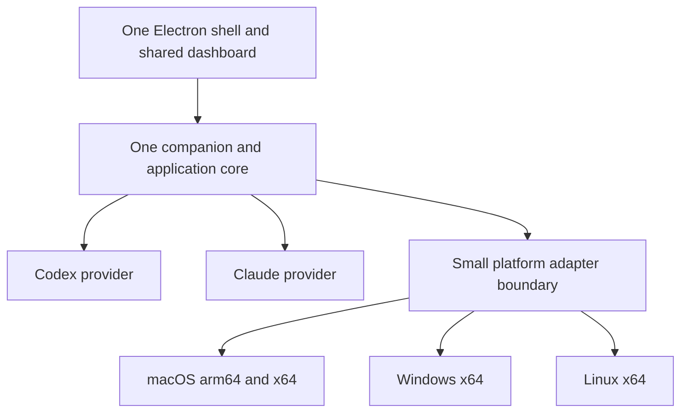

# One TiboTattle desktop app and release train

Recommendation: finish the scoped native 0.1.18 release, then converge on the
existing Electron shell with the shared companion, dashboard and accounting
core. Treat Codex and Claude as providers inside that product. Make installed
migration and the next update the first major proof, rather than leaving
distribution until after feature development.

Implementation was authorized on 2026-09-04, including accountless contribution
in the unified Electron app. This is not release approval or platform
qualification. The four targets mean macOS arm64, macOS
x64, Windows x64 and Linux x64. Additional architectures and package formats
are outside the first convergence milestone. The active 0.1.18 work is not
modified by this plan.

The related [contribution research](../research/2026-09-04-contribution-opt-in-options.md)
records the investigation. The accepted direction is one coordinated
workstream: Electron convergence plus accountless contribution. The owner
resolved the sharing default on 2026-09-04: fresh installations share
automatically without sign-in, with a persistent opt-out. Existing installations
without a prior choice receive three visible notices before activation;
**Share now** or **Keep sharing off** cancels the remaining notices. Preserve
explicit existing off, paused and disconnected choices. The accepted
[sharing policy](../decisions/2026-09-04-accountless-sharing-policy.md) records
the detailed state and timing contract. This supersedes the earlier ambiguity
and approval-review hold on changing the default.

## Implementation boundary

The owner's subsequent page-by-page review identified overlapping tray surfaces
in the first 0.1.18 Electron candidate. The follow-up acceptance boundary is
native primary/secondary tray interaction, rendered navigation through all five
dashboard pages and every Settings tab, and working Share and More shortcuts.
Three Terra agents independently reviewed Usage pages, Settings/sharing, and
the native control inventory. Each repaired interaction must be checked in a
fresh packaged app; passing a direct popup smoke does not exercise an actual
status-item click. AppKit window chrome and web chrome remain distinct, so
feature parity must not be described as pixel-identical native rendering.

The owner also requested a background/backoffice parity check. That audit
confirmed the shared accounting/history lineage but found unsupported
secondary-folder ingestion and a hidden-window refresh mismatch. The candidate
uses one analyzed folder, matching native 0.1.18, while preserving saved extra
folder configurations. The owned automatic cadence must continue while the app
is hidden in the tray. Full multi-folder ingestion remains a separate, explicit
acceptance gate; future tests must exercise the actual companion and index,
not merely assert proposed argv. Accountless uploads remain unavailable until
upload ownership and scheduler integration are complete.

Continuation authorized on 2026-09-04: finish reconciliation with the latest
native 0.1.18 changes and controls, provide a durable Electron app the owner can
test, and prepare packaging for all four targets. The integration baseline is
native commit `3a785e6d` (including the earlier `6731e6d4` integration). This includes the
combined Astra/Intel work, compressed-history support, paginated-export fixes,
the parser-v14 exact-history inheritance correction, RC3 upgrade deadlines,
the subsequent strict filesystem refusal diagnostics, Login Item tooling
closure and refreshed native v14 qualification receipts.
GitHub PRs and remote references were refreshed before selecting the release
lineage; the active local release checkout was checked again at each freeze.
Open PRs are evaluated for relevant product changes; their presence alone does
not authorize adopting unrelated research or obsolete implementations.

The next acceptance boundary is a versioned development package for each of
`darwin-arm64`, `darwin-x64`, `win32-x64` and `linux-x64`, one packaging command
and native-runner workflow, a source-backed Mac control parity ledger, and a
durable side-by-side Mac test app with isolated writable state. Exact native
runtime, installed lifecycle, production signing and update proofs stay visible
per target. Docker x64 emulation can produce/test a Linux development artifact;
it cannot be reported as physical x64 desktop qualification. Existing native
release artifacts and checkouts remain intact.

The policy is accepted for the new Electron mode. Source implementation and
synthetic qualification may proceed; distributed collection still depends on
upload ownership, honest authorization, abuse controls and release evidence.

- Keep local analysis available offline. Contribution failure never blocks it.
- Remove mandatory social sign-in for the new Electron contribution mode.
  Reuse per-installation credentials, authenticated uploads and revocation.
  Existing social enrollment remains compatible during migration.
- Record automatic enrollment as `default_on` authorization under a versioned
  policy. Never manufacture an explicit-consent timestamp or claim a review
  occurred. Local privacy settings must distinguish default from user choice.
- Enable the new default only for a positively identified fresh installation
  in a candidate whose composition explicitly selects that policy. Missing or
  unreadable migrated settings do not prove freshness. Preserve a durable
  opt-out before cancelling work; restart, failed revocation, missing secrets,
  or upgrades must not silently re-enroll a user who turned sharing off.
- Keep enrollment and contribution disabled in existing production settings
  while the new path is qualified in an isolated synthetic laboratory.
- Match provider-account and quota-window evidence independently of the
  uploader's credential. Do not equate a social login, installation, provider
  account or person. Unknown historical account attribution remains unknown.
- Keep Claude as a capability in the same binaries. Full Claude activation is
  outside the first combined migration milestone; do not merge its dirty
  worktree wholesale or make it a second product/release train.

The accepted default-on decision changes the earlier default-off design for
this new mode. Current authorization does not include remote migrations, publication, signing, system installs,
real-corpus uploads, erasure, or re-enabling previously declined contribution.
Update applicable invariants and disclosures as each implemented path changes;
the distributed native application's current behavior remains unchanged.

### Work estimate and first implementation tranche

Initial estimate: **12–25 focused engineering days**, with parallel work
potentially yielding a qualified four-target release in **2–4 calendar weeks**.
These are planning ranges, not delivery guarantees. Physical Windows/Linux and
Intel access, signing and installed migration/update evidence are dependencies.

| Work | Initial engineering-day range |
|---|---:|
| Reconcile current Electron and native shared core | 2–4 |
| Accountless enrollment, renewal, honest authorization and opt-out UX | 3–5 |
| Usage/quota attribution, replay and abuse/influence controls | 2–4 |
| State/credential migration, updater and four-target packaging | 3–7 |
| Cross-target integration, installed regression and release qualification | 2–5 |

First tranche: reconcile the shell, freeze the identity/enrollment contract,
implement bounded accountless backend/client foundations and preference
semantics, then verify synthetic enrollment. The enrollment-only receipt must
not grant upload authority: current credentials require a browser-pairing FK
and participants require a non-null consent timestamp. Do not work around
those constraints with invented browser sessions, pairings or consent events.
Additive upload ownership and honest policy authorization are a subsequent
integration gate. This is a useful
source milestone, not a claim that all four installers are ready. Use separate
reviewable commits and compatible server-first deployment gates inside the
single workstream; avoid coupling rollback of the shell to a destructive data
migration.

| Owner | Isolated work | Status |
|---|---|---|
| Integrator | `codex/unified-desktop-accountless` | Isolated integration branch, policy/client, asset closure and combined validation |
| Luna: Electron | `codex/electron-accountless-reconcile`, then `codex/electron-architecture-exception-tightening` | Selective shell reconciliation, narrow preload boundary and complete browser catalogs integrated |
| Luna: enrollment | `codex/accountless-enrollment-backend` | Disabled enrollment-only endpoint, additive ledger, bounded issuance and synthetic lifecycle tests |
| Luna: attribution | Read-only attribution trace, then owned client files | Join contract verified; bounded enrollment helper implemented; independent backend concurrency review |

First-tranche preference foundation was implemented with a closed versioned record and
the existing protected settings adapter. Its nine focused tests passed, including
real-file restart, first-operation opt-out, corrupt/unknown state, failed writes,
policy/destination changes and concurrent selections. At that milestone it was not connected to the application or an upload
scheduler. The second tranche below connects the accepted policy to Electron;
no existing production behavior changed.

The initial source integration selectively brings the retained Electron shell
onto the current shared core. It preserves current native accounting, hosted
authentication and the active 0.1.18 checkout. A real companion HTTP test caught
and now covers the settings routes, MIME types, exporter inventory and native
shared-web asset closure. The browser preview caught missing localization;
152 retained Electron/appearance catalog entries are now present across all
three locales. Rendered Settings was inspected after that repair. This is
browser evidence only, not a packaged Electron or native lifecycle receipt.

The client helper has 13 focused passing tests. It reuses the existing secure
installation capability, sends an exact five-field request, and validates an
enrollment-only receipt. It bounds response streaming and deadlines, rejects
revoked/expired/overlong receipts, and rechecks the durable preference around
asynchronous operations. It is not wired into the application: the composition
must additionally abort or serialize enrollment with opt-out to close the
last preference-read/send race. No scheduler, credential renewal, upload
authorization or automatic collection is introduced by this tranche.

Before activation, complete additive upload ownership without synthetic consent
events, preference UI and cancellation wiring, explicit legacy choice/identity
migration, source-level duplicate selection, contribution influence controls,
and installed update qualification. Enrollment's provisional 1,000-per-day and
10,000-lifetime global caps bound the disabled candidate's ledger; they are
laboratory containment limits, not the production onboarding capacity plan.

Validation for the first tranche (2026-09-04):

| Evidence | Result and boundary |
|---|---|
| Electron source suite on integrated branch | 308/308 passed; synthetic lifecycle/IPC/platform contracts |
| Complete Worker Vitest on integrated branch | 537/537 passed across 44 files; isolated local Cloudflare fixtures |
| Required macOS artifact lane | 121/121 passed across its three test groups after preparing the pinned public Sparkle dependency; disposable development/preview and loopback fixtures, no installed migration or production signing proof |
| Worker script/type/schema checks | 179/179 script checks, 19/19 staging-readiness checks and TypeScript passed on the backend branch; 17/17 focused route/enrollment tests passed |
| Preference/client/export/application focused suite | 30/30 passed, including 9 preference and 13 client cases |
| Usage/account attribution regressions | 43/43 passed in the focused provider and telemetry lanes |
| Browser Settings inspection | Rendered repaired English catalog and layout; ordinary browser correctly reports absent native bridge |
| Architecture, i18n mirror, documentation governance | Passed after shell/catalog/client integration |
| Integrated API/docs/tool inventory/HTTP asset checks | 15/15 passed after recording both new static tool callers |
| Complete root suite | 3,755 tests: 3,731 passed, 21 skipped, 3 failed. One missing static tool caller was repaired afterward; two retained R7 evidence checks remain unqualified for the changed workload source |

The R7 failures are the retained receipt/current-workload digest and exact
decision reconstruction checks. Preserve those assertions and old receipts.
The full regenerator includes a real-history pass and documents prior durations
of 42–59 minutes; do not rewrite hashes or represent historical measurements as
new evidence. Run it on the final accepted source with an explicitly approved
corpus and pinned runtimes during release qualification. Native Windows tests
remain skipped on this Mac host; no test count closes their physical gates.

The complete Worker product gate is not claimed green. Its Vitest and script
components pass, while `deploy:dry` and `staging:check` stop at the absent
generated public release manifest in a clean checkout. Prepare the exact public
asset/provenance inputs for the accepted candidate before those dry-run gates;
do not bypass the manifest checks or stage a fabricated release. No deployment
or remote migration was attempted.

| Candidate target | Current workstream status | Next physical gate |
|---|---|---|
| macOS arm64 | Fresh Electron 43.2.0 development app and exact ASAR closure verified; synthetic notice, Settings and opt-out restart inspected | Credential/state migration, installed replacement and first update |
| macOS x64 | Shared source reconciled; active native 0.1.18 candidate left separate | Exact Intel Electron/native-dependency build and installed lifecycle |
| Windows x64 | Retained protected-state/platform seams integrated; production readiness remains disabled | Qualified native binding, installer, credentials and update on Windows |
| Linux x64 | Retained shell/adapter foundations; no installed support claim | Secret Service, tray/display environment, package/update and relaunch |

### Second tranche: accepted sharing policy and visible controls

Implemented source scope: protected local policy v2, fresh-install default-on,
metadata-only installation classification, durable three-notice transition,
explicit-choice cancellation, a narrow Electron bridge, visible dashboard
notices and persistent Settings controls. The candidate schedule is days 0, 3
and 6, at least 24 hours between actual displays, with activation no earlier
than day 7 and 24 hours after the third displayed notice. Late visits extend
that schedule. Policy records distinguish `default_on`, `migration_default_on`
and `user_choice`; automatic activation creates no consent timestamp.

The Electron host removes the legacy hosted contribution origin and rejects
hosted sign-in. This prevents a previously paired legacy scheduler from
bypassing the new choice while accountless upload ownership is unfinished.
The preference UI explicitly reports that uploads are unavailable in this
build. This is a candidate source milestone, not a shipping replacement for
existing contributors.

The next backend change must generalize contribution ownership without a
parallel ingestion pipeline. Existing participants, device credentials,
consent triggers and aggregate eligibility depend on social enrollment;
enrollment-only receipts cannot safely be promoted into upload credentials.
Add a common owner/principal contract, honest policy authorization,
authenticated renewal/revocation and conservative aggregate admission, then
wire scheduling and cancellation through the same durable preference.
Do not fabricate participants, consent events, sessions or browser pairings.

The reviewed development packager and exact-artifact verifier were restored
from the retained Electron branch, with both sharing modules added to their
closed source inventories. This avoids a parallel packaging implementation.
At this historical milestone the restored packager targeted development macOS
arm64 and Windows x64. The four-target continuation below supersedes that
packaging limitation.

Second-tranche source commits are `29c99016` (policy and UI), `6971c479`
(development packaging) and `b4314a1b` (viewport visibility guard). Validation:

| Evidence | Result and boundary |
|---|---|
| Complete Electron source suite | 328/328 passed, including hidden/foreign/settings-frame notice refusal and legacy hosted transport suppression |
| Complete shared web suite | 492/492 passed after the viewport guard, including notice retention, actual visibility and startup regression coverage |
| Domain, protected desktop store and classifier | 31/31 passed: trusted clock, restart, three receipts, choices, corrupt state and unsafe metadata |
| Restored packaging/verifier suite | 41 passed, two platform/artifact fixture skips; a subsequent direct verifier matched the actual macOS artifact to its staged source |
| Architecture, catalogs, API/docs guidance, tool inventory and preflight | Passed; four restored packaging tools have explicit ownership |
| Packaged macOS arm64 UI | Actual Electron 43.2.0 directory app: first notice remained visible after its one display receipt; Settings on/off persisted; clean quit and relaunch preserved off and cancelled notices |
| Complete root suite | 3,804 tests: 3,783 passed, 19 skipped, two retained R7 receipt/current-workload provenance failures. This run began at `6971c479`; the subsequent UI-only guard passed the complete 492-test web suite |

The packaged UI check uses a disposable synthetic profile and export-identity
override, with the hosted contribution origin absent. It does not qualify real
account/credential migration, live uploads, Intel/Windows/Linux, startup-item
registration, signing/notarization, an installed replacement or an update.
Host HOME was preserved; this is not whole-process Keychain isolation.

### Four-target continuation: current implementation and acceptance

One development packager now handles all four target tuples, with explicit
platform/architecture artifact names, clean-commit provenance, complete ASAR
and native-executable checks, bounded logs and SHA-256 receipts. The
native-runner workflow uses the same command and pinned dependencies, with
manual dispatch and a push trigger restricted to the approved integration
branch. It has no
signing or publication authority. Windows builds its security binding from the
current source on the Windows runner; a retained older binary cannot substitute
for that build.

Verified development distributions have been produced locally for both Mac
architectures (DMG and ZIP) and Linux x64 (AppImage and tar.gz). These initial
artifacts exposed two runtime regressions before handoff: missing startup
refresh and a scrubbed `ELECTRON_RUN_AS_NODE` switch in the accounting child.
The final candidate must include both repairs and pass an actual packaged
refresh. Initial distribution receipts alone do not close that runtime gate.

The Linux AppImage dependency has a small pinned patch that removes its
implicit sandbox bypass; executable launcher tests cover the actual installed
template. Linux cross-packaging on this Mac is artifact evidence. It does not
establish desktop, Secret Service, tray or installed lifecycle behavior on
Linux. Native Windows CI has produced the installer and ZIP; installed Windows
runtime qualification remains separate.

The tester profile copies retained derived databases through SQLite read-only
backup, preserves the matching index salt and uses a separate development
export identity. Native writable state and native credential storage are not
the tester profile. Repeated launches must accept normal changes to those
private copies. The launch command must bind the selected app to its exact
ASAR digest and keep hosted contribution unavailable.

Current validation includes 546/546 Worker Vitest tests, 59/59 migration and
staging contract tests, 934/934 Electron/web/local tests after the refresh
cadence repair, 195/195 parser-v14 integration tests, 78/78 release trust
checks and 20/20 preflight tests. The latest complete root run had 4,081 tests:
4,057 passed, 20 skipped and four failed. Two concurrent inventory/caller
omissions were subsequently repaired and passed their focused checks; the two
historical R7 provenance checks remain unqualified. No historical receipt was
rewritten and this is not a green complete-root claim.

The `a6226a4b` snapshot produced verified Mac arm64, Mac x64 and Linux x64
development distributions with complete hashed testing handoffs. A subsequent
native CI run at `daaff299` completed successfully for all four targets:
[run 33936034045](https://github.com/adamallcock/tibotattle/actions/runs/33936034045).
The Windows installer, ZIP, ASAR, current native binding and testing handoff
were downloaded and matched their SHA-256 receipts. The first manual dispatch failed
because the workflow was absent from the default branch; the approved branch
push now runs the four native jobs without a merge or release.

The owner-reported visual differences are part of final acceptance. Process
inspection found the owner was running the older `18b8de56` app. Its cache
reuse plot was visibly populated on Usage and costs, with the switch-overhead
and recent-drop expansions present. Current native and Electron share these
cache views; recent attribution changes affect the data behind them. Direct
tray/menu navigation to Usage and costs now makes that surface discoverable.

The real Electron NativeImage probe reproduced an opaque square and verified
the alpha-preserving PNG repair as a bird silhouette with transparent pixels.
The richer tray now has a shared local renderer, and the browser adapter
preserves native `paceOutlook` data for the selected current plan. Its packaged
render/action proof remains required. The final candidate must include these
changes, expose its build identity and pass rendered checks; source freshness
and module-presence tests cannot substitute for that proof.

Remaining release gates are explicit: final four-target distributions, rendered
final Mac inspection, physical target runtime checks, production signing,
installed state/credential migration and first update, and accountless upload
ownership/scheduling. Sharing controls already implement the accepted policy;
they truthfully report unavailable uploads until the transport integration is
qualified. Claude remains a provider inside this same product and packaging
matrix.
Rendered notice and Settings captures plus the content-free runtime and
artifact receipts are retained under the ignored
`.release-build/electron-sharing-qa-viewport-final/evidence/` directory.

The earlier sharing-policy artifact was rebuilt from
`b4314a1bcbd97c1663f17ddda23610b8366a1c26`; it is not the current convergence
candidate.
Its raw ASAR SHA-256 is
`678f0658d098626d51d530b160d392f8993b78a7104df51fcf8d7a24eb307142`.
The direct verifier matched all 466 staged and packaged files, including the
one unpacked native module. The final packaged runtime check passed again:
one visible notice produced exactly one receipt, Settings toggled on then off,
and a clean relaunch retained the opt-out with reminders cancelled.

The viewport guard has four passing UI tests: offscreen, zero-area or
CSS-hidden notices wait until sufficient banner area is visible before the
renderer supplies a display receipt. Scroll, resize and visibility changes
retry presentation without duplicating receipts. Actual rendered notice and
Settings captures were inspected after rebuilding the final app.

### Usage-to-quota attribution contract

Four identities have separate jobs:

| Dimension | Purpose | Must not imply |
|---|---|---|
| Installation credential and hosted participant/device | Authenticate an uploader, retain enrollment continuity, revoke and budget requests | One person or one provider account |
| Provider-account track | Partition measured usage/quota within a provider and observed account context | Global identity across devices or retroactive historical ownership |
| Plan era, limit/pool and reset window | Select comparable quota observations and the usage interval between them | Additive quota across devices or a provider-authoritative token denominator |
| Source session and occurrence | Replay/copy deduplication and correction provenance | Ownership of every record sharing a session UUID |

For one installation, match usage and quota through compatible **provider,
account track, plan era, limit/pool and time/reset interval** evidence. A quota
observation is a sample of an account allowance; never sum those samples as if
they were independent consumption. One machine can change accounts, and one
account can have usage on other machines or unobserved surfaces. Preserve those
coverage limits in fit eligibility and confidence.

Current local scope is keyed from the observed normalized account email using
the installation's account-observation secret
(`src/providers/codex/account-scope.js`). It is not a verified tenant/pool ID.
The bracketed account read refuses an account switch during quota retrieval;
fresh markers apply prospectively, never backward to arbitrary old rollouts.

The v1.1 projection (`src/contribution/telemetry-v11-chunks.js`) retains explicit
account/plan evidence and derives `accountTrackId` only with the captured,
matching destination/enrollment binding. Preserve the account-observation
secret, enrollment namespace and binding during supported native migration.
New enrollment alone must not retroactively attach unknown history to the
currently signed-in provider account.

Current account tracks are installation/enrollment scoped, and usage occurrence
IDs still depend on a salted local source key. Two devices using the same
provider account therefore do not automatically coalesce. Do not call them
independent people, sum their quota samples, or dedupe quota by equal values and
timestamps. First accountless collection remains excluded from public fit and
participant-support eligibility until source/copy deduplication and scoped fit
selection are qualified. Global account linking is a separate, explicit data
contract; it must not be smuggled in by hashing an email with a public constant.

Required regression cases: account A to B on one installation; account change
during quota read; same account copied to two devices; repeated upload/reinstall;
quota reset and plan change; lost/locked account secret; unknown historical
account evidence; migrated namespace mismatch; and opt-out during enrollment.

## Verified starting point

Source and GitHub state were inspected on 2026-09-04. Historical runtime
receipts were read but not rerun. No private usage corpus was inspected.

| Surface | Evidence | Meaning for this workstream |
|---|---|---|
| Public release | Live [v0.1.17](https://github.com/adamallcock/tibotattle/releases/tag/v0.1.17), published September 3, with macOS-arm64 DMG and four evidence/feed assets | The current customer baseline is native macOS |
| Integration base | Live remote main and local `origin/main` both `9e1c33338297c4ffdd224a22b2a2cfbf589ce62a` | Start from production lineage, not the stale primary checkout |
| Native 0.1.18 | Local `codex/release-0.1.18` at `de386d3136a4cb0f5c70a848919567aac3887f53` when checked; includes Intel integration and Astra/history changes | Active, moving source; final accepted revision must be selected later |
| Electron | Local `codex/electron-latest-prs-20260830` at `64cdaddd`; package version 0.1.17; retained macOS-arm64 development-app receipt | Useful working foundation; no production migration or updater proof |
| Divergence | Main versus Electron: 71 main-only / 121 Electron-only commits, including merges | Reconciliation is real work; the package version understates the difference |
| Windows/Linux | Open [PR #74](https://github.com/adamallcock/tibotattle/pull/74), Electron qualification and dormant Linux foundations | Foundations do not establish supported installed products |
| Claude | Worktree `f56f`, branch `codex/claude-full-fit-foundation`, committed head `7c88d13a` already an ancestor of main; 121 modified tracked and 176 untracked paths at inspection | Substantial newer work is mixed and uncommitted; extract owned changes, not a wholesale branch merge |

The primary checkout was clean at `4cb5c489` but 155 commits behind and two
ahead of `origin/main`. Preserve it. This planning branch is isolated from
both that checkout and the active release worktrees.

## Destination and explicit simplifications

- One product version and development line; short task branches return to it.
- One shared dashboard, domain implementation and companion. Preserve the
  existing process boundary and reviewed public facades.
- One desktop shell. Swift may remain for a small credential helper or OS
  integration where justified; retaining a helper does not require retaining
  a second Mac UI, settings implementation and release product.
- Platform adapters own protected paths/files, credentials, startup, tray,
  notifications, deep links and installer/update integration. CPU differences
  select native artifacts; they do not fork product behavior.
- Provider modules own discovery, normalization, accounting and quota/fit
  semantics. Share infrastructure without forcing Claude data into Codex's
  evidence model.
- One release manifest and orchestration path generates platform packages,
  updater metadata, checksums and support/download information. Reuse the
  existing release-evidence contract instead of adding a competing registry.

There are still four platform qualification rows and provider-by-platform
integration checks. Adding Claude creates more test cases, not eight apps,
eight installers or eight release branches. Platform maintenance cannot be
eliminated; confine it to adapters, packaging and repeatable acceptance tests.

Keep the current macOS floor unless an explicit, tested change is necessary.
Start Windows with the existing per-user x64 NSIS installer contract. Propose
Linux x64 AppImage with one declared qualification environment, initially
Ubuntu 24.04 LTS/GNOME; test the claimed display sessions and credential
backend explicitly. Do not call an untested distribution, Wayland session or
tray implementation supported. Additional Linux formats, ARM Windows/Linux,
stores and Universal 2 packaging are deferred. Two thin Mac artifacts from
one source are already one product; a universal installer is optional later.

## Decisions that remove the split

1. **Native 0.1.18 remains a bounded maintenance release.** Include its final
   shared fixes in the convergence base. Thereafter native-shell work is
   restricted to necessary fixes and migration support. New product features
   target the shared application and destination shell.
2. **Reconcile once, then integrate continuously.** Bring the reviewed
   Electron/platform delta onto current production lineage, checking retired
   APIs and newer accounting/identity behavior. Do not resurrect a complete
   older tree or repeatedly produce detached “latest PR integration” products.
   Extract shared packaging closure out of its current macOS-builder owner
   when needed, preserving the existing allowlist and artifact checks.
3. **Keep Claude off the shell's critical path.** Preserve safely disabled
   provider foundations; complete and enable Claude through the same app
   after its own acceptance criteria pass. Do not lower its promised full-fit
   scope merely to declare desktop convergence complete.
4. **Replace overlapping completion checklists with this workstream's fixed
   acceptance ledger when the proposal is accepted.** Update conflicting
   current authorities in the implementation change. The old Claude plan's
   Swift-on-Mac/Electron-elsewhere direction and Linux ARM64 requirement do
   not govern this proposed four-target destination. Old receipts remain
   evidence only for their named source and artifact.

## Prove the handover before expanding scope

The first decisive demonstration is:

**Supported native Mac N → signed Electron N+1 → signed Electron N+2**,
with history, identity, consent, settings and expected background behavior
preserved. N refers to the supported predecessor(s) at cutover, including
0.1.17 and any released 0.1.18. Each Mac architecture needs its own proof.

The current Electron development app uses a separate identity and defaults
to Electron `userData/companion-state`; the successful development-profile
copy is not a production migration. Design one idempotent, journaled handover:

1. Detect the supported predecessor and acquire exclusive migration/writer
   ownership. Stop the old companion and prevent its login item from racing
   the replacement. A preview remains fully isolated, including URL scheme.
2. Inventory and preserve the actual stable state roots, database compatibility
   metadata, history, identity salt, credentials, consent, preferences and
   startup registration. Do not derive stable paths from Electron defaults.
3. Prepare a consistent backup and staged candidate; validate integrity,
   generation, accounting conservation, identity and permissions before commit.
   Preserve the existing non-interactive Keychain requirements; do not assume
   Electron/keytar can read the native broker's credentials transparently.
4. Atomically commit the state handover, register one app/login owner, launch
   the new companion and record completion. Inject interruption/restart
   failures and prove retry does not duplicate history or identities.
5. Preserve recovery material. Recover by a newer compatible build or an
   explicit matching pre-migration backup; never point an older writer at
   newer state or silently reset consent to make the upgrade work.

Retain the stable bundle identity and monotonic native build ordering for a
supported replacement, subject to proving signing, Keychain and updater
compatibility. Do not reuse the development app identity for production.

Timebox a direct Sparkle-to-Electron replacement experiment first. Sparkle
delivery of a replacement bundle and the new app's future updater are two
separate contracts. A direct swap is an unproven option, not an assumption.
If it fails, choose a minimal final-native bridge or a guided one-time signed
installation with the same migration checks. Do not spend weeks building a
general migration framework. No stable feed changes until the chosen route
and the subsequent Electron update are qualified.

Keep old Sparkle migration entry points for users who skip releases; retaining
an immutable bridge/feed does not require continued native feature development.

## Reuse distribution tooling behind the existing trust boundary

Timeboxed official-documentation review supports using the existing
electron-builder foundation with electron-updater rather than writing an
updater. The package supports NSIS, Mac updates and Linux AppImage; its Mac
path also needs a ZIP update payload alongside the DMG. This is tooling
capability, not proof for TiboTattle's runtime or pinned dependency versions.
See [electron-builder updates](https://www.electron.build/docs/features/auto-update/).
Electron's own built-in updater does not support Linux:
[Electron autoUpdater](https://www.electronjs.org/docs/latest/api/auto-updater/).

Before adopting it, verify a compatible pinned version and a packaged
smoke test, including the existing runtime's native module ABI. Preserve
artifact closure, signing/notarization, Windows publisher verification,
provenance and fail-closed readiness. Linux update authentication requires
its own verified trust design; do not treat a checksum from mutable metadata
as sufficient authorization. Consult the package's
[security documentation](https://www.electron.build/docs/features/security/).

The present release contract allows macOS `sparkle`/`none`/`store-managed`
and Linux `none`/`store-managed`. New updater kinds therefore need a coherent
schema/policy, generator, validator and consuming-service change. A dependency
addition alone is insufficient. Preserve safe update-install timing and
test interruption/recovery, especially for a tray-only Windows app.

One release process should:

1. Select one source revision/version and build the declared target matrix on
   appropriate hosts with target-native dependency closure.
2. Validate shared behavior, each packaged artifact and required installed
   journeys. Freeze immutable artifacts; signing/finalization produces the
   exact final bytes that receive their own trust and installed checks.
3. Track per-target candidate/qualified/held state in the orchestration ledger.
   The public evidence manifest includes only qualified final artifacts from
   its one source/version. Missing required evidence blocks that target.
4. Publish immutable authorized artifacts, then promote compatible per-target
   update pointers and downloads from those artifacts. Never rebuild during
   promotion. Keep feeds architecture-correct and channels isolated.
5. Retain a stop-promotion path and publish a newer corrective version when
   needed. Download/support metadata for a held target references its previous
   qualified version and immutable manifest; do not mix old artifacts into
   the new release manifest.

One release train need not mean every platform blocks an urgent fix on another.
Initial four-target availability still requires all four support gates. During
qualification, new platforms may remain preview while the Mac cutover advances.
Do not advertise “four supported targets” before all four qualify.

Hosted Worker/schema deployment remains a separate versioned dependency.
Declare supported client/service contracts for stable and migrating clients;
use additive server changes before client activation. A shell replacement
should not require a simultaneous hosted migration. If new transport does,
stage it separately and preserve the existing consent boundary.

## Claude as an independently enabled provider

Use one provider capability/status projection: enabled state, source
availability, platform qualification, last successful result/freshness, and
evidence state such as learning or unavailable. Put source/credential discovery
behind injected platform services. Do not create provider-specific builds or
use a remote flag to grant consent or activate collection automatically.

Keep provider failure and latency independent. The inspected Claude work
contains error handling but still awaits Claude quota/shadow/fit callbacks
during the common foreground refresh, with 30-second callback defaults.
Independent bounded scheduling and result publication are required so a slow
Claude operation does not delay a successful Codex refresh. Define cancellation
and total resource limits across providers in the same companion.

Extract the dirty Claude work by explicit path/patch ownership, preserving all
unrelated edits. Bring over shared contracts only when needed for convergence.
Its own public-enable gate includes installed-source/restart proof, trustworthy
account/backend/reset linkage, separately billed activity exclusion, shared-pool
coverage and holdout policy, consent/history handling, and customer-facing
fit/gap states. The inspected fit adapter intentionally remains `learning`
without its holdout policy; completion cannot be inferred from test counts.

## Execution order and bounded milestones

Suggested timeboxes are planning budgets, not delivery promises. Hardware,
signing access and migration results determine the public release date.

| Milestone | Work and ownership | Exit |
|---|---|---|
| M0: reconcile and freeze scope | Integration owner; roughly 1–2 focused engineering days. Select final production base, classify Electron/platform delta, assign narrow ownership, enumerate supported predecessor states and four target environments | One current integration branch, fixed user-journey ledger, dependency and hardware/access gaps recorded |
| M1: Mac vertical slice and migration spike | Runtime/migration owner plus distribution owner; next 3–5 focused days as an initial budget. Current accounting in Electron, staged state handover, target credentials, first signed replacement/update experiment | Evidence-backed choice of direct update, minimal bridge or guided install; current packaged app works and unresolved blockers are named |
| M2: four-target candidates | Windows and Linux adapters/qualification run in parallel with Mac migration; shared build/manifest/updater work has one owner | Reproducible install/update/relaunch evidence per target, and a stable candidate revision for full required qualification |
| M3: promote and retire | Release owner; authorized staged rollout with an observation window defined before promotion | Mac handover and second Electron update pass; all claimed targets qualify; native feature/build lane retires after the agreed window |
| Provider follow-up | Provider owner after shared contracts settle; may proceed in parallel with M2 without modifying migration contracts | Claude passes its enablement gate and appears in the same four artifacts through a normal release |

M2 explicitly includes Windows trusted runtime-verifier/readiness wiring,
retention of final artifacts and installed lifecycle qualification. The
inspected production readiness constructor rejects activation and the signed
candidate procedure deletes outputs; signing alone cannot close that row.

The first-week objective is a current Electron candidate plus a demonstrated
update/migration route and a concrete remaining platform list. It is not a
promise to ship all platforms in a week. If M1 exceeds its budget, stop adding
features and resolve the observed blocker or choose the simpler handover route.

Use one integrator for shared companion/schema/build contracts; delegate
platform adapter implementation and independent native qualification. Keep
0.1.18 release coordination separate until its accepted revision is available.
At cutover, allocate a normal version (potentially 0.2.0 to communicate the
transition); do not create an Electron-specific version series.

## Fixed acceptance ledger

Maintain four target rows in this document during implementation. Each needs
exact candidate/source/artifact references for these gates:

| Gate | Required result |
|---|---|
| Core user journeys | Offline first launch, source discovery, current accounting, large-history refresh/cancel, honest unavailable states, settings and relaunch |
| Desktop integration | Tray/menu access, close-versus-quit behavior, startup opt-in, notifications, deep links, sleep/resume and single companion ownership |
| State/security | Protected state and credentials, consent continuity, interrupted migration recovery, future-schema refusal, no duplicated/lost history |
| Distribution | Signed/trusted install, update to next version, interrupted update/recovery, correct architecture/feed and uninstall preserving intended data |
| Existing Mac migration | Every supported predecessor profile class, salt/credential/consent continuity, old login-item cleanup and no unexpected automatic Keychain prompts |
| Product parity | Current stable customer capabilities on replacement Mac; hosted contribution follows the accepted Electron sharing policy with persistent opt-out and preserved prior choices. Reduced Windows/Linux functionality is disclosed and classified, not silently called full parity |
| Performance/accessibility | Measured startup, idle CPU/RSS, large-history responsiveness, keyboard/navigation, readable failure states and retained localization; agree budgets against current native before sign-off |

Shared deterministic accounting/provider tests run once in their owning
portable lane; platform contract and filesystem tests run on target hosts.
Test both providers' adapter interactions on all supported targets before
Claude enablement. Use existing tests and harnesses; add tests for changed
boundaries and failures rather than rebuilding an entire parallel suite.
Run impacted checks during iteration and the required complete qualification
on the frozen candidate. Never waive a required gate because another lane is
green, and do not regenerate expensive release evidence for every UI edit.

Native retirement is an explicit milestone: successful supported migration,
successful subsequent Electron update, agreed observation window and recovery
path. Then remove the active Swift UI build/release lane and duplicate feature
work in a reviewed follow-up. Retain necessary helpers, immutable recovery
artifacts and long-tail migration feeds. This proposal authorizes no deletion.

## Source pointers and remaining uncertainty

- Electron `64cdaddd`: `apps/electron/desktop-runtime.js:114` (state),
  `desktop-platform-services.js:295` (disabled updater), `main.js:403`
  (Windows readiness composition), `scripts/build-electron-app.mjs:60`
  and `apps/electron/electron-builder.config.cjs:94` (target limits).
- Electron `64cdaddd`:
  `docs/plans/2026-08-30-electron-latest-pr-integration.md:192` records the
  historical macOS development receipt;
  `docs/plans/2026-08-24-electron-native-parity-ledger.md:64` is an older
  completion rule requiring reconciliation with current source.
- `config/release-evidence.js` defines updater/support evidence contracts;
  Electron `config/windows-installer-contract.js:309` defines per-user NSIS.
- Main's [state/channel decision](../decisions/2026-08-27-local-state-schema-and-release-channel-isolation.md)
  and [release publication runbook](../runbooks/2026-08-18-cross-platform-release-publication.md)
  remain constraints; this proposal does not bypass them.
- Claude working tree: `src/local-companion-refresh.js:1488` (awaited work),
  `src/claude-source-capabilities.js:68` (capability projection),
  `src/providers/claude/fit-analysis.js:1471` (learning gate),
  `docs/plans/2026-08-23-claude-code-full-fit-completion-plan.md:622`
  (conflicting split-shell direction), and
  `docs/receipts/2026-09-02-claude-hidden-composition-and-recovery-validation.md:81`
  (remaining installed/provider gates). These are local uncommitted observations,
  not reproducible evidence from committed head `7c88d13a`.

Still unproven: native-to-Electron credential and update compatibility, exact
Electron Intel/native-module closure, supported Windows/Linux installed
lifecycle, the Linux update trust path, and final Claude full-fit readiness.
These are the workstream's concrete engineering gates, not reasons to restart
the application architecture or maintain separate provider products.
