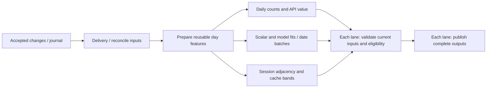
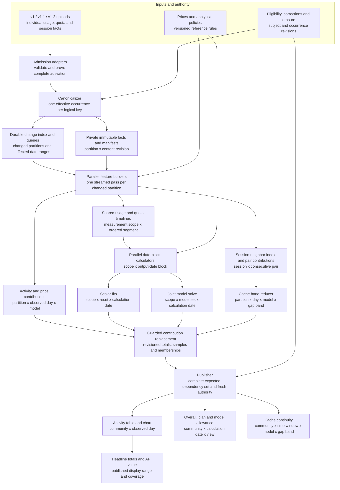

# A shared incremental analytics architecture

## Owner direction — October1

The owner has instructed P0 to complete the remaining P1–P11 work end to end
and to defer the10× performance target for now. Complete functional integration,
correctness, bounded execution, erasure/recovery and honest measurement remain
required. A tenfold saving is no longer a local-completion or migration gate.
Historical performance experiments below retain their original claim boundaries.

## Implementation status and completion rule — October 1

**The complete architecture is not yet qualified.** The maintained candidate now
contains local implementations for canonical facts, selective mutation/reverse
metadata, shared quantities and prices, rolling inputs, reversible cache pairs,
partition work, publication closure, physical erasure/restore and the descriptive
admin flow. Actual Worker role composition and durable graph-date admissions are
integrated locally. Focused native-oracle tests qualify named boundaries; they do
not establish complete all-output parity or a tenfold whole-workload saving.

The [integration work ledger](./2026-09-30-maintained-analytics-framework.md)
records P0–P11 ownership, schemas, focused evidence and remaining gates. The
candidate is branch `codex/maintained-analytics-framework`, baseline `f056940f`
plus uncommitted changes in its dedicated worktree. This plan's original checkout
and its unrelated changes remain preserved. The candidate is not frozen or
reviewed as a combined release, and it has not been deployed by this work.

**The implementation register below defines the full scope.** Existing L0–L9 and
rollout checklists describe dated increments; their checked boxes do not complete
the full design. The small integrated comparison is a diagnostic. H04's equal
completed-output and incremental-work requirements remain open; the tenfold
performance target is deferred by the owner;
H05–H07 remain separate gates. Recorded deployments are dated evidence, and
production was not inspected for this checkpoint. The
[production runbook](../runbooks/production-operations.md) remains the operational
authority.

### How to read the register

- **Complete foundation:** the named existing building block has source and
  recorded qualification evidence. This does not qualify its integration with
  newly added metadata, queues or schemas.
- **Partial:** a useful part exists, but the full requirement is unmet.
- **Local implementation:** working source exists; integration and qualification
  for the whole requirement remain open. Local tests are not deployment evidence.
- **In progress:** implementation is being assembled; no completion claim.
- **Not implemented:** no implementation of the stated target was established.
- **Pending gate:** the new combined candidate has not passed that gate.
- **Conditional:** an explicit experiment or architecture decision determines
  adoption. Its obligations become required if adopted; a condition cannot be
  used to reclassify an unfinished core requirement.

Only **Complete foundation** IDs appear in the checked aggregate foundation item.
Every other core row stays open until its stated acceptance boundary is met.
Full local readiness requires all core implementation rows plus local
qualification; online qualification, deployment and production observation have
their own completion boundaries. An adopted conditional item needs its own
implementation and qualification.

When a row advances, record the integrated source revision, exact schema/method
contract, focused/owning test or receipt, and its separate online/deployment/live
result. A green test for another revision or a deployment of a related component
cannot advance that row. Do not replace a missing core requirement with a narrower
completed experiment without an explicit scope decision.

Evidence entrypoints:

- [Initial durable shared-feature qualification](../receipts/2026-09-28-durable-shared-analytics-local.md)
  and [initial online rollout](../receipts/2026-09-29-shared-analytics-online-rollout.md).
- [Durable model-block experiment](../receipts/2026-09-28-durable-model-blocks.md)
  and [native publication/adoption](../receipts/2026-09-28-model-block-publication.md).
- [Shared feature store](../../apps/worker/src/storage-analytics-shared-features.ts),
  [native dependency reconstruction](../../apps/worker/src/storage-effective-history.ts)
  and [cache calculation](../../apps/worker/src/cache-retention-day.ts).

These links support the named foundations and explain the remaining paths. The
uncommitted increment does not yet have a combined qualification/release receipt.

## Implementation register

### A — Admission, reconciliation and canonical inputs

| ID | Required implementation and granularity | Local state and evidence | Recorded online / production status | Remaining acceptance |
|---|---|---|---|---|
| A01 | Closed v1/v1.1/v1.2 admission, authorization and complete-source activation; accepted change set | **Complete foundation.** Existing admission adapters and effective reader; recorded all-format activation and erasure qualification below. | Recorded all-format activation and isolated parity/erasure; new composition pending. | Preserve these contracts in the new composition; never invent fields absent from older formats. |
| A02 | Stable logical occurrence identity, retained variant reconciliation and correction effects; occurrence × effective revision | **Local implementation.** Migration 0036 persists scoped logical identities, retained provenance and replay-safe old/new effects. Native mixed-format/correction tests passed; combined acceptance pending. | Native reconciliation recorded; maintained provenance/effects pending. | Persist reusable reconciliation/provenance; emit replay-safe insert, replace, withdraw or no-op effects once, including old/new locations and externally linked variants. |
| A03 | Closed private canonical facts and revisioned partition manifests; stream × logical partition × content revision | **Local implementation.** Closed canonical facts, bounded ordered input pages, revisioned partition manifests and source/target guards are in 0036/0044; physical inventory is registered. | No target materialization deployed or qualified online. | Define the allowlisted fact/manifest contract, ordering, presence/conflict fields, content hashes, provenance and erasure coverage; materialize and replay it without copying arbitrary source JSON or raw session IDs. Storage choice is separate, X01. |
| A04 | Computation units independent of upload protocol and owner/device hierarchy; bounded logical partitions/date ranges | **Partial; feature/activity composition and fair claims checked locally.** Original-leaf groups retain individual receipts; same-caller-stage previews, guarded ordinary-prefix claims and singleton retries have focused parity/race evidence. Eight one-fact/one-scope activity leaves fit the950 cap; mixed groups regress and stay excluded. Shared cache staging/drain has exact history-fixture parity; an accepted eight-leaf computation completes in610 queries with exact native cache-day/series outputs and focused source/lease/erasure/retry controls. Sparse eight-leaf runtime completes all original leaves in685 statements; genuine mixed/dense singleton fallback and both interrupted-write cases passed focused native recovery/public parity checks. Wider bounds and skewed whole-workload qualification remain open. | Existing owner-scoped paths recorded; target partition scheduling pending. | Split large partitions and group small ones by bounded work; retain identity only for deduplication, quota/session continuity, membership and authority/erasure. Prove no cross-subject deduplication or pooling of unknown quota scopes. |
| A05 | Exact contributor/device membership and identity-role metadata; membership key × contribution | **Local implementation.** Migration 0041 maintains exact credential membership, contributions and native cohorts; focused count/weight/publication parity passed. | Existing counts/weighting retained; maintained membership redesign pending. | Maintain membership/reference counts and erasure provenance separately from job identity; preserve the current credential-based metric and sample weighting without repeated source enumeration. |

### B — Shared feature preparation and early aggregation

| ID | Required implementation and granularity | Local state and evidence | Recorded online / production status | Remaining acceptance |
|---|---|---|---|---|
| B01 | One normalized analytical input per changed occurrence and shared compatible pricing/classification | **Local implementation.** Shared canonical page preparation reuses quantities and compatible prices. Dense B02/native-bundle parity passed; all-consumer cold/warm measurement is open. | Local increment only; combined online/production qualification pending. | Qualify the combined path across all consumers and measure decode/price calls including cold preparation. Daily and fit pricing methods remain separate where their contracts differ. Codec validation copies are not a second analytical reduction. |
| B02 | Durable shared day features; source scope × UTC day × content/method dependency | **Complete foundation.** Migration 0032 and `storage-analytics-shared-features.ts` provide bounded parts, resumable building, validated immutable values and atomic head promotion; L2–L5 receipts cover consumers. | Initial store 0032 enabled in recorded rollout; new dependency composition pending. | Preserve the store's refusal, capacity, lease and authority behavior when replacing its expensive dependency proofs, C01–C07. |
| B03 | Independent fair preparation of recent, changed and all retained historical days; bounded day/range jobs | **Local implementation.** Migrations 0034/0038 and Worker roles compose fair changed/recovery/history preparation; focused scheduling passed. Whole retained-history convergence is being measured. | Local lane only; migration/activation and online qualification pending. | Integrate and qualify resume/recent/dirty/history fairness, large and legacy sources, delivery lag, interruption and resource reserves. Historical traversal must not stop permanently at the recent 101-day window. |
| B04 | Price-independent quantities plus versioned priced usage/coverage; occurrence or exactly equivalent price cell | **Local implementation.** Migration 0037 separates immutable quantity, daily-price and fit-price contributions; selective repricing and sparse coverage passed focused tests. | Existing priced path recorded; selective repricing target pending. | Reprice only affected cost products when possible; preserve integer rounding, context thresholds, unknown coverage and method differences. A price change must not rebuild unrelated token or cache evidence. |
| B05 | Exact early activity/API contributions and non-additive side state; partition × day × provider/model | **Local implementation.** Partition activity/API replacement and exact maximum/membership state feed existing publication; focused native daily parity passed. | Native daily/API path recorded; maintained partition contributions pending. | Maintain partition contributions, maximum-time candidates and exact membership state without rereading unaffected sources; prove null/unknown and overlap handling. Do not average daily medians or percentages. |

### C — Maintained dependencies, freshness and precise invalidation

| ID | Required implementation and granularity | Local state and evidence | Recorded online / production status | Remaining acceptance |
|---|---|---|---|---|
| C01 | Source-owned mutation metadata updated atomically with every relevant accepted change | **Local implementation.** Source 0014/0015 atomically maintain mutation and selective change metadata. Seventeen native D1 tests passed; measured 200-record admission added 11 bookkeeping writes. | New mutation schema/reader not qualified online or deployed. | Prove complete mutation coverage, monotonicity, namespace/runtime sealing and partial-schema refusal. Include correction facts at unchanged owner revision, proof completion, retained-domain changes and permitted deletion. Measure admission write overhead. |
| C02 | Durable exact day and range dependency summaries; source scope × bounds × stream set × dependency method | **Local implementation.** Analytics 0035 reuses native exact day/range identities with bounded payloads and fenced promotion; seven focused native tests passed. | New summary schema/adapter not qualified online or deployed. | Preserve native v3 identity bytes, distinguish session-inclusive scopes, fence before/after reads and writes, and bound storage/cleanup. A range identity cannot be replaced by concatenated singleton-day hashes. |
| C03 | Selective invalidation of affected days, partitions and intersecting result ranges | **Local implementation.** Selective covered scope tokens and changed-range work preserve unaffected dependencies; source-backed no-op/outside-append tests passed. Whole-consumer proof is open. | No qualified selective-invalidation rollout. | Maintain the narrow change state needed to reuse unaffected work after unrelated uploads. Broad participant invalidation does not complete this row; no-op and unrelated-append tests must prove the absence of repeated raw-history scans. |
| C04 | Maintained reverse links from source variants/corrections to partitions, session boundaries and output windows | **Local implementation.** Source 0015 maintains variant/day reverse incidence and bounded drain coverage; unseeded or pending scopes refuse negative reuse. | No qualified maintained reverse-link rollout. | Discover both existing and newly introduced cross-day variants, replace old/new effects, bound fanout and use an explicit safe fallback until coverage is complete. No unseeded catalog may assert that no dependency exists. |
| C05 | Empty-range, correction-runtime, selection-policy and clock/authorization dependencies | **Local implementation.** Empty/terminal outcomes (0046), source/runtime/selection stamps and output clock jobs (0045) are composed; combined mutation/clock acceptance remains open. | Native checks recorded; new metadata/clock-boundary composition pending. | Invalidate on arrivals into empty days, runtime activation, policy changes and relevant authorization-time boundaries without requiring a payload change or owner revision. Preserve opt-out versus historical withdrawal semantics. |
| C06 | All consumers use maintained validation rather than repeated source-history reconstruction | **Partial; local composition.** Maintained adapters are wired into daily/API, graph, block, cache and publication paths. Legacy-selected complete-output parity and warmed whole-workload scan proof remain open. | New all-consumer summary integration/rollout pending. | Integrate daily/API, scalar/model scope capture, date-block preparation/adoption, cache lookback and publication. Count initial scope capture and final checks. Warm reuse may read bounded metadata, not rescan unchanged raw history. |
| C07 | Safe capability fallback, metadata retirement and erasure; bounded schema/owner/scope units | **Local implementation.** Capability inventories, native fallback/refusal and bounded retirement are composed. Focused capability loss and physical erasure/restore tests passed; final combined gates pending. | New metadata fallback/cleanup/erasure qualification pending. | Prove missing/partial migrations retain exact native proofs or explicit refusal; source changes cannot bypass guards. Add metadata to physical erasure/recovery proofs and validate every target binding through nested statement meters. |

### D — Quota/usage features, scalar fits and model-date calculations

| ID | Required implementation and granularity | Local state and evidence | Recorded online / production status | Remaining acceptance |
|---|---|---|---|---|
| D01 | Durable ordered quota and priced usage features; measurement scope × ordered segment | **Complete foundation.** Shared quota/model/scalar features and their current consumers are implemented and covered by L4 parity evidence. | Shared consumers enabled in recorded rollout; new input/metadata composition pending. | Preserve event timing, attribution hazards, unknown scope, reset/plan evidence and native pricing methods in the new input representation. |
| D02 | Resumable adjacent model-date batches that reuse overlapping history; scope × bounded output-date block | **Complete foundation.** Migrations 0030/0031, bounded model-block jobs and clipped date planning are implemented; local/online adoption evidence is linked below. | Jobs and isolated adoption recorded; production observations are dated. | Keep the existing memory/checkpoint/fallback limits and native dependency identities; C06 must remove repeated validation cost around the batch. |
| D03 | Exact rolling-window feature reuse and narrow corrections; measurement scope × window boundary | **Local implementation.** Migration 0039 persists exact rolling segments/windows and native readers, including open-ended scalar evidence. Focused parity/resume/correction passed; whole-date scaling is unproved. | Existing batch reuse recorded; new maintained rolling-window state pending. | Maintain exact affected interval/window state across corrections and resumed work. Prove expiration, reset-cluster splits, session boundaries and cutoff eligibility. Compact feature folds are allowed; raw-history reconstruction is not the warm path. |
| D04 | Existing whole-cohort eligibility and date-specific statistical finishers | **Complete foundation.** Native scalar/model kernels remain the reference and parity tests cover the implemented shared path. | Native methods retained by recorded releases; new composition pending. | Preserve whole-window refusals, joint model solving, medians/percentiles and chronology. Do not infer constant-time fits, independent per-model solves or a new historical scalar output. Further solver reuse is X05. |
| D05 | Adoption into native graph storage and the existing publisher; result date × method/dependency | **Complete foundation.** The native adoption adapter preserves result/publication identities, CAS and refusal results. | Native publication parity and deployment recorded; new proof integration pending. | Requalify adoption with maintained dependencies and new partition work; stored job completion alone is not a published result. |

### E — Cache continuity and reversible pair updates

| ID | Required implementation and granularity | Local state and evidence | Recorded online / production status | Remaining acceptance |
|---|---|---|---|---|
| E01 | Shared cache event preparation and exact existing seven-day carry | **Complete foundation.** Shared digest-only cache items feed the native reducer; L5 and N1 have parity/replay/correction/erasure evidence. | Isolated nonempty parity and shared-cache activation recorded; new pair path pending. | Preserve the current carry reach, ordering ambiguity, exclusions and explicit empty-input behavior through the new path. |
| E02 | Persistent ordered session-neighbor index and boundary state; session × event order | **Local implementation.** Migration 0040 maintains ordered private session neighbors and boundary proofs; focused move/tie/carry tests passed. | No maintained neighbor-index rollout. | Add bounded predecessor/successor discovery, configuration/unreadable breaks, ties and cross-midnight/session-move handling without rereading seven whole source days. |
| E03 | Reversible pair contributions and exact multiplicities; consecutive pair × later-endpoint day × model/effort/band | **Local implementation.** Reversible pair contributions, provenance and membership multiplicities support bounded old/new neighborhood repair; focused insertion/deletion/replay tests passed. | No maintained reversible-pair rollout. | Replace P→N with P→X and X→N on insertion; reverse on deletion and repair both neighborhoods on moves. Preserve session-count/concentration membership semantics and replay safety. |
| E04 | Prepared community cache counters and bounded public calendar windows; day × model × gap band | **Local implementation.** Maintained day/week/month counters and 0041 cache snapshots preserve tagged empty/refusal outcomes and UTC refresh; whole-output population parity pending. | Existing cache windows recorded; new pooled contribution path pending. | Pool replacement pair contributions once; maintain exact contributor/session multiplicities. Compose small daily counters or explicitly trigger UTC rollover. Preserve current session-count meaning, model selection and omitted/null series. |

### F — Contribution replacement, publication and consumer outputs

| ID | Required implementation and granularity | Local state and evidence | Recorded online / production status | Remaining acceptance |
|---|---|---|---|---|
| F01 | Idempotent replacement of affected output contributions; partition/scope × output date × revision | **Local implementation.** Guarded partition/day contributions and recoverable successors use immutable input/policy identities; focused lost-response and duplicate tests passed. | Existing guarded writers recorded; new partition effects pending. | Generalize to the new partition effects and exact side state. Apply `oldTotal - oldContribution + replacement` atomically; retries or partial writes must not double count. |
| F02 | Maintained expected membership/dependency completion at an accepted watermark | **Local implementation.** Migration 0041 persists expected partition closure and bounded native cohorts at accepted watermarks, including empty/unchanged outcomes. | Native publisher recorded; maintained expected-partition closure pending. | Replace repeated broad enumeration with maintained expected-partition completion, including empty partitions and explicit unchanged reuse. Preserve sample weighting and non-additive final estimators. |
| F03 | Separate content/method reuse from permission to publish or serve | **Local implementation.** Content reuse has separate source authority, target epoch/erasure, clock and final live lease/CAS fences. Whole cross-store race qualification remains open. | Existing authority/continuity gates recorded; new contribution composition pending. | Reuse unaffected arithmetic across unrelated source/authority bookkeeping while immediately enforcing withdrawal/erasure. Prove cross-store publication races are fenced; a before/after read is not an atomic cross-store commit. |
| F04 | Complete prepared outputs with last-good continuity and atomic replacement | **Complete foundation.** Existing daily/API, scalar/model and cache publications preserve accepted output contracts. | Existing outputs/continuity recorded; full target cutover pending. | Retain daily tables/charts, headline totals/API value, overall/plan/model allowance views and cache continuity. Expose each family's evidence date; a new count must not imply a newly calculated graph. Qualify new heads through H04–H07. |

### G — Durable work, budgets, parallelism and recovery

| ID | Required implementation and granularity | Local state and evidence | Recorded online / production status | Remaining acceptance |
|---|---|---|---|---|
| G01 | Durable idempotent work keys, leases/fencing and interrupted-transition recovery; logical job × input/policy revision | **Local implementation.** Migration 0038 persists immutable jobs, claims, fencing and successor lineage; actual D1 replay/lease tests passed. | Existing durable jobs recorded; full partition/pair scheduler pending. | Extend and qualify it for canonical partition changes, maintained metadata, pair repair and downstream effects. Duplicate delivery and lost write responses must converge. |
| G02 | Durable dirty-work/outbox index with repair of lost notifications and bounded recovery sweeps | **Local implementation.** Canonical effects, dirty partitions and 0045 sealed-input/graph-result outboxes feed bounded role work; focused lost-notification/replay tests passed. | Source delivery outbox recorded; new partition-work index pending. | Maintain discoverable changed partitions/ranges and downstream work atomically; recover missing notifications. Recovery sweeps must not become recurring full-history reconstruction. |
| G03 | Fair short-update and historical lanes, adaptive bounded units and capacity reserves | **Partial; local implementation.** Fair lane/subject claims, split partitions and 0043 pending capacity/reserves are composed. Skewed final workload and retirement qualification are open. | Existing schedules recorded; new partition fairness/capacity qualification pending. | Prove skewed-source fairness, separation of new work/backfill and prompt withdrawals/erasure. Split oversized partitions or group small ones without fixed uploader/version job boundaries. |
| G04 | Controlled parallel execution of independent partitions/date blocks | **Partial; measured component decision.** Actual 1/2/4/8 canonical/features component preserves semantic and lease parity. Degrees4/8 add work; retain degree1 pending grouped/skewed whole qualification. | No qualified parallel partition-pool rollout. | Benchmark concurrency 1/2/4/8, serialize competing output heads and keep authority fresh. Adopt only beneficial bounded concurrency, or record evidence supporting a single executor; replica/shard/container choices are X01–X04. |
| G05 | Actual statement metering, cooperative deadlines and bounded CPU/memory/checkpoint behavior | **Complete foundation.** Existing invocation/phase meters and deadline/refusal gates bound scheduled work. | Existing metered roles recorded; new attached bindings/adapters pending. | Meter every new binding and nested adapter, including metadata reads/writes, save/release work and failed statements. Batching or worker chaining must not evade a limit; requalify the changed composition, H05. |
| G06 | Bounded retirement, compaction/capacity and orphan cleanup for every new artifact | **Partial; local implementation.** Bounded canonical, rolling, cache, publication/cohort, queue, feature/model retirement is composed and lease-protected; 0047 paces empty cleanup sweeps. Complete lifecycle qualification remains open. | Existing retirement recorded; complete new-artifact cleanup pending. | Include facts, manifests, summaries, reverse links, queues, pair contributions and any adopted objects; protect active leases and physical erasure. A capacity refusal keeps the native/reference result or explicit unknown. |

### H — Privacy, admin visibility, qualification and migration

| ID | Required implementation and granularity | Local state and evidence | Recorded online / production status | Remaining acceptance |
|---|---|---|---|---|
| H01 | Complete physical erasure and deletion-safe restore across all new stores/indexes | **Local implementation.** Analytics 0042/source 0016 cover terminal UPDATE replay; 0046 outcomes and 0045 graph roots are in the physical inventory. Populated interrupted erasure and resumable frozen restore passed focused checks. | Prior isolated physical erasure/restore passed; new artifact coverage pending. | Fence immediately, enumerate all newly retained provenance/metadata, physically remove owned artifacts and prove tombstone/ledger replay and surviving contributions. No completion from public withdrawal alone. |
| H02 | Descriptive admin flow, real units/coverage, controls, waiting reasons and public freshness | **Local implementation.** Seven-stage view uses compact real populations, closed reasons, explicit unchecked freshness and last-observed role controls. Focused web/D1 checks and desktop/narrow rendering passed; live rendering is unqualified. | Local view only; new deployed availability/live rendering not established. | Finish the acceptance checklist below. Retained complete heads are not proof of current dependencies. Unmeasured preparation/cache queues stay unavailable; qualify runtime controls/reasons, rendered states and deployed/live visibility separately. |
| H03 | Whole-workload instrumentation and a fixed comparison basis | **Partial.** Pinned native and integrated candidate instrumentation includes delivery, proofs, queues, cleanup and publication with actual 950 metering and input hashes. Complete equal-output receipt and CPU/memory/bytes/cost evidence pending. | No comparable full-target production saving established. | Capture scope validation, preparation, checkpoint/retry/cleanup, adoption, publication, bytes/writes, CPU/peak memory and total cost. Compare equal completed outputs; do not combine incompatible samples or exclude expensive proofs. |
| H04 | All-format, all-output correctness and incremental-work qualification, E1/E2 | **Partial; sixteenth optimized small pair completed.** Complete cold/warm/unchanged public outputs match exactly and all six observer/histogram records reconcile. Four genuine native writer/delivery cases passed separately, including typed append and metadata change. A later cold pair also matched all eight public families and populations, then refused base capture on a private preview CAS counter difference (48/1) before any mutation. A separate unchanged-SQL native counter lineage observer passed six focused actual-D1 cases; its whole-run seam, persistent all-output repair, full corpus/mutations and C06/resource proof remain open. The owner deferred the tenfold target; the exact comparison is in the [local receipt](../receipts/2026-10-01-maintained-analytics-comparison16.md). | Initial-increment isolated parity passed; full new-target qualification pending. | Qualify the full new composition through cold/warm/no-op, unrelated append, corrections, clock changes, repricing, interruption, refusal and erasure. Prove no unchanged raw-history scan on the warmed no-op path and report whole-workload measurements. The tenfold performance target is deferred by the owner. |
| H05 | One frozen combined candidate, independent review and owning local gates | **Pending gate.** Prior green releases do not qualify newly added modules/migrations. | Combined local gate pending; no newly qualified release from this work. | Integrate the exact candidate, run focused checks while iterating, then the complete owning Worker gate once on frozen source; run architecture/docs and relevant UI/render gates. Preserve failed results and distinguish environment gaps. |
| H06 | Populated migration/rollback rehearsal and isolated online qualification of the exact new candidate | **Pending gate.** Previous operators/rehearsals provide reusable procedures. | Exact new-candidate online migration/parity gate pending. | Verify source/target ledgers, partial-migration refusal, ordered code/schema/activation, privacy and forward-safe rollback. Compare the same outputs online before an explicitly authorized production change. |
| H07 | Production cutover, measured output convergence and controlled legacy retirement | **Pending gate.** Initial increments have dated deployments; this complete target has none. | Complete-target production qualification not established. | Pin exact deployed versions/controls/schemas, observe nonempty work through publication, reconcile throughput/cost and rollback. Retire redundant paths/data only after parity, erasure and recovery are proven and the exact operation is authorized. |

### Conditional storage/runtime choices and later experiments

These are not excuses to omit A–H. Choose the physical implementation from the
same contracts and whole-workload measurements. A backend decision must record
what was adopted, deferred or rejected and why; unselected options do not block
completion of an equivalent, qualified implementation on current storage.

| ID | Option and present status | Condition and required acceptance if adopted |
|---|---|---|
| X01 | Private R2 or columnar fact/feature objects plus a compact catalog; **not implemented** | Adopt if measured acquisition/checkpoint cost warrants it. Qualify immutable digest/length checks, manifest/head atomicity or recoverable commit, private serving, orphan/compaction cleanup and exact packed-subject erasure. |
| X02 | Ordinary CPU/container workers; **not implemented** | Adopt if bounded Worker execution remains the measured constraint. Use the same kernels and durable references/revisions; qualify memory/CPU limits, cancellation, retries, authority and publication recovery. |
| X03 | Replica acquisition; **experimental code only, not adopted for production consumers** | Require demonstrated routing and equivalent fresh acquisition with primary authority/commit fences. Bookmarks are not cross-database snapshots; no saving follows merely from an enabled setting. |
| X04 | Physical source sharding or source-store rebuild; **synthetic experiments only** | Require measured useful scaling beyond aggregate count scans, stable placement, cross-format/session/quota locality, correction reconciliation, migration/restore and erasure. A failed populated index build is not a completed migration. |
| X05 | Completed-reset candidates, exact prefix/interval indexes or statistical solver optimization; **planned** | Profile after acquisition/metadata savings. Preserve cutoff cohort, pairwise/median behavior, joint solves and refusals; any eligibility/capacity/method change requires its own explicit decision and parity basis. |

### Checklists to local readiness, online qualification and production

The detailed acceptance cells above are the task list. These aggregate gates
remain open even where reusable building blocks are complete:

- [x] Existing closed admission, durable shared-feature/model job foundations,
  native reducers/adoption and published continuity identified: A01, B02, D01,
  D02, D04, D05, E01, F04 and G05. Existing evidence is revision-scoped.
- [ ] Finish reusable canonical inputs and identity/membership roles: A02–A05.
- [ ] Finish fused preparation, independent scheduling and affected contributions:
  B01, B03–B05.
- [ ] Finish maintained exact dependencies, narrow invalidation and all-consumer
  integration: C01–C07. Conservative broad stamps alone do not close this gate.
- [ ] Finish exact rolling-window reuse and reversible cache work: D03, E02–E04.
- [ ] Finish partition replacement, expected membership and authority integration:
  F01–F03.
- [ ] Finish discoverable durable work, fairness, concurrency decision and complete
  cleanup/erasure: G01–G04, G06 and H01.
- [ ] Finish admin coverage and whole-workload measurement: H02–H04.
- [ ] Select and record the physical backend/runtime/concurrency decisions;
  qualify each adopted X item.
- [ ] **Ready to begin online qualification:** close the preceding local gates
  and H05; prepare and rehearse the exact migration/rollback portion of H06.
- [ ] **Ready for production cutover:** pass the isolated online portion of H06
  and receive authorization for the exact candidate/environment/operation.
- [ ] **Production-qualified target:** close H07 with observed output completion,
  measured costs and recovery evidence. A deployed flag is insufficient.

### Required evidence for closing the incremental-work claims

Use one pinned reference and identical accepted evidence/output populations.
Cover daily counts/table/chart/totals and API value, current scalar/plan views,
historical model results and native publication, and cache continuity/windows.
Keep the current meaning of turns, contributor/device counts, coverage and cache
sessions. Include explicit unknowns and refusal results in comparisons.

Test mixed versions and overlapping occurrences, sparse older fields, a warmed
no-op, an unrelated later append, new evidence in an empty day, same-owner-revision
correction, cross-day variant introduction and timestamp/session movement,
quota/plan/price/method/runtime changes, expiry/UTC rollover, ambiguous ties,
partial schema/authority lag, lease loss, duplicate work, interrupted writes,
withdrawal, physical erasure and deletion-safe restore. Prove metadata coverage
before using a negative catalog lookup to skip native work.

Measure cold history, warm refresh, small updates and corrections, including
initial scope capture, final validation, all feature/metadata writes, retries,
cleanup, adoption and complete publication. Report raw resource units separately
and use one cost basis. Whole-workload 10× is still unproved; a 10×–100× selected
query/phase saving or additional parallelism does not close H04/H07.

## Agent implementation work packages

This partitions the **34 open core requirements** into 11 specialist packages
and one integration/qualification owner. The nine complete foundations remain
the reference and must be preserved. These are proposed work boundaries, not
new completion claims or a transfer of ownership of ongoing work.

Before starting a package, reconcile its exact checkout, existing changes and
current file owner. Reuse the in-progress metadata, preparation and admin work
rather than starting competing implementations. Every agent must know it is not
alone in the codebase, preserve other agents' changes and report interface changes
to the integration owner. One primary owner closes each requirement; contributors
may provide tests or adapters without silently taking over another package.

### Package overview and requirement ownership

| Package | Responsibility | Primary open requirements | Depends on |
|---|---|---|---|
| P0 | Contracts, runtime integration, concurrency and final qualification | A04, C06, G04, H05, H06, H07 | Establish interfaces first; integrate P1–P11 as they become ready |
| P1 | Canonical facts, occurrence reconciliation and provenance | A02, A03 | P0 interfaces; existing effective reader as oracle |
| P2 | Source change tracking, selective invalidation and reverse links | C01, C03, C04, C05 | P0 identity/change contract; P1 occurrence/provenance contract |
| P3 | Exact dependency summaries, capability guards and bounded retirement | C02, C07 | P2 mutation/coverage contract; native v3 dependency oracle |
| P4 | Shared normalization, pricing and activity contributions | B01, B04, B05 | P1 facts; P2 invalidation; P3 exact validation |
| P5 | Exact rolling quota/usage reuse and date-block calculations | D03 | P4 feature contract; P2/P3 invalidation and validation |
| P6 | Session-neighbor index, reversible cache pairs and window counters | E02, E03, E04 | P1 order/provenance; P4 cache feature contract; P2 invalidation |
| P7 | Membership, contribution replacement and publication closure | A05, F01, F02, F03 | P1 provenance; P4–P6 contribution contracts; P2/P3 validation |
| P8 | Durable changed-work index, preparation scheduling and cleanup | B03, G01, G02, G03, G06 | P0 job/resource contract; P1/P2 change effects; artifact contracts from P3–P7 |
| P9 | Physical erasure, restore and recovery coverage | H01 | Define erasure contract early; final proof needs artifacts from P1–P8 |
| P10 | Admin pipeline flow and authoritative progress reporting | H02 | P0 aggregate contract; real job/result metadata from P3–P8 |
| P11 | Whole-workload instrumentation, reference parity and performance proof | H03, H04 | Harness can start immediately; final comparisons need the integrated P1–P10 candidate |

Dependencies refer to stable interfaces or qualified artifacts, not necessarily
the completion of an entire upstream package. A consumer may develop against a
synthetic contract fixture, but cannot close its requirement on a stub.

### P0 — Contracts, integration and qualification

**Deliverable:** one coherent locally qualified candidate, followed by separately
qualified online migration and production cutover. Primary ownership is A04,
C06, G04 and H05–H07.

- Own shared composition files: `storage-analytics-runtime.ts`,
  `storage-analytics-worker.ts`, `storage-publication-worker.ts`,
  `cache-retention-day-worker.ts`, `analytics-delivery.ts`,
  `storage-community-authority.ts`, `storage-community-graph.ts`,
  `storage-effective-history.ts`, `d1-invocation-budget.ts` and
  `analytics-feature-controls.ts` under `apps/worker/src/`.
- Own integration configuration/package scripts, migration-number allocation,
  the implementation register and the final release/migration receipts.
  Preserve existing allocated migrations and verify the actual ledger before
  assigning additional numbers. Specialists write only their allocated SQL.
- Agree the versioned fact/change, mutation/coverage, feature/contribution,
  job/fencing, erasure and admin contracts. Implement admission-to-work and
  consumer wiring through existing public entrypoints; keep dependencies static.
- Define bounded partition splitting/grouping and a concurrency dispatcher;
  qualify concurrency with P8/P11. Preserve one final writer for a given output
  head and the actual invocation meter across every binding/adapter.
- **Acceptance:** all specialist outputs compose without duplicate policy or
  source scans on the warmed path. Freeze one revision, run the owning gates,
  rehearse migration/rollback, then pass isolated online parity. Production
  operation and observation close H07 only after exact authorization.

### P1 — Canonical inputs and provenance

**Deliverable:** reusable immutable canonical input revisions and partition
manifests, with replay-safe reconciliation effects. Primary ownership is A02/A03.

- Own new canonical fact/reconciliation/manifest modules and focused tests under
  the Worker app, plus the relevant selection implementation in
  `telemetry-usage-effective-reader.ts` and `typed-telemetry-compatibility.ts`.
  P0 owns admission/composition call-site wiring; P2 owns mutation hooks.
- Start from the existing reader's exact selection rules. Preserve scoped
  logical keys across timestamp moves and retain only closed, opaque analytical
  provenance. Define explicit missing/conflict evidence rather than defaults.
- Hand P2 the stable occurrence, source-variant, location and erasure references;
  hand P4–P6 ordered facts and presence fields. Supply insert/replace/withdraw/
  no-op effects and an immutable revision/digest contract.
- **Acceptance:** mixed-version overlap, cross-subject duplicate IDs, late
  corrections, moved events and identical replay match the native oracle.
  Bounded materialization is resumable and privacy-safe; source retention and
  physical erasure remain exact. No repeated normalization for an unchanged
  canonical revision.

### P2 — Maintained source changes and reverse dependencies

**Deliverable:** atomic source metadata that identifies affected partitions and
result ranges without rereading unchanged history. Primary ownership is
C01/C03/C04/C05.

- Own `storage-effective-dependency-mutations.ts`,
  `storage-effective-dependency-days.ts`, new selective-change/reverse-link
  modules, their tests and centrally allocated ingestion-isolation SQL.
  Necessary admission-writer changes require a named file handoff through P0.
- Reuse the in-progress conservative mutation token as a safe intermediate.
  Add narrow day/range state and complete occurrence/provenance coverage,
  including variants introduced after a summary was built. Until coverage is
  sealed, expose the need for a native proof; absence is not negative evidence.
- Cover same-owner-revision corrections, proof completion, all retained domains,
  empty manifests, runtime/policy changes, allowed deletion, authorization-time
  boundaries and erasure. Bound any initial catalog build and change fanout.
- Hand P3 sealed tokens/coverage and P8 idempotent affected-work effects; hand
  P6 old/new order neighborhoods and P7 affected memberships/output ranges.
- **Acceptance:** unrelated uploads preserve unaffected dependencies; no-op
  validation does not scan raw history. Every genuinely relevant change
  invalidates, including cross-day links and clock-only transitions. Prove
  atomicity, monotonicity, partial-schema refusal and admission write overhead.
  Broad participant/global epochs alone do not complete this package.

### P3 — Exact dependency summary store

**Deliverable:** reusable bounded day/range proofs compatible with native v3
identities. Primary ownership is C02/C07.

- Own `storage-effective-dependency-summaries.ts`, its tests and centrally
  allocated analytics-summary SQL. P0 owns integration into the native history
  facade and nested D1 meter; P2 owns source tokens.
- Reuse the working exact-summary adapter. Separate range and singleton proofs,
  stream sets and method versions; preserve byte-identical native dependencies.
  Never substitute concatenated day digests for a native range identity.
- Implement source/target/current-authority fences, capability inventory,
  missing/partial-schema fallback, bounded payload/record counts and retirement.
  Give P9 an explicit artifact/erasure inventory.
- **Acceptance:** cold native proofs and stored proofs have exact parity; warm
  reuse performs bounded metadata reads. Dirty/stale/expired tokens cannot
  return stale work. Unknown response, capacity refusal, missing triggers and
  erasure remain recoverable and within all enclosing budgets.

### P4 — Shared features, pricing and activity

**Deliverable:** one prepared analytical pass over each changed canonical
partition, with reusable exact activity and priced contributions. Primary
ownership is B01/B04/B05.

- Own `analytics-shared-input.ts`, `analytics-shared-reducers.ts`,
  `analytics-shared-features.ts`, `storage-analytics-shared-features.ts`,
  `v11-daily-projection-values.ts`, new activity/price contribution modules and
  their focused tests. P5 owns quota/usage mapper internals; P6 owns cache mapper
  internals. Coordinate their public input contracts instead of editing them.
- Reuse the implemented page normalization and compatible pricing work. Retain
  distinct daily/fit pricing methods where required and separate price-independent
  quantities from cost products. Persist bounded feature heads/parts using the
  existing B02 store rather than creating another competing feature cache.
- Hand P5 ordered quota/usage features, P6 cache/order features and P7 exact
  activity/API cells, maximum-time candidates and membership references.
- **Acceptance:** every family matches the existing reference, including unknown
  price/field coverage and rounding. Replays reuse; corrections replace only
  affected contributions; selective repricing preserves unrelated counts/cache
  state. Count cold and warm decode/price calls and all preparation I/O.

### P5 — Rolling fit inputs and model dates

**Deliverable:** exact reuse of quota/usage window state across dates, corrections
and resumed jobs. Primary ownership is D03; preserve D01/D02/D04/D05.

- Own `effective-quota-day.ts`, `effective-usage-day.ts`,
  `storage-effective-quota-days.ts`, `storage-effective-usage-days.ts`,
  `quota-analysis-v1.ts`, `quota-analysis-v11.ts`, `analytics-model-block.ts`,
  `analytics-model-block-contract.ts`, `storage-analytics-model-block.ts`,
  `storage-community-graph-model-block.ts` and their focused tests.
- Extend current durable features/date-block jobs instead of replacing their
  native finishers. Maintain bounded ordered/interval state and exact changed
  window membership; keep whole-cohort refusals and reset/plan hazards.
- Hand P7 validated date-result contributions with native method/dependency
  identities. P0 owns graph facade/runtime wiring; P7 owns publication closure.
- **Acceptance:** adjacent dates, resumed isolates, expired bridging reset
  instants, open-ended legacy scalar evidence, changed plan/price and cross-day
  corrections match native results/refusals without repeated raw acquisition.
  No new historical scalar output or statistical method is implied. X05 is a
  separate optional follow-up if final solving remains expensive.

### P6 — Incremental cache pairs

**Deliverable:** maintained session neighbors, reversible pair contributions and
prepared cache-window counters. Primary ownership is E02/E03/E04; preserve E01.

- Own `cache-retention-events.ts`, `cache-retention-values.ts`,
  `cache-retention-day.ts`, new neighbor/pair/counter store modules and focused
  tests. P0 owns the Worker entrypoint; P7 owns shared publication closure.
- Persist ordered session boundary state and pair provenance. Repair both old
  and new neighborhoods on a move; maintain exact membership multiplicities
  when a pair is added, replaced or removed. Use P1/P4 facts and P2 changes.
- Publish bounded contribution/counter contracts to P7; expose genuine progress
  and reasons to P10. Compose small daily windows or explicitly handle UTC rollover.
- **Acceptance:** insertion/deletion inverses, midnight/session moves, unreadable
  breaks, configuration changes, unknown order/ties, seven-day reach, concentration
  and current session-count semantics match the native reducer. Warm updates
  repair affected neighborhoods rather than rereading seven whole source days.

### P7 — Membership and publication closure

**Deliverable:** exact contribution replacement and maintained expected-cohort
completion, with authority-safe public heads. Primary ownership is
A05/F01/F02/F03; preserve F04.

- Own `storage-community-daily.ts`, `storage-community-daily-devices.ts`,
  `storage-community-daily-pending.ts`, `storage-community-graph-publication.ts`,
  `storage-community-publication-value.ts`, new membership/closure modules and
  their focused tests. P0 owns shared authority and HTTP/runtime composition.
- Maintain exact contributor/device sets, weights, maximum candidates and fit
  sample states. Use explicit old/new contribution revisions and transactional
  or recoverably journaled downstream effects; do not subtract or average medians.
- Track expected changed partitions at a source watermark, including empty and
  explicitly unchanged ones. Do not rescan the whole cohort to rediscover that
  already-complete state on every phase or public read.
- **Acceptance:** duplicate/lost-write recovery never overcounts; complete
  public payloads match all reference outputs and refusals. New counters do not
  misrepresent graph freshness. Unrelated bookkeeping reuses arithmetic, while
  withdrawal/erasure races immediately fence visibility and last-good continuity
  remains consistent with the accepted policy.

### P8 — Durable work scheduling and lifecycle

**Deliverable:** discoverable bounded changed-work jobs and fair recovery without
recurring broad history sweeps. Primary ownership is B03/G01/G02/G03/G06.

- Own `storage-analytics-preparation.ts`, `storage-community-graph-work.ts`,
  `storage-graph-retirement.ts`, new work-index/outbox/reconciliation/cleanup
  modules, their tests and centrally allocated scheduling SQL. P0 owns scheduler
  entrypoints, shared resource controls and the concurrency dispatcher.
- Reuse the existing local resume/recent/dirty/history preparation lane. Connect
  idempotent P1/P2 change effects to durable queues/work indexes and guarded
  downstream completion. Lost notification, expired lease and partial save must
  remain discoverable; source authority is not a scheduling hint.
- Reserve capacity for new evidence and withdrawals while progressing all
  retained historical ranges. Split/group bounded jobs and reconcile orphan
  artifacts through each store's public lifecycle API.
- **Acceptance:** skewed owners/partitions cannot starve, history is not limited
  permanently to the recent horizon, duplicate work converges and interrupted
  jobs resume. Cleanup is bounded and protects live leases. Metadata and memory
  costs remain inside the same actual invocation/phase budgets.

### P9 — Erasure, restore and recovery

**Deliverable:** exact physical artifact removal and deletion-safe replay for the
whole adopted system. Primary ownership is H01.

- Own `storage-erasure.ts`, the relevant `authority-restore*.ts` modules,
  erasure/restore tests and the consolidated artifact inventory. Artifact owners
  implement their allocated schema/lifecycle hooks against this contract.
- Review provenance/FK/terminal-fence design before stores are finalized. Track
  facts, manifests, mutation/reverse-link metadata, summaries, work indexes,
  pair/membership contributions, public heads and any adopted packed objects.
- **Acceptance:** withdrawn work cannot republish; physical removal is ledger-
  proven and interruption-safe; surviving contributions remain exact. Restore
  replays tombstones/deletion receipts before serving and a repeated replay is
  a no-op. Test every newly retained artifact, not only the existing B02 store.

### P10 — Admin flow and progress

**Deliverable:** a descriptive rendered pipeline view backed by closed aggregate
contracts. Primary ownership is H02.

- Own canonical admin assets/tests under `apps/web`, plus
  `storage-community-progress.ts`, `storage-admin-overview.ts` and focused admin/
  pipeline contract tests. Regenerate `admin-ui.generated.ts` through its generator;
  do not hand-edit it.
- Reuse the local seven-stage view. Consume actual contracts from P3–P8 for job
  units, coverage, current/deferred/refused state, controls, methods and public
  freshness; P0 approves shared operational fields.
- **Acceptance:** incomplete/missing telemetry is explicit, retained complete
  heads are distinguished from currently valid/published results, and admin
  reads do not reconstruct source history. Closed negative tests and real
  desktop/narrow rendering pass; deployed availability/live progress stay separate.

### P11 — Whole-workload correctness and performance

**Deliverable:** a reproducible comparison of identical complete outputs and
resource use, including invalidation and publication. Primary ownership is
H03/H04; support P0's G04 and H05–H07 gates.

- Own new all-output benchmark/instrumentation scripts and tests, existing
  benchmark tool extensions, and shared synthetic corpus/profile helpers under
  `apps/worker/test/`. Do not change production kernels to obtain parity.
  Other agents own their focused product tests; coordinate edits to shared fixtures.
- Start a baseline/oracle harness against existing paths while implementation
  proceeds. Include scope capture, source/target metadata, preparation, all
  writes/checkpoints, cleanup/retries, adoption and complete publication.
- **Acceptance:** close E1/E2 on mixed/sparse/skewed data and every mutation case
  listed above, including warmed no-op and unrelated append. Count raw scans,
  decoding/pricing, bytes, database work, CPU/memory and fixed-basis cost. Compare
  concurrency 1/2/4/8 with P0/P8 if adopted. A selected query gain, unequal output
  set or interrupted cost sample cannot establish a whole-workload saving. The tenfold target is deferred; complete functional qualification remains required.

### Contracts and ownership that must be settled before parallel edits

1. **P1 ↔ P2:** scoped immutable occurrence/provenance keys, old/new locations,
   coverage/backfill proof, selection method and authority/erasure references.
2. **P2 ↔ P3/P8:** sealed mutation stamps, narrow affected ranges, clock-boundary
   validity, safe fallback and replay-safe changed-work delivery.
3. **P4 ↔ P5/P6/P7:** closed feature/contribution schemas, ordering, price/method
   versions, null/unknown/refusal representation and non-additive membership state.
4. **P7 ↔ P8:** accepted watermark, expected-partition closure, transactional
   replacement and durable downstream work effect. Neither side independently
   invents a second completion/queue policy.
5. **P0/P9 ↔ every store:** actual budget/fencing adapters, migration allocation,
   terminal erasure, artifact inventories and bounded retirement interfaces.
6. **P0/P10/P11 ↔ producers:** safe aggregate counters, exact measurement units,
   instrumentation seams and reference workload/output populations.

P0 is the sole editor of the shared composition files listed in P0. Specialists
request small integration changes through their public interfaces or an explicit
sequential file handoff. Migration directories are shared, but SQL file numbers
and ownership are allocated centrally. Do not run complete owning suites against
a candidate still being edited by multiple packages.

### Suggested execution waves

Keep **one integrator and at most three active specialists** at a time. A package
is a responsibility, not a requirement to create a permanent chat or keep the same
agent occupied through every later gate. Reuse available agents for later packages.

| Wave | Main packages | Required result before dependent integration |
|---|---|---|
| 0 | P0 contracts; P1/P2 interface design; P11 baseline harness | Pin existing work, agree shared keys/change contracts and capture an equal-output baseline. P9's erasure design is part of contract review. |
| 1 | P1 canonical inputs, P2 selective metadata, P11 reference/cost harness | Stable fact/change/coverage contracts and native-oracle tests. P2 can use current source seals while P1 materialization is assembled. |
| 2 | P3 summaries, P4 shared features, P8 durable work | Qualified exact validation, common feature/contribution contracts and the generic resumable work/preparation lane. P8's fit/cache/publication adapters and cleanup close after P5–P7 artifacts stabilize. |
| 3 | P5 rolling fits, P6 cache pairs, P7 publication/membership | Independent output-family work composes through exact contribution and closure contracts. |
| 4 | P9 complete erasure/restore, P10 admin completion, P11 integrated comparisons | Full artifact deletion proof, descriptive real progress and whole-workload parity/cost evidence. |
| 5 | P0 combined qualification with focused reviewer/benchmark help | One frozen owning gate, populated rehearsal and exact candidate/package for isolated online qualification. |
| 6 | P0 authorized online/production operation and observed convergence | Close H06/H07 against exact deployed identities and complete public outputs; retain rollback and erasure safety. |

Independent contracts, focused tests and synthetic adapters may start earlier
than their final wave. P9 reviews every store early; P10 can extend the existing
view while producers mature. A wave is an integration barrier, not a reason to
wait for unrelated work. Resume P8 in a freed specialist slot to finish its
artifact adapters and cleanup before the final P9/P11 proofs. Each handoff records
the exact source revision, owned files/migrations, public contracts, focused test
results, measured costs and remaining gates. Run focused tests while iterating, then one complete
owning Worker gate on frozen source plus relevant UI/architecture/docs gates.

### Conditional experiment ownership

P1 leads X01 object/columnar materialization if measurements justify it; P0/P8
own its runtime and work integration and P9 proves object erasure. P0 leads X02
container execution, X03 replica adoption and X04 physical placement/migration,
with P11 providing comparative evidence. P5 leads X05 solver/reset reuse.
An adopted option needs allocated files and explicit qualification; experiments
do not bypass open core requirements or independently authorize remote changes.

## Recorded Phase 1 checklist: reusable features and model jobs

The owner requested completion of both durable model-date batches and durable
shared features/incremental updates across every output family before online
qualification. This supersedes the earlier sequence that would canary model
batching before implementing the other families. The checklist below records the
implemented initial increment, qualified on the named September 29 candidates.
It did not include the full maintained-input, invalidation and pair-update
architecture in A–H. Its correction/replay tests proved correctness and reuse,
not absence of recurring history scans. Online testing and production writes
are subsequent, separately recorded operations.

- [x] **L0 — Baseline and acceptance:** preserve the existing working tree;
  identify production source/schema and independent reference kernels.
- [x] **L1 — Model batch liveness:** finish historical blocks under continuing
  uploads and actual scheduler budgets; retain valid progress, invalidate real
  corrections, recover interruption, and bound cleanup/erasure. Focused tests
  and independent source review passed; the full candidate gate is L8.
- [x] **L2 — Durable shared feature store:** resumable version-neutral day
  preparation, closed content-free features, exact dependencies, pricing/method
  versions, atomic promotion, bounded capacity and retirement. Ten focused
  tests passed, including a full 101-day read under 950 statements.
- [x] **L3 — Daily activity and API value:** use shared features, preserve
  contributor counts, replace changed contributions and publish complete days.
  Exact reference parity and cold scheduled publication passed in one or two
  invocations (at most 318 statements per invocation in observed runs).
- [x] **L4 — Scalar and model fits:** reuse durable ordered/priced evidence and
  quota features; preserve timing, attribution hazards, refusals and kernels.
  Independent target databases produced exact graph and published payload parity
  for cold preparation, replay and accepted numeric correction; erasure passed.
- [x] **L5 — Cache continuity:** reuse shared events and exact seven-day carry;
  handle cross-midnight changes, ties, corrections and erasure. Exact reference
  parity passed; a cold dense scheduled case completed in 10 invocations,
  at most 352 statements each, with 427 events and 426 adjacencies.
- [x] **L6 — Initial reuse/correction lifecycle:** unchanged replay,
  outside-window uploads,
  cross-day correction, empty-day changes, repricing, method changes, erasure,
  lease expiry, interruption and stale-source/target fences across all families.
  Lost write responses, prior pricing-method artifacts and correction at the
  write boundary are covered by focused regressions.
- [x] **L7 — Scheduled integration and measured parity:** closed deployment
  switches and bounded meters; mixed-version dense/skewed fixtures, complete
  reference-output comparisons and full scheduled cost measurements. All three
  scheduled lanes have bounded completion evidence. These local synthetic
  measurements do not establish production latency or a whole-system speedup.
- [x] **L8 — Review and release candidate:** integrate reviewed changes on an
  appropriate clean source revision, run the owning Worker/architecture/docs
  gates, and create verified analytics/publication/cache artifacts. Candidate
  `4ac0b999` passed the complete owning gate: 191 files / 2,356 tests, types,
  scripts and dry deployment checks. All three disabled bundles are hash-pinned.
- [x] **L9 — Migration readiness:** populated rehearsal against the exact live
  ledger, preservation/erasure/rollback checks, ordered migration and activation
  commands, bounded online acceptance criteria and rollback instructions. Native
  D1 qualification passed all 31 migrations; the prior 28-entry schema matches
  the observed live digest. The private package and plan-only operator review
  are verified. Online qualification and fresh live reconciliation remain open;
  the owner subsequently authorized the end-to-end staged rollout below.

These identifiers retain the initial increment's evidence. Full target readiness
is governed by A–H above, including the cost of its freshness checks. A passing
partial experiment does not mark a full architecture requirement complete.

## Recorded Phase 1 online qualification and production rollout

The owner authorized proceeding end to end after reviewing the local candidate
and staged migration proposal. Online testing started with candidate `4ac0b999`;
online correction uncovered a cache uniqueness collision and stale closed-model
publication after a v1.2 change. Bounded cache retirement passed live recovery;
exact publication dependency validation is corrected in `9a590a4a`. Its fresh
isolated online comparison passed at 12:03 UTC; its full owning gate and retained package passed at 12:50 UTC. The existing working tree remains preserved. No eligibility-policy change or
public website release is part of this rollout.

- [x] **M0 — Refresh production:** at 2026-09-29 02:21 UTC the three scheduled
  Worker versions and 28-entry analytics schema still matched the package.
  Database size was 1,096,814,592 bytes. No new migrations or controls were active.
- [x] **M1 — Isolated online comparison:** fresh candidate `9a590a4a` passed
  complete daily, price, scalar, model and cache parity through cold/warm work,
  correction, publisher convergence, replay and physical erasure on separate
  synthetic resources. The single-pass run completed at 12:03 UTC with no failed
  statements and a maximum of 918 statements per invocation, below 950.
  Unequal historical work prevents claiming an overall speedup from its totals.
- [x] **M2 — Guarded scheduled deployment:** qualified a journaled three-role
  procedure with pinned modules, preserved live configuration, exact version
  readback and uncertain-response recovery. The public-site wrapper does not
  accept these scheduled Worker entrypoints. Independent review, 25 local
  recovery/refusal tests and live read-only provider checks passed, including
  exact verification of provider settings changes after an owned upload.
- [x] **M2a — Final corrected releases:** exact analytics `9a590a4a` passed
  the complete owning gate at 12:50 UTC (191 files / 2,365 tests and both dry
  builds), followed by native schema qualification and retained package review.
  Public erasure backport `de675230` passed its owning gate (1,998 tests and both
  dry builds), with the unchanged 38-file website manifest verified.
- [x] **M3 — Production migration:** fresh identity/schema/recovery/lock checks
  passed; the maintained operator applied exactly 0030–0032 and verified each
  schema and ledger transition, completing at 12:52 UTC.
- [x] **M4 — Disabled deployment:** all three pinned bundles deployed and
  verified at 13:12 UTC with new controls disabled. Public erasure backport
  `de675230` deployed and verified at 13:17 UTC, preserving the exact website
  manifest. Missing-trigger completion refusal passed local regressions; no
  real-owner erasure was performed.
- [x] **M4a — Unblock authority delivery:** publication activation exposed a
  pending owner activation whose historical delivery keeps the public authority
  epoch behind. Candidate `e0bd9b9f` gives that verified condition a bounded
  45-second ordinary-minute delivery slice, preserving the 950-statement meter
  and tenth-minute graph window. Independent review, 26 focused tests and the
  full owning gate passed (191 files / 2,375 tests, type/script checks and both
  dry builds). Native schema qualification and retained artifacts passed;
  all three scheduled Workers deployed and verified at 14:18 UTC. The first
  expanded pass completed three delivery steps without an exception. At
  15:00:53 UTC, delivery was complete: source and target both held sequence
  27662 / authority epoch 24033, with no pending event or building projection.
- [x] **M5 — Staged activation:** shared publication, cache, graph preparation
  and model batches are enabled on exact `e0bd9b9f`; final live role/version,
  flag and schedule verification passed at 15:30 UTC. Live adoption and
  performance boundaries are recorded below rather than inferred from flags.
  - [x] Shared publication: at 15:03 UTC, two shared feature days and two new
    daily publications were complete; the queue advanced and public health/daily
    endpoints returned HTTP 200. Isolated all-family parity and erasure proof
    remain the controlled comparison; live output correlation is not provenance.
  - [x] Shared cache: deployed at 15:04 UTC and completed its first natural-run
    cache mark at 15:23 UTC, after durable lookback preparation. That selected
    historical input was empty; nonempty production throughput remains unproved.
  - [x] Shared graph preparation enabled at 15:24 UTC. At 15:27 UTC all 69
    historical publications in the active window validated, and all three
    effective owners had today's scalar/model results with no pending selection.
  - [x] Durable model batches enabled at 15:28 UTC. No unfinished historical
    model date was eligible; new production block computation/adoption remains
    unexercised. The isolated online run holds the controlled adoption proof.
- [x] **M6 — Production readout:** the 15:30 UTC snapshot recorded 30 newly
  published daily dates, 123 dates still queued, 41 completed feature days,
  one refreshed model day and a current graph preview. Public HTTP checks
  passed; delivery remained caught up. Exact role identities, costs, limitations
  and the forward-safe disable procedure are retained in the rollout receipt.

**Remaining measurement checklist:**

- [ ] Measure nonempty production cache throughput; the first completed live
  shared-cache result covered an empty historical day.
- [ ] Observe a newly eligible shared graph calculation and durable model block
  through publication. Existing valid results are reused when controls change;
  enabling them does not create artificial recalculation work.
- [ ] Qualify the separate all-format ingestion transition below. Current
  activation does not move v1/v1.1-only owners onto the effective reader.
- [ ] Establish a comparable production performance baseline. Neither the
  delivery recovery samples nor the isolated unequal cold workloads prove an
  overall 10–100× improvement.

### Completion of remaining items — authorized September 29

Read-only refresh at 15:49 UTC: 50 daily publications completed since delivery
recovery, 103 queued days, 67 complete shared feature days and 14 complete
effective cache marks. The previously qualified `e0bd9b9f` package and deployed
version receipt remain immutable. The next candidate is still local.

At 16:15 UTC, the clean increment is frozen at `2ad641d3`. Focused cache,
dependency, daily, graph, progress, admin and activation checks passed. The full
Worker gate is running. A fresh isolated four-database qualification has the
verified 89 source and 31 analytics migration imports; its authenticated Worker
has no production bindings or schedules. Equal completed-output comparison and
an additional active-correction deletion-safe restore rehearsal remain in
progress. No production change from this increment has occurred yet.

Qualification caught a bundled initialization defect in `2ad641d3`: the new
pending-day status query imported the daily publisher through a cycle, leaving
the historical model-window constant undefined for some entrypoints. A
dependency-free SQL module fixes the cycle; bundled and ESM entrypoints are
being rechecked before freezing a successor. Exact query accounting and one
fixture's source-schema prerequisites also need updates. The isolated test
stopped before seeding, so it has produced no performance result. The local
active v1/v1.1 correction restore rehearsal passed, including deletion replay
and a no-op second replay; it will be repeated against the successor revision.

At 16:47 UTC, successor `3216e225` is frozen and its full Worker gate is
running. Focused regression checks pass, including both bundle entrypoints,
query-budget boundaries and aggregate model-adoption telemetry. The exact
successor's active-correction restore and deletion replay also pass. The first
online corpus setup failed because its analytics seed required an active runtime
while the admission rehearsal required a staged one. These now use separate
synthetic sources; the full initialization and seed sequence passes locally.
The fresh R2 Worker is deployed with four isolated databases, no production
bindings or schedules, and its comparable run has started. The separate R1
admission rehearsal stopped before activation and is being diagnosed. There
is still no performance claim or production deployment from this increment.

At 16:50 UTC, `3216e225` passed the full owning gate: 191 files and 2,393
tests, generated contract/type checks, operator checks and deployment dry runs.
The 31-migration native schema qualification matches the observed live schema;
all three scheduled artifacts and the retained release package are built.
Existing website assets are staged by their exact 38-file manifest. R2 has
completed seeding and reached model publication in both comparison lanes.
These are local and isolated-online results; production still runs `e0bd9b9f`.

At 17:10 UTC, the complete local comparison passes cold, warm, correction and
erasure against the frozen Worker bundle. It closes all 69 historical model
dates and the 70-day publication window before the warm comparison, checks
today's two-owner model results separately, and proves daily, scalar, preview
and nonempty cache parity. Erasure removes the owned derived artifacts and
invalidates the public read. The two failed online setup/comparison attempts
remain separate evidence and are excluded from performance measurements.
The isolated owner-kernel activation rehearsal also passes, including the
expected staged refusal, CAS, audit, replay, V1 archive and V1.1 successor
readback. Its first two attempts exposed a REST test-adapter error translation
defect; the corrected attempt records the exact expected refusal. This does not
claim to exercise production Access/CSRF. Fresh R3 databases are initialized;
the complete online comparison is the remaining pre-deployment gate.

The owner requested completion of all recommended items after the first
production rollout. This includes the cache follow-up identified in the receipt.
Keep the prior deployment evidence intact while qualifying this next increment.

**19:06 UTC update:** `3216e225` is deployed to all three scheduled roles with
all shared controls enabled. Online cold/warm, correction, accepted-update and
erasure qualification passed. Integrated public source `c7dcdc6f` passed its
complete 2,395-test owning gate and deployed at 19:02 UTC. The all-format runtime
activated at 19:05 UTC with an independently reconciled revision 0→1; all 52
eligible owners now select the effective path. Production output observation
is ongoing. These are prior point-in-time observations from the original plan,
not qualification of the maintained candidate. The candidate ledger records
its separate local and release gates.

- [x] **N0 — Refresh and pin:** capture current live progress and preserve the
  qualified `e0bd9b9f` fallback, public writer identity and existing dirty work.
- [x] **N1 — Cache efficiency:** avoid repeated eight-day validation and
  unnecessary reconstruction for exact-current empty inputs; prove nonempty,
  empty, late correction and erasure parity under actual scheduler budgets.
- [x] **N2 — All-format transition:** implement a guarded, resumable operator
  and qualify the deployed writer, effective reader, rollback target,
  correction retention, predecessor closure, erasure and restore together.
- [x] **N3 — Comparable online measurement:** compare identical completed
  outputs and input ranges through cold, warm and correction work; retain
  statements, rows, elapsed time and complete publication/adoption evidence.
  Cold/warm and a fresh accepted additive update have complete cost comparisons.
  The interrupted replacement correction has separately recovered functional
  parity; its incomplete cost sample is excluded. Online erasure passed at
  18:43 UTC. These are isolated synthetic results, not production speedups.
- [x] **N4 — Qualify the release:** integrate the scoped changes into a clean
  candidate, run the full owning gate and rehearse the exact online operation.
- [ ] **N5 — Production completion:** deploy the qualified increment, perform
  the qualified all-format transition, and verify nonempty cache/shared graph
  and model-batch work through the existing publisher.
  - [x] Implement the selected-occurrence lookup and additive index; 39 focused
    tests prove parity, indexed work and refusal before migration.
  - [x] Implement durable cache-owner rotation; 70 focused tests cover skipped
    candidates, real deadlines, owner churn, races and migration refusal.
  - [x] Qualify the guarded migration and enabled deployment operators locally:
    8 and 37 tests pass, respectively; successor frozen at `21e694cc`.
  - [x] Pass the complete successor Worker gate and package its exact artifacts:
    2,403 tests in 191 files passed at 20:26 UTC; all 32 analytics migrations
    qualified locally and the three scheduled bundles are retained.
  - [x] Receive approval and temporarily pause all three telemetry schedules;
    live cron arrays were verified empty at 21:31 UTC.
  - [x] Replace the source-index migration that failed with `SQLITE_NOMEM`;
    read-only reconciliation proved it did not apply. The analytics cursor
    migration was not attempted. Qualify existing-index lookup alternatives
    against the measured 9.8-million-record retained table. Successor
    `198be972` reuses existing occurrence indexes and adds only two metadata
    indexes; 41 lookup tests and 10/37 operator tests pass. The sparse
    166-manifest case shows fanout overhead, so no blanket speedup is claimed.
  - [x] Retire the proven-not-applied operation with exact journal/lock guards;
    original evidence is preserved and its matching lock released at 21:49 UTC.
  - [x] Pass `198be972`'s complete owning gate and apply its two required
    additive migrations. The gate passed all 2,405 tests and dry builds at
    23:02 UTC. Both migrations completed with verified full schemas and ledgers.
  - [x] Deploy the successor public and three scheduled Workers. The public
    backend completed and verified `198be972` at 23:10 UTC; all three scheduled
    roles completed and verified at 23:42 UTC. The reviewed rollout tool
    corrections and recovered journal are retained with the deployment proof.
  - [x] Restore the recorded schedules against verified successor versions.
    Restoration completed with live readback at 23:45:39 UTC: analytics and
    publication every minute, cache every five minutes.
  - [x] Resolve missing scheduled execution after restoration. At September 30
    00:16 UTC, dedicated cron history and retained log counts showed no new
    scheduled runs; a connection probe confirmed all three live tails opened.
    Exact handlers, versions, environments and schedule arrays remain verified.
    The exact arrays were reasserted once with a new guarded operation at
    00:28:35 UTC; provider modification times confirm the writes and the lock
    is released. Fresh provider cron history and retained logs at 00:46 UTC
    now prove all three scheduled roles execute. Strict live tails remain empty;
    this diagnostic alone must not be treated as an absence of execution.
  - [ ] Resolve the remaining expensive reader/query path: retained summaries
    show repeated publisher deadline deferrals after approximately 100 queries
    and graph `d1_cpu_limit` failures. Verify planner and bounded acquisition
    behavior before selecting the next production increment.
    - [x] Freeze reader increment `d05135a3`: both source-expansion paths
      seek requested canonical occurrence IDs through the existing format
      indexes. Seven reader tests and typechecking pass. Synthetic row cost
      is 249 versus 445 for one fixture; this is not an overall speedup.
    - [x] Verify the candidate's plan against production with synthetic-only
      `EXPLAIN`: both paths use owner dictionary and format occurrence indexes;
      zero rows are acquired or written. Whole-owner completeness proof cost
      remains, and the exact statement responsible for live CPU failures is
      not yet identified.
    - [x] Qualify successor `c3a5c3b8` incrementally, following the owner's
      request to avoid repeating large suites for each small change. The first
      `d05135a3` broad gate passed 2,406 tests and failed one mixed-format fixture;
      the same failure reproduces on unchanged deployed baseline `198be972`.
      The fixture drain now follows manifest days and asserts idle and owner
      authority. Runtime code is unchanged from the broad-tested `d05135a3`.
      The repeated broad successor run was stopped; its interrupted evidence
      remains separate. All 49 tests in both affected files, type/contract
      checks and both dry builds passed at 01:52 UTC on September 30. The exact
      incremental receipt, old failed gate, baseline reproduction and unchanged
      migration bytes are bound into the deployment package. This is an
      incremental qualification, not a green complete successor suite.
    - [x] Deploy the code-only increment with original schedules and flags.
      All three scheduled roles verified `c3a5c3b8` at 02:09 UTC on September 30.
      The public backend is also on that source; current typed schema/config,
      public health/surface and retained manifest checks passed, and its matching
      coordination lock was released at 02:20 UTC. There were no migrations.
    - [ ] Qualify the remaining outputs and failures. By 02:37 UTC, 32 shared
      feature heads and five model blocks had completed after the scheduled
      refresh. All 66 active model rows are `not_testable` with
      `supported_quota_track_unavailable`; these are completed refusal results,
      not fitted estimates. No active-authority daily publication or effective
      cache mark appears in July 22–September 29. A separate target aggregate
      finds zero complete effective daily rows in that window, so the cache
      builder has no effective daily candidate there. Its `built` log count
      includes idempotent stored results and is not a new-mark delta. Trace the
      upstream daily prerequisite and quota eligibility before claiming recovery.
    - [x] Evaluate and withdraw the source-only chunk-proof experiment. Sparse
      parity passed, but a dense 200-ID chunk required 17,842 versus 2,048 rows
      read; both distinct-chunk alternatives also exceeded the original sparse
      and dense costs. Preserve the unqualified patch and failed assertion.
      No reader change from this experiment is included in the next release.
    - [x] Trace actual daily admission: all 294 unqueued stale heads and both
      selected endpoints precede July 22. All 66 retained in-window stale heads
      are queued and excluded from stale-head admission. The queue contains 11
      older days ahead of 69 in-window days. A one-owner source probe also found
      no typed quota rows across its model window; this does not establish
      eligibility for the other owners.
    - [x] Qualify daily admission candidate `47aee7e7`, based on `c3a5c3b8`.
      Queue-first opportunities alternate oldest/newest selection, while stale
      priority, bounded skipping and full publication gates remain. All 104
      tests in four complete affected/consumer files passed, along with types,
      contract checks, documentation checks and both dry builds. The CI reporter
      omitted filenames; a reviewed parser correction verifies the closed
      four-file command and exact 104-test log without rerunning product tests.
      This is scoped qualification, not a complete new Worker suite.
    - [x] Deploy the three scheduled roles on daily admission `47aee7e7`.
      The operation completed at September 30 04:21:30 UTC and released its
      matching lock. Schemas, controls and schedules were preserved.
    - [x] Complete public backend reconciliation for `47aee7e7`. Its upload
      succeeded, but the immediate health read was unreachable; its operation
      initially remained `deployed_unverified` with coordination held. Full
      typed/configuration/health/surface/manifest/version checks passed, and
      its matching lock was released at 05:03:20 UTC. A later failed attempt
      identifies a primary probe read failure; bounded exact metadata/probe
      retries preserve the original guards. No deployment was replayed.
      Retained frontend bytes are unchanged.
    - [x] Verify recent daily checkpoint progress. At 04:39 UTC, September 28
      has seven retained complete effective owner rows with the active correction
      method. This does not prove complete current cohort membership or release.
      The first observer compared the base method and misclassified active
      correction rows; its zero-current count is inconclusive and superseded
      by a distinct bounded observer, preserving both receipts.
    - [x] Qualify content-free phase timings on frozen `9a59dd27`.
      All 115 tests in six complete affected/consumer files passed. The new
      checkout initially lacked generated site assets; a preserved build
      continuation passed both dry builds without repeating the tests. The
      composite proof binds both attempts, the parent proof and local assets.
    - [x] Deploy `9a59dd27` to the three scheduled roles and measure a normal
      scheduled run. All versions verified and the lock released at 05:50 UTC.
      One daily attempt spent 48.5 of its 50.6 shared-feature seconds validating
      dependencies, before page reading or saving. Preserve runtime/authority
      fences while identifying and reducing that query work.
    - [x] Diagnose the public `9a59dd27` preflight refusal. The upload never
      started and no lock was acquired. A distinct read-only check passed all
      ten typed queries at 06:14 UTC with one bounded metadata retry; it proves
      no schema mismatch. Public remains verified on `47aee7e7`; include the
      measured performance fix in the next guarded backend deployment.
    - [x] Profile exact dependency statements on one bounded, nonempty source
      scope. Tiny source/header reads took roughly 19–23 seconds wall time
      despite sub-millisecond D1 execution metadata; the selected scope is not
      a controlled benchmark of the current heavy publication owner.
    - [x] Qualify indexed correction expansion in `1ffae989`: all 46 tests in
      the two complete dependency files passed, with types, guards and dry
      builds. Dense correction singleton reads fell 13.9–34.8%; batch reads
      fell 4.4–6.1% while preserving exact dependency bytes. This is local query
      evidence, not measured publication throughput.
    - [x] Test temporary scheduler isolation. Analytics/cache were paused at
      06:43 UTC while publication continued. Publication still spent about
      44–45 seconds in duplicate dependency proofs and reached its deadline
      before saving. Original schedules were restored and verified at 07:10
      UTC; the matching coordination lock is released.
    - [x] Freeze a bounded save-progress repair in `f54709d3`: reuse the initial
      private dependency snapshot, reserve observed proof/page latency before
      acquiring another page, and retain fresh final proofs and clock/lease
      checks. The first focused run exposed two new test expectation errors;
      its receipt is preserved. The next regression attempt incorrectly reset
      its synthetic clock across resumptions; the database correctly refused
      the backwards timestamp. Follow-up `90c38f6e` fixes only that test clock.
    - [x] Qualify `90c38f6e` using all 74 tests in the three complete
      affected/consumer files, TypeScript, contract checks, preflight and both
      dry builds, reusing the exact qualified parent proof. All three scheduled
      bundles and 17 deployment-protocol checks also pass. No new large suite
      was repeated. Retained 9985 frontend bytes are staged separately from
      archived local qualification assets.
    - [x] Deploy `90c38f6e` through both guarded backend paths. All three
      scheduled roles completed at 07:39 UTC; the public backend verified at
      07:44 UTC. Both coordination locks are released. Original controls,
      schedules, resources and all 39 retained 9985 frontend files are preserved.
    - [x] Compare durable progress after rollout. At 07:53 UTC, nine shared
      feature days and one model block completed after scheduled rollout;
      one pass adopted two model-date results and completed a graph calculation.
      At 09:04 UTC this reaches 65 feature days and two model blocks, while
      fresh daily/model/nonempty effective-cache publication remains unconfirmed.
    - [x] Refresh the existing Chrome public page. Activity and aggregate
      allowance now reach September 28; cache continuity increased by 3,685
      checked follow-ups. These are visible outputs, not proof that each uses
      the new effective method or that the latest increment alone caused them.
    - [x] Verify a fresh daily release after the latest increment. The pinned
      09:49 UTC observation confirms a new active daily head released at
      09:42:45 UTC and a queue of 78 days. The settled existing Chrome page
      confirms 362 shared days and $247,909.60 API-equivalent value.
    - [ ] Verify public model publication and nonempty effective cache output.
      At 10:18 UTC there are zero active-method model publication days and zero
      nonempty effective cache marks. Retained public continuity does not
      substitute for completion of the new paths.
    - [ ] Resolve the next measured bottleneck. Some heavy feature scopes
      spend about 44–45 seconds in two dependency proofs; graph scope/model
      queries still report D1 CPU-limit failures. Profile the exact SQL before
      changing the schedule, work window or publication guards.
      - [x] Isolate the busy dependency query with read-only source/target/version
        fences. Its 150,987 selected occurrences require 2.8 million selection
        reads and 4.3 million reads including outside matching.
      - [x] Implement and qualify sealed V1 chunk-header proof reuse on
        `4b101167`: all 69 tests in four complete affected files, type/contract
        checks and both dry builds pass; the exact parent proof is retained.
      - [x] Compare production-identical `c320c534` with deployed `90c38f6e`:
        exact result parity, 47% fewer rows and SQL execution 3.55 to 1.10 seconds
        on the busy scope. Earlier sparse-only gains did not improve that scope
        and were not sufficient for deployment.
      - [x] Finish the guarded `4b101167` rollout through both backend paths.
        Scheduled roles verified at 09:24 UTC; public backend verified at
        09:44 UTC after a pre-write health refusal and a separately journaled
        retry. The approved analytics/cache pause lasted 09:41–09:45 UTC;
        all original schedules are restored. Schema proof, role settings and
        all 39 retained 9985 website files remain unchanged.
      - [x] Capture source/version-pinned results at 09:38 UTC: 370 complete
        shared features, 24 complete model blocks and 14 ready model results.
        Three features completed after this scheduled rollout. No fresh daily,
        public model or nonempty effective-cache output is confirmed yet;
        remaining deadline and D1 CPU failures are preserved in the receipt.
      - [x] Refresh source/version-pinned progress at 10:18 UTC: 395 complete
        shared features, 25 complete model blocks and 14 ready model rows.
        After the scheduled rollout, 28 features and one model block completed;
        the graph queue has 182 pending and three claimed selections.
      - [x] Measure paged source expansion and owner discovery without changing
        production code. Usage/quota source expansion completed below 40 ms
        SQL time in the sampled scope; an owner-discovery rewrite halved reads
        but did not improve execution time, so it is not selected for rollout.
      - [x] Locate a larger v1.1 dependency scope using retained chunk metadata.
        Header/runtime queries complete below 2 ms SQL time, while its exact
        101-day occurrence-links query reaches the 35-second read deadline.
        This refused profile does not prove a complete stable dependency.
      - [x] Isolate v1.1 selection cost: the fenced 101-day phase profile
        selects 1,746,651 occurrences with 57,334,488 reads and 32.2 seconds SQL
        time. Completeness is a separate 4.27-million-read / 986-ms phase.
      - [x] Complete the approved analytics-only contention experiment:
        paused at 10:55 UTC and restored at 11:03 UTC; publication/cache continue.
        No fresh daily release is observed. All original schedules are restored.
      - [x] Qualify sealed v1.1 chunk metadata reuse in `d43c8f92`: all 70
        tests in four complete files, type/configuration/preflight checks, both
        dry builds and 17 deployment-recovery checks pass. Exact deployed SQL
        parity holds and dense selection reads decrease by more than 3x.
      - [x] Preserve the 11:32 UTC pre-rollout baseline: 437 complete features,
        25 complete model blocks, 14 ready rows, zero active-method public model
        days and zero nonempty effective cache marks; latest daily release
        remains 09:42:45 UTC. Candidate live profiles are refused before the
        changed query, with explicit D1 CPU-reset evidence.
      - [x] Complete the guarded `d43c8f92` rollout of all three scheduled roles
        at 11:41 UTC, with its deployment journal completed and lock released.
        At 12:16 UTC nine feature heads have completed since rollout; model
        blocks remain at 25 and ready model rows at 14. Public publication is
        still a separate open gate.
      - [x] Complete the public backend's guarded `d43c8f92` rollout.
        The fifth attempt uploads once; exact typed reconciliation at 13:03 UTC
        verifies the same journal, retains the 9985 frontend and releases the
        lock without replaying deployment. The prior four refused attempts are
        preserved separately.
      - [x] Complete the approved processing pause and restore all three original
        schedules. Restoration is verified at 13:08 UTC; a fresh provider API
        read at 13:39 UTC confirms the exact versions, configuration and crons.
        A subsequent short diagnostic pause also ends with all original crons
        verified restored at 14:48:29 UTC, with the coordination lock released.
      - [x] Qualify local successor `cdcff55e`: 72 tests in four complete files,
        types/contracts and both dry builds pass by reusing the qualified parent.
        A fenced same-scope production read matches the `d43c8f92` dependency
        query exactly and reads 19% fewer rows; its 752 ms SQL time is slower than
        the reference's 640 ms in that run. It is not deployed and no latency gain
        is claimed. The code-only package and 17 operator recovery tests pass.
      - [ ] Evaluate read replication before the next infrastructure change.
        The September 30, 14:47 UTC provider read verifies replication disabled
        on ingestion and analytics. Heavy native reads currently use the primary;
        the budget wrapper supports Sessions, but consumers do not request them.
        Test a Worker-based session anchored at the primary, preserve fresh
        primary erasure/authority/publication checks, and measure routing, SQL
        time, end-to-end time, parity and concurrency 1/2/4. REST cannot test
        Sessions. The owner's September 30 instruction to proceed authorizes
        the bounded ingestion-replica trial below; a full publisher cutover
        remains dependent on its measured result.
        - [x] **R0:** Create an isolated trial from deployed `d43c8f92`; preserve
          the separately qualified manifest successor.
        - [x] **R1:** Implement read-only native Session measurements in isolated
          `e8bf9ab8`, with primary anchoring and fresh primary dependency and
          authority checks. The private preview returns aggregate timings only.
        - [x] **R2:** Qualify correction, erasure, routing and budget behaviour:
          all 60 tests in three affected files, original Worker types, preview
          types and dry build pass. The September 30, 15:28 UTC native primary
          baseline completes with exact parity and a 584 ms measured phase.
        - [x] **R3:** Verify exact live versions/configuration and enable only
          ingestion read replication. The operation is verified complete at
          15:28:53 UTC, with analytics replication still disabled and the
          coordination lock released. Existing production readers still use
          primary bindings; replica code is confined to the private preview.
        - [x] **R4:** Compare primary/session reads at concurrency 1/2/4; record
          actual routing, failures, SQL time, elapsed time and exact parity.
          Two initial attempts are refused before the replica phase. The second
          records a primary lookup CPU/reset refusal after 27.3 seconds, at
          query 2. All three processing schedules are temporarily paused at
          15:34:41 UTC under the owner's existing discretionary approval. Allow
          propagation/draining before interpreting the comparison. Complete
          preview and private deployed-Worker sweeps pass within-job parity,
          but every measured query remains on the primary. Native Session
          bookmarks work; actual replica throughput remains unqualified.
          Wrangler disables placement in development. A separately deployed,
          private Worker requests Europe placement and repeats the sweep;
          all 49 measured Session queries still report primary/ENAM. Each phase
          scans 1,153,425 rows. No replica saving is claimed.
        - [x] **R5:** Retain the experimental code locally without publisher
          adoption. Delete the exact temporary Worker at 16:06:11 UTC and verify
          all three original processing schedules restored at 16:08:41 UTC;
          both journals complete with coordination locks released. Ingestion
          replication remains at its last verified `auto` setting, while
          production consumers retain their primary bindings. Later database
          metadata inspection is refused with provider CPU/reset code 7429.
        - [ ] **R6 — next experiment:** Replace repeated full history dependency
          scans with maintained day/range summaries. First prove exact v1,
          v1.1, v1.2, late-correction, cross-day-link, consent and erasure parity
          locally. Measure read rows and total phase time before deployment.
          Resolve actual replica routing independently before any Session
          adoption or claim of parallel scaling.
          - [x] **S0:** Trace invalidation and preserve the exact v3 identity,
            correction activation, fresh authority fences and all input versions.
          - [x] **S1:** Implement an isolated source-day catalog on deployed
            `d43c8f92`, at `analytics-dependency-summaries`. Granularity is one
            participant/stream/day, shared across v1, v1.1 and v1.2. Chunk and
            correction admission maintain presence; retirement retains it and
            participant erasure removes it. The existing link statement uses
            the catalog to skip occurrence acquisition only when there is no
            possible outside day. Positive lookups and batched targets retain
            the exact scan. Statement count stays unchanged.
          - [x] **S2:** Qualify populated migration, exact bytes, late arrivals,
            cross-day links, sessions, runtime activation, guard failures and
            erasure. Measure read rows and elapsed time with real Miniflare D1.
            September 30 local evidence: all 53 dependency tests and all 67
            tests in nine integration files pass. The owner explicitly approved
            a 10-times minimum for this first slice. Automatic review accepted
            the exact edit after provenance checks proved the prior 100-times
            assertion was new uncommitted experiment code. The 2,000-record
            v1.1 phase reads 917 rows instead of 25,254 (27.5 times fewer).
            Exact bytes and seven statements are retained. The earlier local
            wall observation was 14 versus 12 ms; no equivalent throughput
            saving is claimed. The final owning gate remains S3.
          - [ ] **S3:** Freeze the candidate and qualify the affected consumers,
            types, forward-migration tooling and dry deployment. Reuse the
            owning baseline evidence where valid; run one final owning gate.
            TypeScript, generated bindings, production dry build and 18 schema/
            existing-operator tests pass. The derived primary schema adds only
            two tables and 12 triggers; analytics/ledger schemas are unchanged.
            The current operator does not yet admit the new primary-only file.
            Runtime source is now frozen at `3686c56a`; its schema test requires 91
            primary inputs, both catalog tables and all 12 guards, with 11
            focused checks passing. The final owning gate resumed at its
            repaired script step; earlier unchanged passing steps are retained.
            The broad run covered 191 files / 2,440 tests: 2,431 passed, with
            nine setup failures in two historical-schema fixtures. Both files
            now retain their intended prerequisites and all assertions; all 26
            focused tests pass. Final default/staging dry builds pass. This is
            combined evidence, not a fresh single all-green full-suite run.
            - [x] Qualify the local reader, schema, affected consumers and dry
              builds on frozen runtime bytes, reusing unchanged passing gates.
            - [ ] Admit this exact file in a guarded migration operator and
              qualify its drift, interruption and rollback boundaries.
          - [ ] **S4:** Prepare the exact production migration/deployment plan,
            reviewed resource scope, pause/restore journal and rollback path.
            No remote summary migration or candidate deployment has occurred.
            A non-executable local review package pins 19 migration statements
            plus the ledger insert in one atomic 20-result request. Its schema
            comparison adds exactly 14 primary objects and removes none. The
            guarded execution operator, fresh live fences and post-migration
            rollback-target qualification remain outstanding. Check whether
            representative live scopes can use the negative shortcut before
            expecting a production gain from this first slice.
            **September 30 live decision:** one version/binding-fenced 101-day
            sample from the eligible source with the largest retained header
            volume has outside-day v1.1 and v1.2 candidates. The shortcut is
            ineligible for that sample. No fraction of other work is inferred.
            Keep this component local and investigate S6 before rollout.
          - [ ] **S5:** After the approved online trial, measure freshly completed
            daily/model/cache outputs and remaining positive-range scan costs.
            Extend maintained summaries to positive ranges only if warranted.
          - [x] **S6 — positive-range performance experiment:** avoid the manifest/device
            fanout for positive ranges by comparing direct record seeks for
            exact encoded occurrence IDs. Preserve namespace, admission,
            correction, retained-variant and outside-header proofs. Measure
            complete dependency rows/time and any new index/storage cost before
            choosing a durable positive-range summary or production migration.
            **Completed locally at `45820c6c`:** an optional non-unique owner/
            encoded-occurrence/format/stream/day index removes the metadata
            fanout. The existing schema statement discovers it; absence keeps
            the original exact query. The populated 101-day/166-manifest
            fixture reads 86,471 rows instead of 1,123,971 (13.0 times fewer),
            with unchanged seven statements and exact v3 bytes. Local elapsed
            time is 38 versus 91 ms; no equal wall-clock or production saving
            is claimed. Sessions-enabled reads fall 16.6 times; a 16-target
            batch falls 12.4 times, retaining all 22 statements/runtime checks.
            All 104 dependency tests, 195 tests in ten affected consumer files,
            21 schema/operator tests, TypeScript, default/staging dry builds
            and documentation/preflight checks pass. Admission, correction,
            incomplete proofs, cross-day links, namespace, consent and erasure
            remain fenced. The 4,164-record index adds 212,992 allocated bytes
            locally and one index entry per typed record. The complete owning
            suite is deferred to the final deployment candidate under the
            owner's requested focused iteration strategy. No remote index or
            candidate deployment has occurred.
          - [ ] **S7 — qualify the production index operation:** admit the exact
            `0006_direct_owner_occurrence.sql` hash in a guarded forward
            operator; qualify drift, interruption, reconciliation and rollback.
            The non-executable review package for `45820c6c` proves an index-only
            schema delta: one index added, no other objects changed, and one
            migration statement plus the custom-ledger entry in one atomic
            request. The source-day catalog can remain deferred. Qualify the
            corresponding canonical/restored schema variants, fresh live
            version/binding/ledger/capacity/backup fences and final owning gate
            before the separately authorized production trial. Measure actual
            completed daily/model/cache/public outputs after that trial.
            **Rollout preparation at `2fc43efc` (September 30):**
            - [x] Separate closed one-index profile; old two-role journals and
              recovery contracts remain valid. Lost-response reconciliation,
              atomic index/ledger rollback, source/control drift and deployment
              receipt adoption pass focused checks.
            - [x] Exact index-only canonical/restored schema expectations hold
              the hash-pinned catalog; all other role schemas remain required.
            - [x] Fresh read-only inventory confirms four predecessor Workers
              at `d43c8f92`, operational collection revision 9, the exact source
              schema and 13-entry custom ledger, and a Time Travel bookmark.
            - [x] Primary capacity observed at 6.76 GB with 9.81 million typed
              records. A separate 100,000-record native D1 experiment uses the
              observed maximum 42-byte occurrence key and widest integers:
              78.89 allocated bytes per record. Twice that measured page growth
              plus 64 MiB reserves 1.62 GB, below the 9 GB operating cap.
              This is a planning estimate; recheck capacity before the write.
            - [x] Three scheduled bundles dry-built from retained production
              configurations, with only source/bundle changes.
            - [x] Single complete owning Worker gate passed on the frozen
              `2fc43efc` candidate at September 30, 20:39 UTC: 191 Vitest files,
              2,491 tests, script/type checks and both dry deployments. The
              three scheduled bundles form a local-qualified retained package;
              this does not establish production deployment or performance.
            - [x] Attempted the approved atomic index operation. The fresh
              capacity check passed, but D1 refused the index build with
              `out of memory: SQLITE_NOMEM`, provider code 7500. Exact read-only
              reconciliation verifies the original schema and 13-entry ledger:
              the index and migration entry were not applied. The attempt is
              journaled as aborted-not-applied and its coordination lock is
              released. No SQL was replayed, no Worker deployed, and no schedule
              changed. Production remains on `d43c8f92`.
            - [ ] Reassess the storage/build strategy before another migration;
              then qualify the successor and measure complete dependency phases
              and freshly completed outputs. Disk-capacity qualification alone
              does not establish index-build memory feasibility.
          - [ ] **S8 — assess physical sharding before retrying:** the owner
            proposed three or four D1 databases partitioned by device. Separate
            databases provide independent SQL execution queues and storage
            capacity; parallelism requires independent jobs and a reducer that
            can combine their exact results. A source split alone leaves the
            analytics target and final publisher as possible serial bottlenecks.
            - [x] At September 30, 21:03 UTC, a read-only compact-metadata
              aggregate matches 9,811,828 allocated v1/v1.1 typed records across
              57 physical devices and 54 physical typed owners. The largest
              device holds 2,521,345 records (25.7 percent). Three physical owners
              have multiple devices. This is retained allocation evidence, not
              a deduplicated active-output census; v1.2 and correction archives
              are outside this count. No participant/device identifiers were
              returned. The query read 418,386 metadata/index rows in 417 ms SQL
              time, without scanning the 9.81-million-row record table.
            - [x] Simulated internal-device-ID modulo placement: three buckets
              span 3,036,932–3,572,218 allocated records; four span
              938,121–4,173,671. These are placement proxies, not a production
              pseudonym-hash simulation or throughput benchmark. Four database
              names alone do not guarantee balanced work. Equal four-way packing
              would average 2,452,957 records; the largest indivisible device
              already exceeds that average.
            - [x] Source review confirms effective usage reconciles complete
              occurrence groups across v1/v1.1/v1.2 and correction history in a
              common identity scope. Device-only storage can scatter one group
              across databases. Preserve version-neutral deduplication,
              corrections, quota/session continuity, authority and erasure;
              identities may determine placement metadata without becoming
              mandatory computation stages.
            - [x] Continuity-mapping coverage check: 9,811,828 retained allocated
              records include 51,562 without a current mapping in the checked
              metadata. All mapped groups have exactly one continuity key.
              Preserve the unmapped evidence; do not infer identity, eligibility
              or erasure from this absence. Resolve its authority before a real
              source migration. No raw keys or records were returned or saved.
              A 22:13 UTC aggregate identifies four v1.1 physical groups with
              memberships and active participants, but no public-source entry
              or current v1.1 head. This explains the narrower current mapping;
              preserve their retained evidence and later admission semantics.
            - [x] Local synthetic physical experiment: create indexes before
              loading one baseline and four independent native D1 databases;
              seed 9,811,828 records in each layout through atomic 10,000-row
              pages with durable checkpoints. Focused rollback, lost-response,
              identity, interruption and query-parity checks pass (23 tests).
              Concurrency-four warm occurrence/range queries measured about
              2.21/2.39 times faster locally, with identical rows read and exact
              query-result parity. This is physical query evidence, not parity
              of analytical outputs or a production throughput claim.
            - [x] Complete the authorized Cloudflare physical experiment:
              five private synthetic databases, full observed cardinality,
              native index-before-load, API batch rollback qualification,
              exact query parity and concurrency 1/2/4 measurements. The
              [shard experiment plan](2026-09-30-analytics-shard-experiment.md)
              tracks this bounded storage experiment and remaining cutover gates.
              Both online layouts sealed 9,811,828 synthetic headers at
              September 30, 22:53 UTC. Exact count/checksum parity holds at
              concurrency 1/2/4. At concurrency four, a full indexed count/checksum
              scan measured 1.276 seconds in one database versus 0.822 seconds across
              four (1.55 times faster); short indexed queries were slightly
              slower with four databases. Only aggregate rows were returned;
              header transfer and analytical computation were not measured.
              All indexes were created before rows,
              avoiding a populated-index build. Baseline seed cost/time remains
              incomplete after interruption; native checkpoint recovery retained
              the committed prefix. Production versions remained unchanged at
              the 22:55 UTC read-only check.
            - [ ] **Next local slice:** qualify one complete source-store rebuild
              with required indexes created before loading, preserving every
              format, dictionary, admission/correction state, staged record and
              erasure fence. Resume dependency summaries and shared date/feature
              reuse after that qualification; measure end-to-end gains before
              expanding production source storage to four databases.
            - [ ] Compare a bounded one-database rebuild with three/four shadow
              databases. Create reviewed indexes while targets are empty, then
              seed through resumable bounded batches; merely dividing the table
              into four does not prove a populated-index build fits D1 memory.
              Prefer stable logical buckets with explicit placement and balance
              measurements. Keep duplicate/correction variants together or prove
              complete cross-shard reconciliation before publication.
            - [ ] Measure exact counts/API value, scalar/model fits and cache
              output parity; correction, replay, interruption and erasure; build
              memory/storage, per-phase rows/time and complete output throughput
              at concurrency 1/2/4. Include analytics-target/publication limits.
              Preserve the original production stores until a separately
              qualified shadow cutover and rollback are concrete. No shard was
              provisioned or production input moved by this assessment.
      - [ ] Measure durable saves, new daily/model publication and nonempty
        effective-cache output after the rollout; retain failures and latency
        observations separately from the single-query comparison.
  - [ ] Observe newly completed nonempty cache, model-block adoption and public
    publication; measure their actual throughput and remaining failures.
- [ ] **N5a — Explain the new flow in the admin pipeline:** replace the four
  broad counters with the stage and output-family view specified below. Expose
  prepared, calculated, adopted and published work separately, with units,
  freshness and blockers. Qualify the bounded admin read, canonical web assets
  and rendered target before including this view in a production release.
- [ ] **N6 — Final readout:** reconcile all remaining checks with observed
  results, record measured gains and unresolved limitations, and retain the
  exact forward-safe recovery artifacts.

The separate website deployment released the production coordination lock.
Its availability is rechecked before each operation. Progress and evidence are
recorded in the [online rollout receipt](../receipts/2026-09-29-shared-analytics-online-rollout.md).

**All-format cutover:** the shared reader supports v1, v1.1 and v1.2.
Production activated the common effective path at 19:05 UTC on September 29.
Before activation, v1/v1.1-only owners used their existing paths. Activating that
runtime changes upload admission, retained correction facts and predecessor
closure, and cannot be reversed to staged state. It therefore needs separate
writer, rollback-target, erasure/restore and occurrence-reader qualification.
Completing M5 does not by itself establish an all-format ingestion cutover.

## Admin pipeline visibility acceptance

Added at the owner's request on September 30; tracked as **H02**. The working
candidate now includes a seven-stage view and bounded, nullable feature/model
head counts. This checkout's earlier four-card view and that separate working
implementation must not be confused with deployed availability. Preparation and
cache queues remain uncounted; full runtime-control, waiting-reason and live
publication visibility are still open. The acceptance checklist below therefore
remains open for the complete requirement.

The overview should follow the actual processing flow:

Stages may share code or run concurrently. The view must not imply that all
output families wait for one another. Show reuse and dependency validation as
part of preparation rather than inventing a separate catalog work queue.
Owner/device keys belong in bounded deduplication and authority diagnostics;
they should not define the main processing story.

| Area | Granularity and progress to expose | Completion boundary |
|---|---|---|
| Accepted input and delivery | Journal changes recorded/applied, remaining changes, current input date coverage | Delivered into the analytical input store |
| Shared preparation | Source-day feature bundles: ready, building, stale, refused; covered dates and actual durable movement | Complete bundle with current dependencies and method |
| Daily counts and API value | Analytical days calculated/queued; date coverage; current-method coverage | Complete day contribution ready for the existing publisher |
| Scalar/model fits | Result dates and plan/model results, separately from date-block jobs; pending/running/complete blocks and resumable cursor | Calculated results adopted into native graph storage |
| Cache continuity | Source event/day coverage and consecutive-event pairs; pending/complete cache dates | Completed adjacency and cache-band output, including explicit empty inputs |
| Validation and publication | Ready versus deferred output days/results; published current-method coverage, latest successful replacement per family | Authoritative complete output visible to consumers |

For each area, show its actual work unit, date coverage, latest successful
completion, observed movement in the last hour/six hours where available, and
why work is waiting. Distinguish waiting for delivery, stale dependencies,
refused evidence, query budget, deadline, capacity, retry and caught-up states.
Use validated reason codes and safe explanations; retain the last failure time
and retry state without exposing private identifiers or raw errors.

Keep these acceptance checks in the rollout checklist:

- [ ] Define the aggregate progress contract and name every counter's unit and
  population. Separate queued jobs, stale output dates and retained results;
  explain why a count can exceed the dates in the displayed recent range.
  Include years when a displayed range crosses calendar years.
- [ ] Expose enabled controls and deployed processing method from authoritative
  runtime state. Missing telemetry is “not reported”; it is never zero, idle or
  proof that a planned stage runs in production.
- [ ] Use compact persisted metadata or bounded existing summaries. Admin
  refresh must not rebuild outputs or scan source history for an estimate.
- [ ] Label completed stored artifacts separately from artifacts validated
  against current inputs. If freshness has not been checked, say so rather
  than calling the artifacts ready for publication.
- [ ] Render a readable flow and output-family progress, with expandable
  technical detail for granularity, budgets and cursor progress. A successful
  invocation or checkpoint advance must not count as completed publication.
- [ ] Preserve last completed public output while replacement work proceeds;
  show public freshness separately from calculation freshness. Do not infer a
  percentage or forecast from unrelated counters.
- [ ] Add focused contract/render checks for partial, missing, stale, refused,
  deferred and failed states; inspect the actual admin target at desktop and
  narrow widths. Regenerate Worker admin assets from canonical web sources.
- [ ] Record local implementation, deployed availability and observed live
  output progress separately before marking N5a complete.

## Purpose and decision boundary

This is a second design, starting from the required inputs and consumer outputs,
with freedom to replace the intermediate pipeline. It targets substantially less
work per accepted change and faster completion of historical calculations.
**Tenfold improvement is an experiment target; 100-fold improvement is a stretch
hypothesis for workloads dominated by repeated acquisition. Neither is proven.**
The target design and local delivery record are separate from deployment
authorization. The implementation register above distinguishes the complete
target from qualified initial building blocks and dated rollout records.

The [artifact catalog](../research/2026-09-28-analytics-artifact-catalog.md)
describes the existing system. Source findings here use analytics candidate
`23575017c61d7b83093227d71e09096e50cf7bd1`. Its
[production receipt](../receipts/2026-09-28-effective-usage-throughput.md)
is a dated deployment observation, not a fresh production audit. Subsequent
deployment/progress observations are dated in the rollout records above; none
is a fresh live audit supplied by this document correction.
The [production runbook](../runbooks/production-operations.md) remains the
operational authority.

## Recorded implementation and rollout checkpoint — September 29

This table is the initial rollout snapshot. Use the September 30 implementation
register for remaining target requirements; this snapshot does not claim cheap
maintained validation, canonical fact partitions or incremental cache-pair repair.

Production readback at **2026-09-29 15:30 UTC** verified all three scheduled
roles on `e0bd9b9f`, with shared features enabled and model blocks enabled on
analytics. The live ledger now contains 31 qualified migrations: 0001–0026 and
0028–0032; 0027 remains excluded. Exact versions, activation times, natural-run
results and unexercised boundaries are in the
[online rollout receipt](../receipts/2026-09-29-shared-analytics-online-rollout.md).

| Component | Local integration | Online / production integration |
|---|---|---|
| Effective quota/model day reuse and matching model publication method | Committed in the production-based release checkout | Deployed and active in the existing analytics pipeline |
| Durable model-date blocks, clipped ranges, bounded retirement and native publisher adoption | Integrated through the scheduler; migrations 0030/0031 | Isolated correction/replay/erasure and adoption passed; deployed and enabled on `e0bd9b9f`, awaiting newly eligible production work |
| Durable shared features for daily counts/API value, scalar/model fits and cache continuity | Integrated through all three scheduled consumers; migration 0032 | Deployed and enabled; daily publication and empty-history cache completion observed; new shared graph work and nonempty throughput remain unexercised |
| Clean release candidate and all-family qualification | `e0bd9b9f` passed the owning gate, 2,375 tests, dry builds and native schema/package qualification | Online parity passed on parent `9a590a4a`; the two-file scheduling follow-up deployed and completed production delivery recovery |
| Object-backed features, containers and concurrency 1/2/4/8 | Planned experiments | No redesign implementation or qualification |

The initial increment's local milestones L0–L9 were complete as of
**2026-09-29 01:51 UTC**. This does not complete the full target architecture.
Candidate `4ac0b999` is committed locally on `codex/analytics-shared-qualified-local`;
it has not been pushed or merged into the main branch. The detailed local
receipt is [durable shared analytics qualification](../receipts/2026-09-28-durable-shared-analytics-local.md).
Earlier experiment receipts below remain point-in-time measurements of their
named workloads; the table above records the September 29 deployed state.

### Recorded initial rollout sequence and next measurements

The owner changed the sequence to finish both durable blocks and shared
features locally first. The model-only canary recommendation is superseded.

1. **Local candidate and recovery package (L8/L9): complete.** The owning Worker
   gate, dependency/documentation checks, three scheduled Worker builds,
   populated preservation/interruption rehearsal and native D1 qualification
   passed. The package retains qualified migration bytes, disabled controls,
   passing logs, a plan-only migration review and recovery instructions.
2. **Isolated online qualification: complete.** Synthetic admitted mixed-version
   inputs passed complete published parity, replay, correction and erasure on
   separate candidate resources. Statements, rows and elapsed time were retained;
   Worker CPU was not measured. Unequal cold-history work prevents an overall
   speedup claim.
3. **Migration and disabled deployment: complete.** The guarded operator applied
   only 0030–0032, verified schema/ledger transitions, and deployed all three
   roles while preserving bindings, schedules, secrets and existing controls.
4. **Staged controls: enabled.** Shared publication and cache have completed live
   work. Graph/model controls are enabled, with no unfinished effective graph
   or historical model date in the checked window. Their next natural adoption
   remains a production qualification step, not proof supplied by an idle run.
5. **Next: expand only from measured gains.** Keep the qualified fallback available
   while proving cold history, warm refresh and accepted corrections live.
   Disabling the new controls selects the existing calculation paths; migrations
   stay forward and erasure support must remain. Only after this qualification
   compare R2/object files and independent partitions at concurrency 1/2/4/8.

The local synthetic suite proves correctness and bounded progress for the named
fixtures. A tenfold whole-pipeline gain remains an experimental target. More
parallel workers, container execution and event-level delta reducers are further
optimizations, not claims made by the current candidate.

## Recommendation

**Full target; partially implemented.** Requirements A–H above define completion.

Build one version-independent, incrementally maintained analytical input layer.
From each changed input partition, produce a shared set of exact features for
activity, pricing, allowance and cache continuity. Calculate adjacent graph dates
together from those features. Publish small complete outputs using revisioned
dependencies. Schedule independent partitions through bounded queues.

The proposed target uses private immutable objects for large reusable inputs and
features, ordinary CPU processes for substantial historical calculations, and a
small transactional catalog for admission references, work ownership and published
heads. The first experiment can run as one local batch process. A large distributed
installation is unnecessary to prove the reduction in work.

| Change | Why it earns its place |
| --- | --- |
| Normalize v1, v1.1 and v1.2 once | Every downstream consumer uses the same facts and reducers; transport version does not choose an efficiency tier. |
| Read and classify each changed usage occurrence once | Activity, API value, scalar fits, model fits and cache pairing reuse the same decoded facts and price classification. |
| Retain compact ordered evidence alongside additive totals | The fit and continuity methods need timing, boundaries, attribution and uncertainty that a daily total discards. |
| Calculate a block of graph dates per task | Adjacent dates reuse loaded evidence, pricing and quota structures. Only date-dependent selection and solving are repeated. |
| Replace partition contributions atomically | Corrections update affected outputs without rescanning every contributor; retries cannot add the same contribution twice. |
| Separate computation from publication | Many workers can compute immutable results; small guarded commits decide what readers may see. |

## 1. Sanity check: version labels and identity

Implementation mapping: **A01–A05**, with shared preparation in **B01–B03**.
Existing source observations below are the September 28 design baseline; the
implementation register separates later shared-path work from unfinished targets.

### The v1.1 labels are real, but not every v1.1 name is a restriction

The existing `analytics_v11_reusable_values` table and its manifest-page builder
really are limited to the `json-v11` and `typed-v11` layouts. v1 has a chunk-summary
path. v1.2 activation acknowledges delivery and queues changed days; its later
effective reader reconciles all three versions. Effective quota-day and model-
usage-day summaries already provide another reuse path. Scalar effective fits
still acquire usage separately.

Some shared helpers are named v1.1 because the effective reader maps records to a
common analytical contract with that name. Those names alone do not establish a
v1.2 exclusion. The structural problem is several preparation paths with different
reuse coverage. Sources: [legacy reusable schema](../../apps/worker/analytics-migrations/0004_v11_reusable_day_values.sql),
[legacy page builder](../../apps/worker/src/v11-daily-projection.ts),
[effective reader](../../apps/worker/src/telemetry-usage-effective-reader.ts),
[effective usage preparation](../../apps/worker/src/storage-effective-usage-days.ts).

**Target contract:** version-specific authentication, validation, completeness
proof and conversion end at admission. All compatible admitted occurrences enter
one canonical analytical contract. New optional evidence remains available through
explicit presence fields; older evidence stays unknown. Native support does not
mean inventing v1.2 fields for v1 or flattening v1.2 to the oldest schema.

### Retire owner/device processing hierarchies

An uploader is a source of evidence, not a mandatory computation unit. Tasks can
contain many sources or a small portion of one large source. Storage partitions,
fit scopes and authorization subjects are separate concepts.

Keep only the identities required by a specific contract:

| Identity or dimension | Minimal reason to retain it | Effect on task scheduling |
| --- | --- | --- |
| Canonical occurrence key and source-variant references | Deduplication, corrections and source precedence; identical token counts are not proof of the same occurrence | Hash/range partition; never a separate version lane |
| Session key and event order | Consecutive request pairing, attribution changes and session statistics | Session segments plus boundary state; many sessions can share a task |
| Quota measurement scope | Provider, account evidence, limit, reset/window and plan continuity determine which observations can be fitted together | Partition by actual measurement scope, not hardware or upload credential |
| Eligibility/erasure subject | Revoke the correct admitted evidence and every derived contribution | Private reverse index and revision fence; no need for owner-wide recomputation |
| Contributor membership / weighting key | Preserve currently published device counts, contributor counts, concentration and sample weighting | Side metadata and exact membership state; not a separate scan per device |

Existing occurrence and session IDs are scoped; the migration must preserve that
scope until equivalence is proved. It must not deduplicate different people's
events merely because an ID or timestamp matches. Unknown account scopes cannot
be pooled into one fictitious common quota meter.

Resolve legacy identifiers to a stable logical occurrence key through the
reconciliation index. The target key must not change when a correction moves the
event to a different day; location and revision are separate indexed attributes.

The existing “contributing devices” metric counts selected credentials, not people
or physical computers. Preserve that result using a membership set/reference
count. Renaming it or replacing it with a different contributor metric is a
separate product decision. Existing contributor/reset weights must also survive
until a method change is explicitly chosen. This is the narrow qualification to
removing identity distinctions everywhere: deduplication, withdrawal, measurement
comparability and those promised counts still require some provenance.

Here, withdrawal means explicit removal of historical publication eligibility.
**Ordinary opt-out or device disconnect only stops future uploads** and preserves
accepted historical evidence and publications. Keep those two authority changes
separate, as required by the [accepted opt-out contract](../decisions/2026-09-15-opt-out-stops-future-uploads.md).

## 2. Contracts from inputs to outputs

Each artifact below is a target contract. Its implementation is tracked by the
named register IDs; the presence of a consumer output does not prove that its
proposed intermediate artifact has been implemented.

The input streams remain usage occurrences, quota observations, session/tool facts,
attribution/corrections, reference policies and eligibility. The required outputs
remain activity, API-equivalent value, allowance views and cache continuity.

Today's scheduler calculates scalar `fits` for the current date and historical
`model` results. The date-block proposal primarily accelerates model history;
current scalar results reuse the same acquisition features. Adding a new historical
scalar series would be a separate output enhancement, not required for this plan.

| Reusable artifact | Logical grain | Stored contents | Consumers | Register |
| --- | --- | --- | --- | --- |
| Canonical facts | Stream × logical occurrence × effective revision | Allowlisted normalized columns, time/order, explicit field presence and conflict state; private provenance references | All reducers; replay and new method versions | A02/A03 |
| Partition manifest | Logical partition × content revision | Ordered object references, schema, min/max time, row counts, content hash, exact dependencies, authority revision | Scheduling, reuse, reconciliation, erasure | A03/C02/G01; X01 if object-backed |
| Activity contribution | Partition × UTC day × provider/model cell | Integer token components, usage/quota counts, session/tool facts where used, maximum activity time, membership state | Daily table/chart, headline totals | B05/F01/F02 |
| Priced usage features | Occurrence/time segment × pricing-rule key × pricing version | Integer cost, coverage/unknown flags, price dimensions and ordered interval indexes | API value, scalar allowance, model allowance | B01/B04/D01 |
| Quota timeline | Measurement scope × limit × ordered segment | Percent observations, reset/plan anchors, boundaries/ties, eligibility and uncertainty | Scalar and model feature assembly | D01/D03 |
| Fit features | Measurement scope × reset/observation interval × method/dependency | Exact boundary costs, hazard/coverage state, model cost vectors, source ordinals/counts and window membership | Date-specific scalar and joint model solves | D01/D03/D04 |
| Cache adjacency | Session × consecutive-event pair × method/dependency | Endpoint references, gap, comparator configuration, reuse and exclusion contributions | Reversible day/model/gap-band reduction | E02/E03 |
| Output contribution | Partition or fit scope × output date × method/dependency | Additive day/band counters, exact memberships, fit samples or model-result contribution | Community publication | B05/E04/F01/F02 |
| Published output | Output family × date/window × revision | Complete payload, dependency root, eligibility epoch and method versions | Public API and browser | D05/F03/F04/H07 |

These are logical contracts, not a prescription for nine services or nine SQL
tables. A partition builder should emit several features in one streamed pass;
small features can share one object. Physical batching is chosen by bytes, CPU
time and locality rather than by upload protocol, a fixed 200-row page, or one
owner per job.

Canonical objects are a new private materialization. They must not copy arbitrary
record JSON or raw session identifiers into analytics. Use the existing allowlist,
opaque scoped analytical IDs, access controls, erasure coverage and a versioned
schema. Source facts remain replayable under the existing retention contract;
this proposal does not authorize discarding evidence or retaining new fields.

## 3. Complete target flow and granularity

**Target diagram, not a deployed-system diagram.** Canonical facts/manifests,
maintained change queues, session-neighbor repair and parallel partition builders
include unfinished A–H requirements. Shared day features/date batches currently
provide only part of this flow. No box is implemented merely because it is drawn.

Daily activity and cache publication can advance independently of expensive fit
calculations. Related fields within one published family use the same completed
revision. Display each family's evidence date explicitly; a fast counter does
not make a slow graph complete.

## 4. Do less work before adding more workers

### 4.1 Canonicalize each changed occurrence once

Required implementations: **A02–A05, B01 and C03/C04**; these remain incomplete.

After a complete source activation, reconcile source variants and corrections
against the previous accepted revision. Emit insert, replace, withdraw or no-op
effects. A repeated upload or unchanged manifest must produce no analytical work.
Record source provenance once and expose one shared downstream representation.

Start with existing effective selection as the oracle. Current legacy selection
and effective union paths have differences; adopting a new global union without
checking their output semantics could change counts. Cross-day correction links
must invalidate both old and new locations, not just the upload's declared day.

Partition by stable hash/range and time, with indexes for occurrence lookup,
session neighbors, quota scope and erasure subject. The scheduler splits large
partitions or groups small ones. It does not recreate the owner/device hierarchy.

### 4.2 Fuse compatible reductions

Required implementations: **B01/B04/B05**. Working shared preparation is a local
increment; exact compatible reuse and selective repricing must both be qualified.

A streamed usage pass can decode and price an occurrence once, then feed activity
counters, scalar/model features and cache adjacency. Quota and session streams
have their own ordered passes. A single task can emit all these products without
duplicating source I/O. Expensive independent solves can run later in parallel.

| Safe to aggregate early | Exact state that must also survive |
| --- | --- |
| Token components and event/observation counts | Null/unknown evidence, conflict status and non-overlapping output components |
| API cost within one fully specified pricing rule | Coverage, integer rounding semantics, model/tier/context/date classification |
| Model costs at the existing two-hour bin grain | Attribution, account-break flags, poisoned bins and session openers/tails |
| Cache-band numerators, denominators and exclusions | Pair provenance and membership multiplicities, to repair corrections and compute concentration |
| Community sums of completed partition contributions | Exact contributor/device membership and maximum-date candidates, which are not freely additive |

Keep token quantities independent of price versions. A simple rate change can
reprice eligible compact cells only if it exactly preserves event-level rounding
and classification. New context thresholds, missing fields or changed pricing
logic may require replay of affected canonical occurrences. Repricing should not
invalidate unrelated token counts or cache evidence.

### 4.3 Reuse ordered features across many calculation dates

Required implementations: **D01–D05**. Durable features/date batches and native
adoption are implemented foundations; maintained validation and exact narrow
rolling-window updates, **C06/D03**, remain open.

Load one date block plus its required history once. For the existing model/effective
history window, calculation date D uses D minus 100 through the end of D. Advancing to D+1 admits
one day's evidence and expires one day from the active window. Use ordered arrays,
interval indexes and prefix costs where their arithmetic is exact.

The pure-v1 current scalar adapter still has an open-ended dependency vector.
Do not apply the model's bounded invalidation rule to that adapter without
separate parity proof. Unifying storage paths must preserve the evidence each
current output actually uses, even when its former protocol name disappears.

Persist price-independent quota anchors and event/interval features. Assemble
date-specific plan eras, reset membership and coverage from only evidence allowed
at that cutoff. Reuse scalar and model acquisition; both consume the same quota
and priced usage foundation. A task might calculate 7 or 30 output dates; select
the block size experimentally, and subdivide if CPU or memory bounds require it.

The existing two-hour model cells are **not sufficient for scalar fitting**.
Scalar features need event interval ends and previous session time/scope, exact
price/coverage, attribution hazards and placement against the chosen window's
quota grid. Keep those ordered features until a smaller equivalent representation
is proved. Reset clusters also need their underlying reset instants or a
delete-capable index: dropping an expired bridging instant can split a cluster.
Subtracting an old daily cluster summary cannot reproduce that behavior.

Before a per-scope model solve, evaluate the existing whole-window refusal over
all relevant plan/account/era anchors and conflicts. Splitting a former calculation
cohort into scopes must not hide a disqualifying second scope. Scalar features
also need cross-scope known/unknown attribution and account-break hazards; keeping
only positively matched rows would admit previously excluded resets. Initially
retain that compatibility cohort as compact eligibility metadata, not as a task
or repeated source scan. A future method could admit independently valid scopes,
but that is an explicit statistical-policy experiment with changed eligibility.

The same principle supports a second level of reuse: cache a completed reset's
candidate statistics by its evidence and method hash, then re-run the date's
selection/validation over those candidates. Reuse is conditional on that reset's
boundaries, plan classification and input set being identical at the cutoff. This
is a promising experiment, not permission to freeze a result that still depends
on a changing window or future observations.

**Do not promise constant-time fits.** Current scalar calculations use pairwise
quota-boundary slopes, reset selection, medians, percentile ranges and
chronological validation. Current model calculations use quota crossings,
model-share selection, a joint non-negative solve and stability checks. Those
can change with the date's evidence cohort. First retain the existing pure
finishers for each date; optimize those separately only after profiling.

No averaging daily percentages, combining completed medians, splitting a coupled
model solve into independent per-model fits, or using future quota observations
to classify earlier results. Preserve resource/refusal boundaries during parity
testing; enlarging them changes the set of publishable results and needs an
explicit method decision. Sources: [usage reduction and finishers](../../apps/worker/src/quota-analysis-v11.ts),
[quota calibration](../../packages/quota-analysis/src/quota-calibration.js),
[model composition](../../packages/quota-analysis/src/model-composition.js).

The current prepared path itself documents exceptions to streaming resource
refusals, including its checkpoint byte limit and transient cluster count. Freeze
which deployed path is the oracle for each test case and record those exceptions;
do not describe today's paths as universally refusal-equivalent. A redesign can
remove implementation-specific ceilings, but must separate that capacity change
from statistical parity.

### 4.4 Maintain cache pairs instead of rereading seven days

Required implementations: **E01–E04**. Existing shared events/carry satisfy E01;
persistent neighbor and reversible pair state, E02/E03, are not implemented.

Use a persistent ordered session index. An inserted event X between P and N
replaces P→N with P→X and X→N. Attribute each contribution to the later endpoint's
day. Re-evaluate the exact comparator, gap, exclusion and unknown rules. Deletion
does the inverse; an event moving between sessions/time positions repairs both
neighborhoods. Ties, unreadable events and eligibility changes may widen the
affected run and must retain current behavior.

Neighbor lookup remains bounded by the current day-plus-seven-prior-calendar-days
reach. An older event is not a valid carry merely because an index can find it.
Preserve ambiguous ties when input order evidence is missing; a convenient sort
by arbitrary IDs must not turn an unknown order into a measured cache pair.

Nonpositive-input events do not enter the adjacency population, although they
still affect source identity/read counters. A readable positive event's local
pair repair is smaller than today's physical invalidation, which includes seven
lookback-day identities. Replacing that broad dependency is part of this design.

Do not simply find the prior event with matching model: an intervening different
configuration or unreadable event can break continuity. Likewise, replacing a
pair can change a session's last remaining contribution to a band; keep exact
multiplicities or rebuild the bounded affected partition. Current counters alone
are insufficient for arbitrary subtraction. See the
[cache reducer](../../apps/worker/src/cache-retention-values.ts).

Publish community day/model/gap-band counters once. Common calendar windows can
sum those counters. Preserve contributor/concentration memberships across the
window, current session-count semantics and any bounded model selection. Avoid
repeating contributor-level pooling on every public HTTP request.

For parity, published `sessions` remains the sum of distinct counts per existing
contributor × day × model × effort × band. It is an upper bound across those rows,
not a true distinct-session union across the public window. Preserve that meaning
even if the new pair ledger could support a different measure. Effort remains a
stored dimension although the public model view combines it.

Materialized day/week/month windows need a UTC-day rollover trigger even without
new uploads; alternatively compose these small daily counters at read time. Keep
today-inclusive calendar boundaries, fixed bands, model ranking/truncation, and
the omitted/null series when no evidence exists in any window.

### 4.5 Replace contributions and publish dependency-complete outputs

Required implementations: **B05, C01–C07 and F01–F04**. Existing guarded writers
and public continuity do not supply maintained partition membership or cheap
incremental dependency validation.

For additive fields use `new total = old total - old contribution + replacement`,
with an idempotent transactional revision swap. For non-additive quantities retain
exact membership/reference counts, ordered candidate values or fit samples; merge
those states and apply the existing final estimator. Do not subtract a median or
take a median of partition medians. A simple small fold of compact contributions
is preferable to an elaborate incremental index when it is already cheap.

Track the expected changed partitions at an accepted source watermark. An output
can advance when each dependency is complete or is explicitly unchanged with a
reused hash. Partition completion records replace repeated enumeration and
revalidation of an entire cohort. Reuse must still be checked against the current
authority epoch; a hash of measurements cannot prove current sharing permission.

Dependencies include requested time/key ranges and explicit empty partitions,
not just hashes of existing objects. An arrival in a formerly empty day must
invalidate every consumer whose window includes it. The authority/selection index
must also cover source variants linked from outside the event's current day.

Use narrow content/dependency hashes for computation and separate authorization
revisions for visibility. A change elsewhere in the same upload generation must
not invalidate an unchanged day's features. An authority change can withhold
publication immediately without forcing unrelated arithmetic to be rebuilt.

## 5. Scheduling, storage and meaningful parallelism

Required implementations: **G01–G06**. Backend/runtime choices **X01–X04** remain
conditional experiments; existing role schedules are not a qualified parallel
partition pool.

### Proposed service responsibilities

| Role | Work unit | Parallelism and commit boundary |
| --- | --- | --- |
| Admission and canonicalization | Complete activated change set; occurrence groups | Independent partitions, serialize competing changes to the same logical keys; bounded transactions |
| Feature builder | Immutable partition revision, possibly several small partitions | Many builders; one immutable feature result and guarded head promotion per unit |
| Historical/current calculator | Measurement scope × output-date block × dependency root | Independent scopes/date blocks; local reuse within a block; separate current/backfill capacity |
| Community reducer/publisher | Output family × date/window × expected revision | Independent dates/families; serialize only the final head for the same output |
| Reconciler/retirement | Missing effects, expired leases, orphan objects, withdrawn dependencies | Lower-priority bounded work; no race with active leases or erasure |

This can be three deployment roles: HTTP/admission, a configurable background
worker pool, and a small publisher/reconciler. Jobs share libraries and schemas;
each box in the diagram need not become a service. Crons become recovery sweeps
and periodic freshness triggers, while durable queue events start ready work.

The pool has two task shapes: short incremental partition work and longer date-
block/backfill work. They share analytical kernels but can use different runtime
memory and duration limits. Small jobs may remain Workers; large jobs can be
ordinary container processes reading immutable snapshots. A worker should pass
references to another task only at a durable boundary, not recursively fan out a
chain of requests to evade an invocation limit.

Use job keys such as `(kind, partition, inputHash, policyHash, dateBlock)` and a
monotonic lease/fencing token. Messages contain references and revisions, not
private facts. Queues can duplicate delivery, so a successful job and its output
commit must be idempotent. A lost notification is repaired from the durable
outbox/work index. [Cloudflare delivery guarantees](https://developers.cloudflare.com/queues/reference/delivery-guarantees/).

Start concurrency at 1, 2, 4 and 8 in the benchmark. Separate source acquisition,
CPU and publication concurrency. Increase only while useful throughput rises
without growing database latency, conflicts, retries or CPU cost per result.
Reserve capacity for new data and withdrawals; backfill uses the remainder.
Cloudflare supports bounded concurrent consumers; its configured maximum is a
ceiling, not evidence that a database can support that many workers.
[Consumer concurrency](https://developers.cloudflare.com/queues/configuration/consumer-concurrency/).

### Physical storage recommendation and alternatives

| Option | Assessment |
| --- | --- |
| Keep facts/features in D1; implement common reducers and date blocks | Best transition experiment. Tests algorithmic savings before storage migration. Keep source reads selective and batch writes; large repeated checkpoint payloads may remain expensive. |
| Private immutable R2 facts/features plus small transactional catalog | Recommended target if acquisition or checkpoint I/O still dominates. Compute reads named immutable objects and performs arithmetic locally; D1 coordinates compact metadata instead of serving every calculation step. |
| PostgreSQL canonical facts and catalog plus batch workers | Credible simpler alternative if transactional corrections, lookup and membership state dominate. Benchmark the same contracts. Changing databases alone preserves any repeated full-history work. |
| Columnar files with DuckDB in ordinary batch processes | Candidate physical implementation for historical replay and large date blocks. Compare to compact typed arrays/streaming objects for small hot updates. Do not assume a Parquet reader fits the current Worker runtime. |
| Shard D1 or adopt a distributed analytical database | Later option if measured catalog/write or ad-hoc analytical load requires it. Additional partitions, compaction, deletion and operations must earn their cost. |

The selected target is a dataflow architecture; the first benchmark decides
whether object/columnar materialization improves the whole workload. Start with
few moderate-sized objects and explicit manifests. Avoid a file per tiny upload
chunk, an object per event, or one giant file whose every correction rewrites all
history. Logical partitions and physical packing can differ; reverse provenance
must make deletion and compaction exact.

DuckDB supports column/filter pushdown and parallel Parquet processing, making it
a reasonable measured batch candidate. These features do not prove a multiplier
for this workload. [DuckDB Parquet processing](https://duckdb.org/docs/current/guides/file_formats/query_parquet).

### Read replicas: supporting optimization

Each D1 database instance processes queries serially. Replicas can add read
capacity, but writes still use the primary, and adding workers does not turn one
primary into many independent writers. D1 currently documents 1,000 queries per
paid Worker invocation. These vendor limits are separate from the application's
950/900 statement meters. [D1 limits](https://developers.cloudflare.com/d1/platform/limits/).

Using replicas requires the Sessions API. A bookmark provides an ordering/freshness
constraint, not an immutable snapshot across multiple databases. Replica reads
can acquire immutable admitted inputs with the needed freshness fence. Current
authority and final publication checks must retain strong freshness guarantees.
Measure routing rather than assuming jobs spread across replicas.
[D1 read replication](https://developers.cloudflare.com/d1/best-practices/read-replication/).

### Atomicity across object storage, metadata and authority

1. Write a new immutable object and verify its digest/length. It is not visible
   through a published head yet.
2. Commit its manifest/head and work completion using the expected prior revision
   and fencing token. A stale or withdrawn job cannot replace the head.
3. Commit the output contribution replacement and downstream outbox effect in the
   same transactional boundary, or use an explicit recoverable idempotent protocol.
4. A cross-store authority epoch/fence must prevent withdrawal races at publication
   and serving. A before/after read alone is not an atomic cross-store transaction.
5. Reconcile interrupted transitions; garbage-collect unreferenced objects only
   after lease/retention checks. Failed work remains discoverable.

R2 object operations are strongly consistent, but do not provide a transaction
with D1. Public caches can retain a deleted object, so private evidence must stay
behind the authority-aware service. Public output withdrawal also requires cache
invalidation or withholding at the serving gate; a new hashed URL alone does not
revoke the old one. [R2 consistency and caching](https://developers.cloudflare.com/r2/reference/consistency/).

## 6. Precise invalidation instead of global rebuilds

Required implementations: **C01–C07, B04, D03 and E02/E03**. The table describes
the target invalidation behavior, not behavior already delivered for every row.
Conservative participant-wide stamps can safely bridge to it, but do not meet
the narrow invalidation/no-history-rescan acceptance by themselves.

| Change | Necessary work | Work usually reusable |
| --- | --- | --- |
| Identical reupload / unchanged day manifest | Receipt/authority bookkeeping only | All measurement features and results |
| New usage occurrence | Changed canonical partition, activity/price cells, session-neighbor contributions; intersecting fit windows | Other partitions and dates outside dependency ranges |
| Late correction, withdrawal or moved timestamp | Old and new occurrence locations, affected session neighbors, quota attribution dependencies, reverse-linked results | Proven unrelated content hashes |
| New quota observation / plan correction | Affected measurement timeline, reset/era boundaries and dependent fit dates | Activity token counts and unaffected cache pairs |
| Price update | Affected price-rule/time/model features and cost-dependent fits | Token counts, quota measurements and cache continuity |
| Analytical method change | Products using that method and their publication identities | Canonical facts and method-independent features |
| Contributor/device linkage change | Dedup selection or membership state where affected | Arithmetic only when its canonical occurrence set truly stays unchanged |
| Ordinary opt-out / device disconnect | Revoke future upload permission; preserve accepted historical evidence and publication eligibility | Retained facts, completed calculations and published history |
| Explicit erasure / security containment / intentional publication disable | Immediate authority fence and applicable public withholding; exact deletion for erasure, or other specifically authorized containment | Only evidence permitted by the recorded authority; deletion proof where required |

The 101-day model/effective horizon bounds ordinary observed-day influence on future
result dates only after accounting for carried plan/reset/session state. Pure-v1
current scalar dependencies require their separate open-ended treatment. A corrected
anchor or externally linked occurrence can invalidate farther than its own day;
follow explicit dependency intervals to the next proved boundary. Expiring data
from a calculation window is different from deleting retained evidence.

Keep a reverse index from source dependencies and erasure subjects to derived
partitions. Full source/selection-policy changes may legitimately require a full
rebuild. Do not make “incremental” an excuse to publish stale dependencies.

For packed objects containing several erasure subjects, rewrite surviving facts
and delete all superseded objects that contain the withdrawn subject, including
unpublished work and retained versions covered by the deletion contract. Logical
tombstones prevent serving while that physical work completes. Do not mark erasure
complete from a publication change alone; the durable deletion ledger must also
prevent restored backups from reintroducing the evidence.

## 7. Where tenfold or hundredfold gains could come from

Qualification requirements: **H03/H04/H07**. Component savings and hypothetical
multipliers do not complete the whole-workload or production gates.

### Separate work, throughput and latency

- **Efficiency:** source rows examined, bytes transferred, database service time,
  CPU-seconds, object operations and total cost per complete equivalent output.
- **Throughput:** complete output dates/results per minute at stated concurrency.
- **Latency:** accepted change to the corresponding published output, including
  queues, barriers and cache freshness.

Parallelism may improve the last two while doing the same or more total work.
The primary efficiency win must come from fewer repeated scans/reductions and
smaller durable state. Do not multiply overlapping optimizations into a forecast.

### Grounded opportunity, not measured production improvement

The existing synthetic 12,122-usage-event / 61-quota-observation fixture reduced
the adjacent model calculation from 1,161 to 117 statements using prepared usage.
Across cold plus adjacent calculations, it improved only 2,560 to 1,751 statements;
cold preparation grew from 1,399 to 1,634. A smaller fixture regressed overall.
Source rows-read counters fell from 157,681,013 to 85,793,452; these are repeated
database work, not unique records. See the
[qualification receipt](../receipts/2026-09-28-effective-usage-throughput.md).

This demonstrates that substantial reuse is possible and that preparation has a
cost. It does not demonstrate 10× whole-system improvement or production speedup.

### A testable cost model

Let N be unique canonical facts, R their repeated acquisition/reduction factor,
C acquisition cost per fact, F date-specific fitting cost, and P publication and
coordination cost. The old shape is approximately `R × N × C + F + P`.
The target is `N × C + changed-feature work + F' + P'`, with extra storage/build
cost included. For warm refreshes, replace N with changed facts plus boundary
repairs. Retain date-specific solving in F' until exact reuse is demonstrated.

| Hypothetical workload | Mechanism and bound |
| --- | --- |
| 365 graph dates, each loading 101 days | With equally sized days and complete lookback, 36,865 day visits become 465 unique days: 79.3× fewer day acquisitions. Interior days were read up to 101 times. This is an acquisition example, not total speedup or a measurement. |
| One changed day in an otherwise stable 101-day window | Rebuild one partition and its dependency neighborhood; unchanged features can remain reusable. Every affected output may still need a small refit. |
| Multiple consumers rereading the same facts | Fused normalization/pricing removes acquisition duplication. Its savings overlap with the date-reuse factor above. |
| 8 independent CPU jobs | At most an eightfold compute-throughput gain before coordination/I/O; no implied eightfold reduction in total CPU or cost. |

For illustration, if 95% of total work were reducible by 100× and 5% stayed fixed,
the whole-work improvement would be `1 / (0.05 + 0.95/100) = 16.8×`. At 99%
reducible work the same component improvement yields 50.3×. Whole-system 100×
requires still greater eliminated work, a better algorithm for the remaining
stage, or a workload whose former idle scheduling dominated latency. Measure the
fractions first. No current profile establishes those assumed percentages.

## 8. Experiments and acceptance gates

Required qualification: **H03–H06**, plus **G04** if parallel execution is adopted.
Historical experiment completions below apply only to their named increments.
They do not close the full E1/E2/E3 acceptance criteria against newly added code.

### Local implementation checkpoint — September 28

The [batched dependency follow-up](../receipts/2026-09-28-batched-analytics-dependencies.md)
now passes its local measurement gate. Exact links for up to 16 target days are
acquired together, with identical per-day digests and analytical outputs. On the
130-day paired workload, correction drops from 185 to 64 statements and 614,462
to 108,617 rows read. Overflow falls back to the singleton query; production
callers retain their current default. All 2,255 Worker regression tests pass;
release asset staging remains subject to the clean committed tree gate.
The [durable model-block follow-up](../receipts/2026-09-28-durable-model-blocks.md)
now measures bounded acquisition, writes, retries and private result reads. Its
30-date cold workload uses 2,575 total statements versus 15,750 for independent
per-date graph jobs; its busiest invocation uses 829. Public publication remains
outside this local measurement.

The user authorized the first shared-input experiment end to end. Implementation
is local, with synthetic admitted data and the existing analytical kernels. It
does not change production routes, scheduling, storage schemas or publication.

- [x] Acquire and prepare version-neutral complete days once, with bounded
  memory, exact dependency checks, cancellation and source authority fences.
- [x] Exercise daily activity/API value, current scalar fits, historical model
  fits and cache continuity against independent existing reference paths.
- [x] Measure cold, adjacent-date, corrected-day and unchanged replay workloads;
  report completed outputs and raw resource dimensions without a forecast.
- [x] Validate the integration, record a reproducible receipt and recommend the
  next bottleneck to address from the measurements.

Scalar preparation currently has no prepriced-feature injection point. The
experiment preserves its existing kernel and records reduction wall time;
individual decode/price call counts and CPU/heap telemetry remain unavailable.
Retained occurrence rows stay in bounded process memory; the experiment does not
persist raw records or session identifiers.

The [local experiment receipt](../receipts/2026-09-28-shared-analytics-benchmark.md)
records exact analytical parity, query/row reductions, the sparse-fixture and
persistence limits, and the remaining dependency-query bottleneck. This completes
the first local slice, not E2/E3 or the whole-work promotion gate. The paired
follow-up batches dependency acquisition; it does not eliminate repeated native
history validation. That unfinished work is C01–C07. Durable model-date execution
is measured below; public publication remains a separate gate.

### Durable model-date blocks: local implementation

**Implemented and benchmarked locally; all 2,292 Worker regression tests pass.**
The [receipt](../receipts/2026-09-28-durable-model-blocks.md) records completed
30-date blocks after process-independent resumes, exact reference results,
source and erasure fencing, and measured source plus target statements below
950 on every invocation. The experimental job store is separate from public
serving heads. No production migration or runtime activation has occurred.
The release gate stops at its clean, committed tree requirement before the
Wrangler dry deployment and staging checks.

The implementation uses model history and the existing compact quota/usage
projections. Dependency selection, acquisition pages and output-date progress
are resumable. A block covers 1–32 output dates and a 101–132-day dependency
horizon; a nominal date count alone does not bound a large populated day.
Explicit empty-day inventory facts avoid durable empty-payload copies.

Reuse the established lease, immutable-stage/head comparison and erasure
fencing patterns. The current
[work-selection table](../../apps/worker/analytics-migrations/0017_graph_work_selection.sql)
is keyed by one day and one metric; the
[history codec](../../apps/worker/src/storage-history-checkpoint.ts)
accepts specific calculation checkpoint types. Neither is a generic container
for `SharedAnalyticsDay`. Any new durable representation needs a deliberate
closed schema, local migration rehearsal and owner-erasure coverage.

Keep raw scalar input rows transient. Cache events also contain an occurrence
`orderKey` whose [contract](../../apps/worker/src/cache-retention-values.ts)
explicitly limits it to memory. Durable scalar/cache reuse requires its own
reviewed representation; model-block success must not be labeled all-family
durable completion. Existing readers remain available for those consumers.

Local acceptance for this slice:

- Resume after an interrupted page/stage without duplicate completion; reject
  expired or superseded claims and lost head comparisons.
- Preserve exact output/refusal parity across block boundaries, including every
  day in the 101-day model dependency window and explicit empty days.
- Fence source changes, cross-day corrections and erasure before promotion and
  final publication; purge staged state through the existing owner-erasure path.
- Measure every resumed invocation below the 950-statement allowance with
  deadline and finalization reserves, including durable writes and reloads.
- Keep source and target checks explicit: separate D1 databases do not provide
  a single atomic cross-database transaction.

### Dense/deadline qualification and integration preparation

**Implemented and measured locally; all 2,294 Worker regression tests pass.**
The [qualification receipt](../receipts/2026-09-28-model-block-deadline-qualification.md)
records a real liveness regression: a fully populated window repeatedly reloaded
without emitting under an injected 50 ms per statement and the runner's default 20-second
deadline. Existing bulk quota/usage head readers remove repeated metadata
queries. The same test now completes in 17 fresh invocations, with exact reference
outputs, cancellation recovery and hidden partial results. Simulated elapsed
time is liveness evidence; it is not remote CPU/latency qualification.

The paired 130-day/30-date dense workload uses 7,289 statements cold versus
95,551 for independent per-date jobs (13.1 times fewer), and 684 versus 17,975
after one correction (26.3 times fewer). Its peak invocation is 801 of 950.
Small and sparse controls also pass with exact output parity. These measurements
exclude scheduler and cohort publication costs and do not establish a production
or whole-system multiplier.
Workspace/type/script, architecture, documentation and root preflight gates also
pass. Release packaging stops at its clean, committed tree requirement before
Wrangler dry deployment or staging qualification.

The publication reader was also repaired to choose the same v1.1 attribution
method as the effective-source writer. A genuine READY effective-result
publication regression passes locally.
The owner subsequently authorized deployment. The isolated release candidate
`75a9b7efb260b062a25a90807886b7c984670a97`, based on verified production source
`23575017`, contains only this publication fix and its regression. All 39
publication tests, all 2,224 Worker tests and the exact analytics-only dry build
pass. General website asset staging remains unqualified because its generated
release manifest is absent. The fix is active at 100% on the analytics Worker
as version `d96c6ce2-c8a6-41c7-9717-c570020ba6e3`; eight ordinary passes and one
long pass completed without failures, and the exact deployment lock was
released. This deployment excludes the dormant block runner and
0030 migration. Track activation and natural-run qualification in the
[publication deployment receipt](../receipts/2026-09-28-effective-model-publication.md).
The next local slice below implements native graph fingerprint bridging,
fixed block boundaries and bounded stale-job retirement. No production scheduler
activation or remote migration is part of this local qualification.

Dense and sparse qualification precedes bounded scheduler/publication integration.
This is a model-only durable result. The following slice integrates cohort
publication; scalar and cache-continuity representations, production routing and
parallel admission remain independent work.

### Current local slice: native graph adoption

**September 28 experiment record.** The heading is retained for existing receipt
links; it does not identify the current implementation stage. See D05 and H05/H06
for foundation versus new-candidate qualification.

**Implemented and qualified locally September 28; production remains off.** The
owner approved proceeding step by step. The acceptance boundary is identical
native graph rows and complete public cohort payloads under one 950-statement
invocation meter, including scheduling, job retirement, adoption and publication.
Keep the scheduler option off by default and qualify concurrency one on existing
D1 storage before considering object storage or parallel workers. No new remote
migration or deployment is part of this implementation step.

The implementation preserves the existing per-owner graph rows, cohort publisher
and public response schema. A private adapter accepts only a complete model
block, then adopts bounded output dates through a graph-owned save/readback
helper extracted from the
existing [graph result writer](../../apps/worker/src/storage-community-graph.ts).

Block and native graph fingerprints are different contracts. Block day digests
include session dependencies; native effective model scope hashes the full
window dependency and omits sessions. Concatenating the block's day hashes
cannot reproduce the native fingerprint, including outside-day occurrence links.
The adapter:

1. Shares the runner's current source/runtime proof helper, including exact source
   namespace, owner revision/epoch/input revision, collection/policy state and
   v1.2/correction runtime state. It requires active target owner authority and no
   erasure fence, with an explicit compatible block/graph/attribution-method tuple.
2. Validates the complete immutable job and its full dependency vector, then
   rechecks at most 132 distinct days with the existing batched dependency reader
   and explicit quota/usage inventories. It reuses this proof across dates in the
   invocation; a missing prepared cache row cannot prove absent input.
3. Captures the native effective graph scope separately for each adopted date.
   It validates a READY result against its original block fingerprint and method;
   only after equivalence is proved does it rebind the top-level input fingerprint
   to the native scope and validate again. Numerical fields must match an
   independent native calculation exactly. Closed analytical refusals and native
   fallback outputs remain explicit. Unsupported dates or missing migrations
   retain the native path; a failed source proof defers adoption.
4. Preserves native dependency digest, payload hash/size, authority, source kind,
   method and input-revision compare-and-swap. It re-fences before the write and
   readback. Existing complete native rows provide resumable adoption progress;
   the current cohort publisher remains responsible for all-contributor visibility.

The real scheduled-pass tests use one 950-statement meter across claim,
verification, writes and cleanup, with durable resumption. The paired benchmark
also measures adoption and publication costs, but calls dates in a controlled
order and excludes the scheduler's fair-selection scan. It is not a whole-service
speedup measurement. There is no automatic production activation.

The [integration receipt](../receipts/2026-09-28-model-block-publication.md)
records exact publication parity, measured costs and remaining qualification.
The aligned 32-date comparison uses 3.19 times fewer statements cold and 3.44
times fewer after changed input. The complete 70-date preview uses 36.0% fewer
statements cold and 35.0% fewer after changed input; only 32 of its dates use
blocks. Replay uses 28.4% more statements across the full preview. These
measurements include native adoption and publication, but exclude fair scheduler
selection and are not production throughput claims.

**Follow-up implemented and qualified locally September 28; production remains off.**
The [clipped-edge receipt](../receipts/2026-09-28-model-block-edges.md) records
the next measurement against the preceding integration baseline. This slice extends
the planner to clipped ranges covering all 69 completed preview dates, with a
forward 0031 migration for four-range admission. Today's result stays native.
An unchanged native result can return after its existing exact dependency/hash
and source proof plus the target revision/epoch/erasure check, before opening any
private block policy or claim. It still refreshes an older native input-revision
proof and retires a completed prepared checkpoint through the shared graph
helper. Block cleanup remains bounded and runs before new work and in the
capacity branch. Acceptance is exact published JSON parity for the
70-date cold/replay/correction comparison, no replay statement regression,
bounded rollover/lease recovery, physical erasure and one 950-statement meter.
The paired 70-date comparison now covers all 69 completed dates in three jobs:
23,822 versus 130,441 statements cold (5.48 times fewer), 15,490 versus 96,556
after correction (6.23 times fewer), and 3,496 for both lanes on unchanged
replay. All published model-day and preview payloads match exactly; the largest
candidate invocation uses 927 statements. The complete profile remains local
and excludes fair scheduler selection. Source and migration changes froze
before the broad owning gate started. All 2,327 Worker tests pass on that exact
snapshot, together with types, script, documentation, preflight and architecture
checks. The later dry build stopped at the clean, committed release-tree guard
before Wrangler bundling; the staging check did not run.
Production routing, remote migrations and deployment remain separate gates.

The next qualification uses the production entrypoint's 55-second minute and
eight-minute long-pass windows, plus the lower-level 20-second default, with
accepted same-owner outside-window appends between partial-block resumptions.
Exact historical day dependencies can stay unchanged while owner and input
revision advance; both are currently part of private job identity. Measure
retained progress, prepared-day reuse and completion before changing that
identity or adding parallel workers. The existing other-owner freshness-tick
test and completed-cache append regression do not establish this liveness case.

Required regressions include exact READY byte parity after proved fingerprint
rebinding, refusal parity, mixed versions and cross-day corrections, conservative
session-only invalidation, stale source/runtime/policy/owner and erasure, partial
or corrupt jobs, races before write/readback, newer native input revisions and
publication only after the complete eligible cohort is available.

### Implemented bounded admission and retirement

The local scheduler admits the intersections of UTC-epoch-aligned 32-day blocks
with the 69 completed dates in the 70-day preview. These three or four exact
ranges contain one to 32 dates each; today retains the existing per-day path.
Clipping both ends keeps each input halo within the existing prepared-day
retirement horizon. Forward migration 0031 adds the two policy slots required
for the clipped ranges and preserves the 0030 jobs, parts and policy data.

Admission bound: at most four stored jobs per source/owner, including
obsolete leased jobs. Three or four current ranges can occupy this ceiling;
after rollover, replacement work can wait for an obsolete lease to expire.
Admission defers at the ceiling and cleans obsolete jobs first. The current 10 MiB
checkpoint bound implies at most 40 MiB of committed job payload per owner, with
one additional successor during an atomic save. These are worst-case ceilings,
not measured typical sizes; validate aggregate D1 capacity before activation.

Retirement removes superseded owner revisions, stale source authority, explicitly
retired methods and ranges that no longer exactly match the admitted intersections. Eligible partial
jobs remain resumable; an old timestamp alone does not make a job obsolete.
Unfamiliar newer methods and unexpired claims are preserved. Ordinary cleanup
compares exact head revision and lease again in the deleting statement. Owner
erasure/inactivity/epoch triggers retain their stronger containment behavior.

The parent/part foreign-key cascade removes up to 81 committed parts atomically
per conditional parent deletion, without reading retained payloads. Bounded
cleanup also runs when new analytical work is capacity-blocked: it narrows
existing admission policies and deletes only jobs proven obsolete from target
state. It reads at most four heads per indexed page before checking obsolescence,
then advances a revision-guarded integer cursor without retaining owner or job
identifiers. It cannot admit a fresh range without a new source proof. Cascaded
rows and bytes are recorded separately from the small statement count.

Initial ensure/claim admission and save CAS require the current target policy
token. Preparation reads target policy, fences source authority afresh, then
atomically compares and swaps policy revision, range/method and the job ceiling.
Late callers cannot recreate retired work with an old token. The source/target
transaction boundary stays explicit. The existing contract owns the pure range
planner; the existing job store owns bounded metadata and retirement operations.

Qualification must cover all 32 alignment offsets, UTC boundaries and input
horizon containment; correction/method churn at the ceiling; partial and complete
retirement; claim/delete races and expiry; late ensure/save attempts; physical
part absence after cleanup/erasure; and actual cleanup cost. No source telemetry
or daily output retention policy is changed by this proposal.

### E1 — One shared input pass, all output families

Build a local vertical slice around one frozen synthetic mixed-version corpus.
Run the current reference and a canonical, fused reducer over identical eligible
evidence. Include daily activity/API value, scalar fits, model fits and cache
continuity. Start with the existing TypeScript kernels so a storage experiment
does not silently become a statistical-method rewrite.

Record queries and query plans, rows examined, decode/price calls, bytes, database
time, CPU, peak memory, checkpoint/write volume and output parity. This first
experiment should reveal whether repeated acquisition or final solving dominates.

### E2 — Adjacent dates and small corrections

Compare one date, 30 dates and 365 dates with the same unique history. Test cold
build, warm run, append, one old correction, cross-midnight insertion, quota/plan
change, repricing, erasure and no-op replay. Compare compact in-memory features,
persisted D1 features and private object/columnar features using the same reducers.

Prove which work scales with unique/changed evidence and which scales with output
count. A no-op must not scan unchanged raw history. Version-equivalent evidence
must reach the same pipeline and result, with no systematic v1.2 reuse penalty.
Do not demand identical cost from versions that genuinely contain different facts.

### E3 — Parallel throughput with correctness under interruption

Run concurrency 1/2/4/8 on independent partitions and deliberately skewed workloads.
Measure completed output rate, p50/p95 job and publication latency, source/catalog
pressure, retries and total cost. Inject duplicate messages, stale leases, failure
after object write, failure before/after manifest commit, missing notification,
withdrawal during computation and restore after erasure. Every accepted change
must eventually resolve without duplicate analytical effects or stale visibility.

### Common gates

- Exact integer counts/costs, coverage labels, sample membership, eligibility,
  refusals, timestamps and ordering; floating outputs match the existing documented
  tolerance or exact deterministic result. No unapproved approximation.
- Mixed versions, duplicate IDs in different scopes, overlapping versions,
  corrections across days, sparse older fields, equal-time conflicts, midnight
  boundaries, plan/account switches, partial pricing and large/skewed partitions.
- No future evidence leaks into an earlier calculation cutoff. No new contributor
  weighting, reset votes or model selection caused by physical partitioning.
- Feature creation, metadata, retries, compaction and erasure are counted in cost;
  a warm result alone cannot justify a whole-system multiplier.
- Deferred performance target: at least10× lower total measured work/cost on the
  repeated-history workload, with small-update and cold-path regressions explicitly
  reviewed. If this is not met, profile the remaining dominant stage before scaling.

Report raw resource dimensions separately and calculate cost with one fixed price
sheet for both candidates. Statements, scanned rows and CPU-seconds cannot be
added as if they were the same unit. Compare equal complete output sets, including
refusals and coverage; producing fewer eligible results is not an optimization.

## 9. Migration sequence and stop points

Required gates: **H05–H07**. The earlier Phase 1 rollout does not qualify migrations
or cutover for the unfinished target. Migration/code/activation and live output
verification must identify the exact new candidate and adopted storage choices.

1. **Freeze semantics and measure.** Capture input/output contracts and reference
   results; finish E1/E2 locally. Decide the physical store from results.
2. **Unify acquisition in shadow.** Add canonical occurrence/feature contracts and
   reuse for every protocol. Existing admission and published outputs remain the
   reference. Replay corrections and deletion as well as append-only history.
3. **Calculate date blocks in shadow.** Use existing statistical finishers over the
   new features. Compare every output family, membership and refusal.
4. **Introduce durable jobs and bounded concurrency.** Prove retry/fencing and
   complete publication, then qualify E3 on an isolated service.
5. **Canary one output family.** Use a reversible serving-head switch after explicit
   production approval. Keep the old path capable of following current authority;
   an obsolete snapshot is not a valid erasure-safe rollback.
6. **Expand and retire.** Once parity, throughput, cost, erasure and operational
   recovery are proven, move the remaining families and remove redundant legacy
   projection/checkpoint lanes. Retire old data through the existing controlled
   retention/deletion process.

Each phase has a usable stopping point. If D1-backed common features already meet
the target, object-storage migration can wait. If one batch process handles the
work cheaply, do not add distributed shards merely to use more workers. If final
model solving dominates, improve that algorithm under separate parity tests.

## 10. Independent ChatGPT Pro consultation

The same inputs, output requirements, identity/version request, current bottlenecks
and measured local benchmark were sent to ChatGPT Pro through the visible ChatGPT
web UI on September 28. The user selected GPT-6 Pro after the SDK's older model
selector failed; the visible picker showed Pro before submission. The SDK also
missed the new Send label, so the prepared prompt was submitted once through that
visible button. No source files, private records or credentials were attached.

[Consultation thread](https://chatgpt.com/c/6aba7f33-9394-83e8-91d5-3d914ab62a1f).
The response completed and was read through its visible Copy action at 15:07 UTC;
the SDK's reader did not recognize the new chat layout. Its recommendations are
independent model judgment, not a production performance measurement.

### Agreement and additions adopted

- Pro independently recommended canonical, version-neutral evidence partitions;
  shared chronological features; private object storage and bounded container
  reducers; a small transactional catalog; and replaceable publication contributions.
- It reinforced keeping the analytical kernels independent of storage/runtime and
  testing current-storage shared reduction before migrating the physical store.
- Its useful additions were explicit empty-range dependencies, an occurrence key
  independent of a mutable observed date, batchable logical partitions, and a
  warning that shared extraction can still need different session/meter sort orders.
- It recommended a three-way benchmark: current pipeline, shared evidence on
  current storage, and object/native execution. E1/E2 adopt this comparison.
- It separated warm-refresh improvement from cold-backfill improvement and
  emphasized queue/object/encoding and idle-container costs. This plan uses that
  distinction without treating Pro's illustrative work-unit table as evidence.

### Reconciliation with source and accepted contracts

The consultation was given a high-level input/output brief rather than the full
repository. Source review supplies several stricter details:

- Ordinary opt-out retains accepted history. Pro's generic withdrawal language
  applies here only to explicit historical withdrawal, containment or erasure.
- Public scalar aggregation selects qualifying reset fits; a generic assumption
  of one vote per contributor is insufficient. Preserve the actual reset selection,
  weights and community estimator. Protocol namespaces still matter to dedup.
- Historical date blocks primarily serve model history; scalar fits currently
  target today, and the legacy v1 scalar dependency is not a closed model window.
- Existing whole-window multi-account/plan/era refusals and cross-scope hazards
  must survive physical repartitioning. Pro's recommended meter scopes cannot
  hide negative evidence that the reference method currently sees.
- Cache pairing retains its seven-day reach, ambiguous ties, session-count upper
  bound and UTC calendar rollover. A global nearest-neighbor index must enforce
  those method boundaries explicitly.
- Pricing and numerical limits remain those of the existing implementation; no
  database or new representation alone establishes statistical equivalence.

The selected direction is therefore the shared-evidence architecture, with the
first decision gate at measured local parity and whole-workload cost. The object
and container target is a candidate to earn its place through that experiment.

## Validation of this plan

**September 30 status correction:** the full implementation register separates
43 core requirements from five conditional experiments and preserves the dated
initial-increment evidence. Source presence and remaining dependency scans were
checked locally; no production query or code/deployment change formed part of
this correction. Documentation/link governance, root hygiene/whitespace and all
20 documentation/guidance preflight tests passed. These validate the document,
not completion or performance of the new architecture.

**Agent work-package coverage:** the 34 open core IDs are assigned once across
P0–P11, with explicit file ownership, interface dependencies, acceptance criteria
and execution waves. The nine completed foundations remain outside that open
assignment; conditional experiments have separate proposed owners. This grouping
defines work boundaries and does not start agents or advance implementation status.

**Original September 28 design validation:** source-sensitive claims were checked
against the pinned code and two focused
read-only reviews. Official Cloudflare/DuckDB documentation was checked on
September 28 for the platform claims linked above. The system diagram was
rendered and visually inspected in Chrome. Documentation/link governance and
the preflight documentation/guidance suite passed; these checks validate the
document, not the proposed architecture's performance or deployment readiness.
