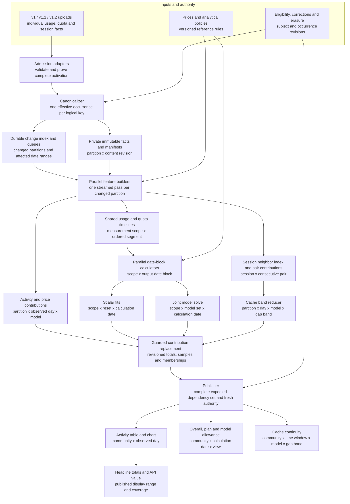

# A shared incremental analytics architecture

## Running checklist: complete local implementation before migration

The owner requested completion of both durable model-date batches and durable
shared features/incremental updates across every output family before online
qualification. This supersedes the earlier sequence that would canary model
batching before implementing the other families. Completion here means a locally
qualified, clean release candidate and migration/activation plan; online testing
and production writes are subsequent, separately recorded operations.

- [x] **L0 — Baseline and acceptance:** preserve the existing working tree;
  identify production source/schema and independent reference kernels.
- [x] **L1 — Model batch liveness:** finish historical blocks under continuing
  uploads and actual scheduler budgets; retain valid progress, invalidate real
  corrections, recover interruption, and bound cleanup/erasure. Focused tests
  and independent source review passed; the full candidate gate is L8.
- [x] **L2 — Durable shared feature store:** resumable version-neutral day
  preparation, closed content-free features, exact dependencies, pricing/method
  versions, atomic promotion, bounded capacity and retirement. Ten focused
  tests passed, including a full 101-day read under 950 statements.
- [x] **L3 — Daily activity and API value:** use shared features, preserve
  contributor counts, replace changed contributions and publish complete days.
  Exact reference parity and cold scheduled publication passed in one or two
  invocations (at most 318 statements per invocation in observed runs).
- [x] **L4 — Scalar and model fits:** reuse durable ordered/priced evidence and
  quota features; preserve timing, attribution hazards, refusals and kernels.
  Independent target databases produced exact graph and published payload parity
  for cold preparation, replay and accepted numeric correction; erasure passed.
- [x] **L5 — Cache continuity:** reuse shared events and exact seven-day carry;
  handle cross-midnight changes, ties, corrections and erasure. Exact reference
  parity passed; a cold dense scheduled case completed in 10 invocations,
  at most 352 statements each, with 427 events and 426 adjacencies.
- [x] **L6 — Incremental lifecycle:** unchanged replay, outside-window uploads,
  cross-day correction, empty-day changes, repricing, method changes, erasure,
  lease expiry, interruption and stale-source/target fences across all families.
  Lost write responses, prior pricing-method artifacts and correction at the
  write boundary are covered by focused regressions.
- [x] **L7 — Scheduled integration and measured parity:** closed deployment
  switches and bounded meters; mixed-version dense/skewed fixtures, complete
  reference-output comparisons and full scheduled cost measurements. All three
  scheduled lanes have bounded completion evidence. These local synthetic
  measurements do not establish production latency or a whole-system speedup.
- [ ] **L8 — Review and release candidate:** integrate reviewed changes on an
  appropriate clean source revision, run the owning Worker/architecture/docs
  gates, and create verified analytics/publication/cache artifacts.
- [ ] **L9 — Migration readiness:** populated rehearsal against the exact live
  ledger, preservation/erasure/rollback checks, ordered migration and activation
  commands, bounded online acceptance criteria and rollback instructions.

The readout will retain these identifiers and distinguish implemented, focused
tests passed, full local qualification, and ready for online migration. A passing
partial experiment does not mark its whole checklist item complete.

## Purpose and decision boundary

This is a second design, starting from the required inputs and consumer outputs,
with freedom to replace the intermediate pipeline. It targets substantially less
work per accepted change and faster completion of historical calculations.
**Tenfold improvement is an experiment target; 100-fold improvement is a stretch
hypothesis for workloads dominated by repeated acquisition. Neither is proven.**
This document proposes work; it does not implement or authorize a deployment.

The [artifact catalog](../research/2026-09-28-analytics-artifact-catalog.md)
describes the existing system. Source findings here use analytics candidate
`23575017c61d7b83093227d71e09096e50cf7bd1`. Its
[production receipt](../receipts/2026-09-28-effective-usage-throughput.md)
is a dated deployment observation, not a fresh production audit. The separate
daily publisher was last recorded at `ba7f00b28a32cc839f420db32dec7009b31e884b`.
The [production runbook](../runbooks/production-operations.md) remains the
operational authority.

## Implementation and rollout checkpoint

Read-only production verification at **2026-09-28 22:39:40 UTC** confirmed
analytics source `75a9b7efb260b062a25a90807886b7c984670a97`, version
`d96c6ce2-c8a6-41c7-9717-c570020ba6e3`, at 100%. Effective folding is enabled,
the every-minute schedule is intact, and the temporary delivery boost is absent.
The analytics migration ledger contains 0028 and 0029, but neither 0030 nor 0031.
This agrees with the [last deployment receipt](../receipts/2026-09-28-effective-model-publication.md).
The same observation found 114 daily dates queued, oldest June 7, and 70 stored
model-day publications through September 28. Existing publications do not prove
that the new algorithm ran or establish a throughput multiplier.

| Component | Local integration | Online / production integration |
|---|---|---|
| Effective quota-day and model usage-day reuse, checkpoint improvements, matching model publication method | Committed in the separate analytics release checkout | Deployed and active; these are improvements to the existing pipeline |
| Shared acquisition/reducers for activity/API value, scalar fits, model fits and cache continuity | Synthetic all-family parity experiment; transient features; no production entrypoint imports | Not deployed |
| Durable model-date blocks, batched dependencies, clipped ranges, bounded retirement and native publication bridge | Integrated through local scheduling and publication behind default-off `modelBlocks`; migrations 0030/0031; uncommitted working-tree candidate | No isolated online qualification or production activation |
| Durable common features and incremental contribution replacement across every output family | Partial foundations; daily/scalar/cache processing has not been replaced by this experiment | Not deployed |
| Object-backed analytical features, batch/container execution and concurrency 1/2/4/8 | Planned experiments | No redesign implementation or qualification |

The [latest paired publication experiment](../receipts/2026-09-28-model-block-edges.md)
produces identical complete 70-date model outputs with 5.48 times fewer cold
statements and 6.23 times fewer correction statements; unchanged replay is equal.
It excludes fair scheduling/claim overhead, source admission, erasure cost, CPU
and peak memory. These are model-history measurements, not whole-system or
production speedups. All 2,327 Worker tests passed on the recorded 666-file
snapshot; this checkpoint rechecked every recorded file hash without finding
changes. The complete command still stops before bundling because release asset
staging requires a clean committed tree. The candidate has no qualified deployment
artifact yet.

### Next experiment and route to production

1. **Complete work while inputs keep arriving.** Drive the real scheduler and
   publisher with identical native/candidate mixed-version inputs. Append new
   evidence from the same contributor outside an unfinished block's entire
   dependency range between resumptions. Verify that exact dependencies remain
   unchanged, then measure completed publications, retained/restarted work,
   retirement, all statements and bytes. Include dense and skewed contributors,
   latency injection, correction inside the range, erasure, interrupted saves and
   UTC rollover. A changed contributor revision is part of today's job identity;
   repeated restart is a risk to measure, not an established production defect.
2. **Use the production execution envelope.** The entrypoint supplies a
   55-second ordinary window or an eight-minute every-tenth-minute window, with
   delivery taking up to ten seconds and sharing the same 950-statement meter.
   Also test the lower-level 20-second default as a constrained case. The existing
   scheduler edge tests use 60 seconds; the direct runner's 20-second proof is a
   different gate. Include fair selection, claims and publication costs here.
3. **Assemble one releasable candidate.** Reconcile the clean production-based
   release checkout with relevant upstream changes, isolate the reviewed delta,
   commit it, and run the owning gates and analytics-only artifact build. Add an
   explicit deployment switch and useful completion/restart/capacity counters;
   the current boolean is only an internal opt-in. Rehearse 0030/0031 against the
   exact populated production schema and ledger, whose baseline omits 0027.
4. **Qualify online in isolation.** After exact environment authorization, use
   separate candidate resources and synthetic admitted inputs. Compare complete
   published outputs and measure real D1 latency, CPU, retained storage, retries,
   erasure cost and recovery. Start at one worker. Then qualify a bounded private
   production shadow, including erasure of its derived state, before permitting
   public writes. A quiet successful scheduler does not measure useful work.
5. **Canary historical model outputs.** Apply the rehearsed forward migrations
   and deploy the disabled artifact as separate approved operations. Enable a
   bounded set of historical date blocks under the existing single-writer
   coordination and native publication contract. Compare complete cohorts, keep
   today on its native path, and expand only after actual work demonstrates the
   gain. Switch back to current native computation on failure; retain the forward
   schema and enforce current erasure/source authority on fallback.
6. **Expand the redesign by output family.** Profile the separate daily publisher
   next, then move its activity/API-value work and scalar/cache preparation onto
   shared durable features. Test object storage against D1 using the same reducers,
   and only then test independent partitions at concurrency 1/2/4/8. Replace
   contributor-sized job boundaries with bounded evidence partitions as part of
   that work. Retire redundant old lanes only after parity, measured total cost
   and recovery are established for their replacements.

This sequence promotes a useful model-history improvement first. The original
all-family, 10-times efficiency target remains open; R2/containers and parallel
execution are further experiments, not requirements for the first canary.

## Recommendation

Build one version-independent, incrementally maintained analytical input layer.
From each changed input partition, produce a shared set of exact features for
activity, pricing, allowance and cache continuity. Calculate adjacent graph dates
together from those features. Publish small complete outputs using revisioned
dependencies. Schedule independent partitions through bounded queues.

The proposed target uses private immutable objects for large reusable inputs and
features, ordinary CPU processes for substantial historical calculations, and a
small transactional catalog for admission references, work ownership and published
heads. The first experiment can run as one local batch process. A large distributed
installation is unnecessary to prove the reduction in work.

| Change | Why it earns its place |
| --- | --- |
| Normalize v1, v1.1 and v1.2 once | Every downstream consumer uses the same facts and reducers; transport version does not choose an efficiency tier. |
| Read and classify each changed usage occurrence once | Activity, API value, scalar fits, model fits and cache pairing reuse the same decoded facts and price classification. |
| Retain compact ordered evidence alongside additive totals | The fit and continuity methods need timing, boundaries, attribution and uncertainty that a daily total discards. |
| Calculate a block of graph dates per task | Adjacent dates reuse loaded evidence, pricing and quota structures. Only date-dependent selection and solving are repeated. |
| Replace partition contributions atomically | Corrections update affected outputs without rescanning every contributor; retries cannot add the same contribution twice. |
| Separate computation from publication | Many workers can compute immutable results; small guarded commits decide what readers may see. |

## 1. Sanity check: version labels and identity

### The v1.1 labels are real, but not every v1.1 name is a restriction

The existing `analytics_v11_reusable_values` table and its manifest-page builder
really are limited to the `json-v11` and `typed-v11` layouts. v1 has a chunk-summary
path. v1.2 activation acknowledges delivery and queues changed days; its later
effective reader reconciles all three versions. Effective quota-day and model-
usage-day summaries already provide another reuse path. Scalar effective fits
still acquire usage separately.

Some shared helpers are named v1.1 because the effective reader maps records to a
common analytical contract with that name. Those names alone do not establish a
v1.2 exclusion. The structural problem is several preparation paths with different
reuse coverage. Sources: [legacy reusable schema](../../apps/worker/analytics-migrations/0004_v11_reusable_day_values.sql),
[legacy page builder](../../apps/worker/src/v11-daily-projection.ts),
[effective reader](../../apps/worker/src/telemetry-usage-effective-reader.ts),
[effective usage preparation](../../apps/worker/src/storage-effective-usage-days.ts).

**Target contract:** version-specific authentication, validation, completeness
proof and conversion end at admission. All compatible admitted occurrences enter
one canonical analytical contract. New optional evidence remains available through
explicit presence fields; older evidence stays unknown. Native support does not
mean inventing v1.2 fields for v1 or flattening v1.2 to the oldest schema.

### Retire owner/device processing hierarchies

An uploader is a source of evidence, not a mandatory computation unit. Tasks can
contain many sources or a small portion of one large source. Storage partitions,
fit scopes and authorization subjects are separate concepts.

Keep only the identities required by a specific contract:

| Identity or dimension | Minimal reason to retain it | Effect on task scheduling |
| --- | --- | --- |
| Canonical occurrence key and source-variant references | Deduplication, corrections and source precedence; identical token counts are not proof of the same occurrence | Hash/range partition; never a separate version lane |
| Session key and event order | Consecutive request pairing, attribution changes and session statistics | Session segments plus boundary state; many sessions can share a task |
| Quota measurement scope | Provider, account evidence, limit, reset/window and plan continuity determine which observations can be fitted together | Partition by actual measurement scope, not hardware or upload credential |
| Eligibility/erasure subject | Revoke the correct admitted evidence and every derived contribution | Private reverse index and revision fence; no need for owner-wide recomputation |
| Contributor membership / weighting key | Preserve currently published device counts, contributor counts, concentration and sample weighting | Side metadata and exact membership state; not a separate scan per device |

Existing occurrence and session IDs are scoped; the migration must preserve that
scope until equivalence is proved. It must not deduplicate different people's
events merely because an ID or timestamp matches. Unknown account scopes cannot
be pooled into one fictitious common quota meter.

Resolve legacy identifiers to a stable logical occurrence key through the
reconciliation index. The target key must not change when a correction moves the
event to a different day; location and revision are separate indexed attributes.

The existing “contributing devices” metric counts selected credentials, not people
or physical computers. Preserve that result using a membership set/reference
count. Renaming it or replacing it with a different contributor metric is a
separate product decision. Existing contributor/reset weights must also survive
until a method change is explicitly chosen. This is the narrow qualification to
removing identity distinctions everywhere: deduplication, withdrawal, measurement
comparability and those promised counts still require some provenance.

Here, withdrawal means explicit removal of historical publication eligibility.
**Ordinary opt-out or device disconnect only stops future uploads** and preserves
accepted historical evidence and publications. Keep those two authority changes
separate, as required by the [accepted opt-out contract](../decisions/2026-09-15-opt-out-stops-future-uploads.md).

## 2. Contracts from inputs to outputs

The input streams remain usage occurrences, quota observations, session/tool facts,
attribution/corrections, reference policies and eligibility. The required outputs
remain activity, API-equivalent value, allowance views and cache continuity.

Today's scheduler calculates scalar `fits` for the current date and historical
`model` results. The date-block proposal primarily accelerates model history;
current scalar results reuse the same acquisition features. Adding a new historical
scalar series would be a separate output enhancement, not required for this plan.

| Reusable artifact | Logical grain | Stored contents | Consumers |
| --- | --- | --- | --- |
| Canonical facts | Stream × logical occurrence × effective revision | Allowlisted normalized columns, time/order, explicit field presence and conflict state; private provenance references | All reducers; replay and new method versions |
| Partition manifest | Logical partition × content revision | Ordered object references, schema, min/max time, row counts, content hash, exact dependencies, authority revision | Scheduling, reuse, reconciliation, erasure |
| Activity contribution | Partition × UTC day × provider/model cell | Integer token components, usage/quota counts, session/tool facts where used, maximum activity time, membership state | Daily table/chart, headline totals |
| Priced usage features | Occurrence/time segment × pricing-rule key × pricing version | Integer cost, coverage/unknown flags, price dimensions and ordered interval indexes | API value, scalar allowance, model allowance |
| Quota timeline | Measurement scope × limit × ordered segment | Percent observations, reset/plan anchors, boundaries/ties, eligibility and uncertainty | Scalar and model feature assembly |
| Fit features | Measurement scope × reset/observation interval × method/dependency | Exact boundary costs, hazard/coverage state, model cost vectors, source ordinals/counts and window membership | Date-specific scalar and joint model solves |
| Cache adjacency | Session × consecutive-event pair × method/dependency | Endpoint references, gap, comparator configuration, reuse and exclusion contributions | Reversible day/model/gap-band reduction |
| Output contribution | Partition or fit scope × output date × method/dependency | Additive day/band counters, exact memberships, fit samples or model-result contribution | Community publication |
| Published output | Output family × date/window × revision | Complete payload, dependency root, eligibility epoch and method versions | Public API and browser |

These are logical contracts, not a prescription for nine services or nine SQL
tables. A partition builder should emit several features in one streamed pass;
small features can share one object. Physical batching is chosen by bytes, CPU
time and locality rather than by upload protocol, a fixed 200-row page, or one
owner per job.

Canonical objects are a new private materialization. They must not copy arbitrary
record JSON or raw session identifiers into analytics. Use the existing allowlist,
opaque scoped analytical IDs, access controls, erasure coverage and a versioned
schema. Source facts remain replayable under the existing retention contract;
this proposal does not authorize discarding evidence or retaining new fields.

## 3. Complete target flow and granularity

Daily activity and cache publication can advance independently of expensive fit
calculations. Related fields within one published family use the same completed
revision. Display each family's evidence date explicitly; a fast counter does
not make a slow graph complete.

## 4. Do less work before adding more workers

### 4.1 Canonicalize each changed occurrence once

After a complete source activation, reconcile source variants and corrections
against the previous accepted revision. Emit insert, replace, withdraw or no-op
effects. A repeated upload or unchanged manifest must produce no analytical work.
Record source provenance once and expose one shared downstream representation.

Start with existing effective selection as the oracle. Current legacy selection
and effective union paths have differences; adopting a new global union without
checking their output semantics could change counts. Cross-day correction links
must invalidate both old and new locations, not just the upload's declared day.

Partition by stable hash/range and time, with indexes for occurrence lookup,
session neighbors, quota scope and erasure subject. The scheduler splits large
partitions or groups small ones. It does not recreate the owner/device hierarchy.

### 4.2 Fuse compatible reductions

A streamed usage pass can decode and price an occurrence once, then feed activity
counters, scalar/model features and cache adjacency. Quota and session streams
have their own ordered passes. A single task can emit all these products without
duplicating source I/O. Expensive independent solves can run later in parallel.

| Safe to aggregate early | Exact state that must also survive |
| --- | --- |
| Token components and event/observation counts | Null/unknown evidence, conflict status and non-overlapping output components |
| API cost within one fully specified pricing rule | Coverage, integer rounding semantics, model/tier/context/date classification |
| Model costs at the existing two-hour bin grain | Attribution, account-break flags, poisoned bins and session openers/tails |
| Cache-band numerators, denominators and exclusions | Pair provenance and membership multiplicities, to repair corrections and compute concentration |
| Community sums of completed partition contributions | Exact contributor/device membership and maximum-date candidates, which are not freely additive |

Keep token quantities independent of price versions. A simple rate change can
reprice eligible compact cells only if it exactly preserves event-level rounding
and classification. New context thresholds, missing fields or changed pricing
logic may require replay of affected canonical occurrences. Repricing should not
invalidate unrelated token counts or cache evidence.

### 4.3 Reuse ordered features across many calculation dates

Load one date block plus its required history once. For the existing model/effective
history window, calculation date D uses D minus 100 through the end of D. Advancing to D+1 admits
one day's evidence and expires one day from the active window. Use ordered arrays,
interval indexes and prefix costs where their arithmetic is exact.

The pure-v1 current scalar adapter still has an open-ended dependency vector.
Do not apply the model's bounded invalidation rule to that adapter without
separate parity proof. Unifying storage paths must preserve the evidence each
current output actually uses, even when its former protocol name disappears.

Persist price-independent quota anchors and event/interval features. Assemble
date-specific plan eras, reset membership and coverage from only evidence allowed
at that cutoff. Reuse scalar and model acquisition; both consume the same quota
and priced usage foundation. A task might calculate 7 or 30 output dates; select
the block size experimentally, and subdivide if CPU or memory bounds require it.

The existing two-hour model cells are **not sufficient for scalar fitting**.
Scalar features need event interval ends and previous session time/scope, exact
price/coverage, attribution hazards and placement against the chosen window's
quota grid. Keep those ordered features until a smaller equivalent representation
is proved. Reset clusters also need their underlying reset instants or a
delete-capable index: dropping an expired bridging instant can split a cluster.
Subtracting an old daily cluster summary cannot reproduce that behavior.

Before a per-scope model solve, evaluate the existing whole-window refusal over
all relevant plan/account/era anchors and conflicts. Splitting a former calculation
cohort into scopes must not hide a disqualifying second scope. Scalar features
also need cross-scope known/unknown attribution and account-break hazards; keeping
only positively matched rows would admit previously excluded resets. Initially
retain that compatibility cohort as compact eligibility metadata, not as a task
or repeated source scan. A future method could admit independently valid scopes,
but that is an explicit statistical-policy experiment with changed eligibility.

The same principle supports a second level of reuse: cache a completed reset's
candidate statistics by its evidence and method hash, then re-run the date's
selection/validation over those candidates. Reuse is conditional on that reset's
boundaries, plan classification and input set being identical at the cutoff. This
is a promising experiment, not permission to freeze a result that still depends
on a changing window or future observations.

**Do not promise constant-time fits.** Current scalar calculations use pairwise
quota-boundary slopes, reset selection, medians, percentile ranges and
chronological validation. Current model calculations use quota crossings,
model-share selection, a joint non-negative solve and stability checks. Those
can change with the date's evidence cohort. First retain the existing pure
finishers for each date; optimize those separately only after profiling.

No averaging daily percentages, combining completed medians, splitting a coupled
model solve into independent per-model fits, or using future quota observations
to classify earlier results. Preserve resource/refusal boundaries during parity
testing; enlarging them changes the set of publishable results and needs an
explicit method decision. Sources: [usage reduction and finishers](../../apps/worker/src/quota-analysis-v11.ts),
[quota calibration](../../packages/quota-analysis/src/quota-calibration.js),
[model composition](../../packages/quota-analysis/src/model-composition.js).

The current prepared path itself documents exceptions to streaming resource
refusals, including its checkpoint byte limit and transient cluster count. Freeze
which deployed path is the oracle for each test case and record those exceptions;
do not describe today's paths as universally refusal-equivalent. A redesign can
remove implementation-specific ceilings, but must separate that capacity change
from statistical parity.

### 4.4 Maintain cache pairs instead of rereading seven days

Use a persistent ordered session index. An inserted event X between P and N
replaces P→N with P→X and X→N. Attribute each contribution to the later endpoint's
day. Re-evaluate the exact comparator, gap, exclusion and unknown rules. Deletion
does the inverse; an event moving between sessions/time positions repairs both
neighborhoods. Ties, unreadable events and eligibility changes may widen the
affected run and must retain current behavior.

Neighbor lookup remains bounded by the current day-plus-seven-prior-calendar-days
reach. An older event is not a valid carry merely because an index can find it.
Preserve ambiguous ties when input order evidence is missing; a convenient sort
by arbitrary IDs must not turn an unknown order into a measured cache pair.

Nonpositive-input events do not enter the adjacency population, although they
still affect source identity/read counters. A readable positive event's local
pair repair is smaller than today's physical invalidation, which includes seven
lookback-day identities. Replacing that broad dependency is part of this design.

Do not simply find the prior event with matching model: an intervening different
configuration or unreadable event can break continuity. Likewise, replacing a
pair can change a session's last remaining contribution to a band; keep exact
multiplicities or rebuild the bounded affected partition. Current counters alone
are insufficient for arbitrary subtraction. See the
[cache reducer](../../apps/worker/src/cache-retention-values.ts).

Publish community day/model/gap-band counters once. Common calendar windows can
sum those counters. Preserve contributor/concentration memberships across the
window, current session-count semantics and any bounded model selection. Avoid
repeating contributor-level pooling on every public HTTP request.

For parity, published `sessions` remains the sum of distinct counts per existing
contributor × day × model × effort × band. It is an upper bound across those rows,
not a true distinct-session union across the public window. Preserve that meaning
even if the new pair ledger could support a different measure. Effort remains a
stored dimension although the public model view combines it.

Materialized day/week/month windows need a UTC-day rollover trigger even without
new uploads; alternatively compose these small daily counters at read time. Keep
today-inclusive calendar boundaries, fixed bands, model ranking/truncation, and
the omitted/null series when no evidence exists in any window.

### 4.5 Replace contributions and publish dependency-complete outputs

For additive fields use `new total = old total - old contribution + replacement`,
with an idempotent transactional revision swap. For non-additive quantities retain
exact membership/reference counts, ordered candidate values or fit samples; merge
those states and apply the existing final estimator. Do not subtract a median or
take a median of partition medians. A simple small fold of compact contributions
is preferable to an elaborate incremental index when it is already cheap.

Track the expected changed partitions at an accepted source watermark. An output
can advance when each dependency is complete or is explicitly unchanged with a
reused hash. Partition completion records replace repeated enumeration and
revalidation of an entire cohort. Reuse must still be checked against the current
authority epoch; a hash of measurements cannot prove current sharing permission.

Dependencies include requested time/key ranges and explicit empty partitions,
not just hashes of existing objects. An arrival in a formerly empty day must
invalidate every consumer whose window includes it. The authority/selection index
must also cover source variants linked from outside the event's current day.

Use narrow content/dependency hashes for computation and separate authorization
revisions for visibility. A change elsewhere in the same upload generation must
not invalidate an unchanged day's features. An authority change can withhold
publication immediately without forcing unrelated arithmetic to be rebuilt.

## 5. Scheduling, storage and meaningful parallelism

### Proposed service responsibilities

| Role | Work unit | Parallelism and commit boundary |
| --- | --- | --- |
| Admission and canonicalization | Complete activated change set; occurrence groups | Independent partitions, serialize competing changes to the same logical keys; bounded transactions |
| Feature builder | Immutable partition revision, possibly several small partitions | Many builders; one immutable feature result and guarded head promotion per unit |
| Historical/current calculator | Measurement scope × output-date block × dependency root | Independent scopes/date blocks; local reuse within a block; separate current/backfill capacity |
| Community reducer/publisher | Output family × date/window × expected revision | Independent dates/families; serialize only the final head for the same output |
| Reconciler/retirement | Missing effects, expired leases, orphan objects, withdrawn dependencies | Lower-priority bounded work; no race with active leases or erasure |

This can be three deployment roles: HTTP/admission, a configurable background
worker pool, and a small publisher/reconciler. Jobs share libraries and schemas;
each box in the diagram need not become a service. Crons become recovery sweeps
and periodic freshness triggers, while durable queue events start ready work.

The pool has two task shapes: short incremental partition work and longer date-
block/backfill work. They share analytical kernels but can use different runtime
memory and duration limits. Small jobs may remain Workers; large jobs can be
ordinary container processes reading immutable snapshots. A worker should pass
references to another task only at a durable boundary, not recursively fan out a
chain of requests to evade an invocation limit.

Use job keys such as `(kind, partition, inputHash, policyHash, dateBlock)` and a
monotonic lease/fencing token. Messages contain references and revisions, not
private facts. Queues can duplicate delivery, so a successful job and its output
commit must be idempotent. A lost notification is repaired from the durable
outbox/work index. [Cloudflare delivery guarantees](https://developers.cloudflare.com/queues/reference/delivery-guarantees/).

Start concurrency at 1, 2, 4 and 8 in the benchmark. Separate source acquisition,
CPU and publication concurrency. Increase only while useful throughput rises
without growing database latency, conflicts, retries or CPU cost per result.
Reserve capacity for new data and withdrawals; backfill uses the remainder.
Cloudflare supports bounded concurrent consumers; its configured maximum is a
ceiling, not evidence that a database can support that many workers.
[Consumer concurrency](https://developers.cloudflare.com/queues/configuration/consumer-concurrency/).

### Physical storage recommendation and alternatives

| Option | Assessment |
| --- | --- |
| Keep facts/features in D1; implement common reducers and date blocks | Best transition experiment. Tests algorithmic savings before storage migration. Keep source reads selective and batch writes; large repeated checkpoint payloads may remain expensive. |
| Private immutable R2 facts/features plus small transactional catalog | Recommended target if acquisition or checkpoint I/O still dominates. Compute reads named immutable objects and performs arithmetic locally; D1 coordinates compact metadata instead of serving every calculation step. |
| PostgreSQL canonical facts and catalog plus batch workers | Credible simpler alternative if transactional corrections, lookup and membership state dominate. Benchmark the same contracts. Changing databases alone preserves any repeated full-history work. |
| Columnar files with DuckDB in ordinary batch processes | Candidate physical implementation for historical replay and large date blocks. Compare to compact typed arrays/streaming objects for small hot updates. Do not assume a Parquet reader fits the current Worker runtime. |
| Shard D1 or adopt a distributed analytical database | Later option if measured catalog/write or ad-hoc analytical load requires it. Additional partitions, compaction, deletion and operations must earn their cost. |

The selected target is a dataflow architecture; the first benchmark decides
whether object/columnar materialization improves the whole workload. Start with
few moderate-sized objects and explicit manifests. Avoid a file per tiny upload
chunk, an object per event, or one giant file whose every correction rewrites all
history. Logical partitions and physical packing can differ; reverse provenance
must make deletion and compaction exact.

DuckDB supports column/filter pushdown and parallel Parquet processing, making it
a reasonable measured batch candidate. These features do not prove a multiplier
for this workload. [DuckDB Parquet processing](https://duckdb.org/docs/current/guides/file_formats/query_parquet).

### Read replicas: supporting optimization

Each D1 database instance processes queries serially. Replicas can add read
capacity, but writes still use the primary, and adding workers does not turn one
primary into many independent writers. D1 currently documents 1,000 queries per
paid Worker invocation. These vendor limits are separate from the application's
950/900 statement meters. [D1 limits](https://developers.cloudflare.com/d1/platform/limits/).

Using replicas requires the Sessions API. A bookmark provides an ordering/freshness
constraint, not an immutable snapshot across multiple databases. Replica reads
can acquire immutable admitted inputs with the needed freshness fence. Current
authority and final publication checks must retain strong freshness guarantees.
Measure routing rather than assuming jobs spread across replicas.
[D1 read replication](https://developers.cloudflare.com/d1/best-practices/read-replication/).

### Atomicity across object storage, metadata and authority

1. Write a new immutable object and verify its digest/length. It is not visible
   through a published head yet.
2. Commit its manifest/head and work completion using the expected prior revision
   and fencing token. A stale or withdrawn job cannot replace the head.
3. Commit the output contribution replacement and downstream outbox effect in the
   same transactional boundary, or use an explicit recoverable idempotent protocol.
4. A cross-store authority epoch/fence must prevent withdrawal races at publication
   and serving. A before/after read alone is not an atomic cross-store transaction.
5. Reconcile interrupted transitions; garbage-collect unreferenced objects only
   after lease/retention checks. Failed work remains discoverable.

R2 object operations are strongly consistent, but do not provide a transaction
with D1. Public caches can retain a deleted object, so private evidence must stay
behind the authority-aware service. Public output withdrawal also requires cache
invalidation or withholding at the serving gate; a new hashed URL alone does not
revoke the old one. [R2 consistency and caching](https://developers.cloudflare.com/r2/reference/consistency/).

## 6. Precise invalidation instead of global rebuilds

| Change | Necessary work | Work usually reusable |
| --- | --- | --- |
| Identical reupload / unchanged day manifest | Receipt/authority bookkeeping only | All measurement features and results |
| New usage occurrence | Changed canonical partition, activity/price cells, session-neighbor contributions; intersecting fit windows | Other partitions and dates outside dependency ranges |
| Late correction, withdrawal or moved timestamp | Old and new occurrence locations, affected session neighbors, quota attribution dependencies, reverse-linked results | Proven unrelated content hashes |
| New quota observation / plan correction | Affected measurement timeline, reset/era boundaries and dependent fit dates | Activity token counts and unaffected cache pairs |
| Price update | Affected price-rule/time/model features and cost-dependent fits | Token counts, quota measurements and cache continuity |
| Analytical method change | Products using that method and their publication identities | Canonical facts and method-independent features |
| Contributor/device linkage change | Dedup selection or membership state where affected | Arithmetic only when its canonical occurrence set truly stays unchanged |
| Ordinary opt-out / device disconnect | Revoke future upload permission; preserve accepted historical evidence and publication eligibility | Retained facts, completed calculations and published history |
| Explicit erasure / security containment / intentional publication disable | Immediate authority fence and applicable public withholding; exact deletion for erasure, or other specifically authorized containment | Only evidence permitted by the recorded authority; deletion proof where required |

The 101-day model/effective horizon bounds ordinary observed-day influence on future
result dates only after accounting for carried plan/reset/session state. Pure-v1
current scalar dependencies require their separate open-ended treatment. A corrected
anchor or externally linked occurrence can invalidate farther than its own day;
follow explicit dependency intervals to the next proved boundary. Expiring data
from a calculation window is different from deleting retained evidence.

Keep a reverse index from source dependencies and erasure subjects to derived
partitions. Full source/selection-policy changes may legitimately require a full
rebuild. Do not make “incremental” an excuse to publish stale dependencies.

For packed objects containing several erasure subjects, rewrite surviving facts
and delete all superseded objects that contain the withdrawn subject, including
unpublished work and retained versions covered by the deletion contract. Logical
tombstones prevent serving while that physical work completes. Do not mark erasure
complete from a publication change alone; the durable deletion ledger must also
prevent restored backups from reintroducing the evidence.

## 7. Where tenfold or hundredfold gains could come from

### Separate work, throughput and latency

- **Efficiency:** source rows examined, bytes transferred, database service time,
  CPU-seconds, object operations and total cost per complete equivalent output.
- **Throughput:** complete output dates/results per minute at stated concurrency.
- **Latency:** accepted change to the corresponding published output, including
  queues, barriers and cache freshness.

Parallelism may improve the last two while doing the same or more total work.
The primary efficiency win must come from fewer repeated scans/reductions and
smaller durable state. Do not multiply overlapping optimizations into a forecast.

### Grounded opportunity, not measured production improvement

The existing synthetic 12,122-usage-event / 61-quota-observation fixture reduced
the adjacent model calculation from 1,161 to 117 statements using prepared usage.
Across cold plus adjacent calculations, it improved only 2,560 to 1,751 statements;
cold preparation grew from 1,399 to 1,634. A smaller fixture regressed overall.
Source rows-read counters fell from 157,681,013 to 85,793,452; these are repeated
database work, not unique records. See the
[qualification receipt](../receipts/2026-09-28-effective-usage-throughput.md).

This demonstrates that substantial reuse is possible and that preparation has a
cost. It does not demonstrate 10× whole-system improvement or production speedup.

### A testable cost model

Let N be unique canonical facts, R their repeated acquisition/reduction factor,
C acquisition cost per fact, F date-specific fitting cost, and P publication and
coordination cost. The old shape is approximately `R × N × C + F + P`.
The target is `N × C + changed-feature work + F' + P'`, with extra storage/build
cost included. For warm refreshes, replace N with changed facts plus boundary
repairs. Retain date-specific solving in F' until exact reuse is demonstrated.

| Hypothetical workload | Mechanism and bound |
| --- | --- |
| 365 graph dates, each loading 101 days | With equally sized days and complete lookback, 36,865 day visits become 465 unique days: 79.3× fewer day acquisitions. Interior days were read up to 101 times. This is an acquisition example, not total speedup or a measurement. |
| One changed day in an otherwise stable 101-day window | Rebuild one partition and its dependency neighborhood; unchanged features can remain reusable. Every affected output may still need a small refit. |
| Multiple consumers rereading the same facts | Fused normalization/pricing removes acquisition duplication. Its savings overlap with the date-reuse factor above. |
| 8 independent CPU jobs | At most an eightfold compute-throughput gain before coordination/I/O; no implied eightfold reduction in total CPU or cost. |

For illustration, if 95% of total work were reducible by 100× and 5% stayed fixed,
the whole-work improvement would be `1 / (0.05 + 0.95/100) = 16.8×`. At 99%
reducible work the same component improvement yields 50.3×. Whole-system 100×
requires still greater eliminated work, a better algorithm for the remaining
stage, or a workload whose former idle scheduling dominated latency. Measure the
fractions first. No current profile establishes those assumed percentages.

## 8. Experiments and acceptance gates

### Local implementation checkpoint — September 28

The [batched dependency follow-up](../receipts/2026-09-28-batched-analytics-dependencies.md)
now passes its local measurement gate. Exact links for up to 16 target days are
acquired together, with identical per-day digests and analytical outputs. On the
130-day paired workload, correction drops from 185 to 64 statements and 614,462
to 108,617 rows read. Overflow falls back to the singleton query; production
callers retain their current default. All 2,255 Worker regression tests pass;
release asset staging remains subject to the clean committed tree gate.
The [durable model-block follow-up](../receipts/2026-09-28-durable-model-blocks.md)
now measures bounded acquisition, writes, retries and private result reads. Its
30-date cold workload uses 2,575 total statements versus 15,750 for independent
per-date graph jobs; its busiest invocation uses 829. Public publication remains
outside this local measurement.

The user authorized the first shared-input experiment end to end. Implementation
is local, with synthetic admitted data and the existing analytical kernels. It
does not change production routes, scheduling, storage schemas or publication.

- [x] Acquire and prepare version-neutral complete days once, with bounded
  memory, exact dependency checks, cancellation and source authority fences.
- [x] Exercise daily activity/API value, current scalar fits, historical model
  fits and cache continuity against independent existing reference paths.
- [x] Measure cold, adjacent-date, corrected-day and unchanged replay workloads;
  report completed outputs and raw resource dimensions without a forecast.
- [x] Validate the integration, record a reproducible receipt and recommend the
  next bottleneck to address from the measurements.

Scalar preparation currently has no prepriced-feature injection point. The
experiment preserves its existing kernel and records reduction wall time;
individual decode/price call counts and CPU/heap telemetry remain unavailable.
Retained occurrence rows stay in bounded process memory; the experiment does not
persist raw records or session identifiers.

The [local experiment receipt](../receipts/2026-09-28-shared-analytics-benchmark.md)
records exact analytical parity, query/row reductions, the sparse-fixture and
persistence limits, and the remaining dependency-query bottleneck. This completes
the first local slice, not E2/E3 or the whole-work promotion gate. Its dependency
bottleneck is addressed by the paired follow-up above. Durable model-date
execution is measured below; public publication remains a separate gate.

### Durable model-date blocks: local implementation

**Implemented and benchmarked locally; all 2,292 Worker regression tests pass.**
The [receipt](../receipts/2026-09-28-durable-model-blocks.md) records completed
30-date blocks after process-independent resumes, exact reference results,
source and erasure fencing, and measured source plus target statements below
950 on every invocation. The experimental job store is separate from public
serving heads. No production migration or runtime activation has occurred.
The release gate stops at its clean, committed tree requirement before the
Wrangler dry deployment and staging checks.

The implementation uses model history and the existing compact quota/usage
projections. Dependency selection, acquisition pages and output-date progress
are resumable. A block covers 1–32 output dates and a 101–132-day dependency
horizon; a nominal date count alone does not bound a large populated day.
Explicit empty-day inventory facts avoid durable empty-payload copies.

Reuse the established lease, immutable-stage/head comparison and erasure
fencing patterns. The current
[work-selection table](../../apps/worker/analytics-migrations/0017_graph_work_selection.sql)
is keyed by one day and one metric; the
[history codec](../../apps/worker/src/storage-history-checkpoint.ts)
accepts specific calculation checkpoint types. Neither is a generic container
for `SharedAnalyticsDay`. Any new durable representation needs a deliberate
closed schema, local migration rehearsal and owner-erasure coverage.

Keep raw scalar input rows transient. Cache events also contain an occurrence
`orderKey` whose [contract](../../apps/worker/src/cache-retention-values.ts)
explicitly limits it to memory. Durable scalar/cache reuse requires its own
reviewed representation; model-block success must not be labeled all-family
durable completion. Existing readers remain available for those consumers.

Local acceptance for this slice:

- Resume after an interrupted page/stage without duplicate completion; reject
  expired or superseded claims and lost head comparisons.
- Preserve exact output/refusal parity across block boundaries, including every
  day in the 101-day model dependency window and explicit empty days.
- Fence source changes, cross-day corrections and erasure before promotion and
  final publication; purge staged state through the existing owner-erasure path.
- Measure every resumed invocation below the 950-statement allowance with
  deadline and finalization reserves, including durable writes and reloads.
- Keep source and target checks explicit: separate D1 databases do not provide
  a single atomic cross-database transaction.

### Dense/deadline qualification and integration preparation

**Implemented and measured locally; all 2,294 Worker regression tests pass.**
The [qualification receipt](../receipts/2026-09-28-model-block-deadline-qualification.md)
records a real liveness regression: a fully populated window repeatedly reloaded
without emitting under an injected 50 ms per statement and the runner's default 20-second
deadline. Existing bulk quota/usage head readers remove repeated metadata
queries. The same test now completes in 17 fresh invocations, with exact reference
outputs, cancellation recovery and hidden partial results. Simulated elapsed
time is liveness evidence; it is not remote CPU/latency qualification.

The paired 130-day/30-date dense workload uses 7,289 statements cold versus
95,551 for independent per-date jobs (13.1 times fewer), and 684 versus 17,975
after one correction (26.3 times fewer). Its peak invocation is 801 of 950.
Small and sparse controls also pass with exact output parity. These measurements
exclude scheduler and cohort publication costs and do not establish a production
or whole-system multiplier.
Workspace/type/script, architecture, documentation and root preflight gates also
pass. Release packaging stops at its clean, committed tree requirement before
Wrangler dry deployment or staging qualification.

The publication reader was also repaired to choose the same v1.1 attribution
method as the effective-source writer. A genuine READY effective-result
publication regression passes locally.
The owner subsequently authorized deployment. The isolated release candidate
`75a9b7efb260b062a25a90807886b7c984670a97`, based on verified production source
`23575017`, contains only this publication fix and its regression. All 39
publication tests, all 2,224 Worker tests and the exact analytics-only dry build
pass. General website asset staging remains unqualified because its generated
release manifest is absent. The fix is active at 100% on the analytics Worker
as version `d96c6ce2-c8a6-41c7-9717-c570020ba6e3`; eight ordinary passes and one
long pass completed without failures, and the exact deployment lock was
released. This deployment excludes the dormant block runner and
0030 migration. Track activation and natural-run qualification in the
[publication deployment receipt](../receipts/2026-09-28-effective-model-publication.md).
The next local slice below implements native graph fingerprint bridging,
fixed block boundaries and bounded stale-job retirement. No production scheduler
activation or remote migration is part of this local qualification.

Dense and sparse qualification precedes bounded scheduler/publication integration.
This is a model-only durable result. The following slice integrates cohort
publication; scalar and cache-continuity representations, production routing and
parallel admission remain independent work.

### Current local slice: native graph adoption

**Implemented and qualified locally September 28; production remains off.** The
owner approved proceeding step by step. The acceptance boundary is identical
native graph rows and complete public cohort payloads under one 950-statement
invocation meter, including scheduling, job retirement, adoption and publication.
Keep the scheduler option off by default and qualify concurrency one on existing
D1 storage before considering object storage or parallel workers. No new remote
migration or deployment is part of this implementation step.

The implementation preserves the existing per-owner graph rows, cohort publisher
and public response schema. A private adapter accepts only a complete model
block, then adopts bounded output dates through a graph-owned save/readback
helper extracted from the
existing [graph result writer](../../apps/worker/src/storage-community-graph.ts).

Block and native graph fingerprints are different contracts. Block day digests
include session dependencies; native effective model scope hashes the full
window dependency and omits sessions. Concatenating the block's day hashes
cannot reproduce the native fingerprint, including outside-day occurrence links.
The adapter:

1. Shares the runner's current source/runtime proof helper, including exact source
   namespace, owner revision/epoch/input revision, collection/policy state and
   v1.2/correction runtime state. It requires active target owner authority and no
   erasure fence, with an explicit compatible block/graph/attribution-method tuple.
2. Validates the complete immutable job and its full dependency vector, then
   rechecks at most 132 distinct days with the existing batched dependency reader
   and explicit quota/usage inventories. It reuses this proof across dates in the
   invocation; a missing prepared cache row cannot prove absent input.
3. Captures the native effective graph scope separately for each adopted date.
   It validates a READY result against its original block fingerprint and method;
   only after equivalence is proved does it rebind the top-level input fingerprint
   to the native scope and validate again. Numerical fields must match an
   independent native calculation exactly. Closed analytical refusals and native
   fallback outputs remain explicit. Unsupported dates or missing migrations
   retain the native path; a failed source proof defers adoption.
4. Preserves native dependency digest, payload hash/size, authority, source kind,
   method and input-revision compare-and-swap. It re-fences before the write and
   readback. Existing complete native rows provide resumable adoption progress;
   the current cohort publisher remains responsible for all-contributor visibility.

The real scheduled-pass tests use one 950-statement meter across claim,
verification, writes and cleanup, with durable resumption. The paired benchmark
also measures adoption and publication costs, but calls dates in a controlled
order and excludes the scheduler's fair-selection scan. It is not a whole-service
speedup measurement. There is no automatic production activation.

The [integration receipt](../receipts/2026-09-28-model-block-publication.md)
records exact publication parity, measured costs and remaining qualification.
The aligned 32-date comparison uses 3.19 times fewer statements cold and 3.44
times fewer after changed input. The complete 70-date preview uses 36.0% fewer
statements cold and 35.0% fewer after changed input; only 32 of its dates use
blocks. Replay uses 28.4% more statements across the full preview. These
measurements include native adoption and publication, but exclude fair scheduler
selection and are not production throughput claims.

**Follow-up implemented and qualified locally September 28; production remains off.**
The [clipped-edge receipt](../receipts/2026-09-28-model-block-edges.md) records
the next measurement against the preceding integration baseline. This slice extends
the planner to clipped ranges covering all 69 completed preview dates, with a
forward 0031 migration for four-range admission. Today's result stays native.
An unchanged native result can return after its existing exact dependency/hash
and source proof plus the target revision/epoch/erasure check, before opening any
private block policy or claim. It still refreshes an older native input-revision
proof and retires a completed prepared checkpoint through the shared graph
helper. Block cleanup remains bounded and runs before new work and in the
capacity branch. Acceptance is exact published JSON parity for the
70-date cold/replay/correction comparison, no replay statement regression,
bounded rollover/lease recovery, physical erasure and one 950-statement meter.
The paired 70-date comparison now covers all 69 completed dates in three jobs:
23,822 versus 130,441 statements cold (5.48 times fewer), 15,490 versus 96,556
after correction (6.23 times fewer), and 3,496 for both lanes on unchanged
replay. All published model-day and preview payloads match exactly; the largest
candidate invocation uses 927 statements. The complete profile remains local
and excludes fair scheduler selection. Source and migration changes froze
before the broad owning gate started. All 2,327 Worker tests pass on that exact
snapshot, together with types, script, documentation, preflight and architecture
checks. The later dry build stopped at the clean, committed release-tree guard
before Wrangler bundling; the staging check did not run.
Production routing, remote migrations and deployment remain separate gates.

The next qualification uses the production entrypoint's 55-second minute and
eight-minute long-pass windows, plus the lower-level 20-second default, with
accepted same-owner outside-window appends between partial-block resumptions.
Exact historical day dependencies can stay unchanged while owner and input
revision advance; both are currently part of private job identity. Measure
retained progress, prepared-day reuse and completion before changing that
identity or adding parallel workers. The existing other-owner freshness-tick
test and completed-cache append regression do not establish this liveness case.

Required regressions include exact READY byte parity after proved fingerprint
rebinding, refusal parity, mixed versions and cross-day corrections, conservative
session-only invalidation, stale source/runtime/policy/owner and erasure, partial
or corrupt jobs, races before write/readback, newer native input revisions and
publication only after the complete eligible cohort is available.

### Implemented bounded admission and retirement

The local scheduler admits the intersections of UTC-epoch-aligned 32-day blocks
with the 69 completed dates in the 70-day preview. These three or four exact
ranges contain one to 32 dates each; today retains the existing per-day path.
Clipping both ends keeps each input halo within the existing prepared-day
retirement horizon. Forward migration 0031 adds the two policy slots required
for the clipped ranges and preserves the 0030 jobs, parts and policy data.

Admission bound: at most four stored jobs per source/owner, including
obsolete leased jobs. Three or four current ranges can occupy this ceiling;
after rollover, replacement work can wait for an obsolete lease to expire.
Admission defers at the ceiling and cleans obsolete jobs first. The current 10 MiB
checkpoint bound implies at most 40 MiB of committed job payload per owner, with
one additional successor during an atomic save. These are worst-case ceilings,
not measured typical sizes; validate aggregate D1 capacity before activation.

Retirement removes superseded owner revisions, stale source authority, explicitly
retired methods and ranges that no longer exactly match the admitted intersections. Eligible partial
jobs remain resumable; an old timestamp alone does not make a job obsolete.
Unfamiliar newer methods and unexpired claims are preserved. Ordinary cleanup
compares exact head revision and lease again in the deleting statement. Owner
erasure/inactivity/epoch triggers retain their stronger containment behavior.

The parent/part foreign-key cascade removes up to 81 committed parts atomically
per conditional parent deletion, without reading retained payloads. Bounded
cleanup also runs when new analytical work is capacity-blocked: it narrows
existing admission policies and deletes only jobs proven obsolete from target
state. It reads at most four heads per indexed page before checking obsolescence,
then advances a revision-guarded integer cursor without retaining owner or job
identifiers. It cannot admit a fresh range without a new source proof. Cascaded
rows and bytes are recorded separately from the small statement count.

Initial ensure/claim admission and save CAS require the current target policy
token. Preparation reads target policy, fences source authority afresh, then
atomically compares and swaps policy revision, range/method and the job ceiling.
Late callers cannot recreate retired work with an old token. The source/target
transaction boundary stays explicit. The existing contract owns the pure range
planner; the existing job store owns bounded metadata and retirement operations.

Qualification must cover all 32 alignment offsets, UTC boundaries and input
horizon containment; correction/method churn at the ceiling; partial and complete
retirement; claim/delete races and expiry; late ensure/save attempts; physical
part absence after cleanup/erasure; and actual cleanup cost. No source telemetry
or daily output retention policy is changed by this proposal.

### E1 — One shared input pass, all output families

Build a local vertical slice around one frozen synthetic mixed-version corpus.
Run the current reference and a canonical, fused reducer over identical eligible
evidence. Include daily activity/API value, scalar fits, model fits and cache
continuity. Start with the existing TypeScript kernels so a storage experiment
does not silently become a statistical-method rewrite.

Record queries and query plans, rows examined, decode/price calls, bytes, database
time, CPU, peak memory, checkpoint/write volume and output parity. This first
experiment should reveal whether repeated acquisition or final solving dominates.

### E2 — Adjacent dates and small corrections

Compare one date, 30 dates and 365 dates with the same unique history. Test cold
build, warm run, append, one old correction, cross-midnight insertion, quota/plan
change, repricing, erasure and no-op replay. Compare compact in-memory features,
persisted D1 features and private object/columnar features using the same reducers.

Prove which work scales with unique/changed evidence and which scales with output
count. A no-op must not scan unchanged raw history. Version-equivalent evidence
must reach the same pipeline and result, with no systematic v1.2 reuse penalty.
Do not demand identical cost from versions that genuinely contain different facts.

### E3 — Parallel throughput with correctness under interruption

Run concurrency 1/2/4/8 on independent partitions and deliberately skewed workloads.
Measure completed output rate, p50/p95 job and publication latency, source/catalog
pressure, retries and total cost. Inject duplicate messages, stale leases, failure
after object write, failure before/after manifest commit, missing notification,
withdrawal during computation and restore after erasure. Every accepted change
must eventually resolve without duplicate analytical effects or stale visibility.

### Common gates

- Exact integer counts/costs, coverage labels, sample membership, eligibility,
  refusals, timestamps and ordering; floating outputs match the existing documented
  tolerance or exact deterministic result. No unapproved approximation.
- Mixed versions, duplicate IDs in different scopes, overlapping versions,
  corrections across days, sparse older fields, equal-time conflicts, midnight
  boundaries, plan/account switches, partial pricing and large/skewed partitions.
- No future evidence leaks into an earlier calculation cutoff. No new contributor
  weighting, reset votes or model selection caused by physical partitioning.
- Feature creation, metadata, retries, compaction and erasure are counted in cost;
  a warm result alone cannot justify a whole-system multiplier.
- First promotion target: at least 10× lower total measured work/cost on the
  repeated-history workload, with small-update and cold-path regressions explicitly
  reviewed. If this is not met, profile the remaining dominant stage before scaling.

Report raw resource dimensions separately and calculate cost with one fixed price
sheet for both candidates. Statements, scanned rows and CPU-seconds cannot be
added as if they were the same unit. Compare equal complete output sets, including
refusals and coverage; producing fewer eligible results is not an optimization.

## 9. Migration sequence and stop points

1. **Freeze semantics and measure.** Capture input/output contracts and reference
   results; finish E1/E2 locally. Decide the physical store from results.
2. **Unify acquisition in shadow.** Add canonical occurrence/feature contracts and
   reuse for every protocol. Existing admission and published outputs remain the
   reference. Replay corrections and deletion as well as append-only history.
3. **Calculate date blocks in shadow.** Use existing statistical finishers over the
   new features. Compare every output family, membership and refusal.
4. **Introduce durable jobs and bounded concurrency.** Prove retry/fencing and
   complete publication, then qualify E3 on an isolated service.
5. **Canary one output family.** Use a reversible serving-head switch after explicit
   production approval. Keep the old path capable of following current authority;
   an obsolete snapshot is not a valid erasure-safe rollback.
6. **Expand and retire.** Once parity, throughput, cost, erasure and operational
   recovery are proven, move the remaining families and remove redundant legacy
   projection/checkpoint lanes. Retire old data through the existing controlled
   retention/deletion process.

Each phase has a usable stopping point. If D1-backed common features already meet
the target, object-storage migration can wait. If one batch process handles the
work cheaply, do not add distributed shards merely to use more workers. If final
model solving dominates, improve that algorithm under separate parity tests.

## 10. Independent ChatGPT Pro consultation

The same inputs, output requirements, identity/version request, current bottlenecks
and measured local benchmark were sent to ChatGPT Pro through the visible ChatGPT
web UI on September 28. The user selected GPT-6 Pro after the SDK's older model
selector failed; the visible picker showed Pro before submission. The SDK also
missed the new Send label, so the prepared prompt was submitted once through that
visible button. No source files, private records or credentials were attached.

[Consultation thread](https://chatgpt.com/c/6aba7f33-9394-83e8-91d5-3d914ab62a1f).
The response completed and was read through its visible Copy action at 15:07 UTC;
the SDK's reader did not recognize the new chat layout. Its recommendations are
independent model judgment, not a production performance measurement.

### Agreement and additions adopted

- Pro independently recommended canonical, version-neutral evidence partitions;
  shared chronological features; private object storage and bounded container
  reducers; a small transactional catalog; and replaceable publication contributions.
- It reinforced keeping the analytical kernels independent of storage/runtime and
  testing current-storage shared reduction before migrating the physical store.
- Its useful additions were explicit empty-range dependencies, an occurrence key
  independent of a mutable observed date, batchable logical partitions, and a
  warning that shared extraction can still need different session/meter sort orders.
- It recommended a three-way benchmark: current pipeline, shared evidence on
  current storage, and object/native execution. E1/E2 adopt this comparison.
- It separated warm-refresh improvement from cold-backfill improvement and
  emphasized queue/object/encoding and idle-container costs. This plan uses that
  distinction without treating Pro's illustrative work-unit table as evidence.

### Reconciliation with source and accepted contracts

The consultation was given a high-level input/output brief rather than the full
repository. Source review supplies several stricter details:

- Ordinary opt-out retains accepted history. Pro's generic withdrawal language
  applies here only to explicit historical withdrawal, containment or erasure.
- Public scalar aggregation selects qualifying reset fits; a generic assumption
  of one vote per contributor is insufficient. Preserve the actual reset selection,
  weights and community estimator. Protocol namespaces still matter to dedup.
- Historical date blocks primarily serve model history; scalar fits currently
  target today, and the legacy v1 scalar dependency is not a closed model window.
- Existing whole-window multi-account/plan/era refusals and cross-scope hazards
  must survive physical repartitioning. Pro's recommended meter scopes cannot
  hide negative evidence that the reference method currently sees.
- Cache pairing retains its seven-day reach, ambiguous ties, session-count upper
  bound and UTC calendar rollover. A global nearest-neighbor index must enforce
  those method boundaries explicitly.
- Pricing and numerical limits remain those of the existing implementation; no
  database or new representation alone establishes statistical equivalence.

The selected direction is therefore the shared-evidence architecture, with the
first decision gate at measured local parity and whole-workload cost. The object
and container target is a candidate to earn its place through that experiment.

## Validation of this plan

Source-sensitive claims were checked against the pinned code and two focused
read-only reviews. Official Cloudflare/DuckDB documentation was checked on
September 28 for the platform claims linked above. The system diagram was
rendered and visually inspected in Chrome. Documentation/link governance and
the preflight documentation/guidance suite passed; these checks validate the
document, not the proposed architecture's performance or deployment readiness.
