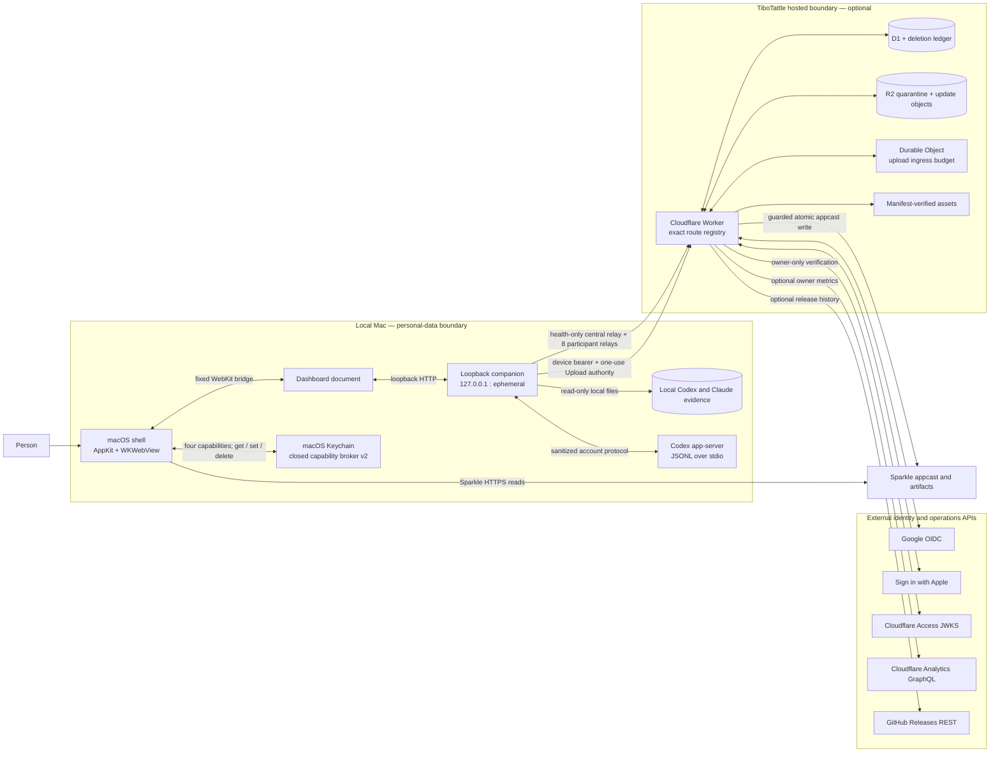

# TiboTattle API surface reference

This is the canonical map of TiboTattle's deliberate software interfaces:
network routes, loopback relays, native bridges, child-process protocols,
Cloudflare bindings, reusable package exports, and persisted schema contracts.
It is written for a reader who needs the shape of the system quickly and for
an engineer who needs to know exactly which boundary a change can affect.

The inventory describes **implemented source in this repository**. It does not
by itself prove that a route is deployed, a hosted dependency is provisioned,
an installed app contains the same revision, or a release channel is live.
Those remain separate verification gates in the relevant runbooks.

## How to read the map

- **External HTTP API** means a route that can cross a machine or hosted trust
  boundary.
- **Loopback HTTP API** means a route served only by the companion on
  `127.0.0.1` for TiboTattle's dashboard or native shell.
- **Internal API** means an intentionally reviewed boundary between TiboTattle
  components: a relay allowlist, native bridge, process protocol, runtime
  binding, package export, or versioned persisted schema.
- An ordinary private module function is not called an API here merely because
  it is exported for a nearby implementation or test. The reviewed source-owner
  facades and workspace package roots are the internal module APIs.
- Human-operated CLI commands, static web pages, and build-script flags are
  operational interfaces, not application APIs. They are intentionally out of
  the route counts below; the root `usage-monitor` command remains discoverable
  through [`src/cli.js`](../../src/cli.js).

## Surface ledger

| Surface | Boundary | Implemented surface |
|---|---|---:|
| Local companion API | Browser/native shell → loopback Node companion | 24 paths, 26 method/path operations |
| Local report pages | Browser → fixed loopback report allowlist | 4 `GET` paths |
| Central public relay | Loopback companion → configured hosted origin | 1 fixed `GET` path |
| Participant relay | Loopback companion → configured hosted origin | 8 paths, 8 method/path operations |
| Hosted Worker API | Internet/native collector → Cloudflare Worker | 30 API paths, 30 method/path operations |
| Deliberate negative Worker route | Internet → fixed non-API interception | 1 always-`404` path |
| Native/browser bridge | WKWebView ↔ macOS shell | 4 message handlers, 4 DOM events, 1 fixed URL scheme |
| Process protocols | Native shell, companion, analysis owners ↔ child/worker | 8 explicit runtime protocol families |
| Cloudflare service bindings | Worker → platform-managed resources | 3 D1 bindings, 3 production R2 bindings, 1 Durable Object, 8 rate limiters, 1 assets binding, 1 cron schedule |
| Reviewed code APIs | App/source owners → reusable modules | 5 workspace packages and 24 reviewed source-owner entrypoints |
| JSON/wire contracts | Collectors, exports, release tooling, hosted intake | 37 JSON contract/schema files plus code-defined telemetry v1 |
| Storage schema APIs | Hosted and local persistence owners | 43 hosted SQL migrations, 12 local SQLite schema owners, plus object/Keychain contracts |

The route counts are checked against the source allowlists by
[`test/api-surface-reference.test.js`](../../test/api-surface-reference.test.js).

## System and trust-boundary diagram



The most important architectural distinction is the line around the local Mac:
ordinary monitoring reads local evidence and needs no hosted account. Only an
explicit contribution flow crosses into the hosted boundary, and its relays
use exact path and authority allowlists rather than behaving as general
proxies.

### Local provider-owned data interfaces

Local source formats are external inputs even though they do not cross the
network. TiboTattle treats them as untrusted, changing provider formats and
projects them through owned adapters:

| Provider-owned interface | Owned adapter | Access boundary |
|---|---|---|
| Codex rollout JSONL and associated local log sources under the selected `CODEX_HOME` | [`src/providers/codex/logs.js`](../../src/providers/codex/logs.js) plus the bounded unified-index ingestion pipeline | Read-only, no-follow and identity/change checks; minimized typed events only |
| `codex app-server` account and rate-limit JSONL protocol | [`src/providers/codex/account.js`](../../src/providers/codex/account.js) | Local stdio subprocess; account identifiers are sanitized or HMAC-scoped |
| `~/Library/Application Support/Claude/claude-code-sessions` and `~/.claude/projects` | [`src/claude-desktop-source-inventory.js`](../../src/claude-desktop-source-inventory.js) and transcript export owner | Bounded, symlink-refusing local inventory; content is minimized before derived storage |
| Claude plan history and local databases used by the disabled shadow qualification lane | [`src/claude-desktop-shadow-controller.js`](../../src/claude-desktop-shadow-controller.js) and its closed source/readiness owners | Local-only, hard-disabled in the shipping product; no loopback quota route or production refresh state |
| Claude status-line stdin | [`src/claude-callback-runtime.js`](../../src/claude-callback-runtime.js) | Bounded local callback stream; no Anthropic endpoint |
| macOS Keychain items | Native Security framework and owned Keychain adapters | Fixed service/account attributes and app/binding authority |

Absent or unsupported fields stay absent/unknown in the projection; a parser
does not fabricate provider continuity merely to keep a chart full.

## 1. Loopback companion HTTP API

**Source of truth:** [`apps/local/server.js`](../../apps/local/server.js), with
fixed report mapping in
[`src/local-companion-data.js`](../../src/local-companion-data.js).

The packaged companion binds only to `127.0.0.1` on an ephemeral port. It
rejects non-loopback peers, unexpected `Host` values, unknown API paths, and
unexpected query strings. Responses are `no-store`; the server emits no CORS
permission. Non-`GET` local mutations require the same origin and the fixed
`X-Usage-Monitor-Local: 1` header; handlers that accept bodies additionally
enforce their closed JSON shape and byte ceiling.

`GET /api/local/timeline/window-breakdown` is the sole local API route that
accepts a query string, and only `from` and `to` as bounded base-ten safe
integers. Health, contribution diagnostics, diagnostic notes, and the
hosted-sign-in handoff can answer without a completed Codex dashboard snapshot.

### Local route inventory

| Method | Path | Purpose |
|---|---|---|
| `GET` | `/api/local/health` | Companion readiness, refresh state, schema versions, and configured capabilities |
| `GET` | `/api/local/diagnostics/contribution` | Closed, path-free contribution support diagnostics for the native shell |
| `POST` | `/api/local/diagnostics/note` | Record one bounded fixed-vocabulary local diagnostic note |
| `GET`, `POST` | `/api/local/identity/hosted-signin-handoff` | Read or update the bounded local recovery handle for an in-flight hosted sign-in |
| `GET` | `/api/local/onboarding` | Local installation and evidence-source readiness |
| `GET` | `/api/local/overview` | Personal dashboard headline and evidence coverage |
| `GET` | `/api/local/cache-drop-thread-links` | Optional, generation-bound local thread-name/parent lookup for the two recent cache-drop tables; requires `X-Usage-Monitor-Local: 1` and no foreign Origin |
| `GET` | `/api/local/gradient` | Quota-versus-cost gradient report data |
| `GET` | `/api/local/weekly` | Weekly calibration report data |
| `GET` | `/api/local/weekly-pace-outlook` | Privacy-safe weekly allowance pace projection bound to the current observed window |
| `GET` | `/api/local/quality` | Monitoring-quality report data |
| `GET` | `/api/local/timeline/window-breakdown` | Bounded indexed timeline breakdown for `from` and `to` epoch-millisecond bounds |
| `GET`, `POST` | `/api/local/refresh` | Inspect refresh state or start one bounded local refresh |
| `POST` | `/api/local/refresh/cancel` | Cooperatively cancel the active refresh |
| `POST` | `/api/local/contribution/prepare` | Build and validate a reviewed local contribution set |
| `GET` | `/api/local/contribution/sync-status` | Inspect the replay-safe contribution queue and pause state |
| `POST` | `/api/local/contribution/sync-next` | Inspect the next bounded queued upload candidate; this is intentionally not a `GET` |
| `POST` | `/api/local/contribution/device-pair` | Claim a one-use hosted pairing code and store the resulting device credential locally |
| `POST` | `/api/local/contribution/device-disconnect` | Persist `device_disconnected` pause intent, revoke the current hosted device, and remove its local authority without deleting history |
| `POST` | `/api/local/contribution/device-credential-reset` | Remove the local contribution-device credential under the fixed reset contract |
| `POST` | `/api/local/contribution/sync-inspect-exact` | Inspect exact next-upload bytes and authority without sending |
| `GET` | `/api/local/contribution/incremental-status` | Inspect incremental v1 eligibility, watermark, and state |
| `POST` | `/api/local/contribution/incremental-approve` | Record explicit approval for the incremental contract |
| `POST` | `/api/local/contribution/incremental-run` | Run one bounded incremental preparation/delivery cycle |

The thread-link route has a closed `local-cache-drop-thread-links-v1` response:
`schemaVersion`, `status`, `generation`, and at most 160 `entries`. Each entry
has a content-free event-pair `key`, `kind` (`switch` or `continuity`), and a
`thread` with canonical `id`, nullable display `name`/`nickname`, and nullable
`parent` (`id`, nullable `name`). It only resolves rows from the current
attested overview; callers cannot supply IDs, source paths, or query parameters.
Names and raw IDs never enrich the persisted overview, reports, share cards,
diagnostics, or contributions. Missing or ambiguous metadata is optional
unavailability, not a refresh failure.

Refresh progress distinguishes source scanning from subsequent calculation.
Once unified ingestion returns and accounting begins, the count-free receipt
is exactly `{ "kind": "accounting", "status": "calculating" }`. It remains a
running-stage indication during accounting and full snapshot projection, not
an assertion of available accounting or refresh success. Clients must replace
the scan counter for that stage; only a terminal refresh receipt establishes
the outcome. Unknown progress kinds, extra fields, and arbitrary server prose
are not admitted by the native projection.

The switch- and cache-continuity impact projections distinguish whole-period
totals from the priced comparisons that remain usable when coverage is partial.
Their `coveredSubtotal` is either `null` or a closed object with
`scope: "covered_priced_drops"`, positive `pricedDrops`, a nonnegative
`standardApiPremiumUsd` and exact decimal `standardApiPremiumUsdExact`, plus
the existing `allowanceWeighting` shape scoped only to those priced drops.
It is derived from the complete exact accumulator, not the capped recent list,
and is available on period and breakdown projections. A missing price or
unprovable session order still withholds the whole-period money/allowance
claim. Clients must identify the subtotal's scope and must not substitute it
into `allowanceImpact` or hide excluded sessions. No priced observations means
`coveredSubtotal: null`, not a zero-valued placeholder.

When contribution preparation encounters a preserved legacy export identity
whose one interactive migration read was declined, it returns the fixed
`identity_migration_required` code. The dashboard directs the user to quit and
reopen TiboTattle before choosing **Check again**; it does not offer identity
reset, deletion, or rotation.

### Fixed report pages

These are HTML report routes backed only by allowlisted artifact names. They
are not a directory server and have no JSON report-index endpoint. The four
direct pages remain intentionally addressable for operator review.

| Method | Path | Report |
|---|---|---|
| `GET` | `/reports/gradient` | Quota and API-price gradient |
| `GET` | `/reports/weekly` | Weekly calibration |
| `GET` | `/reports/quality` | Monitoring quality |
| `GET` | `/reports/multi-surface` | Cross-surface comparison |

## 2. Loopback-to-hosted relay APIs

The companion has two separate upstream policies. Both accept only a
configured absolute HTTP(S) origin, impose request/response byte ceilings and a
15-second timeout, require JSON for API payloads, reject redirects, and never
derive the upstream host from request data.

### Public central relay

**Source of truth:**
[`src/local-companion-central-proxy.js`](../../src/local-companion-central-proxy.js).

This deliberately credential-free relay is health-only. It forwards neither
participant cookies nor device authority; collector envelope-key reads use
their own fixed hosted client instead of widening the browser relay.

| Method | Path | Purpose |
|---|---|---|
| `GET` | `/api/health` | Hosted service health |

### Participant relay

**Sources of truth:**
[`apps/local/transport/participant-relay-routes.js`](../../apps/local/transport/participant-relay-routes.js)
and
[`apps/local/transport/participant-session-cookie-bridge.js`](../../apps/local/transport/participant-session-cookie-bridge.js).

This relay bridges the hosted `__Host-usage_monitor_session` cookie into a
loopback-origin browser without making the companion a general cookie proxy.
It forwards only the allowlisted cookie and CSRF headers and rejects incoming
`Authorization`. Identity start/result and enrollment are session-exempt by
design; provider callbacks go directly to the hosted Worker and are never
relayed through loopback.

| Method | Path | Relay role |
|---|---|---|
| `POST` | `/api/v1/enroll` | Consume a short-lived identity proof and establish participation |
| `POST` | `/api/v1/identity/google/start` | Start hosted Google sign-in |
| `POST` | `/api/v1/identity/google/result` | Poll the one-time Google handoff result |
| `POST` | `/api/v1/identity/apple/start` | Start hosted Apple sign-in |
| `POST` | `/api/v1/identity/apple/result` | Poll the one-time Apple handoff result |
| `GET` | `/api/v1/session` | Read the current hosted session projection |
| `POST` | `/api/v1/logout` | End the hosted browser session |
| `POST` | `/api/v1/me/device-pairings` | Create a one-use local-device pairing code |

## 3. Hosted Cloudflare Worker HTTP API

**Sources of truth:**
[`apps/worker/src/route-registry.ts`](../../apps/worker/src/route-registry.ts)
and [`apps/worker/src/index.ts`](../../apps/worker/src/index.ts).

Production is configured for `tibotattle.com`, `www.tibotattle.com`, and the
separately protected `admin.tibotattle.com` host. The registry is exact: an
unknown `/api/*` route is a real `404`, while non-API paths may pass to the
manifest-verified asset binding. The table's **authority** column names the
primary gate, not every defense; handlers also apply route-specific body,
origin, expiry, rate-limit, idempotency, and state-transition checks.

Authority vocabulary:

- **Public** — no participant identity, with public-read throttling where
  applicable.
- **Handoff** — same-origin initiation/result plus unguessable, expiring,
  state-bound provider callback handling.
- **Handoff / reattachment** — a Handoff proof establishes identity; an
  identity already bound to a participant reattaches that participant. It does
  not accept a recovery code.
- **Session** — hardened hosted cookie; mutations also require same-origin
  CSRF authority.
- **Pairing code** — an expiring, one-use claim minted under Session authority
  and consumed to bind a locally generated device credential hash.
- **Device** — locally held device bearer scoped to collector operations.
- **Upload** — one-use authorization bound to digest, bytes, content type, and
  principal; the contribution request does not use the session cookie.
- **Admin** — admin hostname, verified Cloudflare Access assertion, pinned
  owner identity; mutations add admin CSRF and revision controls.
- **Operator** — separate timestamped, nonce- and digest-bound appcast write
  token; it is not a participant or admin credential.
- **None** — no authority is accepted because the path is deliberately retired
  and always returns `404`.

### Hosted Worker route inventory

| Method | Path | Authority | Purpose |
|---|---|---|---|
| `GET` | `/api/health` | Public | Service posture and declared capabilities; not dependency readiness |
| `GET` | `/api/ready` | Public | D1, lifecycle, reconciliation, rebuild, and upload-budget readiness |
| `POST` | `/api/v1/enroll` | Handoff / reattachment | Consume a one-use identity proof and create a participant or reattach the identity's existing participant; recovery codes are not accepted |
| `POST` | `/api/v1/internal/release/appcast` | Operator | Validate and atomically publish the exact Sparkle appcast object |
| `POST` | `/api/v1/identity/google/start` | Handoff | Create state, binding, PKCE material, and a Google authorization URL |
| `GET` | `/api/v1/identity/google/callback` | Handoff | State-bound Google OAuth callback and server-side token exchange |
| `POST` | `/api/v1/identity/google/result` | Handoff | Deliver the bounded one-time Google identity proof to its initiator |
| `POST` | `/api/v1/identity/apple/start` | Handoff | Create state, binding, nonce, and an Apple authorization URL |
| `POST` | `/api/v1/identity/apple/callback` | Handoff | State-bound Apple `form_post` callback and server-side token exchange |
| `POST` | `/api/v1/identity/apple/result` | Handoff | Deliver the bounded one-time Apple identity proof to its initiator |
| `GET` | `/api/v1/session` | Session | Read the current web-session projection and CSRF material |
| `POST` | `/api/v1/logout` | Session | Revoke the current web session |
| `GET` | `/api/v1/admin/overview` | Admin | Read owner operations state plus bounded optional distribution integrations |
| `GET` | `/api/v1/admin/metrics/history` | Admin | Read cached owner metrics history |
| `GET` | `/api/v1/admin/community/allowance-preview` | Admin | Preview the cached owner-only allowance merge without publishing it |
| `POST` | `/api/v1/admin/action` | Admin | Run an allowlisted operations action; explicit owner participant erasure is a task of `run_maintenance`, not a new action or route |
| `POST` | `/api/v1/me/security-reset` | Session | Rotate participant recovery and session authority |
| `POST` | `/api/v1/me/device-pairings` | Session | Mint a one-use pairing code for a local collector |
| `POST` | `/api/v1/device-pairings/claim` | Pairing code | Bind a locally generated device credential hash to a participant |
| `POST` | `/api/v1/device/upload-authorizations` | Device | Mint one device-scoped, body-bound upload authorization |
| `POST` | `/api/v1/device/disconnect` | Device | Revoke the calling device's hosted authority |
| `POST` | `/api/v1/device/credential/renew` | Device | Rotate an active device secret in place without consuming a new slot |
| `GET` | `/api/v1/device/sync/state` | Device | Read the device's accepted-through and synchronization state |
| `GET` | `/api/v1/device/sync/manifest` | Device | Read the bounded manifest for `fromDay` and `toDay` ISO-day bounds |
| `GET` | `/api/v1/me/devices` | Session | List the participant's bounded device projections |
| `POST` | `/api/v1/me/devices/revoke` | Session | Revoke a selected device |
| `GET` | `/api/v1/envelope-key` | Public | Return the active public wrapping key and key identifier |
| `POST` | `/api/v1/contributions` | Upload | Validate and accept one encrypted contribution under device-minted, body-bound authority |
| `GET` | `/api/v1/me/export` | Session | Stream the participant's bounded hosted-data export |
| `GET` | `/api/v1/community/daily` | Public | Read bounded daily community series for `from` and `to` ISO-day bounds |
| all | `/.well-known/apple-developer-domain-association.txt` | None | Deliberately intercepted retired path; always `404`, never SPA content |

### Lifecycle review

The [API lifecycle and redundancy review](../reviews/2026-08-26-api-lifecycle-review.md)
records the source, caller, tagged-app, and persisted-state evidence behind the
2026-08-27 retirement as a historical source snapshot. Relay membership is
routing permission, not proof of a caller. Exact aliases, legacy
recovery/upload/statistics/contribution routes, and `GET /api/v1/me` are absent.
The [2026-08-30 decision](../decisions/2026-08-30-self-service-deletion-retirement.md)
also retires self-service `DELETE /api/v1/me` from the Worker and participant
relay. It returns `404 NOT_FOUND` without D1 access or participant mutation;
individual-contribution deletion remains retired. Health reports
`participantDeletion: false` and `deletionSafeRestoreReplay: true` separately.

Private erasure uses the existing owner/CSRF-protected
`POST /api/v1/admin/action`, `action: "run_maintenance"`, and explicit
`participantErasure: { participantId: "participant:<UUID>", confirmation: "erase_hosted_participant" }`.
Omitting that object means ordinary maintenance only. The `admin-action-v0.1`
response retains `action: "run_maintenance"` and returns `result` with
`task: "participant_erasure"`, `operationId` (UUID), `deleted: true`,
`alreadyDeleted`, and `contributionsDeleted`. A completed erasure returns
`alreadyDeleted: false` with a numeric count; a retry proven by an unexpired
independent tombstone returns `alreadyDeleted: true` and
`contributionsDeleted: null` (unknown, not zero). Missing state alone is never
completion. See the [API contract](./api-surface.md#self-service-retirement-and-private-owner-erasure)
and [owner procedure](../runbooks/production-operations.md#private-owner-participant-erasure).

This source-only change introduces no migration, route, action enum, retention
change, or removal of erasure/restore safeguards; it does not prove deployment.
Historical D1 migrations and data columns are deliberately retained until the
owner runs the read-only gates in the
[hosted API retirement data runbook](../runbooks/2026-08-27-hosted-api-retirement-data-gates.md).

### Hosted identity and device flow

```mermaid
sequenceDiagram
  autonumber
  actor Person
  participant UI as Loopback dashboard
  participant Local as Local companion relay
  participant Worker as Hosted Worker
  participant IdP as Google or Apple
  participant Keychain as macOS Keychain
  participant Store as D1 / R2 / upload budget

  Person->>UI: Choose Google or Apple
  UI->>Local: POST /api/v1/identity/google/start or POST /api/v1/identity/apple/start
  Local->>Worker: Fixed relay; same-origin rewritten
  Worker-->>Local: State + provider authorization URL
  Local-->>UI: Closed relay response
  UI->>IdP: Open HTTPS authorization in system browser
  IdP->>Worker: Provider callback with code + state
  Worker->>IdP: Server-side token exchange / key verification
  UI->>Local: POST /api/v1/identity/google/result or POST /api/v1/identity/apple/result with verifier
  Local->>Worker: Fixed relay
  Worker-->>Local: Short-lived one-use enrollment proof
  Local-->>UI: Closed relay response
  UI->>Local: POST /api/v1/enroll
  Local->>Worker: Establish hardened web session
  Worker-->>Local: Session cookie and bounded projection
  Local-->>UI: Loopback session bridge
  UI->>Local: POST /api/v1/me/device-pairings
  Local->>Worker: Fixed session relay
  Worker-->>Local: One-use pairing code
  Local-->>UI: Closed relay response
  Local->>Keychain: Generate and store local device secret
  Local->>Worker: POST /api/v1/device-pairings/claim with derived credential hash
  Worker-->>Local: Device identifier; raw secret stays local
  Local->>Worker: POST /api/v1/device/upload-authorizations using device bearer
  Worker-->>Local: One-use digest-and-size-bound Upload authority
  Local->>Worker: POST /api/v1/contributions without session cookie
  Worker->>Store: Validate budget, persist metadata/object, advance state
  Worker-->>Local: Accepted or explicit retry/rejection state
```

The browser session can pair and manage devices but cannot substitute for a
device bearer on collector routes. Conversely, device authority can synchronize
and upload but cannot read personal account controls. The one-use `Upload`
authorization is a third, body-bound capability and is not accepted by either
identity boundary as a substitute.

## 4. Cloudflare runtime APIs and non-HTTP entrypoints

**Configuration:**
[`apps/worker/wrangler.jsonc`](../../apps/worker/wrangler.jsonc) and
[`apps/worker/wrangler.dogfood.jsonc`](../../apps/worker/wrangler.dogfood.jsonc).

These are APIs provided directly to Worker code as capabilities, not public
HTTP endpoints. Cloudflare describes a binding as permission and API together;
no Cloudflare resource credential is exposed to the Worker for these calls.

| Binding / entrypoint | Implemented use | Boundary |
|---|---|---|
| `USAGE_MONITOR_DB` (D1) | Sessions, identities, contributions, aggregates, maintenance state, admin caches | Primary mutable service metadata |
| `DELETION_LEDGER` (D1) | Separate deletion/audit ledger | Segregated deletion evidence |
| `QUARANTINE` (R2) | Encrypted contribution object quarantine and reconciliation | Payload objects; production and non-production buckets are distinct |
| `SPARKLE_RELEASES` (R2, production) | Exact appcast and signed update artifacts | Release objects; guarded writer only |
| `UPLOAD_INGRESS_BUDGET` (Durable Object) | Global token-bucket and concurrent-upload leases | Stores opaque short-lived lease IDs and content-free denial counters |
| Eight rate-limit bindings | Enrollment, recovery, per-client, public reads, upload authorization/principal/request/client | Route-class abuse controls |
| `ASSETS` via `ASSETS.fetch(request)` | Manifest-verified public/admin static output | Non-API fallback after exact route classification |
| `scheduled(controller, env, ctx)` | Minute cron for optional GitHub release snapshots, hourly admin metrics, identity/device/deletion purges, retention, object reconciliation, and community aggregate rebuilds | Background runtime entrypoint, not an HTTP route |

The exact production rate-limit binding names are:

- Identity and public reads: `ENROLLMENT_RATE_LIMIT`,
  `RECOVERY_RATE_LIMIT`, `CLIENT_ATTEMPT_RATE_LIMIT`, and
  `PUBLIC_READ_RATE_LIMIT`.
- Upload issuance and ingress: `UPLOAD_AUTHORIZATION_RATE_LIMIT`,
  `UPLOAD_PRINCIPAL_RATE_LIMIT`, `UPLOAD_INGRESS_REQUEST_RATE_LIMIT`, and
  `UPLOAD_INGRESS_CLIENT_RATE_LIMIT`.

Across the primary production Worker and the separate dogfood release guard,
the configuration declares three D1 binding instances and three R2 binding
instances. `USAGE_MONITOR_DB` and `SPARKLE_RELEASES` are reused as binding names
inside separate Workers; their databases and buckets remain distinct.

The Durable Object class
[`UploadIngressBudget`](../../apps/worker/src/ingress-budget.ts) exposes five
Worker RPC methods: `acquire(policy)`, `renew(leaseId, policy)`,
`probe(policy)`, `status(policy)`, and `release(leaseId)`. This is private
Worker-to-Durable-Object RPC; the returned lease identifier is never a public
participant capability.

The separate dogfood Worker exposes only the guarded
`POST /api/v1/internal/release/appcast` contract on its configured guard host,
with its own D1 replay ledger and R2 bucket. It does not inherit the participant
or community route registry.

## 5. Native, browser, and child-process APIs

### macOS shell ↔ companion launch contract

**Source of truth:**
[`apps/macos/UsageMonitorApp.swift`](../../apps/macos/UsageMonitorApp.swift).

The shell starts the bundled Node companion with an ephemeral port and passes
only fixed configuration values: parent PID, resource root, state root,
selected `CODEX_HOME`, the inherited safe environment subset, optional fixed
central origin, and the private Keychain-broker descriptor. A successful child
announces exactly:

```text
USAGE_MONITOR_READY http://127.0.0.1:<port>/
```

The shell accepts only the fixed loopback pattern and loads only that exact
origin in its `WKWebView`.

The custom URL `usagemonitor://open` is a wake-up signal after a hosted browser
sign-in. Its scheme, host, empty query, and empty fragment are fixed by
[`config/product-brand.js`](../../config/product-brand.js); it never transports
an OAuth code, state, identity, or provider response.

The outbound-only `codex://threads/<UUID>` target opens a user-selected thread
in Codex. It is not a registered TiboTattle callback. Only a canonical UUID
without credentials, port, query, fragment, encoding, or extra path is allowed.
The native-owned isolated-world click bridge requires a trusted DOM click
(including keyboard activation) in the pinned companion main frame. Generic
WebKit navigation/new-window requests cannot open Codex programmatically.

### WKWebView bridge

| Direction | Name | Closed payload / purpose |
|---|---|---|
| Web → native | `tibotattleLocalization` | `{type: "set-language-preference", preference}` with preference restricted to the native locale enum |
| Web → native | `tibotattleDownloads` | `{type: "reveal-latest-download"}`; the path never crosses the bridge |
| Web → native | `tibotattleHostedSignIn` | `{inFlight: boolean}` only; carries no provider or identity data |
| Isolated local click → native | `tibotattleCodexThreadLink` | `{threadId}` only, from the native-owned non-page content world after `event.isTrusted`; canonical UUID and pinned main-frame origin revalidated; never persisted or logged |
| Native → web | `tibotattle:hosted-sign-in-return` | DOM event telling the live page to collect its opaque result |
| Native → web | `tibotattle:local-evidence-updated` | DOM event telling the live page that the snapshot changed |
| Native → web | `tibotattle:locale-override` | `CustomEvent` with one closed language preference |
| Native → web | `tibotattle:appearance-override` | `CustomEvent` with schema version, native host, closed appearance preference, and resolved theme |

At document start the shell also injects the fixed
`window.__TIBOTATTLE_LOCALIZATION__` handoff and a native-dashboard marker. The
native diagnostics reader calls only the allowlisted
`window.__tibotattleContributionDiagnostics()` function and independently
decodes a fixed boolean vocabulary.

### Private Keychain broker protocol

**Sources of truth:**
[`apps/macos/Sources/KeychainBroker.swift`](../../apps/macos/Sources/KeychainBroker.swift)
and
[`src/contribution-device-keychain-broker.js`](../../src/contribution-device-keychain-broker.js).

The signed app and its spawned companion share a kernel-held socketpair. The
child receives its endpoint as standard input; the environment contains only
the descriptor announcement needed to select the broker transport. Frames are
newline-delimited JSON protocol v2, strictly ordered, and at most 4,096 bytes.
The wire names one of four logical capabilities; service and account strings
never cross the channel:

| Wire capability | App-owned modern Keychain service | Purpose |
|---|---|---|
| `export_identity` | `app-usagemonitor.export-identity.app.v1` | Stable local export pseudonym authority |
| `account_observation` | `app-usagemonitor.account-observation.app.v1` | Account-continuity observation secret |
| `claude_session_pseudonym` | `app-usagemonitor.claude-session-pseudonym.app.v1` | Local Claude-session pseudonymization |
| `contribution_device` | `app-usagemonitor.contribution-device.app.v1` | Hosted collector device bearer |

| Operation | Request | Successful response |
|---|---|---|
| `get` | `{v: 2, id, op: "get", capability}` | `{id, ok: true, secret: string|null}` |
| `set` | `{v: 2, id, op: "set", capability, secret}` | `{id, ok: true}` |
| `delete` | `{v: 2, id, op: "delete", capability}` | `{id, ok: true}` |

The broker reads the `.app.v1` generation first. When only the corresponding
legacy keytar-backed `.v1` item exists, it permits one interactive legacy read
for that capability per app process, writes and reads back the exact secret in
the app-owned item, and only then deletes the legacy item. A denied migration
returns `migration_required` and preserves the legacy item; it never falls back
to a reset or fresh credential. It also suppresses any further interactive read
for that capability in the same process. Quit and reopen TiboTattle, then repeat
the initiating action and allow the fixed migration prompt: app restart is the
only authorized retry boundary. All four capability adapters preserve a fixed,
content-free migration-required diagnostic rather than collapsing it to generic
unavailability. Protocol v1 remains accepted only for the historical
contribution-device-only client and cannot name a wider capability.

The broker protocol admits exactly these four capabilities. The packaged
companion's current runtime graph injects it for export identity, account
observation, and contribution device; that graph's audited dependency closure
excludes `@github/keytar`. Claude callback is reached from the standalone CLI
and local-review compositions, which retain the keytar adapter for
compatibility. Invalid or uncorrelatable frames close the channel; ordinary
operation failures return a fixed error code and matching `id`. Native smoke
modes use process-memory storage and never inspect or migrate the developer's
login Keychain.

### Codex app-server subprocess protocol

**Sources of truth:**
[`src/providers/codex/app-server.js`](../../src/providers/codex/app-server.js)
and the public sanitizing facade
[`src/providers/codex/account.js`](../../src/providers/codex/account.js).

TiboTattle spawns `codex app-server` and exchanges newline-delimited JSON over
stdio. It sends requests `initialize` (reserved request id `0`),
`account/read`, `account/rateLimits/read`, and `account/usage/read`; it sends
the `initialized` notification and accepts the
`account/rateLimits/updated` notification. Timeouts, malformed output,
disconnects, and authentication failures are collapsed into fixed local error
classes before the dashboard sees a projection.

This is a local Codex subprocess contract, **not** a call to the OpenAI API.
Likewise, Claude Desktop support reads allowlisted local application-support,
status-line, and transcript sources and does **not** call the Anthropic API.
The former shipping quota refresh/state/loopback chain has been retired; the
separate hard-disabled shadow qualification lane remains local-only.
Price-document URLs stored in the accounting registry are evidence provenance,
not runtime billing or inference endpoints.

### ccusage cross-check subprocess

**Source of truth:** [`src/ccusage.js`](../../src/ccusage.js).

The diagnostic cross-check resolves the pinned `ccusage` package entrypoint and
spawns it with the closed command shape `codex daily --since <day> --until
<day> --timezone <zone> --json`, optionally adding `--offline`. Standard input
is ignored, stdout must be one JSON report, stderr is retained only as a bounded
failure detail, and the private Keychain-broker descriptor announcement is
removed from the child environment. The resulting summary is comparison
evidence; it does not become provider-authoritative billing data.

### Claude status-line coexistence process

**Source of truth:**
[`src/claude-callback-runtime.js`](../../src/claude-callback-runtime.js).

TiboTattle's managed Claude status-line callback accepts the bounded Claude
status payload on stdin and emits one display line on stdout. If the person had
an existing status command, the lifecycle configuration can invoke that exact
command through `/bin/sh -c`, replay the same input to it, accept at most 8 KiB
of output, and wait at most 1.5 seconds. A successful prior command is preserved
when TiboTattle's monitor fails. This is a compatibility subprocess boundary,
not an Anthropic network call.

### Private rebuild and worker-thread protocols

These are implementation-private concurrency boundaries rather than public
module facades, but their message shapes are security- and resource-relevant:

| Owner / source | Input boundary | Output boundary |
|---|---|---|
| [Replay-safe accounting rebuild child](../../src/replay-safe-accounting-rebuild-child.js) | Two owner-private temporary paths on argv: versioned JSON request and exclusive result target; parent-held stdin is the death watchdog | Canonical result file plus one bounded stdout envelope containing status and either byte count/SHA-256 or a fixed error code |
| [Unified-index worker](../../src/local-unified-index-worker.js) | `workerData` with bounded lineage components, source paths/sizes, and maximum line bytes | Typed `batch` messages containing minimized events/boundaries/tools/snapshot keys, or one content-free `failed` code |
| [Local-analysis extraction worker](../../src/local-analysis-extract-worker.js) | `workerData` with an owner-private shard path and bounded source byte-range tasks | One `{ok: true, result}` aggregate or `{ok: false, code}` fixed failure |

The parent compositions in
[`src/replay-safe-accounting-cache.js`](../../src/replay-safe-accounting-cache.js),
[`src/local-unified-index-build.js`](../../src/local-unified-index-build.js),
and [`src/local-analysis-index.js`](../../src/local-analysis-index.js) impose
resource limits, abort/termination behavior, and independent output
validation. R7 qualification workers, controlled experiment workloads, release
helpers, and test-fixture crash workers are owner/development tooling rather
than application runtime APIs and remain under their owning scripts and
runbooks.

### Apple platform APIs

The native shell uses these external platform APIs directly:

| Framework/API | Use |
|---|---|
| WebKit (`WKWebView`, website data store, script messages) | Render and bridge the fixed loopback dashboard |
| Security (`SecItem*`) | App-owned export identity and contribution-device secrets |
| ServiceManagement (`SMAppService.mainApp`) | User-controlled launch-at-login registration |
| UserNotifications | Optional local-only allowance notifications |
| AppKit / `NSWorkspace` | System-browser handoff, reveal-download, settings, and app lifecycle |
| Sparkle 2 | Signed appcast and update-artifact verification in distribution builds |

## 6. Reviewed internal module APIs

### Workspace package roots

Each private workspace package exports only `.`. Production consumers must use
the bare package name; architecture checks reject package subpath imports.
The package's `index.js` and `index.d.ts` are its complete public contract.

| Package | Public capability groups |
|---|---|
| [`@app-usagemonitor/accounting`](../../packages/accounting/index.js) | Exact decimal cost ledger; pinned official price registry; Codex fast-mode inference/weighting; local Codex and Claude API-price-equivalent projections |
| [`@app-usagemonitor/quota-analysis`](../../packages/quota-analysis/index.js) | Quota tracks/reset evidence; capacity calibration; rolling comparisons; pace forecast; model composition; provider-pool naming, classification, and window formatting |
| [`@app-usagemonitor/telemetry-contract`](../../packages/telemetry-contract/index.js) | Closed constants and error codes; telemetry v0.1/v0.2 parse/inspect/validate; canonicalization; envelope validation; upload validation |
| [`@app-usagemonitor/identity-core`](../../packages/identity-core/index.js) | `deriveExportPseudonym` and `deriveExportPseudonymV2` |
| [`@app-usagemonitor/i18n`](../../packages/i18n/index.js) | Locale catalogs and negotiation; closed language preferences; translation/interpolation; locale-aware number, percent, and date formatting |

The complete symbol inventory follows as a reviewable appendix. Each package
is grouped by capability so readers can scan the contract without a wall of
undifferentiated names.

#### `@app-usagemonitor/accounting` — 27 public symbols

- Cost ledger: `addUsdStrings`, `priceUsageEvent`.
- Price registry: `APP_OFFICIAL_PRICE_CARDS`, `APP_PRICE_REGISTRY_MANIFEST`, `OPENAI_PRICE_EVIDENCE_START_DATE`.
- Speed accounting: `CODEX_SPEED_MODE_DECLARATION`, `CODEX_SPEED_MODE_OBSERVABILITY`, `DEFAULT_FAST_MODE_PREFERENCE`, `FAST_MODE_MODEL_FAMILY_KEYS`, `FAST_MODE_MULTIPLIER_SOURCE`, `FAST_MODE_PREFERENCE_VALUES`, `FAST_MODE_QUOTA_MULTIPLIERS`, `OBSERVED_SPEED_MODE_KEYS`, `QUOTA_WEIGHTED_API_PRICE_METRIC`, `emptySpeedWeightingCrossing`, `fastModeModelFamilyKey`, `fastModeQuotaMultiplier`, `inferFastModeFromCalibrationWindows`, `isFastModePreference`, `resolveEffectiveSpeedMode`, `summarizeQuotaWeightedAccounting`.
- Local pricing: `aggregateLocalApiPriceResults`, `apiPriceResolutionSummary`, `costWarningCodes`, `priceClaudeUsageRecord`, `priceCodexProviderToolUnits`, `priceCodexUsageEvent`.

#### `@app-usagemonitor/quota-analysis` — 32 public symbols

- Tracks: `buildResetEvidence`, `continuityKey`, `resetKey`.
- Calibration: `QUOTA_CALIBRATION_POLICY`, `analyzeQuotaCalibration`, `fitResetCapacity`.
- Rolling and pace: `buildRollingQuotaComparisons`, `analyzeQuotaPace`.
- Composition: `MODEL_COMPOSITION_POLICY`, `blendedCompositionCapacityUsd`, `buildCompositionObservations`, `calibrateCompositionCapacities`, `compositionExpectedPp`.
- Windows and provider pools: `CODEX_PRIMARY_LIMIT_ID`, `CODEX_SPARK_LIMIT_ID`, `CODEX_SPARK_LIMIT_IDS`, `CODEX_SPARK_RESERVED_LIMIT_ID`, `FIVE_HOUR_WINDOW_MINUTES`, `formatQuotaWindowDuration`, `MAX_QUOTA_LIMIT_DISPLAY_NAME_LENGTH`, `MAX_QUOTA_WINDOW_DURATION_MINUTES`, `QUOTA_LIMIT_DISPLAY_ALIASES`, `QUOTA_WINDOW_KINDS`, `classifyQuotaWindowKind`, `isSparkQuotaLimitId`, `isSupportedQuotaWindowDuration`, `isValidQuotaWindowDuration`, `quotaLimitDisplayAlias`, `quotaWindowLabel`, `sanitizeQuotaLimitDisplayName`, `sanitizeQuotaLimitId`, `SEVEN_DAY_WINDOW_MINUTES`.

#### `@app-usagemonitor/telemetry-contract` — 24 public symbols

- Constants: `ACCOUNT_SCOPED_TELEMETRY_CONSENT_VERSION`, `ACCOUNT_SCOPED_TELEMETRY_ENVELOPE_SCHEMA_VERSION`, `ACCOUNT_SCOPED_TELEMETRY_SCHEMA_VERSION`, `MAX_TELEMETRY_BROWSER_BYTES`, `TELEMETRY_CONTRIBUTION_SCHEMA_VERSION`, `TELEMETRY_ENVELOPE_SCHEMA_VERSION`, `TELEMETRY_MODEL_IDS`, `TELEMETRY_PLAN_DISPLAY_NAMES`, `TELEMETRY_PLAN_TYPES`, `TELEMETRY_SCHEMA_VERSION`, `TELEMETRY_TOOL_CLASSES`.
- Errors: `TELEMETRY_CONTRACT_ERROR_CODES`, `TelemetryContractError`, `isTelemetryContractError`.
- Telemetry v0.1: `parseTelemetryContribution`, `validateTelemetryContribution`.
- Telemetry v0.2: `canonicalTelemetryContributionV01`, `inspectTelemetryContributionDatasetV02`, `inspectTelemetryContributionV02`, `parseTelemetryContributionV02`, `validateAccountScopedTelemetryContribution`.
- Envelope and upload: `parseTelemetryEnvelope`, `validateTelemetryEnvelope`, `validateContributionForUpload`.

#### `@app-usagemonitor/identity-core` — 2 public symbols

`deriveExportPseudonym`, `deriveExportPseudonymV2`.

#### `@app-usagemonitor/i18n` — 17 public symbols

- Catalogs and policy: `DEFAULT_LOCALE`, `SYSTEM_LOCALE_PREFERENCE`, `SUPPORTED_LOCALES`, `LANGUAGE_OPTIONS`, `EN_US_CATALOG`, `ZH_HANS_CATALOG`, `ES_CATALOG`, `CATALOGS`.
- Resolution and copy: `negotiateLocale`, `resolveLocalePreference`, `isLanguagePreference`, `getMessage`, `interpolateMessage`, `translate`.
- Formatting: `formatNumber`, `formatPercent`, `formatDate`.

The accounting and quota package roots were narrowed by 20 and 7 symbols
respectively after repository-wide consumer analysis. Internal helpers remain
available only inside their owning packages where required; consumers still
use the linked package roots rather than implementation subpaths.

### Reviewed source-owner entrypoints

[`scripts/check-architecture-boundaries.mjs`](../../scripts/check-architecture-boundaries.mjs)
defines these as the only reviewed public entries into owned root-source areas:

| Owner | Reviewed entrypoints |
|---|---|
| Application | [`src/application/index.js`](../../src/application/index.js), [`claude-callback-capability.js`](../../src/application/claude-callback-capability.js), [`local-review.js`](../../src/application/local-review.js), [`local-contribution-preparation.js`](../../src/application/local-contribution-preparation.js), [`local-incremental-contribution-sync.js`](../../src/application/local-incremental-contribution-sync.js), [`local-prepared-contribution.js`](../../src/application/local-prepared-contribution.js) |
| Contribution | [`src/contribution/index.js`](../../src/contribution/index.js), [`telemetry-v1-chunks.js`](../../src/contribution/telemetry-v1-chunks.js) |
| Export | [`src/export/bundle-verification.js`](../../src/export/bundle-verification.js), [`canonical-json.js`](../../src/export/canonical-json.js), [`index.js`](../../src/export/index.js), [`workspace-runtime.js`](../../src/export/workspace-runtime.js), [`set-materialization-runtime.js`](../../src/export/set-materialization-runtime.js) |
| Platform | [`src/platform/index.js`](../../src/platform/index.js), [`claude-callback-lifecycle.js`](../../src/platform/claude-callback-lifecycle.js), [`export-identity-keychain.js`](../../src/platform/export-identity-keychain.js), [`local-review.js`](../../src/platform/local-review.js), [`owner-only-prepared-contribution-storage.js`](../../src/platform/owner-only-prepared-contribution-storage.js), [`telemetry-envelope.js`](../../src/platform/telemetry-envelope.js), [`telemetry-v1-envelope.js`](../../src/platform/telemetry-v1-envelope.js) |
| Providers | [`src/providers/claude/statusline.js`](../../src/providers/claude/statusline.js), [`src/providers/codex/account.js`](../../src/providers/codex/account.js), [`src/providers/codex/logs.js`](../../src/providers/codex/logs.js) |
| Reporting | [`src/reporting/index.js`](../../src/reporting/index.js) |

These are architectural import boundaries, not promises of third-party package
stability. Their value is enforceable ownership: code outside an owner enters
through a reviewed facade, while private implementation modules can change
without becoming accidental cross-system APIs.

## 7. Persisted and wire schema contracts

The repository contains 37 JSON contract/schema files. They are grouped below
by compatibility boundary. Most are runtime, generation, or persisted-format
authorities; the product-synthetic, Claude status-line, and release-evidence
families currently act as test/spec mirrors of code-defined runtime validation.
That distinction matters because a mirror can detect drift but is not itself a
runtime parser. The lifecycle review recommends consolidating those families
around one generated or compiled authority.

| Family | Files / purpose |
|---|---|
| [`contracts/telemetry-v0.1`](../../contracts/telemetry-v0.1) | Consent status, contract status, and field policy for telemetry v0.1 |
| [`contracts/telemetry-v0.2`](../../contracts/telemetry-v0.2) | Consent status, contract status, and field policy for account-scoped telemetry v0.2 |
| [`packages/telemetry-contract/schemas/v0.2`](../../packages/telemetry-contract/schemas/v0.2) | Package-canonical contribution, usage event, quota snapshot, and activity marker schemas |
| [`schemas/telemetry-v0.1`](../../schemas/telemetry-v0.1) | v0.1 activity, bundle, compatibility, privacy receipt, quota snapshot, and usage event |
| [`schemas/telemetry-contribution-v0.2`](../../schemas/telemetry-contribution-v0.2) | Generated repository mirrors of the four canonical v0.2 upload schemas |
| [`schemas/product-synthetic-v0.1`](../../schemas/product-synthetic-v0.1) | Synthetic product contribution and encrypted envelope |
| [`schemas/claude-statusline-v0.2`](../../schemas/claude-statusline-v0.2) | Minimized Claude status-line record |
| [`schemas/provider-accounting-snapshot-v0.1.schema.json`](../../schemas/provider-accounting-snapshot-v0.1.schema.json) | Cross-provider accounting snapshot |
| [`schemas/export-set-v0.1`](../../schemas/export-set-v0.1), [`v0.2`](../../schemas/export-set-v0.2) | Export-set manifests and evolution |
| [`schemas/export-deletion-v0.1`](../../schemas/export-deletion-v0.1) | Deletion preflight, journal, commit marker, and receipt |
| [`schemas/export-workspace-discard-v0.1`](../../schemas/export-workspace-discard-v0.1) | Workspace-discard preflight, journal, commit marker, and receipt |
| [`schemas/release-evidence-v1`](../../schemas/release-evidence-v1) | Nullable cross-platform release-evidence manifest |
| [`schemas/r7-release-evidence-v0.1`](../../schemas/r7-release-evidence-v0.1) | R7 release qualification receipt |
| [`schemas/r7-resource-benchmark-v0.1`](../../schemas/r7-resource-benchmark-v0.1) | R7 resource benchmark receipt |

Telemetry v1 incremental chunks are code-defined in
[`src/contribution/telemetry-v1-chunks.js`](../../src/contribution/telemetry-v1-chunks.js),
with the Worker-side mirror in
[`apps/worker/src/telemetry-v1.ts`](../../apps/worker/src/telemetry-v1.ts).
Local HTTP response schema versions remain beside their handlers because they
are projections, not general-purpose persisted formats.

### Storage schema boundaries

Storage is reached through an owning adapter; a database binding or file path
is not treated as permission for arbitrary cross-owner queries.

| Store | Schema authority | Contract |
|---|---|---|
| Hosted primary D1 | [`apps/worker/migrations`](../../apps/worker/migrations) — 40 ordered SQL migrations | Participant/session/device state, contribution metadata, aggregate revisions, retention/reconciliation, controls, and admin caches |
| Hosted deletion-ledger D1 | [`apps/worker/deletion-ledger-migrations`](../../apps/worker/deletion-ledger-migrations) — 2 ordered SQL migrations | Deletion tombstones and identity re-enrollment cooldowns, segregated from the primary store |
| Dogfood guard D1 | [`apps/worker/dogfood-update-guard-migrations`](../../apps/worker/dogfood-update-guard-migrations) — 1 SQL migration | Appcast operator nonce replay ledger only |
| Hosted `QUARANTINE` R2 | Worker quarantine/reconciliation owners | Encrypted contribution objects addressed by fixed stored keys and reconciled against accepted metadata |
| Hosted `SPARKLE_RELEASES` R2 | [`sparkle-appcast-guard.ts`](../../apps/worker/src/sparkle-appcast-guard.ts) plus the stable/dogfood release contracts | Fixed appcast object and signed release objects; no participant route can write them |
| macOS Keychain | Native protocol-v2 broker and reviewed platform adapters | Four fixed logical capabilities; app-owned `.app.v1` items are not enumerable through the broker, and legacy migration is fail-closed |

The owned local SQLite surfaces are:

| Domain | Storage owners |
|---|---|
| Local evidence and accounting | [`local-collector-state.js`](../../src/local-collector-state.js), [`local-unified-index.js`](../../src/local-unified-index.js), [`local-analysis-index.js`](../../src/local-analysis-index.js), and its private [`local-analysis-extract-worker.js`](../../src/local-analysis-extract-worker.js) shard writer |
| Claude shadow pipeline | [`claude-desktop-incremental-canonicalizer.js`](../../src/claude-desktop-incremental-canonicalizer.js), [`claude-desktop-ledger-prototype.js`](../../src/claude-desktop-ledger-prototype.js), [`claude-desktop-pricing-cache.js`](../../src/claude-desktop-pricing-cache.js), [`claude-desktop-shadow-store.js`](../../src/claude-desktop-shadow-store.js) |
| Contribution and export | [`local-contribution-sync-queue-storage.js`](../../src/platform/local-contribution-sync-queue-storage.js), [`owner-only-export-workspace-storage.js`](../../src/platform/owner-only-export-workspace-storage.js), [`export-set-verification-storage.js`](../../src/platform/export-set-verification-storage.js) |
| Windows qualification | [`windows-credential-operation-audit.js`](../../src/platform/windows-credential-operation-audit.js), a bounded local audit store rather than a shipping credential backend |

Each owner pins a schema/user version, verifies invariants at open, and controls
migration or replacement. Temporary local-analysis shards are part of the
local-analysis schema contract; the worker is not an independent public
database API. The replay-safe accounting cache is stored through the local
collector-state owner rather than creating another general-purpose store.

Generated or mirrored schemas must be changed through their generation/check
commands rather than edited into divergence:

```bash
npm run telemetry:check
npm run telemetry:browser:check
npm run telemetry:upload-schemas:check
```

## 8. External runtime and operations APIs

This table separates services contacted during ordinary runtime from APIs used
only by owner operations.

### External library adapters

These dependency APIs are kept behind TiboTattle-owned facades rather than
spread across callers:

| Library API | Owned adapter and use |
|---|---|
| `runcost/browser` | [`@app-usagemonitor/accounting`](../../packages/accounting/index.js) compiles pinned price cards and performs exact API-price-equivalent calculation |
| `ccusage` CLI JSON | [`src/ccusage.js`](../../src/ccusage.js) provides a bounded diagnostic cross-check subprocess |
| `@github/keytar` native binding | [`src/platform/export-identity-keychain.js`](../../src/platform/export-identity-keychain.js) retains the adapter for standalone CLI and local-review compatibility; it is excluded from the packaged macOS companion runtime, whose reachable export-identity, account-observation, and contribution-device capabilities use the native broker above. The broker protocol also reserves the closed `claude_session_pseudonym` mapping, while the currently standalone Claude callback retains keytar. |
| Ajv | Owned schema modules compile and enforce persisted export, accounting, synthetic, and R7 JSON schemas |
| `oauth4webapi` | [`apps/worker/src/identity-oidc.ts`](../../apps/worker/src/identity-oidc.ts) owns pinned-provider ID-token verification and claim projection |
| `jsonc-parser` | [`apps/worker/src/strict-json.ts`](../../apps/worker/src/strict-json.ts) enforces strict JSON intake, including duplicate-key refusal; owner scripts also parse reviewed JSONC configuration |

Package manifests and lockfiles pin or constrain the selected implementations;
the TiboTattle-owned adapters above, not a transitive dependency's full export
surface, are the relevant application APIs.

### Network and platform service APIs

| External API | Caller and exact use | Runtime class | Primary documentation |
|---|---|---|---|
| Google OpenID Connect | Worker authorization, token exchange, and JWKS verification | Optional hosted sign-in | [Google OIDC](https://developers.google.com/identity/openid-connect/openid-connect) |
| Sign in with Apple REST API | Worker authorization, token exchange, and JWKS verification | Optional hosted sign-in | [Apple REST API](https://developer.apple.com/documentation/signinwithapplerestapi) |
| Cloudflare Workers bindings | Worker D1, R2, Durable Object, rate-limit, asset, and scheduled APIs | Hosted runtime | [Bindings](https://developers.cloudflare.com/workers/runtime-apis/bindings/) |
| Cloudflare Access JWKS | Worker verifies the admin Access assertion from the configured team-domain certs endpoint | Owner-only admin request | [JWT validation](https://developers.cloudflare.com/cloudflare-one/access-controls/applications/http-apps/authorization-cookie/validating-json/) |
| Cloudflare Analytics GraphQL | Optional bounded seven-day distribution read from `POST https://api.cloudflare.com/client/v4/graphql`; source addresses are reduced to counts in transient memory | Owner-only admin overview read | [Analytics GraphQL](https://developers.cloudflare.com/analytics/graphql-api/) |
| GitHub Releases REST | Optional public or token-authenticated release/asset inventory under `/repos/adamallcock/tibotattle/releases`; a complete read is snapshotted atomically and partial reads do not replace prior evidence | Owner-only sync/maintenance, then cached overview read | [Releases endpoints](https://docs.github.com/en/rest/releases/releases) |
| Sparkle appcast protocol | Native app reads the signed stable/dogfood appcast and artifacts; guarded Worker writes the exact feed object | Distribution runtime | [Sparkle documentation](https://sparkle-project.org/documentation/) |

### Configured TiboTattle origins

These values are source configuration, **not a live-availability claim**:

| Origin / URL | Configured role |
|---|---|
| `https://tibotattle.com` | Canonical production Worker API and public assets |
| `https://www.tibotattle.com` | Production alias, canonicalized by the Worker |
| `https://admin.tibotattle.com` | Owner-only Worker UI and `/api/v1/admin/*`, behind Cloudflare Access |
| `https://updates.tibotattle.com/appcast.xml` | Stable Sparkle appcast in the production release bucket |
| `https://dogfood-release.tibotattle.com` | Separate dogfood appcast-guard Worker |
| `https://dogfood-updates.tibotattle.com/internal-dogfood/appcast.xml` | Internal-dogfood Sparkle feed |

Staging uses a platform-assigned development origin and the loopback companion
chooses an ephemeral port; neither has a second hard-coded public origin in
the application contract.

Exact identity-provider endpoints pinned in source are:

| Provider | Endpoint | Use |
|---|---|---|
| Google | `https://accounts.google.com/o/oauth2/v2/auth` | Browser authorization |
| Google | `https://oauth2.googleapis.com/token` | Server-side code exchange |
| Google | `https://www.googleapis.com/oauth2/v3/certs` | ID-token signature keys |
| Apple | `https://appleid.apple.com/auth/authorize` | Browser authorization |
| Apple | `https://appleid.apple.com/auth/token` | Server-side code exchange |
| Apple | `https://appleid.apple.com/auth/keys` | ID-token signature keys |
| Cloudflare Access | `https://<team-domain>/cdn-cgi/access/certs` | Admin assertion signature keys |
| Cloudflare Analytics | `https://api.cloudflare.com/client/v4/graphql` | Optional owner distribution analytics |
| GitHub | `https://api.github.com/repos/adamallcock/tibotattle/releases` | Optional release history, with bounded asset pagination |

Release automation also uses GitHub Actions/releases and attestations,
Cloudflare Wrangler/R2 operations, Apple's `codesign`, `notarytool`, `stapler`
and Gatekeeper interfaces, the pinned Sparkle tool archive, Homebrew, and a
pinned Syft release. Those are build and publication APIs, not application
runtime dependencies. Their exact order and protected-operation gates live in
the [macOS stable release runbook](../runbooks/macos-stable-release-runbook.md)
and [cross-platform publication runbook](../runbooks/2026-08-18-cross-platform-release-publication.md).

## Security properties that span APIs

| Property | Where it is enforced |
|---|---|
| Exact routing | Local `API_ROUTES`, report allowlist, two relay policies, and the Worker route registry |
| Authority separation | Session, device bearer, one-use Upload authorization, admin Access, and appcast operator token are non-substitutable |
| Origin discipline | Loopback mutation header + same-origin checks; hosted same-origin/CSRF checks; provider callbacks use state rather than pretending to be same-origin |
| Bounded I/O | Closed bodies, request/response ceilings, timeouts, limited export exception, fixed pagination and date windows |
| Replay safety | One-use identity/pairing/upload capabilities, idempotent queue state, nonce/digest-bound appcast writes, deletion ledger |
| Privacy minimization | Raw local logs stay local; broker paths and diagnostic bridges use fixed vocabularies; hosted intake validates content-free schemas |
| Fail-closed degradation | Unknown API routes are `404`; unready dependencies are explicit; missing admin integrations do not invent zeros |

## Keeping this reference complete

When an interface changes:

1. Change the authoritative source allowlist or reviewed package/schema root.
2. Update the matching inventory section in this document in the same change.
3. Add or update behavior tests for method, authority, body, failure, and replay
   semantics — route parity alone is not behavioral coverage.
4. Run the reference and link checks:

   ```bash
   npm run docs:api:check
   npm run docs:links:check
   ```

5. For telemetry, native, Worker, or release boundaries, run the owning lane as
   well. A green documentation check does not establish live deployment,
   native packaging, or release publication.

The parity test deliberately reads the same exact route registries used by the
applications. If a new local, report, relay, or Worker path
is introduced without a corresponding reference entry, the test fails with a
set difference rather than allowing a partial README list to become the de
facto API contract.
