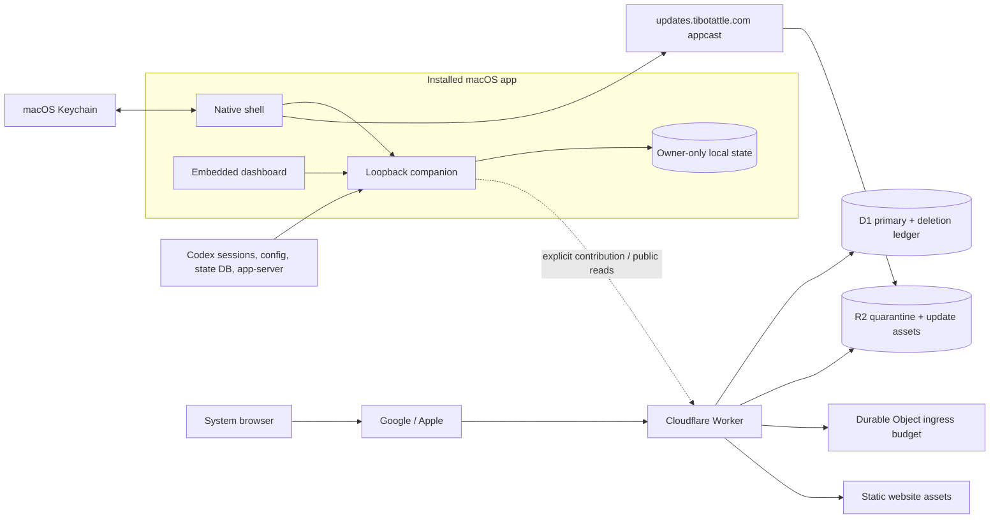

# System architecture and trust boundaries

TiboTattle is a local-first usage and quota companion with an optional hosted
community contribution service. Local analysis works without the hosted
service. Contribution, identity, public community data, release distribution,
and updates cross separate network boundaries and must never be treated as one
combined readiness claim.

## Deployed topology

Dashed traffic is optional. The local dashboard is not a remote website inside
the app: it is served by the loopback companion and admitted by a native
navigation allowlist.

## Component ownership

| Component | Responsibility | Does not own |
| --- | --- | --- |
| `src/` | Local/domain ingestion, accounting, identity, exports, contribution preparation, and durable state contracts. | UI composition, deployments, or native OS presentation. |
| `apps/local/` | Loopback HTTP composition, refresh lifecycle, dashboard projections, and fixed relays. | Arbitrary proxying or hosted persistence. |
| `apps/web/` | Shared dashboard/static public UI and browser localization. | Local filesystem or platform credential access. |
| `apps/macos/` | Native lifecycle, menus/settings, login item, Keychain broker, updater, and WKWebView policy. | Accounting semantics or hosted authorization. |
| `apps/worker/` | Public website, identity, participant/session/device lifecycle, ingestion, aggregates, admin operations, D1/R2/DO composition. | Local source discovery or private Mac state. |
| `packages/` | Runtime-neutral accounting, quota, identity, localization, and telemetry public APIs. | App-to-app imports or platform-specific side effects. |
| `scripts/` and `tools/` | Build, validation, release, migration, and operator entrypoints. | Runtime product dependencies. |
| `native/windows-filesystem/` | Narrow Windows filesystem/credential qualification boundary. | A supported Windows product claim. |

Architecture ownership is mechanically checked by
`npm run architecture:check`. Cross-surface imports must use reviewed public
facades; no application may reach through another application's private files.

## Local trust boundary

The installed app creates an owner-only state root at
`~/Library/Application Support/Usage Monitor`. The native shell passes that
exact absolute path to the companion. Standalone developer/CLI use defaults to
the platform-specific `app-usagemonitor` state directory unless explicitly
configured; this distinction is intentional and must be named in instructions.

The companion:

- binds only to a random loopback port;
- rejects non-loopback peers, unapproved Host headers, arbitrary paths, and
  unexpected query strings;
- serves a fixed dashboard/resource root that is separate from writable state;
- requires same-origin and route-specific review tokens for mutations; and
- publishes staged index/snapshot changes atomically so cancellation or failure
  leaves the previous good state readable.

The WKWebView admits only its current loopback origin, `about:`, and bounded
blob downloads. Provider identity pages open in the system browser. Native/web
bridge messages use a closed vocabulary documented in
[`api-surface.md`](./api-surface.md).

## Source boundary

Normal refresh reads narrowly defined local sources:

- Codex rollout metadata under `~/.codex/sessions` and
  `~/.codex/archived_sessions`;
- the top-level `service_tier` setting in `~/.codex/config.toml`;
- selected rollout names from `~/.codex/state_5.sqlite`, without retaining
  thread titles, working directories, prompts, or previews;
- content-free account, quota-window, and usage projections from a local
  `codex app-server` subprocess.

Claude prototype and benchmark readers remain outside the shipping source
boundary. The installed companion exposes no Claude or Gemini source setting,
route, UI, or upload surface. The complete field, persistence, and deletion
inventory is maintained in
[`local-data-and-privacy.md`](./local-data-and-privacy.md).

## Identity and authority separation

Do not collapse these identities:

| Identity | Location | Purpose |
| --- | --- | --- |
| Local session and source keys | Owner-only local SQLite/files | Replay-safe joins and deduplication on one machine. |
| Export participant secret | Keychain in the installed Mac app | Rotatable pseudonyms for explicitly reviewed exports. |
| Account observation secret | Keychain | Pseudonymous current account/quota attribution. |
| Hosted participant/session | D1 plus secure cookie | Website account, export, and device management; no self-service hosted erasure. |
| Hosted device credential | Keychain plus content-free local binding; digest/state in D1 | Consent-bound incremental upload authority. |
| Upload authorization | Short-lived D1 record | One-use contribution delivery. |
| Admin identity | Cloudflare Access assertion plus configured owner email | Owner-only operations host, including explicitly confirmed participant erasure with admin CSRF. |
| Release credential | Owner-controlled secret/Keychain profile | Appcast/update publication only. |

Raw account identifiers and credentials do not enter contribution payloads,
diagnostics, public aggregates, or documentation.

Prospective v1.1 account/era pseudonyms reuse the account-observation root under
a separate purpose and authenticated enrollment/destination binding. The upload
path only leases an existing root; it does not mint one or infer cross-device
continuity. Bracketed collection remains provisional evidence. Historical quota
occurrences and cumulative quantity bounds are a separate provenance layer.

Device credential use is serialized locally across delivery, pairing, renewal,
reset and credential-bearing review/capability reads. Before a rotation, the
contribution controller persists `device_repair_required`. Ordinary approval or
manual resume cannot bypass it. A validated remote receipt and local credential
commit are required before re-arming delivery; monthly renewal also persists
its scheduling hint. An ambiguous failure stays paused across restart without
retrying an old bearer. Local analysis and accepted history remain available.

## Hosted data flow

1. A participant starts Google or Apple sign-in. The Worker owns the provider
   callback; loopback receives only a bounded restart/result handoff.
2. Enrollment creates or reattaches the participant after explicit consent and
   configured admission controls.
3. Device pairing creates a short-lived claim. The native app stores the
   claimed credential in Keychain and retains only a content-free binding file.
4. The app shows an exact local contribution preview before first approval.
5. Each upload uses a one-use authorization, closed JSON Schema validation,
   encryption, idempotency/deduplication, ingress budgets, and staged D1/R2
   bookkeeping.
6. Scheduled aggregation publishes only eligible derived cohorts. Missing,
   stale, or unavailable evidence remains explicit rather than becoming zero.
7. Participant export and device revoke/disconnect are separate authenticated
   lifecycles. Confirmed **Disconnect this Mac** removes this device's authority,
   not hosted or local history.
8. Private owner erasure uses the existing admin maintenance action, not a
   participant session or device capability. It preserves the upload fence,
   aggregate withdrawal/rebuild, independent tombstone, identity cooldown, R2
   cleanup, and fenced database removal, with resumable audit-backed attempts.

Self-service `DELETE /api/v1/me` is retired under the
[2026-08-30 source decision](../decisions/2026-08-30-self-service-deletion-retirement.md).
The source retirement does not establish deployment, change retention, or
remove deletion-safe restore; the baseline review commit above predates it.

The full HTTP inventory and authority model is in
[`api-surface.md`](./api-surface.md).

### Attribution-correct analytical selection

The shared quota-analysis package builds plan/conflict eras from all admitted
quota evidence before fit filtering. Local reset estimates are plan-selected;
unresolved quantity only blocks intervals it could contribute to. Positively
identified other-account usage does not poison an unrelated account. An absent
account key by itself does not discard coherent legacy plan history.

Hosted legacy quota, usage, daily totals and model composition share one pinned
winning-device/day vector. Its exact journal fingerprint and participant input
revision accompany existing fit/composition caches; the global mutation epoch
fences the existing publication singleton and admin preview. Changed input
invalidates publication atomically. Fragment selection occurs after fit/coverage
gates and cannot give one reset multiple votes. Public Pro-equivalent conversion
and existing cohort limits are unchanged.

The staged v1.1 path adds immutable day manifests and a complete-domain head.
First activation uses a null predecessor plus the observed legacy fingerprint;
successors preserve every selected prior occurrence's base accounting. Candidate
arrival is not publication. A transactional head switch selects v1.1 for the
whole participant domain, queues daily rebuilds and invalidates prior caches.
Even an explicit admission-floor rollback cannot silently select a legacy day
outside that domain. Any accepted v0.2 corpus prevents a v1.1 consent upgrade
and activation until a semantic replacement mapping is proven, including when
its dates do not overlap the candidate. This preserves the existing v0.2 source
instead of hiding it behind a participant-wide successor head. Identical complete vectors acknowledge the
existing generation without cache churn when no source revision changed.

The local runner retains an owner-only, closed progress journal beside the
index (at most 1 MiB). It contains completed day-manifest digests and bounded
control fingerprints, not account markers, root bytes, provider identifiers or
session content. Each invocation checks consent and predecessor continuity;
publication or marker-presence changes revalidate the completed prefix locally.
A changed day restarts only the affected suffix, while a new day can extend the
vector. Interrupted staging is not analytical acknowledgment.

Closure is bounded to 4,096 contiguous days and 30,000 chunks (at most 6,000,000
records); larger transfers pause without deleting or silently truncating history.
Hosted fitting has a bounded 100-day evidence horizon and remains conditional:
the wire format does not prove complete historical quantity intervals. No
scoped-primary account billing claim is introduced by the new transport.

## Hosted storage

| Store | Current role | Boundary |
| --- | --- | --- |
| Primary D1 | Identities, sessions, devices, upload authorizations, contribution metadata/derived records, aggregates, controls, admin audit. | Schema migrations are ordered and production application is protected. |
| Deletion-ledger D1 | Tombstones that suppress restore replay after participant deletion. | A restore is unsafe until ledger replay/readiness passes. |
| Quarantine R2 | Encrypted/raw contribution object lifecycle and reconciliation. | Database/object registration is journaled; orphan and referenced objects are distinguished. Age-based deletion is currently disabled in shipped source. |
| Update R2 | Stable appcast and release assets behind the reviewed update origin. | Publication uses digest/size/signature/nonce checks and is separate from Worker deployment. |
| Upload ingress Durable Object | Shared concurrency and start-rate admission. | It protects expensive body reads/processing; it is not participant storage. |
| Static assets | Public website and application UI assets. | Unknown API routes never fall through to the SPA. |

## Release and deployment gates

These are independent:

1. source and unit tests;
2. local/browser rendering;
3. native app and installed-state behavior;
4. signed/notarized artifact evidence;
5. GitHub release publication;
6. appcast/update publication;
7. Worker deployment and migrations;
8. live endpoint checks; and
9. physical platform qualification.

See [`../current-status.md`](../current-status.md) for the latest explicitly
verified snapshot and [`../runbooks/production-operations.md`](../runbooks/production-operations.md)
for protected operations.

## Change contract

A change that adds or removes a source, route, bridge message, credential,
store, schema, migration, binding, network destination, or release surface must
update in the same change:

- the closest source registry or allowlist;
- negative and parity tests;
- this architecture reference and the relevant privacy/API/schema reference;
- public disclosure or first-run copy when user-visible access changes; and
- the current status/support matrix when a qualification gate changes.

When an old architecture document is no longer accurate and supplies no
enduring decision, audit, recovery, or release value, delete it with `git rm`
and repair every inbound link. Do not preserve obsolete instructions merely to
avoid deleting documentation.
