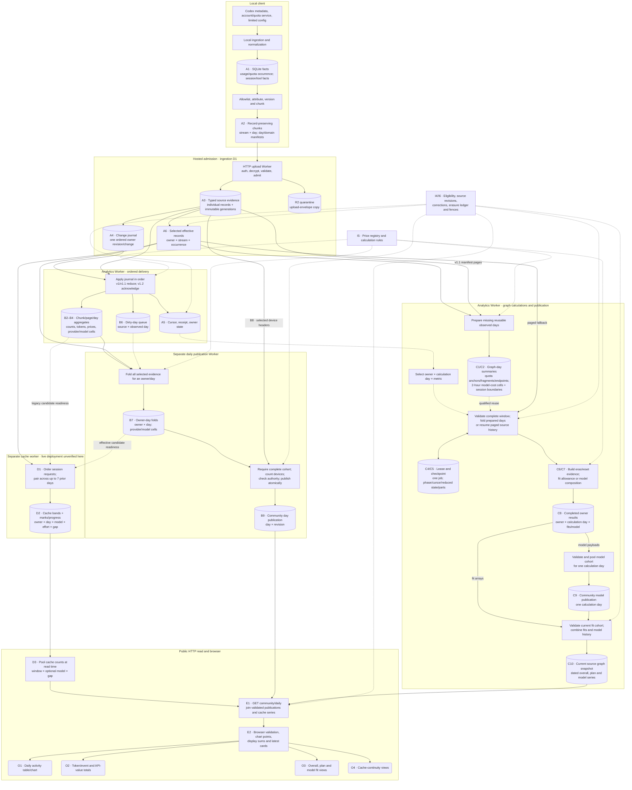
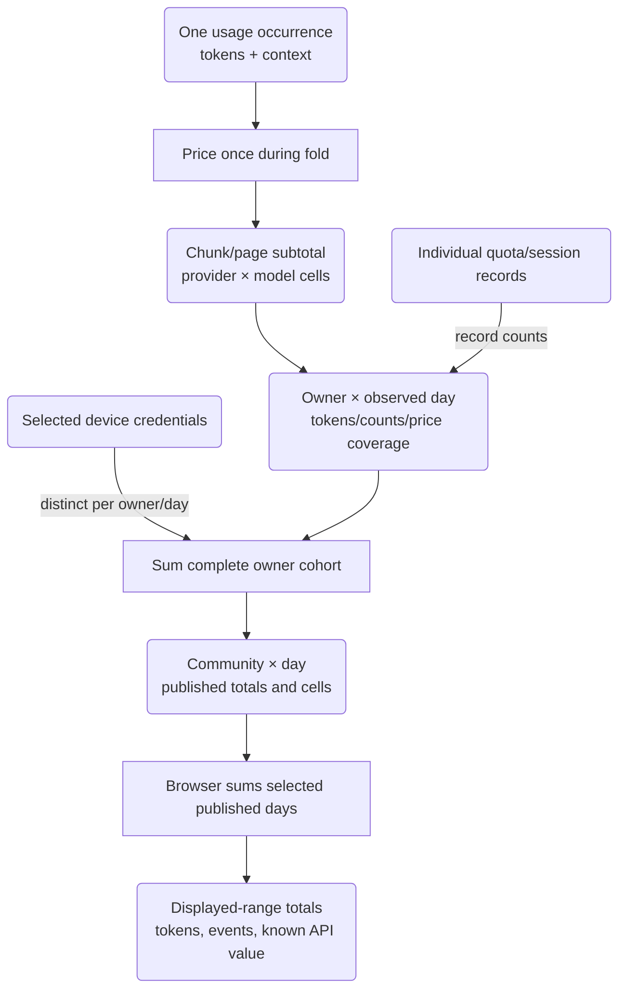
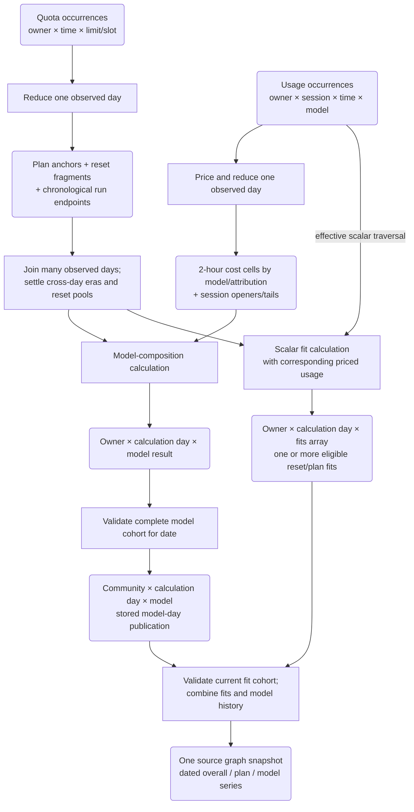
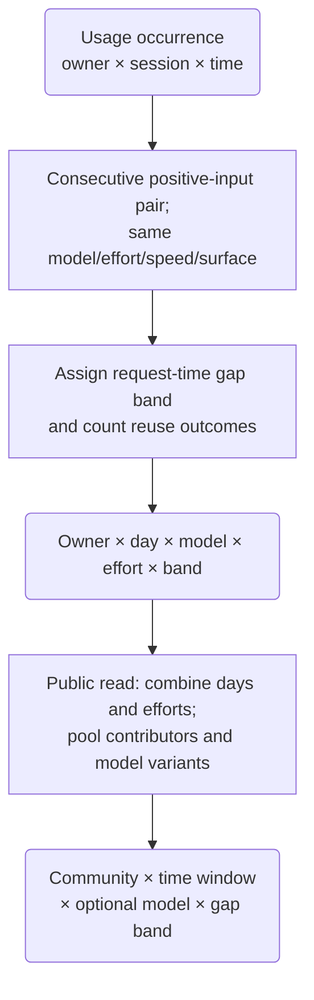

# Analytics artifact and process catalog

## Scope and evidence

This is an explanatory snapshot of the hosted community analytics discussed on
September 28: activity/counts, API-equivalent value, allowance/fit graphs and
cache continuity. It follows their inputs from the local client through hosted
processing to the browser. Personal-only analytics, synthetic speed examples,
release distribution and identity-provider implementation are outside this map.

Source was inspected at `23575017c61d7b83093227d71e09096e50cf7bd1`.
The [deployment receipt](../receipts/2026-09-28-effective-usage-throughput.md)
last verified that analytics revision at 14:07 UTC on September 28. The separate
daily publisher was on `ba7f00b28a32cc839f420db32dec7009b31e884b`; its daily
publication, device-count and authority files match the inspected revision.
This document is a source map and uses that recorded deployment boundary; it is
not a fresh production inventory or a processing-progress report.

The new effective-usage summaries were deployed, but the recorded canary did
not exercise their production build/reuse path. The separate cache-continuity
and standalone graph-day builder entrypoints are implemented in source; their
live deployments, schedules and shard counts were not established by this
receipt. They are explicitly labeled below. Current operational authority
remains the [production runbook](../runbooks/production-operations.md).

This catalog preserves today's physical version-specific paths. The v1.1 manifest
page/reusable-day lane is genuinely v1.1-specific; the effective readers and newer
effective day summaries reconcile v1, v1.1 and v1.2 separately. A v1.1 name on a
shared analytical helper does not by itself imply an input-version restriction.
The [second architecture plan](../plans/2026-09-28-analytics-redesign.md) proposes
one shared downstream contract and removes uploader-based scheduling, while
preserving deduplication, measurement continuity and output membership semantics.

## How to read granularity

- **Occurrence:** one usage event, quota observation or session-dimension record.
  Its identity includes the owner/source/stream context. Usage-event count is
  not a count of user turns.
- **Owner:** an analytical contributor identity, with device linkage and eligible
  source history. It is not a verified unique human. Device counts concern
  selected device credentials, not a physical-hardware census.
- **Observed day:** the UTC calendar day of source evidence.
- **Calculation day:** the date a graph result answers for. Its input spans many
  observed days. The current helper starts 100 days before this date and ends
  just before the following UTC day: up to 101 calendar dates, rather than
  exactly 100 daily buckets.
- **Quota window/reset:** a provider limit interval, such as a seven-day window.
  This is different from the multi-day evidence horizon and a chart's date range.
- **Chunk/page:** a transport or storage batch. It does not necessarily change
  analytical granularity. Some pages contain records; others contain reduced
  summaries or serialized checkpoint parts.
- **Selection** chooses admissible/current evidence while keeping record grain.
  **Reduction** combines records and drops detail that the consumer does not
  need. **Checkpoint** saves unfinished work. **Publication** makes a complete,
  validated result available to readers.

Source IDs, method versions, dependency digests and authority revisions qualify
the keys below even where the table abbreviates them. A matching date alone is
never enough to reuse an artifact.

## Inputs and final outputs

| ID | Input | Logical grain |
| --- | --- | --- |
| I1 | Sanitized usage: token components, timestamp, model, reasoning effort, speed/tier/surface, context size and outcome | One usage occurrence within a session |
| I2 | Quota: observed percentage, duration, reset, limit and plan | One observation of one limit/slot at one time |
| I3 | Session metadata and tool-category counts | One session-dimension record; tool counts are category aggregates |
| I4 | Account/plan attribution, contributor/device linkage, source versions, manifests and corrections | Record, device, owner, day-manifest or generation, depending on the proof |
| I5 | API price registry, plan conversion factors and calculation policy | Versioned model/tier/context/date prices and versioned method rules |
| I6 | Sharing/source eligibility, collection controls and erasure state | Device/owner/source authority and policy revisions |

| ID | Consumer output | Final grain |
| --- | --- | --- |
| O1 | Daily activity table/chart: usage events, tokens, contributing devices and quota-observation counts | Community × UTC day; supported breakdown cells add provider/model |
| O2 | Activity headline totals and API-equivalent dollar value with coverage | Sum over the displayed published days; latest activity date |
| O3 | Overall, per-plan and per-model allowance/fit graphs and latest cards | Community × calculation date × view/plan/model, with estimates, ranges and evidence counts |
| O4 | Cache-continuity curve/table and evidence counts | Community × selected time window × optional model × request-gap band |

The three measurement contracts and newer continuity fields are described in
[schema contracts](../reference/schema-contracts.md). Normal local sources are
listed in [local data and privacy](../reference/local-data-and-privacy.md).

## A. Local preparation, admission and delivery

| ID / artifact | Input grain → artifact grain | Producing process and storage | Reuse / meaning |
| --- | --- | --- | --- |
| A1. Local normalized ledger | Allowlisted source metadata → individual usage/quota occurrences, session/tool facts | Local companion/domain ingestion; owner-only SQLite tables including `usage_event`, `quota_observation`, `quota_occurrence`, `tool_class_count`, `usage_event_boundary` | Incremental source cursors, lineage and index generations make replay resumable. This is the local measurement base. |
| A2. Prepared contribution and sync journal | Local facts → versioned stream × UTC day × chunk, with individual records retained | Contribution projection produces immutable chunks, day manifests and a multi-day domain manifest; v1.1/v1.2 chunks hold at most 200 records. Local sync journal records completed manifest digests and continuation state | Chunking packages records; it does not total them. A day manifest proves chunk membership/completeness; a domain identifies a complete ordered day set. |
| A3. Accepted hosted evidence | Upload chunk → individual admitted records plus chunk/day/generation headers | Main HTTP Worker authenticates, decrypts, validates and admits into ingestion D1: `typed_telemetry_records` and usage/quota/session subtypes for v1/v1.1; `telemetry_v12_records` and subtypes for v1.2 | Immutable retained variants and complete-domain activation preserve source evidence. R2 `QUARANTINE` holds a tracked upload-envelope copy beside this path; analytics reads typed D1, not R2. |
| A4. Ingestion change journal | Accepted activation/change/terminal action → one ordered owner revision/change event | Source D1 `storage_ingestion_changes`; source transaction records the digest-only event | This is an outbox of accepted changes, not one journal row per usage event. Global sequence orders delivery; owner revision identifies the owner's change. |
| A5. Delivery acknowledgments and owner state | Ordered journal entries → one applied-event receipt plus source cursor and owner state | Analytics Worker; target D1 `analytics_applied_events`, `analytics_source_cursors`, `analytics_owner_state` | Retries converge; a cursor advances only after its work is durably applied. Delivery progress is separate from public publication. |
| A6. Effective occurrence view | Overlapping v1/v1.1/v1.2 records and corrections → one reconciled occurrence per owner/day/stream | Correction-aware source D1 reader, exposed as bounded pages by `readEffectiveTelemetryOwnerDayPage` | A logical selection/normalization, not a second full record store. Conflicts or incomplete evidence block the relevant work. Older accepted evidence has separate compatibility paths, including retained legacy allowance inputs. |

Sources: [local schema](../reference/unified-index-schema.md),
[contribution preparation](../../src/contribution/telemetry-v11-chunks.js),
[admission routes](../../apps/worker/src/index.ts),
[delivery journal](../../apps/worker/src/analytics-delivery.ts),
[effective reader](../../apps/worker/src/telemetry-usage-effective-reader.ts).

## B. Daily activity and API-value artifacts

| ID / artifact | Input grain → artifact grain | Producing process and storage | Reuse / meaning |
| --- | --- | --- | --- |
| B1. Per-event price result | One usage event + price/tier/context/date → known nanodollars and full/partial/unpriced status | Pure server pricing during a fold; generally transient | Preserves coverage. Subscription usage is valued by the configured API-equivalent method; this is not a subscription bill. |
| B2. v1 chunk summary | One accepted source chunk → counters, token sums, price sums and provider/model cells for that chunk/day | Delivery phase, `analytics_v1_chunk_values` | Lossy reduction, keyed by source/owner/chunk slot and forward revision. It is not a copy of the raw chunk. |
| B3. v1.1 page partials and projection work | Up to 200 source occurrences → one partial aggregate, plus day/stream/occurrence cursor | Delivery phase, `analytics_v11_value_pages` and `analytics_v11_projection_work` | Pages store reduced counts/tokens/prices/model cells, not raw events. Work can resume without recomputing completed pages. |
| B4. Complete reusable v1.1 day | Complete page partials → one complete device/manifest/day summary | Delivery phase, `analytics_v11_reusable_values`; generation/day references in `analytics_v11_day_references`, active owner head in `analytics_v11_owner_heads` | Reused across successor generations when the immutable day identity and schema/pricing contract match. A changed day gets new work. |
| B5. v1.2 delivery receipt | Activated successor generation → acknowledgement and changed-day queue entries | Delivery phase, `advanceV12StorageAcknowledgement`; source records remain in ingestion D1 | No v1.2 raw-record copy or equivalent v1.1 delivery summary is built here. Later effective reads perform the owner-day reduction. |
| B6. Dirty-day queue | Changed source chunks/domains or authority → one pending source × UTC day revision | Delivery/activation/terminal handling, `analytics_community_daily_queue` | Coalesces a need to rebuild a day. One queued date can contain substantial work across many owners. |
| B7. Daily owner fold | Selected chunk/day summaries, or effective occurrence pages → owner × observed day totals and provider/model cells | Separate daily publisher, `analytics_community_daily_owners`, including cursor/completion metadata | Reduced tokens, usage/quota/session counts and priced coverage. Reuse requires matching owner/input revision, source family and pricing method. Effective reads page the three streams separately. |
| B8. Contributing-device counts | Selected, nonempty admitted source headers → distinct selected device credentials per contributing owner/day | Daily publisher reads source D1; then sums counts across contributing owners | Follows the same source selection as the fold. An owner contributes at least one device; the meaning is not simply owner count. |
| B9. Published community day | All complete current owner-day folds + device counts → one community × UTC day × publication revision | Daily publisher, `analytics_community_daily_publications` and `analytics_community_daily_heads` | Immutable payload with totals, spend/coverage and provider/model cells. Public cells are bounded to 100; overall totals remain separate. Publication requires the whole captured eligible cohort and fresh authority checks. |

Sources: [v1 delivery](../../apps/worker/src/v1-daily-projection.ts),
[v1.1 delivery](../../apps/worker/src/v11-daily-projection.ts),
[daily arithmetic](../../apps/worker/src/v11-daily-projection-values.ts),
[v1.2 acknowledgment](../../apps/worker/src/v12-storage-journal.ts),
[owner folds and publication](../../apps/worker/src/storage-community-daily.ts),
[device counting](../../apps/worker/src/storage-community-daily-devices.ts),
[daily tables](../../apps/worker/analytics-migrations/0007_community_daily_publication.sql).

## C. Allowance and model-fit artifacts

Daily activity totals are not sufficient inputs for allowance fitting. The fit
needs quota changes, plan/account continuity, pricing coverage and timing within
windows. Model composition also needs within-day cost bins and session boundary
state. This is why there are several different artifacts called a “day.”

Prepared-day identity also depends on the source family. A v1.1 prepared value
belongs to **owner × device × immutable manifest × observed day**. An effective
prepared value belongs to **owner × observed day**, after cross-device occurrence
reconciliation, and uses an `effective-owner` device sentinel. Both identities
also include source namespace/layout, exact dependency digest and acquisition
version; effective usage additionally pins pricing/method identity.

| ID / artifact | Input grain → artifact grain | Producing process and storage | Reuse / meaning |
| --- | --- | --- | --- |
| C1. Prepared quota day | One owner's admitted quota observations in one UTC day → plan anchors, reset/plan fragments and run endpoints | Analytics graph preparation; `analytics_graph_day_values` and component `analytics_graph_day_pages`. The legacy v1.1 projection can include usage too; effective quota uses a separate layout | A compact structured reduction, not a daily average percentage. It retains the anchors/endpoints needed to reconstruct cross-day eras, reset pools and fit eligibility. Exact day dependencies and acquisition version qualify reuse. |
| C2. Prepared model-usage day | One owner's usage occurrences in one UTC day → **2-hour bin × attribution × account-break × model** cost/count cells, plus one opener and final state per session | Graph-day reduction or inline effective model preparation; same graph-day store with distinct `effective-usage` layout | Openers/tails preserve account transitions across midnight; an exact rows-read scalar preserves resource limits. Price/method digest qualifies identity. These are model inputs; effective scalar fits still traverse usage separately. |
| C3. Prepared-day coverage and refusals | Requested multi-day window → complete matching day set, missing-day list or bounded refusal | Graph job validates stored heads/pages and source dependencies; `analytics_graph_day_refusals` plus bounded checkpoint state | Reuse only when complete, exact and within bounds. Missing/unsuitable preparation uses the resumable paged calculation. Cache refusal does not become a fabricated analytical result. |
| C4. Work selection, lease and scan cursor | Eligible owners and target dates → one owner × calculation day × metric (`fits` or `model`) job | Analytics scheduler; `analytics_community_graph_work_selection`, `analytics_community_graph_scan` | Pins the selected source/dependency and guards competing invocations with a compare-and-swap claim. A lease is not a measurement or completed result. |
| C5. History/calculation checkpoint | A partial multi-day job → phase/cursors, accumulated reduced state, preparation state and serialized parts | Analytics graph runner; `analytics_history_checkpoint_stages`, `_heads`, `_parts` | Atomic head promotion makes interrupted saves recoverable. Storage parts are not fit samples or published dates. Checkpoint key includes job/dependency/method identity. |
| C6. Plan eras, quota fragments and scalar fits | Chronological quota history + corresponding priced usage → eligible reset/plan fragments and fitted allowance estimates | Shared quota-analysis kernel and hosted adapters; transient/reduced checkpoint state, then fits payload | Windows can cross UTC days. Evidence/coverage filtering occurs before fit selection; one reset must not gain extra votes because it was split into fragments. |
| C7. Model composition result | Quota evidence + eligible priced model usage across the calculation window → one owner's composition/model result | Model analysis kernel; prepared-day fold where qualified, paged fallback otherwise | Retains model-specific evidence/refusals. A two-hour usage cell is an input to this analysis, not itself a final allowance estimate. |
| C8. Completed owner graph result | Complete job → one **source × owner × metric × calculation day** row | Analytics Worker, `analytics_community_graph_results`; payload is a fit array or model-composition result | A row can hold several fits/models. It is reused only with its valid source/method/dependency contract. A completed owner row does not establish whole-community completeness. |
| C9. Historical community model day | Complete validated owner model cohort → community × calculation day model payload | Analytics graph publication, `analytics_community_model_publications` | Revalidates exact closed-window dependencies and authority; ordinary input changes allow the last completed published result to remain visible while replacement is built. |
| C10. Current allowance preview/publication | Complete current fit cohort + retained historical model publications → one source-level graph snapshot containing dated series | Analytics graph publication, `analytics_community_graph_previews` | Produces overall/per-plan summaries, ranges and evidence counts, with model history for public projection. A current-fit refresh and a historical model-day completion are separate milestones. |

Sources: [prepared component definitions](../../apps/worker/src/graph-day-projection-values.ts),
[projection storage and builder](../../apps/worker/src/graph-day-projection.ts),
[effective quota preparation](../../apps/worker/src/storage-effective-quota-days.ts),
[effective usage preparation](../../apps/worker/src/storage-effective-usage-days.ts),
[calculation window](../../apps/worker/src/model-history-window.ts),
[graph work selection](../../apps/worker/src/storage-community-graph-work.ts),
[graph runner/results](../../apps/worker/src/storage-community-graph.ts),
[graph publication](../../apps/worker/src/storage-community-graph-publication.ts),
[checkpoint storage](../../apps/worker/analytics-migrations/0010_history_checkpoints.sql).

## D. Cache-continuity artifacts

| ID / artifact | Input grain → artifact grain | Producing process and storage | Reuse / meaning |
| --- | --- | --- | --- |
| D1. Pairing work and carry dependencies | An owner/day's usage plus up to seven prior days → ordered per-session adjacency work and source dependency proof | Separate `cache-retention-day-worker.ts`; effective layout uses `analytics_cache_retention_day_progress`; carry proofs in `analytics_cache_retention_day_carry` | Builds pairs of consecutive positive-input requests in the same owner-scoped session, with matching model, effort, speed and surface. Cross-day evidence prevents midnight from breaking a valid pair. |
| D2. Owner-day cache bands and completion mark | Candidate same-configuration pairs within the seven-day gap → **owner × observed day × model × effort × gap band** integer counters, including exclusions | `analytics_cache_retention_day_bands`, `_values`, `_marks`, atomically promoted by the cache worker | Ten gap bands; comparable pairs enter adjacency/reuse counts, while insufficient evidence or contracted context enters exclusion counters. Speed/surface are pair-equality filters, not output grouping dimensions. Key includes day and seven-day carry dependencies plus method. |
| D3. Public pooled cache series | Current owner-day bands → community × day/week/month/all window × optional model × gap band | Bounded aggregation by the public HTTP reader, `readCacheRetentionCommunitySeries`; response object, not a persisted community publication table | Pools counters, calculates rates, contributor counts/concentration and model variants. Effort is combined in this public read. Session totals across days/groups are an upper bound, not a globally distinct-session census. |

Sources: [cache worker](../../apps/worker/src/cache-retention-day-worker.ts),
[cache reducer](../../apps/worker/src/cache-retention-values.ts),
[cache store and public pooling](../../apps/worker/src/cache-retention-day.ts).
Current cache arithmetic remains request-scoped; v1.2 turn/compaction flags do
not change it. The gap is measured between recorded request completion times.
Public day/week/month windows comprise UTC calendar days ending today; “day”
means today, not a rolling 24 hours. The standalone worker's live deployment
was not verified here.

## E. Serving, display and operational artifacts

| ID / artifact | Input grain → artifact grain | Producer / significance |
| --- | --- | --- |
| E1. Public response | Published day range + graph snapshot + pooled cache series → one requested range response | Main HTTP Worker, `GET /api/v1/community/daily?from=...&to=...`; verifies authority/hash/visibility and joins prepared results. It does not rerun historical fits. Cache pooling is bounded read-time arithmetic. |
| E2. Browser display model | Validated response → chart points, table rows, latest cards and headline totals | Public web JavaScript validates/normalizes data, sums published activity/spend days and derives display scales. A headline total is generally this sum, not another background all-time calculation. |
| E3. Terminal fences and retirement work | Erasure/policy change or superseded dependencies → owner/source epochs, containment fences and reclaimable artifact pages | Source/analytics workers and deletion ledger; blocks withdrawn evidence, invalidates affected results and retires obsolete checkpoints/summaries in bounded work. This controls validity; it adds no usage measurements. |
| E4. Operational progress and failure summaries | Journal, queue, fold/checkpoint/result/publication state and bounded failures → admin diagnostics | Admin read paths and scheduled logs. “Applied change,” “prepared day,” “checkpoint part,” “completed result” and “published date” are different counters. |

Sources: [HTTP composition](../../apps/worker/src/index.ts),
[published reads](../../apps/worker/src/storage-community-daily.ts),
[browser data validation](../../apps/web/public/community-data.js),
[browser display calculations](../../apps/web/public/community-view.js),
[analytics progress](../../apps/worker/src/storage-community-progress.ts),
[erasure](../../apps/worker/src/storage-erasure.ts).

## Process and service map

These budgets are the application's configured statement ceilings, not a new
claim about Cloudflare platform limits.

| Process | Trigger / work boundary | Technology and ownership | Evidence boundary |
| --- | --- | --- | --- |
| Local ingest and preparation | Local refresh; foreground contribution sync respecting saved sharing choice | Local companion/domain JavaScript, SQLite, bounded immutable versioned JSON preparation | Source verified; installed-client revisions can differ |
| Main HTTP Worker | Upload requests and public/admin reads; separate lifecycle schedule | Cloudflare Worker; ingestion D1, analytics D1 for published reads, R2 quarantine, ingress-budget Durable Object, separate deletion-ledger D1 | HTTP composition verified in source; this document does not redeploy or requalify that service |
| Analytics Worker | Minute trigger; ordinary 55-second work window; every tenth UTC minute up to eight minutes | `storage-analytics-worker.ts`; one shared **950-statement** meter. Delivery starts with a 10-second / 175-statement slice, then graph/preparation work uses the remaining invocation budget. Durable leases/cursors/checkpoints | Source `23575017` and minute schedule verified in the cited receipt; delivery catch-up boost absent |
| Daily publication Worker | Separate minute schedule, 55-second work window | `storage-publication-worker.ts`; own **900-statement** meter, bounded steps; reads source D1 and writes analytics D1 | Source `ba7f00b` verified separately in the receipt |
| Standalone graph-day builder | Independent scheduled entrypoint, explicitly gated; can be sharded by owner | `graph-day-projection-worker.ts`; prepares reusable v1.1 graph inputs. Main analytics can also run a gated preparation lane; effective summaries are prepared inline under graph jobs | Source capability; standalone deployment and switches not freshly verified |
| Cache-continuity Worker | Independent scheduled entrypoint, explicitly gated; can be sharded by owner | `cache-retention-day-worker.ts`; reads source D1, writes analytics D1; source defaults include four-minute window, 1,000-statement meter, up to 12 candidate days | Source capability; live schedule, budget overrides and shard count not verified |
| Browser | Public data fetch and user-selected views | Static web JavaScript; validates, sums and renders bounded public payloads | Source verified; no new production browser qualification in this exercise |

The main analytics and daily publisher are separate invocations with separate
budgets. Within the main analytics invocation, a new phase does not create a
new budget. SQL work queues shown below are D1 tables; they are not Cloudflare
Queues. Bounded Queue concurrency and D1 read replicas remain deferred in the
cited throughput receipt.

## Full system diagram

Rectangles are processes; cylinders are persisted artifacts; rounded boxes are
logical/transient values or final views. Solid arrows carry evidence/results;
dashed arrows carry control, eligibility or an optional reuse path. IDs refer
to the catalog above. A store cylinder can represent several related tables.

The graph's `GPREP` box combines two implementations: v1.1 preparation can run
in a gated main-analytics lane or standalone builder; effective quota/usage
preparation runs inline under the claimed graph job. It does not imply that
all of those services are simultaneously deployed. Legacy non-effective
readers are abbreviated in the diagram and retained in the catalog.

## Granularity transformations in detail

### Activity and money

The effective lane can feed occurrence pages directly into the owner-day fold;
the chunk subtotal is a version-specific shortcut, not a mandatory new level
for every source. Quota/session records add counts, not token usage or spend.

### Allowance and model composition

Prepared daily quota fragments are not complete fits. Prepared usage cells are
not model-capacity estimates. The reset/window and cross-day transformations
must still occur. Full matching preparation allows the source-row acquisition
to be reused across overlapping jobs; it does not remove downstream fitting.

### Cache continuity

## Practical interpretation

1. **There are three different day reductions:** activity/spend totals,
   graph inputs that preserve fitting structure, and cache-adjacency bands.
   They answer different questions and cannot generally replace one another.
2. **A transport chunk is not an aggregation grain.** The important reductions
   happen when events become totals, cost cells, quota fragments or pair counts.
3. **Owner-day and calculation-day are different.** A graph point for one date
   can consume many observed days and several provider reset windows.
4. **Prepared inputs, checkpoints, completed owner results and publications are
   four different milestones.** Improving one does not by itself establish
   faster end-to-end publication.
5. **Public activity and graph work have separate publication paths.** Their
   backlogs and freshness can move independently. Cache continuity adds another
   independent production path and read-time pooling step.
6. **Most large reductions are persisted; display totals are small reductions.**
   The browser sums already-published daily values and renders graph data. Public
   reads do not rerun the owner history/calibration pipeline.

## Validation of this catalog

The inventory was checked against the pinned source, migration keys, producer
call sites, public read composition and the dated deployment receipt. It
contains no production payload rows or private account identifiers.

- `npm run docs:check`: passed, including the new untracked document.
- `npm run test:preflight`: passed; 20 documentation/guidance tests passed.
- All four Mermaid diagrams rendered in Chrome; rendered catalog hierarchy,
  tables and diagram labels were inspected.

These checks validate the document. Source inspection alone is not live
deployment proof.
