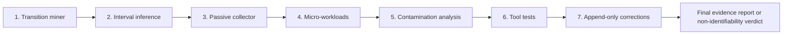

# Usage Monitor v0.3 Evidence-Gated Goal

## Goal

Build and validate a local-only system that reconstructs coding-agent usage at standard API prices, aligns that activity with provider-reported quota transitions, and produces either an evidence-backed capacity range or a clear non-identifiability verdict.

The system must not claim to reveal OpenAI's internal quota formula. It must identify which API-price-equivalent models remain consistent with observed data, expose competing explanations, and refuse conclusions when the observations do not identify a result.

Work through the seven milestones below in order. A later milestone may receive read-only design preparation, but implementation must not begin until the preceding acceptance gate passes and its decision is recorded as `proceed`, `revise`, or `stop`.

## Completion snapshot

- Observation schema `0.2` and later derived artifacts use standard API-priced usage rather than Codex subscription credits.
- Codex rollout token-count records do not expose per-request API tier or Fast mode; parser `0.3.1` records that absence and the explicit standard-tier API-price assumption separately from per-event long-context state. A later official-docs check established that ChatGPT Codex Fast and API Priority are distinct mechanisms and must be captured as separate future fields.
- The live inference remains `non_identifiable`; the provisional `$1,886.70` statistic fails exact, holdout, control-state, and change-point gates and is not a reported capacity.
- Local Codex token-count events expose integer `used_percent`, duration, reset, and limit metadata, but no absolute remaining allowance or sub-percent counter. The descriptive `report` path always refuses a capacity; only the interval-censored `infer` path may identify one.
- Forked rollout history is deduplicated using chronological cumulative-snapshot identity. The former 471-event `unknown` bucket was copied history, not a hidden model, and is corrected append-only in the effective view.
- Historical transition mining, passive collection, controlled-workload gating, contamination analysis, tool-mechanism classification, and correction provenance are all implemented and validated.
- The final evidence and missing-data verdict are recorded in [Usage Monitor v0.3 Final Validation](./2026-07-23-usage-monitor-v03-final-validation.md).

## Global constraints

### Privacy

Measurement artifacts must not contain:

- prompts or response content;
- credentials, auth headers, or tokens;
- stable account, organization, user, session, or device identifiers;
- repository paths, filenames, branch names, or project names;
- tool arguments, shell commands, file contents, or URLs derived from conversations.

Allowed local measurement fields are limited to timestamps, coarse client/provider metadata, quota-window identity, integer usage percentage, reset metadata, model name, disjoint token counters, pricing provenance, aggregate tool class, diagnostics, experiment labels, estimator versions, and explicitly consented coarse cohort fields.

Observation files and checkpoints must be owner-readable only. Raw Codex and Claude files remain read-only inputs and must never be modified.

### Pricing

- Use standard OpenAI API prices, not Codex subscription credit rates.
- Price each request-like event at the price effective at its timestamp.
- Preserve cached reads, cache writes, uncached input, text output, reasoning output, long-context conditions, service tier, and tool units as separate semantics.
- Unknown models or components remain explicit and unpriced. Never silently select a nearby model or zero a component.
- Retain source URL, source retrieval/check time, selected price card, estimator version, and all warnings.

### Evidence

- Separate provider facts, local observations, assumptions, and model judgments.
- Keep five-hour, weekly, named preview, and any other limit buckets separate.
- Group only observations with the same provider, plan/limit ID, slot, duration, and reset identity.
- Do not treat official daily token buckets as a complete or real-time denominator.
- Do not pool controlled and uncontrolled intervals without a sensitivity view.
- Passing unit tests alone is not completion: every milestone that changes a user-facing or live-data path requires a proportionate live smoke.

## Milestone 1: Historical quota-transition miner

### Objective

Recover the quota transitions already present in local rollout history and join them to replay-safe, request-aware API-price usage.

### Work

1. Read Codex session and archived rollout JSONL incrementally.
2. Parse token-count events, rate-limit snapshots, model contexts, cumulative/last usage, and safe aggregate tool classes.
3. Build chronological parent/fork lineage from local structural metadata without persisting stable session identifiers.
4. Deduplicate copied fork history using exact cumulative-snapshot identity and retain only new child usage.
5. Canonicalize each quota window using provider, plan/limit ID, slot, duration, and reset timestamp.
6. Normalize input into disjoint components:
   - uncached input;
   - cache-read input;
   - cache-write input;
   - text output;
   - reasoning output.
7. Price each request-like delta with RunCost at standard API rates and preserve price-source warnings.
8. Collapse repeated integer quota snapshots into transition boundaries while retaining:
   - last priced event observed at percentage `p`;
   - first priced event observed at the next distinct percentage;
   - intervening cost and token interval;
   - snapshot source and age;
   - local coverage and replay diagnostics.
9. Emit a versioned, owner-only transition dataset and a human-readable audit.

### Required transition fields

- schema and parser version;
- provider and sanitized plan/limit classification;
- window slot, duration, reset identity, and event time;
- prior and next displayed percentage;
- last-prior and first-next cumulative API-priced USD;
- marginal API-priced USD and token components;
- model mix and aggregate tool-class mix;
- controlled/uncontrolled/unknown interval state;
- snapshot source and staleness;
- replay, malformed-line, coverage, attribution, and pricing warnings.

### Tests

- ordinary monotonic transitions;
- repeated identical snapshots;
- skipped percentage values;
- percentage regression within one reset;
- reset between adjacent events;
- five-hour and weekly snapshots on the same event;
- parent/fork replay plus legitimate child usage;
- active/archive duplicate rollout;
- missing/null rate limits;
- malformed or truncated final JSONL line;
- unknown model and unpriced component;
- deterministic rerun with byte-identical normalized output.

### Acceptance gate

- Fixture tests pass without weakened assertions.
- Two identical runs over unchanged local inputs produce the same transition dataset.
- A live historical run reports input coverage, replay exclusions, malformed records, gaps, reset groups, and transition counts.
- Manual inspection confirms no conversation content, paths, filenames, arguments, or stable identifiers are stored.
- Parent/fork history is counted once and every retained priced event has defensible model attribution.

### Decision record

Proceed only if the local history yields usable transition boundaries. Revise the parser if results depend on file traversal order or replay heuristics. Stop the capacity-inference lane if trustworthy transitions cannot be recovered.

**Gate result (2026-07-23): `proceed`.** See [the Milestone 1 decision record](./milestones/2026-07-23-milestone-1-transition-miner-decision.md). The fixed live interval yielded 284 transitions, including 177 unit-increase candidates with complete pricing, known model attribution, full elapsed-time coverage, and retained local usage. Two normalized runs were byte-identical. Regressions and unavailable historical snapshot age remain explicit inputs to Milestone 2 rather than being silently removed.

## Milestone 2: Interval-censored inference

### Objective

Estimate capacity from transition intervals without pretending the displayed integer percentage is exact.

### Observation models

Implement and compare at least:

1. **Floor:** displayed `p` means true utilization is in `[p, p+1)`.
2. **Nearest integer:** displayed `p` means true utilization is approximately `[p-0.5, p+0.5)`.
3. **Delayed/stale display:** the new integer may lag the request that crossed the hidden boundary by one or more events or a bounded time interval.

### Work

1. Convert every clean transition into capacity constraints under each observation model.
2. Compute the jointly feasible capacity interval before fitting a point estimate.
3. Add a robust estimator that reduces sensitivity to contaminated transitions.
4. Produce uncertainty using bootstrap, profile likelihood, or another justified interval method.
5. Hold out the newest transitions or one complete reset window and report prediction error.
6. Report residuals by model mix, cache share, reasoning share, tool class, time, and window age.
7. Detect slope/intercept change points rather than forcing a single capacity across incompatible periods.
8. Retain the origin-aligned estimate only as a clearly labelled sensitivity analysis.

### Identifiability gates

The report must refuse a quota-capacity claim when any required condition fails, including:

- too few transitions;
- insufficient displayed-percentage span;
- mutually inconsistent transition intervals;
- material uncontrolled/shared-pool contamination;
- incomplete pricing or model attribution;
- unacceptable held-out error;
- strong dependence on an unverified rounding model;
- a reset or plan change inside the fitted group.

Thresholds must be justified from synthetic recovery and display granularity, not chosen to make the live result pass.

### Tests

- exact recovery for floor-generated synthetic data;
- exact recovery for nearest-integer data;
- delayed-update simulation;
- skipped percentages and irregular cost increments;
- controlled outliers and robust-fit behavior;
- non-identifiable low-span data;
- incompatible resets and genuine change points;
- deterministic bootstrap seed and stable serialized result.

### Acceptance gate

- Synthetic tests recover known capacities within their reported intervals.
- Wrong observation models show worse fit or incompatibility on discriminating fixtures.
- Live output includes all model assumptions and either a defensible range or an explicit non-identifiability verdict.
- No two-point perfect fit is presented as validation.

**Gate result (2026-07-23): `proceed`, with live capacity `non_identifiable`.** See [the Milestone 2 decision record](./milestones/2026-07-23-milestone-2-interval-inference-decision.md). Synthetic recovery, robust-fit, delay, holdout, change-point, and determinism tests pass. The live weekly data fails exact feasibility, holdout error, control-state, and candidate change-point gates, so the `$1,886.70` robust statistic is retained only as a provisional diagnostic and no capacity range is reported.

## Milestone 3: Passive local collector

### Objective

Collect future transitions with source and staleness metadata while remaining idle, local, restart-safe, and non-invasive.

### Modes

- `run-once`: ingest new file content, optionally refresh a stale quota snapshot, checkpoint, and exit.
- `foreground`: tail rollouts and maintain one app-server connection until interrupted.
- Persistent installation is out of scope until foreground behavior is proven and the user explicitly requests installation.

### Work

1. Tail active rollout files from byte offsets stored in an atomic checkpoint.
2. Discover new, rotated, archived, truncated, or replaced rollouts safely.
3. Hold one Codex app-server session and consume `account/rateLimits/updated` notifications.
4. Record whether a snapshot came from:
   - a rollout token-count event;
   - an app-server notification;
   - an explicit `account/rateLimits/read` refresh.
5. Store observation time, receipt time, and computed staleness.
6. Refresh only when the latest snapshot exceeds a documented staleness threshold or after reconnect.
7. Never generate a model turn to obtain quota data.
8. Use bounded exponential backoff and distinguish app-server absence, authentication failure, malformed output, and temporary disconnect.
9. Flush owner-only append records and checkpoints before clean shutdown.
10. Avoid concurrent duplicate collectors with a recoverable local lock.

### Tests

- restart from checkpoint without duplicates;
- partial final line completed later;
- truncation and rotation;
- archive movement;
- duplicate notifications and out-of-order receipts;
- app-server disconnect/reconnect;
- sleep/wake time jump;
- reset while offline;
- lock contention;
- SIGINT/SIGTERM clean shutdown;
- file-permission enforcement.

### Acceptance gate

- A foreground live smoke captures a real event or notification and exits cleanly.
- Restarting produces no duplicate effective observations.
- Idle CPU, memory, filesystem activity, and polling remain bounded and reported.
- User Codex settings and authentication files remain untouched.

**Gate result (2026-07-23): `proceed`.** See [the Milestone 3 decision record](./milestones/2026-07-23-milestone-3-passive-collector-decision.md). Run-once and foreground modes pass restart, partial-line, rotation/truncation, notification, reconnect, lock, permission, and shutdown tests. Live smokes captured app-server and rollout records, exited cleanly, preserved Codex settings/auth metadata, and exposed bounded resource use. A stationary five-second receipt recorded zero watcher events/reconciliation cycles at the 60-second cadence, bounded checkpoint writes, CPU, memory, and file sizes. No persistent collector was installed.

## Milestone 4: Controlled micro-workload harness

### Objective

Run the smallest safe experiments capable of distinguishing model, reasoning, cache, context, and tool effects on quota burn.

### Manifest

Each workload manifest must declare:

- experiment ID and hypothesis;
- model and reasoning effort;
- targeted context band;
- intended cache state;
- permitted aggregate tool class;
- maximum turns, elapsed time, API-priced USD, and displayed quota movement;
- stop conditions;
- required before/after captures;
- concurrency declaration;
- whether the run is dry, sample, or live.

The manifest must not save the prompt or response. Use a stable local workload implementation whose content remains outside measurement artifacts.

### Initial experiment matrix

Start with pairwise comparisons, not a full factorial:

1. Same model and effort, uncached versus repeated/cache-heavy context.
2. Same model and context, low versus high reasoning.
3. Sol versus Terra versus Luna on the same bounded task shape.
4. Below versus above a meaningful context band, without deliberately approaching unsafe spend or quota exhaustion.
5. No-tool control versus one selected tool class after Milestone 6's observability inventory is drafted.

### Safety

- Dry-run the manifest and projected API-priced cost first.
- Start with one comparison pair.
- Stop on unexpected quota jumps, contamination, pricing warnings, authentication changes, reset changes, or budget breach.
- Do not intentionally exhaust five-hour or weekly allowance.
- Do not run concurrent agent work during a controlled interval unless concurrency is the explicit variable.

### Acceptance gate

- Manifest validation and stop-budget tests pass.
- At least one small live pilot produces aligned before/after evidence.
- The report separates observed effects from causal interpretation.
- A multiplier is not reported until repeated transitions or reset windows support it.

**Gate result (2026-07-23): `proceed`, with no causal observation yet.** See [the Milestone 4 gate record](./milestones/2026-07-23-milestone-4-controlled-workload-gate.md). Validation, seven-manifest pricing, controller/child isolation, five-minute active-task and quiet-period checks, dry-run, refusal, simulated live, and stop-budget tests pass. After the weekly reset, two bounded Terra workloads produced aligned before/after evidence, but a separate Sol rollout contaminated each interval; both remain `controlledState: unknown`, with no causal or multiplier claim. Later retries and a three-minute watcher refused or timed out before launch while that task remained active. This satisfies the safety/alignment gate and supplies real contamination evidence for Milestone 5; a clean pair remains required before causal interpretation.

## Milestone 5: Shared-pool contamination and change-point analysis

### Objective

Expose quota movement that local Codex logs cannot explain instead of forcing it into the pricing model.

### Candidate residual sources

- ChatGPT Work or another shared agentic surface;
- Codex activity on another device;
- cloud, mobile, scheduled, or background work;
- missing, late, truncated, or unflushed local logs;
- stale quota display or notification delay;
- model fallback or routing change;
- plan, promotion, earned reset, or limit-bucket change;
- provider experiment, load policy, or backend accounting change.

### Work

1. Compute observed quota delta, locally explained API-price delta, predicted delta, and residual for every interval.
2. Add flags for negative deltas, cost without quota movement, quota movement without local cost, coverage gaps, stale snapshots, reset ambiguity, and concurrent activity.
3. Keep controlled, uncontrolled, and unknown intervals separate.
4. Provide include/exclude and sensitivity views rather than deleting anomalous data.
5. Add robust change-point detection across time, resets, model mix, and collector coverage.
6. Use official daily token buckets only as a lagging anomaly signal.
7. Label temporal clustering and correlations as hypotheses, not causal findings.

### Tests

- injected other-device quota burn;
- missing local events;
- stale snapshot followed by catch-up jump;
- plan/reset change;
- pricing-source change;
- model fallback;
- true capacity change;
- ordinary noise that must not trigger a change point.

### Acceptance gate

- Synthetic contamination is detected with acceptable false-positive behavior.
- Live reports quantify explained and unexplained movement.
- No correction silently forces local cost and quota into agreement.

**Gate result (2026-07-23): `proceed`, with the live result still `non_identifiable`.** See [the Milestone 5 decision record](./milestones/2026-07-23-milestone-5-contamination-decision.md). The miner now retains 19,977 compact adjacent snapshot intervals, including 19,693 zero-display movements, while preserving the original collapsed transition stream. Synthetic tests detect every required contamination/change case and leave bounded noise unflagged. The live report keeps all 19,979 intervals unknown, reports zero strict controlled references, exposes 76 provisional unexplained movements and 89 negative deltas, explicitly marks explained movement not measurable, and proves official daily buckets cannot alter interval residual arithmetic.

## Milestone 6: Tool-mechanism experiments

### Objective

Determine whether observable tool classes contribute to subscription quota beyond their token effects, without equating client calls with billable server units.

### Inventory

For each tool class, document:

- what the local rollout exposes;
- whether the event is client-side, server-side, or ambiguous;
- whether an official API billable unit exists;
- whether the local field actually matches that unit;
- whether standard API pricing can be applied;
- whether a safe controlled comparison is possible.

Classes to inspect include web search, file search, code interpreter, hosted shell, computer use, MCP calls, ordinary shell/apply-patch calls, and subagent orchestration.

### Experiment design

1. Select only tool classes with a clean no-tool control and bounded workload.
2. Hold model, effort, approximate token shape, and context band as constant as practical.
3. Capture repeated paired intervals across more than one displayed quota transition when feasible.
4. Treat tool count/duration as explanatory features when no billable unit is observable.
5. Estimate incremental quota effect after tokens, but report confounding and uncertainty.

### Classification

Every investigated class ends as one of:

- **Supported:** observed local unit matches an official priced unit and repeated evidence supports inclusion.
- **Unsupported:** evidence shows the local event is not the billable/quota unit or produces no detectable incremental effect within sensitivity.
- **Inconclusive:** observability, sample size, token matching, or contamination prevents a decision.

### Acceptance gate

- No guessed prices or invented unit conversions.
- At least one feasible paired tool/no-tool pilot is completed, or the report demonstrates why none is safely identifiable.
- Each inspected class receives an evidence-linked classification.

**Gate result (2026-07-23): `proceed`, with no safe identifiable pair.** See [the Milestone 6 decision record](./milestones/2026-07-23-milestone-6-tool-mechanism-decision.md). The fixed-window parser separates client wrappers from typed Responses tool items and reports 17,552 relevant client observations but zero matching provider-billed units. Six classes remain inconclusive; local shell, Apply Patch, and subagent orchestration are unsupported as separately priced API units. No pilot was launched because none combines an exact provider unit, a clean control, adequate display resolution, bounded repetition, and an uncontaminated interval.

## Milestone 7: Append-only corrections and provenance

### Objective

Allow parser, pricing, and attribution improvements to correct derived observations without mutating or deleting historical evidence.

### Correction record

A correction must include:

- its own immutable ID and schema version;
- the superseded observation or correction ID;
- correction reason and category;
- creation time;
- parser, estimator, pricing, and lineage-method versions;
- original-value digest;
- replacement derived fields and diagnostics;
- source-input coverage summary;
- optional operator note containing no sensitive content.

### Resolution rules

1. Originals and corrections remain append-only.
2. Effective state follows one deterministic supersession chain.
3. Duplicate idempotent corrections collapse safely.
4. Branching corrections are conflicts and must not be selected silently.
5. Cycles, missing targets, digest mismatches, and incompatible schemas are errors.
6. Reports expose both effective results and correction history.
7. Raw provider/client logs are never rewritten.

### Required migration

Create a correction for the schema-0.1 baseline whose aggregate token total contained 71,060,499 replayed fork-history tokens. Preserve the original observation, record the replay-deduplication rationale, and ensure the effective report no longer carries the obsolete `unknown_model` warning.

### Tests

- one correction;
- multi-step chain;
- idempotent duplicate;
- branching conflict;
- cycle;
- missing target;
- digest mismatch;
- legacy observation compatibility;
- report with original versus effective values;
- deterministic serialization.

### Acceptance gate

- All correction and legacy tests pass.
- The retained schema-0.1 observation remains unchanged on disk.
- The effective report uses the corrected derived values and preserves a visible audit trail.
- Rerunning migration is idempotent.

**Gate result (2026-07-23): `proceed`.** See [the Milestone 7 decision record](./milestones/2026-07-23-milestone-7-correction-provenance-decision.md). One owner-only correction removes exactly 71,060,499 replayed unknown-model tokens from the effective schema-0.1 analytical view while leaving the retained observation byte-identical. The active warning is gone, API-priced cost remains $1,668.23595870, the second migration appends nothing, the migration transaction is exclusively locked, and branch/cycle/missing-target/digest/schema/read-time-privacy tests all pass. The separate 22 collector-only unknown records remain immutable and outside every canonical analytical input; they are not misrepresented as observation corrections.

## Validation strategy

For every milestone:

1. Identify affected modules and privacy boundaries.
2. Add the smallest meaningful fixture or synthetic test first.
3. Run focused tests and fix source failures before changing assertions.
4. Run the full suite and JavaScript syntax checks.
5. Scan produced artifacts for forbidden keys and enforce mode `0600`.
6. Run a fresh `doctor` and `report` when relevant.
7. Exercise the changed live path with bounded inputs.
8. Update this plan, the validation record, and README.
9. Record the gate evidence and `proceed`, `revise`, or `stop` decision.

## Final deliverables

- versioned transition dataset and audit;
- interval-censored inference report with model sensitivity;
- passive collector with run-once and foreground modes;
- controlled workload manifest and pilot evidence;
- contamination/residual report;
- tool observability and mechanism matrix;
- append-only correction system and migrated effective baseline;
- updated README and dated validation/decision record;
- final test and live-verification receipts.

## Definition of done

The goal is complete only when:

1. all seven milestone gates pass in order;
2. the retained local dataset can be reproduced from unchanged source logs;
3. replay, pricing, correction, and staleness behavior are deterministic and audited;
4. privacy checks show no forbidden data in produced artifacts;
5. controlled and uncontrolled evidence remain separable;
6. the final report provides either:
   - a capacity interval supported across observation models, held-out data, and more than one reset window; or
   - a clear non-identifiability verdict explaining exactly which evidence is missing;
7. no result is described as OpenAI's internal formula unless OpenAI directly documents it.

**Completion result (2026-07-23): achieved via the permitted non-identifiability outcome.** All seven gates passed in order, the final report states exactly which evidence is missing, current parser outputs are versioned away from frozen evidence, the descriptive report refuses capacity, privacy and deterministic-replay checks pass, and no provider-internal formula is claimed.
